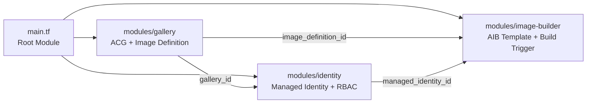
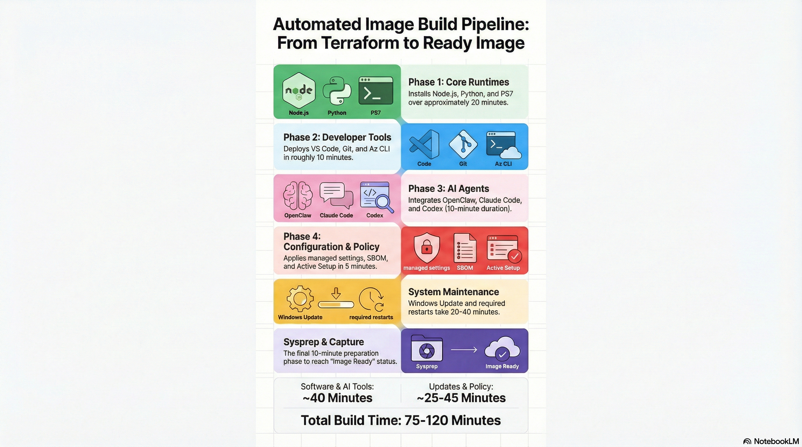
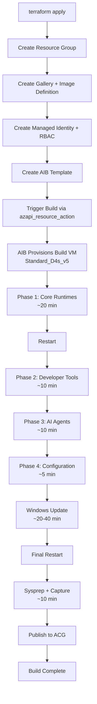
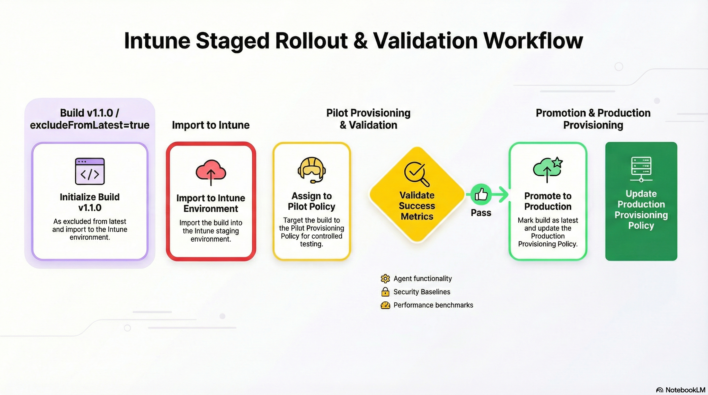
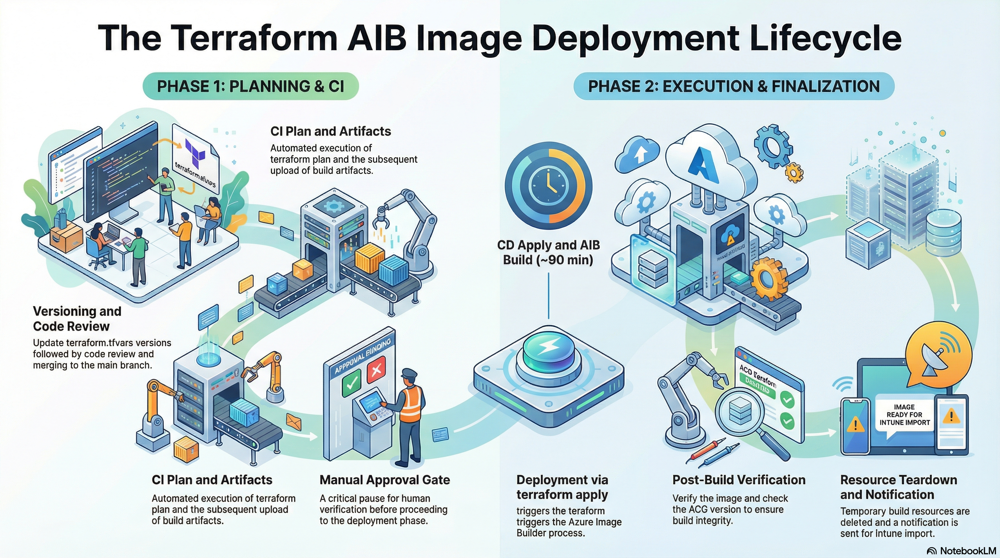
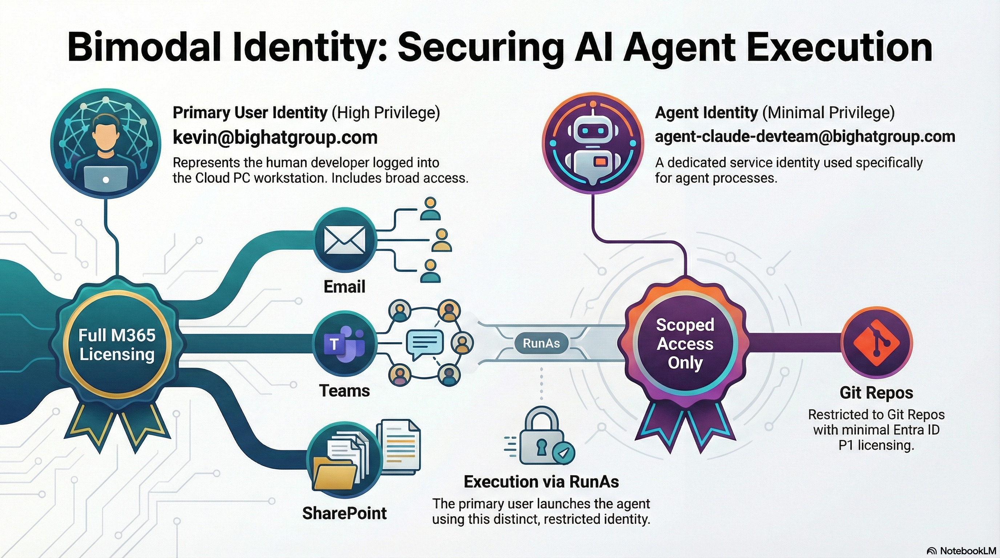
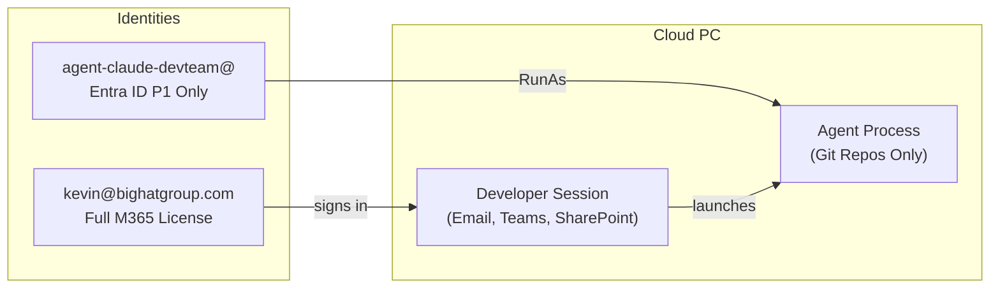

# Deploying OpenClaw with Windows 365: A Practitioner's Guide to Custom Image Engineering and Deployment

**Author:** Kevin Kaminski, Microsoft MVP for Windows 365

---

## About This Book

This book is a comprehensive technical guide for IT administrators and platform engineers who need to deploy AI coding agents (specifically OpenClaw and Claude Code) onto Windows 365 Cloud PCs using custom images built with Azure Compute Gallery and Azure VM Image Builder. While OpenClaw is the anchor product and primary focus, the book also covers Claude Code, OpenAI Codex CLI, and OpenSpec as complementary tools in the AI coding agent ecosystem, each with its own installation, configuration, and security considerations. It covers everything from infrastructure provisioning through Terraform, to the build pipeline, to post-provisioning operations, to the security architecture required to contain autonomous AI agents in an enterprise environment.

The audience is technical. If you're looking for a high-level overview, this isn't it. This is the book you read when you need to understand why the Node.js MSI doesn't update your PowerShell session's PATH, why GitHub Desktop uses a "hydration" mechanism instead of a traditional installer, and why running an AI agent under your primary Entra ID is an architectural failure.

### Publication Notes

This book is designed to work both as a standalone guide and as a companion to the **[W365Claw repository](https://github.com/kkaminsk/W365Claw)**, which contains the complete Terraform modules, PowerShell scripts, and configuration templates referenced throughout. The repository should be public and current with the code shown in this book at the time of publication.

Several chapters include Mermaid diagrams for architecture and workflow visualization. These render natively in GitHub, VS Code, and most modern markdown viewers. If your reading environment does not support Mermaid, the diagrams are described in the surrounding text.

---

## Table of Contents

- [Part I: Foundation](#part-i-foundation)
  - [Chapter 1: Introduction](#chapter-1-introduction)
  - [Chapter 2: Architecture Overview](#chapter-2-architecture-overview)
  - [Chapter 3: The Architectural Boundary](#chapter-3-the-architectural-boundary)
- [Part II: Infrastructure](#part-ii-infrastructure)
  - [Chapter 4: Azure Compute Gallery for Windows 365](#chapter-4-azure-compute-gallery-for-windows-365)
  - [Chapter 5: Identity and RBAC](#chapter-5-identity-and-rbac)
  - [Chapter 6: Terraform Solution Architecture](#chapter-6-terraform-solution-architecture)
- [Part III: The Build Pipeline](#part-iii-the-build-pipeline)
  - [Chapter 7: Preparing the Build Workstation](#chapter-7-preparing-the-build-workstation)
  - [Chapter 8: Phase 1 — Core Runtimes](#chapter-8-phase-1--core-runtimes)
  - [Chapter 9: Phase 2 — Developer Tools](#chapter-9-phase-2--developer-tools)
  - [Chapter 10: Phase 3 — AI Agents](#chapter-10-phase-3--ai-agents)
  - [Chapter 11: Phase 4 — Configuration and Policy](#chapter-11-phase-4--configuration-and-policy)
  - [Chapter 12: Windows Update and Sysprep](#chapter-12-windows-update-and-sysprep)
  - [Chapter 13: Supply Chain Integrity](#chapter-13-supply-chain-integrity)
- [Part IV: Operations](#part-iv-operations)
  - [Chapter 14: Building the Image](#chapter-14-building-the-image)
  - [Chapter 15: Verification Checklist](#chapter-15-verification-checklist)
  - [Chapter 16: Image Versioning and Staged Rollout](#chapter-16-image-versioning-and-staged-rollout)
  - [Chapter 17: Importing into Windows 365](#chapter-17-importing-into-windows-365)
  - [Chapter 18: The Reprovisioning Reality](#chapter-18-the-reprovisioning-reality)
  - [Chapter 19: Tearing Down Build Resources](#chapter-19-tearing-down-build-resources)
  - [Chapter 20: Version Retention and Cost Management](#chapter-20-version-retention-and-cost-management)
  - [Chapter 21: CI/CD Pipeline Integration](#chapter-21-cicd-pipeline-integration)
- [Part V: Post-Provisioning](#part-v-post-provisioning)
  - [Chapter 22: First Login Experience](#chapter-22-first-login-experience)
  - [Chapter 23: API Key Delivery](#chapter-23-api-key-delivery)
  - [Chapter 24: VS Code Extensions](#chapter-24-vs-code-extensions)
  - [Chapter 25: Agent Updates Without Reprovisioning](#chapter-25-agent-updates-without-reprovisioning)
- [Part VI: Security](#part-vi-security)
  - [Chapter 26: The Agent Threat Model](#chapter-26-the-agent-threat-model)
  - [Chapter 27: Identity Architecture — The Secondary User Imperative](#chapter-27-identity-architecture--the-secondary-user-imperative)
  - [Chapter 28: Hardening Claude Code](#chapter-28-hardening-claude-code)
  - [Chapter 29: Hardening OpenClaw](#chapter-29-hardening-openclaw)
  - [Chapter 30: Network Segmentation](#chapter-30-network-segmentation)
  - [Chapter 31: Endpoint Protection](#chapter-31-endpoint-protection)
  - [Chapter 32: Intune Configuration Profiles](#chapter-32-intune-configuration-profiles)
  - [Chapter 33: Monitoring and Forensics](#chapter-33-monitoring-and-forensics)
- [Part VII: Reference](#part-vii-reference)
  - [Chapter 35: PowerShell Scripts](#chapter-35-powershell-scripts)
  - [Chapter 36: Windows 365 Image Requirements Checklist](#chapter-36-windows-365-image-requirements-checklist)
  - [Chapter 37: Component Summary Matrix](#chapter-37-component-summary-matrix)

---

# Part I: Foundation

---

## Chapter 1: Introduction

### Why AI Agents on Windows 365

The emergence of AI-powered coding agents, OpenClaw and Claude Code chief among them, is reshaping how software developers work. These tools don't just autocomplete lines of code; they read repositories, execute commands, manage files, and reason about architecture. They are, in effect, autonomous collaborators that live inside the user's machine.

For organizations running Windows 365 Cloud PCs, deploying these agents at scale introduces a genuinely novel challenge: how do you build a custom operating system image that ships with AI agents pre-installed, pre-configured, and ready to use the moment a developer signs in? And how do you do it in a way that's repeatable, secure, version-controlled, and compatible with Windows 365's specific ingestion requirements?

This book answers that question end-to-end.

### Why Windows 365

Before diving into the how, it's worth addressing the why. Why Windows 365 specifically? Why not a traditional VM, a local workstation, or a Linux container?

The answer is that Windows 365 Cloud PCs sit at the intersection of three requirements that are difficult to satisfy simultaneously: **full-fidelity developer experience**, **enterprise security posture**, and **operational resilience**. No other platform delivers all three without significant compromise.

#### A Full-Fidelity Windows Desktop

A Cloud PC is not a thin client, a sandboxed container, or a browser-based IDE. It is a complete instance of Windows 11 Enterprise, running on dedicated compute in Azure, with a persistent disk, a full user profile, and the same application compatibility as a physical workstation. The developer connects via the Windows 365 web portal, the Windows App, or a Remote Desktop client and gets a desktop that behaves identically to a physical machine.

This matters for AI agent deployment because agents like OpenClaw and Claude Code are not simple CLI tools; they interact with the filesystem, spawn processes, manage Git repositories, invoke npm and Python, and orchestrate background services. They need a real operating system with real process isolation, real environment variables, and real file I/O. A Windows 365 Cloud PC provides exactly that, managed and delivered as a service.

The developer experience is indistinguishable from a local machine. Keyboard shortcuts work. Clipboard redirection works. Multi-monitor works. Local peripherals can be redirected. There is no "it works differently in the cloud" asterisk.

#### Zero Trust by Design

Every Windows 365 Cloud PC is **Microsoft Entra ID joined**. There is no domain controller, no VPN concentrator, no network perimeter to defend. Identity is the control plane.

Authentication flows through Entra ID with full Conditional Access support: you can require multi-factor authentication, enforce compliant device posture, restrict sign-in to specific locations or IP ranges, and block legacy authentication protocols. Every sign-in is logged. Every token has a lifetime. Every session can be revoked.

For AI agent workloads, this architecture is particularly powerful because you can place the Cloud PC on a **dedicated, isolated Azure Network Connection**, a virtual network segment with no access to corporate file shares, no line-of-sight to production databases, and no lateral movement path to other workloads. The agent's network boundary is defined by Azure networking rules, not by hoping a firewall appliance catches everything.

Combined with the dedicated agent account model described in Chapter 2 and the network segmentation detailed in Chapter 30, this creates a genuinely zero-trust deployment: the agent authenticates with a scoped identity, operates on an isolated network, runs under security policies it cannot modify, and produces audit logs it cannot delete.

#### Managed, Patched, and Policy-Governed

Windows 365 Cloud PCs are managed through Microsoft Intune. This means the same security baselines, compliance policies, configuration profiles, and endpoint protection that govern your physical fleet also govern your Cloud PCs, with the same consistency and the same reporting.

The operating system is patched through Windows Update for Business, on a schedule you control, with compliance reporting through Intune. There is no "the developer disabled Windows Update" scenario. There is no "we forgot to patch the build server" scenario. The Cloud PC is a managed endpoint, period.

For AI agent images specifically, this means you can enforce application control policies (which executables the agent can run), restrict PowerShell execution policy, configure Defender for Endpoint with agent-specific detection rules, and monitor for anomalous behavior, all through the same Intune console you already use for the rest of your estate.

#### Snapshots and Disaster Recovery

Windows 365 includes **point-in-time restore** capability: the ability to save and restore Cloud PC snapshots. If an agent corrupts its workspace, installs something destructive, or gets into a state that's difficult to debug, you can roll back to a known-good snapshot in minutes. This is not a full VM backup and restore cycle; it's a platform-native feature accessible from the Intune admin centre or via the Windows 365 API.

For organizations that need geographic resilience, Windows 365 supports **cross-region disaster recovery**. A Cloud PC provisioned in Canada Central can fail over to Canada East (or any other supported region pair), providing business continuity without building custom replication infrastructure. The failover is managed by the platform: no runbooks, no DNS cutover, no storage account synchronization.

#### Cross-Region DR and Custom Images

When configuring Windows 365 cross-region disaster recovery, your custom image must be available in the failover region. This means either:

1. **Replicate the ACG image version** to the DR region using manual Azure CLI replication (`az sig image-version update`), because the Terraform module currently publishes to the build region only (see Chapter 20).
2. **Maintain a separate import** in Intune for the DR region, pointing to the replicated image version.

During a failover event, Windows 365 reprovisions the Cloud PC in the DR region using the provisioning policy. If the policy references a custom image that isn't available in the DR region, provisioning will fail. Plan for this by replicating image versions to all regions where you have Azure Network Connections.

The developer's data is preserved via Git (primary) and OneDrive (if licensed). The Cloud PC itself is stateless by design; reprovisioning in the DR region produces an identical environment from the same image.

Together, these capabilities mean that a Cloud PC running an AI agent is not a fragile, irreplaceable environment. It's a disposable, reproducible, restorable compute unit backed by platform-level resilience. If something goes wrong, you restore from snapshot. If a region goes down, the platform fails over. If the image needs updating, you build a new version and reprovision. The Cloud PC is cattle, not a pet, but cattle with a safety net.

#### The Economic Argument

There is also a practical economic consideration. A Windows 365 Cloud PC runs on Azure compute that you pay for monthly, on a predictable per-user basis. There is no surprise bill for leaving a VM running over the weekend. There is no capacity planning for how many D4s_v5 instances your dev team needs. The licensing is simple: a Windows 365 Enterprise licence per user, sized to the workload (2 vCPU / 8 GB is sufficient for most agent workflows; 4 vCPU / 16 GB for heavy workloads).

Compared to provisioning and managing traditional Azure VMs, the operational overhead is dramatically lower. No OS disk management, no availability set configuration, no NSG rule debugging, no "who left the RDP port open" incident. The platform handles compute lifecycle; you handle the image and the policies.

### Solution Cost Estimation

For decision-makers evaluating the total cost, here is a representative monthly estimate for a 10-developer team. Every user and every agent account requires a **minimum base licence stack of Entra ID P1 + Windows 365 Enterprise + Intune P1**. If the user needs Microsoft 365 productivity services (Exchange, Teams, SharePoint, Office), a full **Microsoft 365 E3** licence replaces the standalone Entra P1 and Intune P1 (both are included in E3). See Chapter 2 for the identity model overview and Chapter 27 for the full security rationale.

- **Option 1 (Developer's own identity):** Each developer gets one Cloud PC with M365 E3 (assuming it's their primary device). The agents run under their regular corporate account. Simplest, but the agent inherits the developer's full privileges and its actions are indistinguishable from the human's in audit logs.
- **Option 2 (Dedicated agent Cloud PC, minimal licence):** Each developer gets a second Cloud PC for agent work, signed in with a purpose-built agent account. The agent account carries the base stack (Entra P1 + W365 + Intune P1) and provisions its own Cloud PC. No M365 E3 needed (no email, Teams, or Office apps). Full session and identity isolation.
- **Option 3 (Dedicated agent Cloud PC, full M365 licence):** Same as Option 2, but the agent account carries a full M365 E3 licence for scenarios where the agent needs to access Microsoft 365 services (Graph API, Teams, SharePoint) under its own identity.

| Component | Per-User Monthly Cost (USD) | Applies To |
|---|---|---|
| Microsoft 365 E3 (developer) | $36 × 10 = **$360** | All options (includes Entra P1, Intune P1) |
| Windows 365 Enterprise (2 vCPU / 8 GB, developer) | $310 × 10 = **$3,100** | All options (one Cloud PC per developer) |
| Entra ID P1 (agent account, standalone) | $6 × 10 = **$60** | Option 2 (agent identity) |
| Intune P1 (agent account, standalone) | $8 × 10 = **$80** | Option 2 (agent Cloud PC management) |
| Windows 365 Enterprise (agent Cloud PC) | $310 × 10 = **$3,100** | Options 2 and 3 (second Cloud PC) |
| Microsoft 365 E3 (agent account) | $36 × 10 = **$360** | Option 3 only (replaces standalone Entra P1 + Intune P1) |
| ACG image storage (3 versions, 1 region) | **$5–15** | All options |
| AIB build compute (1 build/month, ~2 hours) | **$2–5** | All options |
| AI API usage | **Varies** | All options; depends on usage volume and models |
| | | |
| **Total (Option 1: developer's own identity)** | **~$3,480/month** | M365 E3 + W365 per developer |
| **Total (Option 2: dedicated agent PC, minimal)** | **~$6,720/month** | Adds Entra P1 + W365 + Intune P1 per agent |
| **Total (Option 3: dedicated agent PC, full M365)** | **~$6,940/month** | Adds W365 + M365 E3 per agent |

The dominant cost is the Windows 365 licences. The image build infrastructure (ACG, AIB) is negligible. Option 2 provides full session and identity isolation at the lowest incremental cost by using the base licence stack without M365 E3. Option 3 adds M365 E3 for scenarios where the agent needs its own Microsoft 365 service access. Evaluate the trade-offs based on your threat model; Chapter 27 provides the full security rationale.

### Companion Reference: Windows 365 Conceptual Architecture

This book focuses specifically on building custom images for AI agent workloads. It does not attempt to cover the full breadth of Windows 365 deployment: user personas, Microsoft 365 Apps servicing, Teams optimization, Windows Autopatch configuration, monitoring dashboards, or the dozens of other decisions that go into a production Cloud PC environment.

For that, there is a companion document: the **[Windows 365 Cloud PC Deployment Conceptual Architecture](https://github.com/kkaminsk/W365ConceptualReferenceArchitecture)**, a 98-page reference design authored by Kevin Kaminski (Microsoft MVP). It covers the complete end-to-end architecture for enterprise Cloud PC deployments:

- **Cloud-native identity**: Entra ID join with no on-premises dependencies
- **Automated provisioning**: Provisioning policies based on group membership
- **Unified management**: Intune as the single management authority
- **Zero Trust security**: Conditional Access, device compliance, security baselines
- **Application strategy**: Modern app delivery, Win32 packaging, Company Portal
- **Servicing**: Windows Autopatch, Microsoft 365 Apps updates, Edge and Teams servicing
- **Monitoring**: Built-in reports and Azure Monitor integration

The reference architecture assumes a standard information worker persona with a baseline application stack (Microsoft 365 Apps, Edge, Company Portal). This book replaces that application stack with a developer toolchain (Node.js, Python, Git, VS Code, OpenClaw, Claude Code) and adds the custom image engineering pipeline required to deliver it, but the underlying platform architecture is the same. The networking model, identity model, security posture, and management plane described in the reference architecture apply directly to AI agent Cloud PCs.

Think of the reference architecture as the foundation and this book as a specialized wing built on top of it. Read the reference architecture first if you're new to Windows 365. Read this book when you're ready to build the image.

The PDF is available in the [GitHub repository](https://github.com/kkaminsk/W365ConceptualReferenceArchitecture/blob/main/W365Design1.0-Signed.pdf), and a full-color hardcover edition is available at [Lulu.com](https://www.lulu.com/shop/kevin-kaminski/windows-365-cloud-pc-deployment-conceptual-architecture/hardcover/product-2m85w9r.html). An interactive [Windows 365 Design Advisor](https://chatgpt.com/g/g-6961758ef3c88191837503959cf2a48a-windows-365-design-advisor) ChatGPT companion is also available for guided Q&A.

### Who This Is For (and Who It Isn't)

This book is written for **enterprise IT departments** deploying AI agents to teams of developers (five, fifty, or five hundred) Cloud PCs managed under a consistent security posture with centralized image builds, Intune policy enforcement, and auditable identity controls.

If you're an individual developer looking to run OpenClaw on a Cloud PC, Windows 365 is a viable platform. You get a persistent, powerful Windows desktop in the cloud that you can access from anywhere. But most of what this book describes (Terraform-managed infrastructure, Azure Compute Gallery pipelines, Intune security baselines, network segmentation, dedicated agent identities) is dramatically over-engineered for a single user. You'd be better served by provisioning a Windows 365 Business Cloud PC, installing Node.js and OpenClaw manually, and skipping the other 35 chapters.

The complexity in this book exists because enterprise deployment has enterprise requirements: repeatable image builds across dozens of machines, separation of duties between the person who builds the image and the person who uses it, compliance evidence that every Cloud PC is patched and policy-governed, and containment guarantees that limit the blast radius when an autonomous agent does something unexpected. None of that matters when it's just you on your own machine.

Read on if you're managing a fleet. If you're managing yourself, install OpenClaw and get to work.

### The Challenge

The technical challenge is deceptively complex. Azure VM Image Builder runs scripts as **NT AUTHORITY\SYSTEM**, an account with full machine access but no user profile, no HKCU registry hive, no browser session, and no interactive desktop. Most developer tools are designed with the assumption of an interactive user shell. They default to installing binaries in `%APPDATA%`, storing configuration in `~/.config`, and relying on browser-based OAuth flows for authentication.

When you run these tools as Local System in a headless build pipeline, several failure modes emerge:

1. **Environment Variable Scope Isolation.** Modifications to the system PATH are written to the registry but do not propagate to the currently running PowerShell process, causing subsequent commands like `npm install` to fail.
2. **Profile Redirection.** Installers targeting "Current User" will hydrate the system profile (`C:\Windows\System32\config\systemprofile`), creating a "ghost" installation invisible to the actual developer.
3. **Interactive Blockers.** First-run experiences like the `openclaw onboard` wizard or `claude login` command block execution until user input is received. In a headless build, these commands hang indefinitely until the AIB timeout kills them.

This book teaches you how to navigate every one of these constraints.

### Audience

This book is written for:

- **Cloud PC administrators** who manage Windows 365 provisioning policies and custom images
- **Platform engineers** who build and maintain developer toolchain images for AI
- **DevOps practitioners** who need to understand the image-as-code workflow
- **Security architects** who must evaluate the risk profile of autonomous AI agents running on enterprise endpoints

You should be comfortable with PowerShell, Terraform, and Azure administration. Familiarity with Windows 365 provisioning concepts is helpful but not required, the book explains the relevant concepts as they arise.

### What We're Building

A software developer receives a new Windows 365 Cloud PC. They sign in and land on a desktop that has:

- **OpenClaw** installed globally with a pre-seeded configuration template, the gateway starts on first login, and the developer connects their Anthropic API key to begin working immediately.
- **Claude Code** installed globally via npm, the CLI is available in any terminal, governed by enterprise-managed settings that control permissions and allowed MCP servers.
- **OpenAI Codex CLI** installed globally via npm, ready for developers who use OpenAI models alongside Anthropic.
- **Visual Studio Code** (System install) with GitHub Copilot pre-installed and context menu integration.
- **Node.js 22+**, **Python 3.14+**, **Git**, **GitHub Desktop**, **Azure CLI**, and **PowerShell 7**, the complete runtime and tooling foundation, installed machine-wide so every user has access without needing admin rights.

No manual setup. No "run this script first." No waiting for Intune to push 15 apps over 45 minutes. The heavy lifting is done in the image; the personalization happens at login.

---

## Chapter 2: Architecture Overview

### End-to-End Architecture

The solution spans four layers: infrastructure definition, image build, Windows 365 ingestion, and post-provisioning configuration.

```mermaid
graph TB
    subgraph "Source Control (Git)"
        TF[Terraform HCL<br/>Gallery, Identity, AIB]
        PS[Inline PowerShell<br/>Phase 1-4 Customizers]
    end

    subgraph "Build Pipeline"
        INIT[terraform init]
        PLAN[terraform plan]
        APPLY[terraform apply]
        AIB[Azure VM Image Builder<br/>Ephemeral Build VM<br/>Standard_D4s_v5]
    end

    subgraph "Azure Compute Gallery"
        GAL[Gallery: acgW365Dev]
        DEF[Image Definition:<br/>W365-W11-25H2-ENU]
        V1[v1.0.0 — Production]
        V2[v1.1.0 — Production]
        V3[v1.2.0 — Canary/Pilot]
    end

    subgraph "Microsoft Intune / Windows 365"
        IMPORT[Custom Image Import]
        POLICY[Provisioning Policy]
        CPC[Cloud PC Provisioned]
    end

    subgraph "Post-Provisioning"
        INTUNE[Intune Delivers:<br/>• API Keys via Settings Catalog<br/>• VS Code Extensions<br/>• Security Baselines]
        LOGIN[First Login:<br/>• Active Setup Hydration<br/>• GitHub Desktop Hydration<br/>• OpenClaw Config Copy]
    end

    TF --> INIT --> PLAN --> APPLY --> AIB
    PS --> AIB
    AIB --> DEF
    GAL --- DEF
    DEF --- V1 & V2 & V3
    DEF --> IMPORT --> POLICY --> CPC
    CPC --> INTUNE
    CPC --> LOGIN
```




### The Four Layers

**Layer 1: Source Control.** All infrastructure and build logic lives in Git. The Terraform configuration defines the Azure Compute Gallery, managed identity, RBAC assignments, and AIB template. The build scripts are inline PowerShell within the Terraform HCL, with no external storage account or blob dependencies. Changes are tracked, reviewed, and versioned.

> **💡 Note: Why inline scripts?** Storing PowerShell in external files (Azure Blob Storage, Git raw URLs) would reduce HCL file size but introduce external dependencies: the build would fail if the storage account is misconfigured, the SAS token expires, or the Git URL changes. Inline scripts keep the entire build definition self-contained in a single `terraform apply`. The companion repository includes a setup script (`Initialize-TerraformVars.ps1`) that populates all variables and prepares the tenant, so the inline approach remains manageable even as the scripts grow. For teams that prefer external scripts, the same PowerShell can be extracted to blob storage with minimal changes to the AIB template.

**Layer 2: Build Pipeline.** A manual `terraform apply` deploys the infrastructure and triggers the AIB build. The build VM (Standard_D4s_v5 by default) downloads installers, runs four phases of PowerShell customization, applies Windows Updates, and runs Sysprep. The result is a generalized VHD published to the Azure Compute Gallery. Build time: 75–120 minutes.

> **💡 Tip:** The default build VM is `Standard_D4s_v5` (4 vCPU, 16 GB) to improve build reliability and speed. If cost is a priority and longer builds are acceptable, downgrade to `Standard_D2s_v5` (2 vCPU, 8 GB RAM) in `terraform.tfvars`.

**Layer 3: Windows 365 Ingestion.** An administrator imports the image version from ACG into Intune (Devices > Windows 365 > Custom images > Add > Azure Compute Gallery). The imported image is assigned to a provisioning policy targeting a developer security group. New Cloud PCs are provisioned from this image.

**Layer 4: Post-Provisioning.** Intune delivers API keys, VS Code extensions, and security baselines to running Cloud PCs. On first login, Active Setup copies the OpenClaw configuration template to the user's profile, and GitHub Desktop hydrates from the machine-wide provisioner.

### The "Image Build vs Post-Provisioning" Split Philosophy

This split is not arbitrary. It's an architectural decision driven by the constraints of Azure Image Builder's execution context and the operational reality of Windows 365.

**What goes in the image:**
- Binary installations (runtimes, tools, agents)
- Machine-level policy (managed-settings.json)
- Configuration templates (in ProgramData)
- Windows Updates

**What goes in post-provisioning:**
- Secrets and API keys (never bake these)
- User-context configuration (VS Code extensions)
- Identity-specific settings
- Frequently updated components (agent version bumps via npm)
- Agent-specific skill updates (new skills or skill version bumps)
- MCP server credential configuration (API keys, tokens)

The reasoning is simple: anything in the image is frozen at build time. Updating it requires a new image build and reprovisioning (which destroys the Cloud PC). Anything delivered via Intune can be updated on running Cloud PCs without disruption.

### Microsoft Entra ID and the Sign-In Question

If you're not already familiar: **Microsoft Entra ID** (formerly Azure Active Directory) is the cloud identity platform that underpins Microsoft 365, Azure, and Windows 365. Every Cloud PC is Entra-joined, so when a developer signs into their Cloud PC via the Windows 365 web portal, Windows app, or Remote Desktop client, they authenticate against Entra ID. Their identity determines what they can access: email, Teams, SharePoint, Azure subscriptions, Git repositories, and everything else governed by Conditional Access policies.

This creates an important architectural question for AI agent deployments: **which identity does the agent run under, and on which machine?**

There are three viable models, each with different cost, security, and operational trade-offs. All models require a **minimum base licence stack** for every user and agent account: **Entra ID P1 + Windows 365 Enterprise + Intune P1**. If the user needs Microsoft 365 productivity services (Exchange Online, Teams, SharePoint, Office apps), a full **Microsoft 365 E3** licence replaces the standalone Entra P1 and Intune P1 (both are included in E3).

#### Option 1: Developer's Own Entra ID (Simple Model)

The developer signs into their Cloud PC with their normal corporate account, the same `kevin@bighatgroup.com` they use for email and Teams. The AI agents (OpenClaw, Claude Code) run under this identity. Everything the developer can access, the agent can access.

**Licensing:** The base stack is Entra P1 + W365 + Intune P1. If the Cloud PC is the developer's **primary device** (replacing a physical workstation), the developer needs a full **Microsoft 365 E3** licence to cover Exchange Online, Teams, SharePoint, and Office apps (M365 E3 includes Entra P1 and Intune P1).

This is the simplest model. It works well when:

- The agents are used interactively (the developer reviews every action before it executes)
- The developer's access is already scoped appropriately
- Audit requirements don't demand separation between human and agent actions

**Security risk:** A compromised agent inherits the developer's full privilege set, including SSO tokens for email, Teams, SharePoint, and any other service the developer has accessed. Agent actions are indistinguishable from human actions in audit logs.

#### Option 2: Dedicated Agent Account on a Separate Cloud PC (Fully Isolated, Minimal Licence)

The organization provisions a **secondary Entra ID account** specifically for agent-assisted work (e.g., `agent-kevin@bighatgroup.com`). The developer signs into a **second, dedicated Cloud PC** with this account when doing heavy agent-assisted coding sessions.

This account has:

- **No email, no Teams, no SharePoint**, stripped of everything the agent doesn't need
- **Access only to Git repositories and Azure DevOps projects** relevant to the development work
- **Its own sign-in logs**, so every action is attributable to the agent identity, not the human
- **A minimal licence stack**: Entra ID P1 + Windows 365 Enterprise + Intune P1 (no M365 E3 needed because the agent doesn't use Exchange, Teams, or Office apps)

The developer's primary Cloud PC (signed in as `kevin@bighatgroup.com`) remains available for non-agent work. The agent Cloud PC is a purpose-built, network-isolated environment where the blast radius of a compromised agent is fully contained.

This model is recommended when:

- Agents operate autonomously (OpenClaw running background tasks, accessing APIs without human supervision)
- Compliance requires non-repudiation between human and agent actions
- The organization needs full session isolation (separate machine, separate identity, separate network segment)
- Budget requires keeping the agent account licence cost to a minimum

**Trade-off:** This adds a second Windows 365 licence per developer, but the agent account avoids the cost of a full M365 E3 licence.

#### Option 3: Dedicated Agent Account on a Separate Cloud PC (Fully Isolated, Full M365 Licence)

Identical to Option 2, but the agent account is assigned a **full Microsoft 365 E3 licence** instead of the minimal stack. This gives the agent account access to Exchange Online, Teams, SharePoint, and Office apps under its own identity.

This model applies when:

- The agent needs to interact with Microsoft 365 services (e.g., reading Teams channels for context, accessing SharePoint document libraries, sending email notifications)
- Compliance or workflow requirements demand that the agent has its own M365 tenant presence rather than relying on the developer's credentials for service access
- The organization is using Microsoft 365 APIs (Graph API) extensively in agent workflows and needs the agent to authenticate independently

**Trade-off:** This is the most expensive model. Each agent account carries a full M365 E3 licence plus a Windows 365 licence. Reserve this for scenarios where the agent genuinely needs M365 service access under its own identity.

#### Choosing a Model

| | Option 1: Developer's Identity | Option 2: Dedicated PC (Minimal) | Option 3: Dedicated PC (Full M365) |
|---|---|---|---|
| **Agent identity** | Developer's own account | Separate agent account | Separate agent account |
| **Machine** | Developer's Cloud PC | Separate Cloud PC | Separate Cloud PC |
| **Audit separation** | None | Full | Full |
| **Session isolation** | None | Full | Full |
| **M365 services for agent** | Via developer's licence | None | Full (own E3) |
| **Developer licence** | M365 E3 + W365 | M365 E3 + W365 | M365 E3 + W365 |
| **Agent account licence** | N/A | Entra P1 + W365 + Intune P1 | M365 E3 + W365 |
| **Best for** | Interactive, supervised use | Autonomous workflows | Agent needs M365 service access |

> **💡 Tip:** You don't have to choose one model for the entire organization. Many teams start with Option 1 for interactive coding assistance and move to Option 2 or 3 when they adopt autonomous agent workflows. The image is the same in all cases; the identity model is an operational decision, not an image build decision.

Chapter 27 covers the security rationale and implementation details in depth, including the emerging **Microsoft Entra Agent ID** (preview) capability that formalizes agent identity management. Chapter 27 also addresses the **local administrator question**: why granting admin rights to a network-isolated, dedicated-account Cloud PC is actually the pragmatic choice for AI agent workflows, and why the risk calculus is fundamentally different from giving admin to a corporate-network-connected laptop.

---

## Chapter 3: The Architectural Boundary

### Local System vs User Context

A critical concept underpins this entire design: **the image build handles binary installation and machine-level policy; everything identity-specific happens after provisioning.**

Azure Image Builder runs scripts as **NT AUTHORITY\SYSTEM** (Local System). This account has full machine access but:

- No user profile (`%USERPROFILE%` resolves to `C:\Windows\System32\config\systemprofile`)
- No HKCU registry hive (in the expected sense)
- No browser session
- No interactive desktop (Session 0)

Any tool that expects a user context (WinGet's App Installer dependency, VS Code extension installation into `%USERPROFILE%`, OpenClaw's onboarding wizard, Claude Code's OAuth login flow) will either fail silently, install into the wrong profile, or hang the build indefinitely.

### The Responsibility Matrix

| Responsibility | Timing | Execution Context | Mechanism |
|---|---|---|---|
| Runtimes (Node.js, Python, PowerShell 7) | Image build | Local System | MSI/EXE silent installers |
| Developer tools (VS Code, Git, Azure CLI) | Image build | Local System | System installers with automation flags |
| AI agent binaries (OpenClaw, Claude Code, Codex) | Image build | Local System | `npm install -g` |
| Enterprise policy (managed-settings.json) | Image build | Local System | File write to ProgramData |
| Configuration templates | Image build | Local System | File write to ProgramData |
| Agent skills (curated) | Image build | Local System | File copy to ProgramData |
| MCP server binaries | Image build | Local System | `npm install -g` or file copy |
| MCP server configuration | Image build | Local System | Template in ProgramData |
| API keys and credentials | Post-provisioning | Machine (Intune) | Environment variables via Settings Catalog |
| VS Code extensions | Post-provisioning | User context | Intune script or logon script |
| OpenClaw config hydration | First login | User context | Active Setup registry entry |
| Skill + MCP config hydration | First login | User context | Active Setup (copies to user profile) |
| GitHub Desktop application | First login | User context | Machine-wide MSI provisioner |


### The "Dormant and Ready" Philosophy

The objective is to produce a Windows 11 image where the AI agents are not merely present, but **dormant and ready**:

- **Binaries are machine-wide.** Executables are in `C:\Program Files` or a globally accessible PATH location, not buried in a specific user's AppData.
- **Dependencies are pre-resolved.** Complex dependency chains are fully installed and verified, eliminating the need for the developer to have admin rights.
- **Configuration is injected.** Base configuration files are pre-seeded in a system location, enforcing enterprise security policies before the user ever launches the agent.

Install the binaries. Inject configuration templates. Defer initialization to first login.

> **⚠️ Warning:** Never run `openclaw onboard` or `claude login` during the image build. These commands launch interactive wizards that will hang the build until the AIB timeout kills it. More importantly, if they somehow complete, they generate unique session tokens and device identifiers that would be baked into every Cloud PC provisioned from this image, causing identity collisions and security failures.

---

# Part II: Infrastructure

---

## Chapter 4: Azure Compute Gallery for Windows 365

### Why Azure Compute Gallery

If you've been managing Windows 365 custom images using Azure managed images, you've felt the limitations: no versioning, no Trusted Launch support, no replication, and no staged rollout capability. Azure Compute Gallery changes the equation fundamentally.

For this developer image scenario, ACG provides three capabilities that matter:

1. **Trusted Launch compatibility.** Windows 365 now requires ACG image definitions to declare Trusted Launch support. Managed images cannot participate in this security model, and Microsoft is actively moving the ecosystem toward Trusted Launch as the default.

2. **Semantic versioning and staged rollout.** When your image includes AI agents with rapidly evolving dependencies, you need the ability to publish a new version, test it with a pilot group, and promote it to production, without maintaining a naming convention spreadsheet. ACG's `Major.Minor.Patch` versioning and `excludeFromLatest` flag give you this workflow natively.

3. **Pipeline integration.** Azure VM Image Builder and HashiCorp Packer both have first-class support for publishing to ACG. Your developer image becomes an "image-as-code" artefact: source-controlled templates, automated builds, and full audit trails.

### Why AIB Over Packer

Both Azure VM Image Builder (AIB) and HashiCorp Packer can produce ACG image versions. This book uses AIB for three reasons:

1. **No build infrastructure to manage.** AIB is a fully managed Azure service; it provisions the build VM, runs your customizers, captures the image, and tears down the VM automatically. With Packer, you manage the build VM lifecycle, networking, and credentials yourself.
2. **Native Terraform integration via azapi.** The AIB template is defined as a Terraform resource, so the entire pipeline (from gallery creation through build trigger) is a single `terraform apply`. Packer requires a separate build step outside Terraform.
3. **Cost.** AIB charges only for the compute time of the ephemeral build VM. There is no AIB service fee. Packer itself is free, but you pay for the VM infrastructure and must manage its lifecycle.

Packer remains a strong choice if you need cross-cloud image builds (AWS AMIs + Azure VHDs from the same template) or if your team already has Packer expertise. For a Windows 365-only pipeline, AIB is simpler and more cost-effective.

### Image Definition Requirements for Windows 365

Before you build anything, the ACG image definition must satisfy Windows 365's compatibility contract. The image definition **must** include all five of the following features:

| Feature | Value | Purpose |
|---------|-------|---------|
| `SecurityType` | `TrustedLaunchSupported` | Enables Secure Boot and vTPM |
| `IsHibernateSupported` | `True` | Required for Cloud PC hibernation |
| `DiskControllerTypes` | `SCSI,NVMe` | Supports both controller types |
| `IsAcceleratedNetworkSupported` | `True` | Required for accelerated networking |
| `IsSecureBootSupported` | `True` | Explicit Secure Boot declaration |

> **⚠️ Warning:** Missing any one of these features will cause the import into Windows 365 to fail. This is non-negotiable. The error message from Intune is often unhelpful; if your import fails, check these features first.

Additionally, the image definition must declare:

- **Architecture:** x64
- **OS Type:** Windows
- **Hyper-V Generation:** V2
- **OS State:** Generalized

### Why Terraform Only

You could accomplish the gallery setup with Bicep, ARM templates, or the Azure CLI. This book uses Terraform exclusively because the entire image build pipeline (gallery, identity, RBAC, AIB template, and build trigger) is managed as a single Terraform state. Mixing IaC tools would split the lifecycle management across two toolchains, complicating both the initial deployment and ongoing version bumps. The Azure CLI example below is provided for verification and one-off operations, not as an alternative deployment path.

### Gallery Setup with Terraform

```hcl
resource "azurerm_shared_image_gallery" "this" {
  name                = var.gallery_name
  resource_group_name = var.resource_group_name
  location            = var.location
  tags                = var.tags
}

resource "azurerm_shared_image" "this" {
  name                = var.image_definition_name
  gallery_name        = azurerm_shared_image_gallery.this.name
  resource_group_name = var.resource_group_name
  location            = var.location
  os_type             = "Windows"
  hyper_v_generation  = "V2"
  architecture        = "x64"

  identifier {
    publisher = var.image_publisher
    offer     = var.image_offer
    sku       = var.image_sku
  }

  # ── Windows 365 ACG Import Requirements ──
  # All five features are mandatory for Windows 365 ingestion.
  # Missing any one will cause the import to fail.

  features {
    name  = "SecurityType"
    value = "TrustedLaunchSupported"
  }

  features {
    name  = "IsHibernateSupported"
    value = "True"
  }

  features {
    name  = "DiskControllerTypes"
    value = "SCSI,NVMe"
  }

  features {
    name  = "IsAcceleratedNetworkSupported"
    value = "True"
  }

  features {
    name  = "IsSecureBootSupported"
    value = "True"
  }

  tags = var.tags
}
```

### Gallery Setup with Azure CLI

```bash
az sig create \
  --resource-group rg-w365-images \
  --gallery-name acgW365Dev

az sig image-definition create \
  --resource-group rg-w365-images \
  --gallery-name acgW365Dev \
  --gallery-image-definition W365-W11-25H2-ENU \
  --publisher BigHatGroupInc \
  --offer W365-W11-25H2-ENU \
  --sku W11-25H2-ENT-Dev \
  --os-type Windows \
  --os-state Generalized \
  --hyper-v-generation V2 \
  --architecture x64 \
  --features "SecurityType=TrustedLaunchSupported" \
             "IsHibernateSupported=True" \
             "DiskControllerTypes=SCSI,NVMe" \
             "IsAcceleratedNetworkSupported=True" \
             "IsSecureBootSupported=True"
```

### Multi-Image Definitions for Different Team Profiles

This book assumes a single image definition (`W365-W11-25H2-ENU`) with one toolchain. In practice, organizations with diverse development teams (frontend, backend, data science, infrastructure) may benefit from **multiple image definitions**, each tailored to a team's specific requirements.

Consider mapping image definitions to AI agent personas. OpenClaw supports persona configuration through its `SOUL.md` and agent profiles. A frontend team's agent might specialize in React and TypeScript, while a data science team's agent focuses on Python, Jupyter, and pandas. These persona differences often align with different runtime and tooling requirements in the base image:

| Image Definition | Target Team | Additional Runtimes | Agent Persona |
|---|---|---|---|
| `W365-W11-25H2-Frontend` | Frontend developers | Node.js, Bun | React/TypeScript specialist |
| `W365-W11-25H2-Backend` | Backend developers | Node.js, Python, Docker | API and microservices focus |
| `W365-W11-25H2-DataSci` | Data science | Python, Conda, CUDA drivers | ML/analytics focus |
| `W365-W11-25H2-Platform` | Platform engineering | Terraform, kubectl, Helm | Infrastructure-as-code focus |

Each image definition lives in the same Azure Compute Gallery and follows the same build pipeline pattern; only the Phase 1–3 customizers differ. The Terraform module can be parameterized with a `team_profile` variable that selects the appropriate toolchain. This approach scales the "image-as-code" pattern to serve the full breadth of an engineering organization while maintaining a single, consistent build and governance process.

### RBAC for Windows 365 Consumption

To import an ACG image into Windows 365 through Intune, the admin account needs the **Compute Gallery Image Reader** role on the gallery. This is intentionally narrow: your image engineering team manages the gallery, and your Cloud PC admins consume from it without the ability to modify or delete gallery resources.

> **💡 Tip:** Separate duties between the image engineering team (who build and publish) and the Cloud PC operations team (who consume and assign). The RBAC model in ACG supports this cleanly.

---

## Chapter 5: Identity and RBAC

### The Managed Identity for AIB

Azure VM Image Builder requires a managed identity to perform its work. The solution uses a **user-assigned managed identity** rather than a system-assigned identity because:

1. The identity must be created before the AIB template references it
2. It can be reused across multiple image template versions
3. RBAC assignments persist independently of the AIB template lifecycle

```hcl
resource "azurerm_user_assigned_identity" "aib" {
  name                = "id-aib-w365-dev"
  resource_group_name = var.resource_group_name
  location            = var.location
  tags                = var.tags
}
```

### Least-Privilege Role Assignments

Instead of granting the broad `Contributor` role, the solution assigns exactly four roles, the minimum required for AIB to function:

```hcl
# 1. Virtual Machine Contributor — create/manage the build VM
resource "azurerm_role_assignment" "aib_vm_contributor" {
  scope                = var.resource_group_id
  role_definition_name = "Virtual Machine Contributor"
  principal_id         = azurerm_user_assigned_identity.aib.principal_id
}

# 2. Network Contributor — create transient networking for the build VM
resource "azurerm_role_assignment" "aib_network_contributor" {
  scope                = var.resource_group_id
  role_definition_name = "Network Contributor"
  principal_id         = azurerm_user_assigned_identity.aib.principal_id
}

# 3. Managed Identity Operator — assign the identity to the build VM
resource "azurerm_role_assignment" "aib_identity_operator" {
  scope                = var.resource_group_id
  role_definition_name = "Managed Identity Operator"
  principal_id         = azurerm_user_assigned_identity.aib.principal_id
}

# 4. Compute Gallery Image Contributor — write image versions to the gallery
resource "azurerm_role_assignment" "aib_gallery_contributor" {
  scope                = var.gallery_id
  role_definition_name = "Compute Gallery Image Contributor"
  principal_id         = azurerm_user_assigned_identity.aib.principal_id
}
```

| Role | Scope | Purpose |
|------|-------|---------|
| Virtual Machine Contributor | Resource Group | Create/manage the ephemeral build VM |
| Network Contributor | Resource Group | Create transient vNIC/NSG for the build VM |
| Managed Identity Operator | Resource Group | Assign the identity to the build VM |
| Compute Gallery Image Contributor | Gallery | Write image versions to ACG |

> **💡 Tip:** When creating a managed identity and assigning roles in the same `terraform apply`, the Entra ID principal may not have propagated yet, causing intermittent failures. Add `skip_service_principal_aad_check = true` to each `azurerm_role_assignment`, or use a `time_sleep` resource between identity creation and role assignment.

### Why Not Contributor?

The `Contributor` role grants write access to every resource type in the scope. For an AIB identity that only needs to create VMs, networking, and write gallery images, `Contributor` is massively over-privileged. If the identity were compromised, `Contributor` would allow an attacker to deploy any resource type, modify existing resources, or exfiltrate data. The four-role approach limits the blast radius to exactly the operations AIB performs.

---

## Chapter 6: Terraform Solution Architecture

### What Is Terraform

Terraform is an open-source infrastructure-as-code (IaC) tool created by HashiCorp. You write declarative configuration files (`.tf` files) that describe the desired state of your infrastructure, and Terraform figures out how to create, modify, or destroy Azure resources to match that state. It communicates with Azure (and hundreds of other cloud providers) through **providers**, plugins that translate Terraform's resource definitions into API calls.

The core workflow is three commands:

1. **`terraform init`**: Downloads the required providers and initializes the working directory.
2. **`terraform plan`**: Compares the desired state (your `.tf` files) against the actual state (what exists in Azure) and shows what will change.
3. **`terraform apply`**: Executes the plan, creating or modifying resources.

Terraform tracks what it has created in a **state file** (`terraform.tfstate`). This is how it knows the difference between "create a new resource group" and "the resource group already exists." In this solution, state is stored locally; no remote backend is needed for a single-operator image build workflow.

### Why Terraform for This Solution

You could build everything in this book by clicking through the Azure portal. You could also script it with the Azure CLI or write Bicep templates. Terraform was chosen for three reasons specific to the developer image workflow:

**1. Unified lifecycle management.** The image build pipeline spans multiple Azure resource types (resource groups, compute galleries, image definitions, managed identities, RBAC assignments, VM Image Builder templates, and build triggers). In the portal, these are spread across half a dozen blades. In Terraform, they're a single `terraform apply` that creates everything in the correct dependency order, and a single `terraform destroy` that tears it down cleanly.

**2. The plan-before-apply safety net.** When you're building images that will be deployed to production Cloud PCs, you want to review exactly what will change before it changes. `terraform plan` gives you a diff ("this RBAC assignment will be added, this image version will be created, this build will be triggered") before any API calls are made. This is particularly valuable when bumping software versions: you can see that only the image version and build template changed, and nothing else was affected.

**3. Modular, parameterised configuration.** Every version number, every Azure region, every gallery name is a variable. The `terraform.tfvars` file (populated by `Initialize-TerraformVars.ps1`) is the single source of truth for the entire build. When you need to bump Node.js from v24.13.1 to v24.14.0, you change one line in `terraform.tfvars` and run `terraform apply`. Terraform recalculates the downstream effects (new download URLs, new SHA256 checksums to verify, new SBOM entries) automatically.

**What Terraform is NOT doing here:** Terraform does not manage Windows 365 provisioning policies, Intune configuration profiles, or Entra ID groups. Those are managed through their respective admin portals or via Microsoft Graph. Terraform's scope in this solution ends at "a validated image version exists in the Azure Compute Gallery." Everything after that (importing into Windows 365, assigning to users, post-provisioning configuration) happens outside Terraform.

> **💡 Tip:** If you're new to Terraform, the [official tutorials](https://developer.hashicorp.com/terraform/tutorials) are excellent. For this book, you need to understand `resource`, `variable`, `module`, `output`, `plan`, and `apply`. The solution avoids advanced features like remote state, workspaces, and dynamic blocks to keep the learning curve manageable.

The complete Terraform solution, including all modules, scripts, and variable definitions, is available at **[github.com/kkaminsk/W365Claw](https://github.com/kkaminsk/W365Claw)**. The code excerpts throughout this book are drawn from that repository. Clone it and use it as your starting point.

### Directory Structure

```text
terraform/
├── main.tf                          # Root module — orchestrates gallery, identity, image-builder
├── variables.tf                     # All configurable inputs with defaults
├── outputs.tf                       # Gallery IDs, build log info, next steps runbook
├── versions.tf                      # Provider requirements (azurerm, azapi, time)
├── terraform.tfvars                 # Environment-specific values (git-ignored)
├── ../scripts/
│   ├── Initialize-BuildWorkstation.ps1  # Prerequisites installer
│   ├── Initialize-TerraformVars.ps1     # Interactive tfvars populator
│   └── Teardown-BuildResources.ps1      # Targeted resource cleanup
└── modules/
    ├── gallery/
    │   ├── main.tf                  # ACG + image definition
    │   ├── variables.tf
    │   └── outputs.tf
    ├── identity/
    │   ├── main.tf                  # Managed identity + RBAC
    │   ├── variables.tf
    │   └── outputs.tf
    └── image-builder/
        ├── main.tf                  # AIB template + trigger (inline scripts)
        ├── variables.tf
        └── outputs.tf
```

### Module Design

The solution uses three modules, each with a single responsibility:




**Gallery Module** creates the Azure Compute Gallery and image definition with all five Windows 365 feature flags. Both resources have `lifecycle { prevent_destroy = true }` to prevent accidental deletion.

**Identity Module** creates the user-assigned managed identity and four RBAC assignments. It takes the resource group ID (for VM/Network/Identity roles) and gallery ID (for image contributor role) as inputs.

**Image Builder Module** defines the AIB template via the `azapi` provider and triggers the build. All PowerShell scripts are inline, with no storage account required.

### Provider Choices

```hcl
terraform {
  required_version = ">= 1.5.0"

  required_providers {
    azurerm = {
      source  = "hashicorp/azurerm"
      version = "~> 4.0"
    }
    azapi = {
      source  = "azure/azapi"
      version = "~> 2.0"
    }
    time = {
      source  = "hashicorp/time"
      version = "~> 0.11"
    }
  }

  backend "local" {}
}
```

### Why azapi for AIB?

The `azurerm` provider does not have full coverage for `Microsoft.VirtualMachineImages/imageTemplates` resources. The `azapi` provider gives direct ARM API access for the AIB template, which is the most reliable approach for defining customizers, distributor targets, and build VM configuration. This avoids the common pitfall of waiting for provider updates to support new AIB features.

### State Management: Remote Backend Recommended

For production deployments, use an **Azure Storage remote backend** with state locking. This provides encryption at rest, an audit trail of state changes, and prevents concurrent builds from corrupting state:

```hcl
terraform {
  backend "azurerm" {
    resource_group_name  = "rg-terraform-state"
    storage_account_name = "stw365clawstate"
    container_name       = "tfstate"
    key                  = "w365claw.tfstate"
  }
}
```

Create the storage account and container before your first `terraform init`. Enable blob versioning for state history and configure a storage account firewall to restrict access.

The code examples in this book show `backend "local" {}` for simplicity during initial learning and experimentation. When you move to team usage or CI/CD pipelines, switch to the remote backend; it's a one-line change in `versions.tf` followed by `terraform init -migrate-state`.

> **⚠️ Warning:** The local backend offers no locking, no encryption at rest, and no audit trail. It is acceptable only for single-operator learning environments.

### Variables

The solution exposes over 30 variables, all with sensible defaults. The critical ones:

| Variable | Default | Purpose |
|----------|---------|---------|
| `subscription_id` | *(required)* | Target Azure subscription |
| `image_version` | `1.0.0` | Semantic version for the image |
| `build_vm_size` | `Standard_D4s_v5` | AIB build VM size (speed/cost tradeoff) |
| `os_disk_size_gb` | `128` | OS disk size for the build VM |
| `build_timeout_minutes` | `120` | Build timeout before AIB run fails |
| `exclude_from_latest` | `true` | Canary flag for staged rollout |
| `node_version` | `v24.13.1` | Pinned Node.js version |
| `python_version` | `3.14.3` | Pinned Python version (verify latest patch at python.org) |
| `openclaw_version` | `2026.2.14` | Pinned OpenClaw version |
| `claude_code_version` | `2.1.42` | Pinned Claude Code version |
| `source_image_version` | `26200.7840.260206` | Pinned Windows 11 25H2 marketplace image |

Every software version is pinned to a specific release. The `source_image_version` variable includes a validation rule that rejects `"latest"`:

```hcl
variable "source_image_version" {
  description = "Marketplace image version — MUST be pinned"
  type        = string
  default     = "26200.7840.260206"

  validation {
    condition     = var.source_image_version != "latest"
    error_message = "Source image version must be pinned (not 'latest') for build reproducibility."
  }
}
```

> **Note:** The source marketplace image is Windows 11 25H2 (`win11-25h2-ent` / `26200.7840.260206`), matching the image definition naming convention.

---

# Part III: The Build Pipeline

---

## Chapter 7: Preparing the Build Workstation

### Prerequisites

Before running `terraform apply`, your workstation needs:

| Tool | Minimum Version | Installation Method | Purpose |
|------|----------------|-------------------|---------|
| Terraform CLI | >= 1.5.0 | `winget install Hashicorp.Terraform` | Infrastructure as code |
| Azure CLI | >= 2.60 | `winget install Microsoft.AzureCLI` | Authentication for Terraform |
| Git | >= 2.40 | `winget install Git.Git` | Repository management |
| Az PowerShell Module | >= 12.0 | `Install-Module -Name Az` | Post-build verification |

### Azure Resource Provider Registration

Four resource providers must be registered on your subscription:

| Resource Provider | Purpose | Default State |
|-------------------|---------|--------------|
| `Microsoft.Compute` | Gallery, image definitions, image versions | Usually registered |
| `Microsoft.VirtualMachineImages` | Azure VM Image Builder | **Often NOT registered** |
| `Microsoft.Network` | Transient networking for build VM | Usually registered |
| `Microsoft.ManagedIdentity` | User-assigned managed identity | Usually registered |

`Microsoft.VirtualMachineImages` is the one that trips people up. It's not registered by default on most subscriptions, and the error message when it's missing is not always obvious.

### The Initialize-BuildWorkstation.ps1 Script

The repository includes a comprehensive prerequisite installer script that automates everything:

```powershell
# Interactive — prompts before each installation
.\scripts\Initialize-BuildWorkstation.ps1

# Non-interactive — installs everything without prompting
.\scripts\Initialize-BuildWorkstation.ps1 -Force
```

The script performs three phases:

**Phase 1: Pre-Flight Checks**: Verifies OS, admin privileges, and each prerequisite. Outputs a summary table:

```text
═══════════════════════════════════════════════════════
  W365Claw Build Prerequisites — Pre-Flight Check
═══════════════════════════════════════════════════════

  ✅ OS                Windows Desktop (x64)
  ✅ Administrator      Running elevated
  ✅ Terraform          1.9.5 (>= 1.5.0)
  ✅ Azure CLI          2.83.0 (>= 2.60)
  ✅ Git                2.53.0 (>= 2.40)
  ❌ Az Module          MISSING
  ✅ Azure Login        Subscription: rg-w365-images
  ✅ RP: Compute        Registered
  ❌ RP: VMImages       NotRegistered
  ✅ RP: Network        Registered
  ✅ RP: ManagedId      Registered
  ✅ terraform init     Initialized
```

**Phase 2: Installation**: For each missing prerequisite, prompts the operator and installs via `winget` (preferred), ZIP download (fallback for Terraform), or `Install-Module` (for Az).

**Phase 3: Verification**: Re-runs all pre-flight checks to confirm everything passes.

The script is fully idempotent; running it on an already-configured machine is a no-op. It never downgrades existing software and never re-registers already-registered providers.

Key implementation details:

- **PATH Propagation:** After each `winget install`, the script calls `Update-SessionPath` to refresh the PowerShell session's PATH from the registry.
- **Subscription Selection:** If multiple Azure subscriptions are detected after `az login`, the script prompts for selection with bounds validation.
- **Resource Provider Polling:** Registration is asynchronous. The script polls every 10 seconds with a 5-minute timeout.

> **💡 Tip:** The script works in both Windows PowerShell 5.1 and PowerShell 7+. It uses `winget` as the preferred package manager and falls back to direct downloads if `winget` is unavailable.

---

## Chapter 8: Phase 1 — Core Runtimes

Phase 1 installs Node.js, Python, and PowerShell 7, the runtime foundation for everything else.

> **💡 Note:** If your development teams also require .NET runtimes, these can be added to the build pipeline using a similar pattern (silent MSI install with `ALLUSERS=1`). .NET is out of scope for this book, but the same principles apply: pin the version, verify the checksum, refresh the session PATH.

### Node.js: The Primary Execution Engine

Both OpenClaw and Claude Code are Node.js applications. OpenClaw mandates **Node.js 22 or higher**. The installation uses the MSI installer with `ALLUSERS=1` to ensure machine-wide placement in `C:\Program Files\nodejs`.

```powershell
$NodeVersion = "${var.node_version}"
$NodeMsiUrl = "https://nodejs.org/dist/$NodeVersion/node-$NodeVersion-x64.msi"
$NodeInstaller = "$env:TEMP\node-$NodeVersion-x64.msi"

Write-Host "=== Installing Node.js $NodeVersion ==="
Get-InstallerWithRetry -Uri $NodeMsiUrl -OutFile $NodeInstaller

$proc = Start-Process -FilePath "msiexec.exe" `
    -ArgumentList "/i `"$NodeInstaller`" /qn /norestart ALLUSERS=1 ADDLOCAL=ALL" `
    -Wait -PassThru
if ($proc.ExitCode -ne 0) {
    Write-Error "Node.js installation failed ($($proc.ExitCode))"
    exit 1
}
```

The critical MSI properties:

| Property / Switch | Value | Purpose |
|---|---|---|
| `/i` | `<path>` | Install mode |
| `/qn` | — | Quiet No UI — suppresses all dialogs |
| `/norestart` | — | Prevents automatic reboot during build |
| `ALLUSERS` | `1` | Forces machine-wide installation to `C:\Program Files` |
| `ADDLOCAL` | `ALL` | Installs all features (npm, runtime, PATH registration) |

### The Environment Variable Propagation Problem

This is the single most important gotcha in the entire build pipeline.

When the Node.js MSI updates the System PATH in the registry (`HKLM\SYSTEM\CurrentControlSet\Control\Session Manager\Environment`), the change is **not** reflected in the currently running PowerShell session. If the script tries to run `npm install` immediately, it fails with `CommandNotFoundException` because `$env:Path` still reflects the pre-installation state.

The solution is to programmatically refresh the session environment:

```powershell
function Update-SessionEnvironment {
    $machinePath = [Environment]::GetEnvironmentVariable("Path", "Machine")
    $userPath = [Environment]::GetEnvironmentVariable("Path", "User")
    $env:Path = "$machinePath;$userPath"
    Write-Host "[PATH] Session environment refreshed"
}
```

This function reads the Machine and User PATH values directly from the registry and reconstructs `$env:Path`. It must be called after every MSI/EXE installation that modifies the system PATH.

> **⚠️ Warning:** Relying on a system reboot to propagate PATH changes is a common but fragile approach. Reboots within AIB builds are complex to orchestrate and add significant time. The `Update-SessionEnvironment` function gives you immediate access to newly installed binaries in the same script block.

### Python

Python supports native module compilation (via `node-gyp`) and is frequently required by OpenClaw's MCP server ecosystem. The installer uses `InstallAllUsers=1` and `PrependPath=1`:

```powershell
$PythonVersion = "${var.python_version}"
$PythonUrl = "https://www.python.org/ftp/python/$PythonVersion/python-$PythonVersion-amd64.exe"
$PythonInstaller = "$env:TEMP\python-$PythonVersion-amd64.exe"

Write-Host "=== Installing Python $PythonVersion ==="
Get-InstallerWithRetry -Uri $PythonUrl -OutFile $PythonInstaller

$proc = Start-Process -FilePath $PythonInstaller `
    -ArgumentList "/quiet InstallAllUsers=1 PrependPath=1 Include_pip=1 Include_test=0 Include_launcher=1" `
    -Wait -PassThru
if ($proc.ExitCode -ne 0) {
    Write-Error "Python installation failed ($($proc.ExitCode))"
    exit 1
}
Update-SessionEnvironment
```

Key flags:

| Flag | Purpose |
|------|---------|
| `InstallAllUsers=1` | Install to `C:\Program Files\Python314` instead of `%LocalAppData%` |
| `PrependPath=1` | Add Python and Scripts directories to system PATH |
| `Include_pip=1` | Include pip package manager |
| `Include_test=0` | Exclude test suite to reduce image size |
| `Include_launcher=1` | Include the `py` launcher |

> **💡 Tip:** Python 3.14.3 is the current stable release as of this writing. Python patch versions are released regularly, so verify the latest 3.14.x patch version at [python.org/downloads](https://www.python.org/downloads/) before building your image. The installer URL structure is consistent across patch releases, so updating is a single variable change in `terraform.tfvars`.

### PowerShell 7

```powershell
$PwshVersion = "${var.pwsh_version}"
$PwshUrl = "https://github.com/PowerShell/PowerShell/releases/download/v$PwshVersion/PowerShell-$PwshVersion-win-x64.msi"
$PwshInstaller = "$env:TEMP\PowerShell-$PwshVersion-win-x64.msi"

Get-InstallerWithRetry -Uri $PwshUrl -OutFile $PwshInstaller

$proc = Start-Process -FilePath "msiexec.exe" `
    -ArgumentList "/i `"$PwshInstaller`" /qn /norestart ADD_EXPLORER_CONTEXT_MENU_OPENPOWERSHELL=1 ADD_FILE_CONTEXT_MENU_RUNPOWERSHELL=1 ENABLE_PSREMOTING=0 REGISTER_MANIFEST=1 USE_MU=0 ENABLE_MU=0 ADD_PATH=1" `
    -Wait -PassThru
if ($proc.ExitCode -ne 0) {
    Write-Error "PowerShell 7 installation failed ($($proc.ExitCode))"
    exit 1
}
```

> **💡 Tip:** The PowerShell 7 download URL must use a specific release path (`/download/v7.4.13/`), not the `/latest/` redirect. Using `/latest/` with a versioned filename will 404 when a newer release ships. This was identified as a High severity finding in the Terraform audit.

### The Restart

After Phase 1, the AIB template includes a `WindowsRestart` customizer to ensure all PATH changes and system state updates are fully propagated:

```json
{
  "type": "WindowsRestart",
  "restartCommand": "shutdown /r /f /t 5 /c \"Restart after runtime installation\"",
  "restartTimeout": "10m",
  "restartCheckCommand": "powershell -command \"node --version; python --version\""
}
```

The `restartCheckCommand` verifies that Node.js and Python are functional after the restart, ensuring Phase 2 has a stable foundation.

### Download Retry Logic

All installer downloads use a retry function to handle transient network failures:

```powershell
function Get-InstallerWithRetry {
    param([string]$Uri, [string]$OutFile, [int]$MaxRetries = 3)
    for ($i = 1; $i -le $MaxRetries; $i++) {
        try {
            Write-Host "[DOWNLOAD] Attempt $i of $MaxRetries : $Uri"
            Invoke-WebRequest -Uri $Uri -OutFile $OutFile -UseBasicParsing
            return
        } catch {
            if ($i -eq $MaxRetries) { throw }
            Write-Host "[DOWNLOAD] Attempt $i failed, retrying in 10 seconds..."
            Start-Sleep -Seconds 10
        }
    }
}
```

---

## Chapter 9: Phase 2 — Developer Tools

Phase 2 installs Visual Studio Code, Git, GitHub Desktop, Azure CLI, and the GitHub Copilot extensions.

### Visual Studio Code: System Installer

VS Code **must** use the **System Installer**, not the User Installer. The User Installer places binaries in `%LocalAppData%`, which in the Local System context means `C:\Windows\System32\config\systemprofile`, invisible to the actual developer.

The Inno Setup installer includes a "Launch VS Code" task that causes the script to hang in a headless build. The `!runcode` merge task explicitly disables this:

```powershell
$VSCodeUrl = "https://update.code.visualstudio.com/latest/win32-x64-system/stable"
$VSCodeInstaller = "$env:TEMP\VSCodeSetup-x64.exe"
Get-InstallerWithRetry -Uri $VSCodeUrl -OutFile $VSCodeInstaller

$proc = Start-Process -FilePath $VSCodeInstaller `
    -ArgumentList "/VERYSILENT /NORESTART /MERGETASKS=`"!runcode,addcontextmenufiles,addcontextmenufolders,addtopath`"" `
    -Wait -PassThru
if ($proc.ExitCode -ne 0) {
    Write-Error "VS Code installation failed ($($proc.ExitCode))"
    exit 1
}
```

The critical argument is `/MERGETASKS="!runcode,addcontextmenufiles,addcontextmenufolders,addtopath"`:

| Task | Purpose |
|------|---------|
| `!runcode` | The `!` negates the task — prevents VS Code from launching after install |
| `addcontextmenufiles` | Adds "Open with Code" to file context menus |
| `addcontextmenufolders` | Adds "Open with Code" to folder context menus |
| `addtopath` | Adds `code` CLI to system PATH |

> **⚠️ Warning:** VS Code is downloaded from the `/latest/` URL and is intentionally not version-pinned. This is a documented exception; Microsoft's auto-update redirector doesn't provide stable versioned URLs with published checksums. VS Code's own auto-update mechanism will supersede the installed version on first login anyway. See Chapter 13 for the full rationale.

### Git for Windows

```powershell
$GitVersion = "${var.git_version}"
$GitUrl = "https://github.com/git-for-windows/git/releases/download/v${GitVersion}.windows.1/Git-${GitVersion}-64-bit.exe"
$GitInstaller = "$env:TEMP\Git-${GitVersion}-64-bit.exe"
Get-InstallerWithRetry -Uri $GitUrl -OutFile $GitInstaller

$proc = Start-Process -FilePath $GitInstaller `
    -ArgumentList "/VERYSILENT /NORESTART /PathOption=Cmd /NoAutoCrlf /SetupType=default" `
    -Wait -PassThru
if ($proc.ExitCode -ne 0) {
    Write-Error "Git installation failed ($($proc.ExitCode))"
    exit 1
}
Update-SessionEnvironment
```

Key flags:

| Flag | Purpose |
|------|---------|
| `/VERYSILENT` | No UI — headless install |
| `/PathOption=Cmd` | Add `git.exe` to system PATH |
| `/NoAutoCrlf` | Don't set `core.autocrlf` — let developers choose |

### GitHub Desktop: The Hydration Mechanism

GitHub Desktop presents a unique installation architecture that's worth understanding in detail. The standard `.exe` installer is designed for per-user installation (ClickOnce-style) into AppData. For enterprise/image deployment, GitHub provides a **Machine-Wide MSI Installer**.

It's vital to understand that this MSI does **not** install the application into Program Files. Instead, it installs a **provisioner** into `C:\Program Files (x86)\GitHub Desktop Deployment`. When a user logs in, the provisioner detects the login and "hydrates" (installs) the actual GitHub Desktop application into the user's `%LocalAppData%` folder.

This is exactly the behaviour you want for a Cloud PC image:

- The MSI runs during the image build as Local System ✅
- The actual application installs into the correct user profile at first login ✅
- Each user gets a clean, updateable copy without admin rights ✅

```powershell
$GHDesktopUrl = "https://central.github.com/deployments/desktop/desktop/latest/GitHubDesktopSetup-x64.msi"
$GHDesktopInstaller = "$env:TEMP\GitHubDesktop-x64.msi"
Get-InstallerWithRetry -Uri $GHDesktopUrl -OutFile $GHDesktopInstaller

$proc = Start-Process -FilePath "msiexec.exe" `
    -ArgumentList "/i `"$GHDesktopInstaller`" /qn /norestart ALLUSERS=1" `
    -Wait -PassThru
if ($proc.ExitCode -ne 0) {
    Write-Error "GitHub Desktop installation failed ($($proc.ExitCode))"
    exit 1
}
```

> **💡 Tip:** Like VS Code, GitHub Desktop is intentionally not version-pinned. GitHub's CDN always serves the latest version, and the auto-update mechanism supersedes the installed version immediately. This is a documented and accepted exception.

### Azure CLI

```powershell
$AzCliVersion = "${var.azure_cli_version}"
$AzCliUrl = "https://azcliprod.blob.core.windows.net/msi/azure-cli-$AzCliVersion-x64.msi"
$AzCliInstaller = "$env:TEMP\azure-cli-$AzCliVersion-x64.msi"
Get-InstallerWithRetry -Uri $AzCliUrl -OutFile $AzCliInstaller

$proc = Start-Process -FilePath "msiexec.exe" `
    -ArgumentList "/i `"$AzCliInstaller`" /qn /norestart ALLUSERS=1" `
    -Wait -PassThru
if ($proc.ExitCode -ne 0) {
    Write-Error "Azure CLI installation failed ($($proc.ExitCode))"
    exit 1
}
Update-SessionEnvironment
```

### GitHub Copilot Extensions

With VS Code installed, the Copilot extensions can be installed machine-wide using the `code.cmd` CLI:

```powershell
$codeBin = "C:\Program Files\Microsoft VS Code\bin\code.cmd"
if (Test-Path $codeBin) {
    & $codeBin --install-extension GitHub.copilot --force 2>&1 | Write-Host
    & $codeBin --install-extension GitHub.copilot-chat --force 2>&1 | Write-Host
    Write-Host "[VERIFY] GitHub Copilot extensions installed"
} else {
    Write-Error "VS Code not found at expected path"
    exit 1
}
```

> **⚠️ Warning:** VS Code extension installation during the image build installs into the **default extensions directory** which, under Local System, may resolve to the system profile. This works for extensions installed via `code.cmd --install-extension` in the System installer because VS Code's System installer uses a shared extensions location. However, for user-specific extensions, use post-provisioning delivery as discussed in Chapter 24.

---

## Chapter 10: Phase 3 — AI Agents

Phase 3 installs OpenClaw, Claude Code, OpenSpec, and the OpenAI Codex CLI. This is the payload, the reason the image exists.

### Prerequisites Check

Before installing anything, verify that Phase 1 succeeded:

```powershell
Update-SessionEnvironment

$nodeCheck = Get-Command node -ErrorAction SilentlyContinue
$npmCheck = Get-Command npm -ErrorAction SilentlyContinue
if (-not $nodeCheck -or -not $npmCheck) {
    Write-Error "Node.js or npm not found in PATH. Phase 1 may have failed."
    exit 1
}
Write-Host "[PREREQ] Node.js: $(node --version)"
Write-Host "[PREREQ] npm: $(npm --version)"
```

### OpenClaw

```powershell
Write-Host "=== Installing OpenClaw ${var.openclaw_version} (global) ==="
npm install -g openclaw@${var.openclaw_version} 2>&1 | Write-Host
if ($LASTEXITCODE -ne 0) {
    Write-Error "OpenClaw npm install failed ($LASTEXITCODE)"
    exit 1
}
Update-SessionEnvironment

$openclawCheck = Get-Command openclaw -ErrorAction SilentlyContinue
if (-not $openclawCheck) {
    Write-Error "openclaw not found in PATH after installation"
    exit 1
}
Write-Host "[VERIFY] OpenClaw: $(openclaw --version 2>&1)"
```

### Claude Code

```powershell
Write-Host "=== Installing Claude Code ${var.claude_code_version} (global) ==="
npm install -g @anthropic-ai/claude-code@${var.claude_code_version} 2>&1 | Write-Host
if ($LASTEXITCODE -ne 0) {
    Write-Error "Claude Code npm install failed ($LASTEXITCODE)"
    exit 1
}
Update-SessionEnvironment

$claudeCheck = Get-Command claude -ErrorAction SilentlyContinue
if (-not $claudeCheck) {
    Write-Error "claude not found in PATH after installation"
    exit 1
}
Write-Host "[VERIFY] Claude Code: $(claude --version 2>&1)"
```

### OpenSpec and Codex CLI

```powershell
# OpenSpec
npm install -g @fission-ai/openspec@${var.openspec_version} 2>&1 | Write-Host
if ($LASTEXITCODE -ne 0) { Write-Error "OpenSpec install failed"; exit 1 }

# OpenAI Codex CLI
npm install -g @openai/codex@${var.codex_version} 2>&1 | Write-Host
if ($LASTEXITCODE -ne 0) { Write-Error "Codex CLI install failed"; exit 1 }
```

### SBOM Generation

After all agents are installed, the build generates a Software Bill of Materials:

```powershell
$sbomDir = "C:\ProgramData\ImageBuild"
New-Item -ItemType Directory -Path $sbomDir -Force | Out-Null

# npm global package tree
$globalPackages = npm list -g --json 2>$null
Set-Content -Path "$sbomDir\sbom-npm-global.json" -Value $globalPackages -Encoding UTF8

# Software manifest with all installed versions
$softwareManifest = @{
    buildDate       = (Get-Date -Format "yyyy-MM-dd'T'HH:mm:ss'Z'")
    nodeVersion     = (node --version 2>&1).ToString()
    npmVersion      = (npm --version 2>&1).ToString()
    pythonVersion   = (python --version 2>&1).ToString()
    gitVersion      = (git --version 2>&1).ToString()
    pwshVersion     = (pwsh --version 2>&1).ToString()
    azCliVersion    = (az --version 2>&1 | Select-Object -First 1).ToString()
    openclawVersion = (openclaw --version 2>&1).ToString()
    claudeVersion   = (claude --version 2>&1).ToString()
    openspecVersion = (openspec --version 2>&1).ToString()
    codexVersion    = (codex --version 2>&1).ToString()
} | ConvertTo-Json -Depth 3
Set-Content -Path "$sbomDir\sbom-software-manifest.json" -Value $softwareManifest -Encoding UTF8
```

The SBOM serves two purposes:
1. **Audit trail**: You can verify exactly what was installed in any given image version
2. **Incident response**: If a vulnerability is discovered in a specific version of a dependency, you can quickly identify which image versions are affected

> **💡 Tip:** `npm audit --global` has limited support and may not detect vulnerabilities reliably in the global install tree. The version pin + SBOM generation is the primary control for global npm packages.

---

## Chapter 11: Phase 4 — Configuration and Policy

Phase 4 is where the image transforms from "tools installed" to "enterprise-ready." This phase configures Claude Code enterprise policy, creates the OpenClaw configuration template, registers Active Setup for first-login hydration, sets Teams optimisation prerequisites, and cleans up the image.

### Claude Code Enterprise Managed Settings

The `managed-settings.json` file enforces enterprise policy at the machine level. Developers cannot override these settings:

```powershell
$claudeConfigDir = "C:\ProgramData\ClaudeCode"
New-Item -ItemType Directory -Path $claudeConfigDir -Force | Out-Null

$managedSettings = @{
    autoUpdatesChannel = "stable"
    permissions = @{
        defaultMode = "ask"
    }
} | ConvertTo-Json -Depth 5

$managedSettingsPath = "$claudeConfigDir\managed-settings.json"
Set-Content -Path $managedSettingsPath -Value $managedSettings -Encoding UTF8
```

The default `defaultMode` is `"ask"`, which requires explicit user approval before Claude Code executes any command. This is the secure default: the agent proposes actions and the developer confirms. For teams that have validated their agent workflows and want to reduce friction, this can be changed to `"allow"` in the `managed-settings.json` template. See Chapter 28 for a deep dive on all available settings, including deny-listing high-risk commands.

> **💡 Tip:** Start with `"ask"` and promote to `"allow"` only after your team has established trust in the agent's behaviour and your network segmentation is verified. It's much easier to loosen permissions than to clean up after a permissive default goes wrong.

### OpenClaw Configuration Template

OpenClaw expects configuration in `~/.openclaw/openclaw.json`. Since `~` resolves to the Local System profile during the build, we create a **template** in ProgramData and copy it to the user's profile at first login:

```powershell
$openclawTemplateDir = "C:\ProgramData\OpenClaw"
New-Item -ItemType Directory -Path $openclawTemplateDir -Force | Out-Null

$openclawConfig = @{
    agent = @{
        model = "${var.openclaw_default_model}"
        defaults = @{
            workspace = "~/Documents/OpenClawWorkspace"
        }
    }
    gateway = @{
        mode = "local"
        port = ${var.openclaw_gateway_port}
    }
    channels = @{
        web = @{ enabled = $true }
    }
} | ConvertTo-Json -Depth 5

$templatePath = "$openclawTemplateDir\template-config.json"
Set-Content -Path $templatePath -Value $openclawConfig -Encoding UTF8
```

### Agent Skills (Curated)

OpenClaw and Claude Code both support **skills**, bundled instruction sets that teach the agent how to perform specific tasks (Terraform workflows, Jira integration, coding standards, etc.). Skills are directories containing a `SKILL.md` file and optional scripts, references, and assets.

During the image build, curated skills are pre-installed to a machine-wide location. At first login, they're copied into the user's profile.

```powershell
# ── Pre-seed curated agent skills ──
$skillsSourceDir = "C:\ProgramData\OpenClaw\skills"
New-Item -ItemType Directory -Path $skillsSourceDir -Force | Out-Null

# Clone the organization's curated skills repository
# This repo has been vetted through the Cisco Skill Scanner (see Chapter 29)
Write-Host "=== Cloning curated agent skills ==="
git clone --depth 1 "https://github.com/bighatgroup/approved-agent-skills.git" "$skillsSourceDir\approved" 2>&1 | Write-Host
if ($LASTEXITCODE -ne 0) {
    Write-Warning "Skills clone failed — skills will need to be installed post-provisioning"
}

# Alternatively, copy skills from a build artifact or Azure Blob
# azcopy copy "https://stbuildartifacts.blob.core.windows.net/skills/*" "$skillsSourceDir\" --recursive
```

**Why bake skills into the image?** Skills are static files (markdown, scripts, JSON). Unlike API keys, they don't contain secrets. Pre-installing them means developers have a curated toolkit from the moment they sign in, without needing to discover and install skills individually.

**What NOT to include:** Never include skills from the public ClawHub marketplace in the image. All skills must go through your internal vetting pipeline first (see Chapter 29).

> **⚠️ Warning:** Skills can contain executable scripts in their `scripts/` subdirectory. Every skill in the curated repository must be reviewed for data exfiltration, prompt injection, and obfuscated payloads before inclusion in the image.

### MCP Servers

The Model Context Protocol (MCP) enables Claude Code and OpenClaw to interact with external services such as Jira, Microsoft Docs, Perplexity, and internal APIs. MCP servers are either npm packages (stdio transport) or HTTP endpoints (SSE transport).

**Stdio MCP servers** (npm packages) should be installed globally during the image build alongside the agent binaries:

```powershell
# ── Install MCP server packages ──
Write-Host "=== Installing MCP server packages ==="

# Perplexity MCP server (web search)
npm install -g @perplexity-ai/mcp-server 2>&1 | Write-Host

# Add other approved MCP servers here
# npm install -g @your-org/internal-mcp-server 2>&1 | Write-Host
```

**HTTP/SSE MCP servers** (remote endpoints) don't require binary installation; they're configured via the MCP configuration file.

**MCP configuration** is pre-seeded as a template in ProgramData and hydrated to the user profile at first login (alongside the OpenClaw config):

```powershell
$mcpConfigDir = "C:\ProgramData\OpenClaw\mcp"
New-Item -ItemType Directory -Path $mcpConfigDir -Force | Out-Null

# mcporter configuration template
# API keys are placeholder values — replaced post-provisioning via Intune
$mcpConfig = @{
    servers = @{
        "perplexity" = @{
            transport = "stdio"
            command   = "npx"
            args      = @("-y", "@perplexity-ai/mcp-server")
            env       = @{
                PERPLEXITY_API_KEY = "__PERPLEXITY_API_KEY__"
            }
        }
        "microsoft-docs" = @{
            transport = "http"
            url       = "https://learn.microsoft.com/api/mcp"
        }
    }
} | ConvertTo-Json -Depth 5

Set-Content -Path "$mcpConfigDir\mcporter.json" -Value $mcpConfig -Encoding UTF8
```

> **💡 Tip:** MCP server configurations often contain API keys. Use placeholder values (e.g., `__PERPLEXITY_API_KEY__`) in the image template and replace them post-provisioning via Intune environment variables or a user-context script that reads from Azure Key Vault. The `microsoft-docs` MCP server is a notable exception; it's a public API that requires no authentication.

### Active Setup: First-Login Configuration Hydration

Active Setup is a Windows mechanism that executes a command once per user at their first login. We use it to copy the OpenClaw configuration template into the user's profile:

```powershell
$hydrationScript = @'
$openclawDir = "$env:USERPROFILE\.openclaw"
$configFile = "$openclawDir\openclaw.json"
$templateFile = "C:\ProgramData\OpenClaw\template-config.json"

if (Test-Path $templateFile) {
    New-Item -ItemType Directory -Path $openclawDir -Force | Out-Null
    $workspaceDir = "$env:USERPROFILE\Documents\OpenClawWorkspace"
    New-Item -ItemType Directory -Path $workspaceDir -Force | Out-Null

    # Only copy template if no existing config — preserves developer customizations
    if (-not (Test-Path $configFile)) {
        Copy-Item -Path $templateFile -Destination $configFile -Force
    }
}

# Hydrate curated agent skills
$skillsSource = "C:\ProgramData\OpenClaw\skills"
$skillsDest = "$env:USERPROFILE\.agents\skills"
if (Test-Path $skillsSource) {
    New-Item -ItemType Directory -Path $skillsDest -Force | Out-Null
    Copy-Item -Path "$skillsSource\*" -Destination $skillsDest -Recurse -Force
}

# Hydrate MCP server configuration
$mcpSource = "C:\ProgramData\OpenClaw\mcp\mcporter.json"
$mcpDest = "$openclawDir\workspace\config"
if (Test-Path $mcpSource) {
    New-Item -ItemType Directory -Path $mcpDest -Force | Out-Null
    Copy-Item -Path $mcpSource -Destination "$mcpDest\mcporter.json" -Force
}
'@

$hydrationScriptPath = "$openclawTemplateDir\hydrate-config.ps1"
Set-Content -Path $hydrationScriptPath -Value $hydrationScript -Encoding UTF8

# Register via Active Setup
$activeSetupKey = "HKLM:\SOFTWARE\Microsoft\Active Setup\Installed Components\OpenClaw-ConfigHydration"
New-Item -Path $activeSetupKey -Force | Out-Null
Set-ItemProperty -Path $activeSetupKey -Name "(Default)" -Value "OpenClaw Configuration Hydration"
Set-ItemProperty -Path $activeSetupKey -Name "StubPath" -Value "powershell.exe -ExecutionPolicy Bypass -WindowStyle Hidden -File `"$hydrationScriptPath`""
Set-ItemProperty -Path $activeSetupKey -Name "Version" -Value "1,0,0,0"
```

The hydration script checks for existing configuration files before copying; if the developer has already customized their `openclaw.json`, the template will not overwrite it. Skills and MCP configuration are still copied with `-Force` to ensure enterprise updates are applied. The Active Setup `Version` property controls re-execution: if you bump the version in a future image, Active Setup will re-run for users who have already logged in, refreshing their skills and MCP configuration while preserving their personal OpenClaw settings.

> **💡 Tip:** Active Setup runs in the user's security context at login, which is exactly what we need. The command executes before the desktop fully loads, so the OpenClaw configuration is in place by the time the developer opens a terminal.

### Teams VDI Optimisation

If you're building from a marketplace base rather than a Windows 365 gallery image, include the Teams optimisation prerequisite:

```powershell
$teamsRegPath = "HKLM:\SOFTWARE\Microsoft\Teams"
if (-not (Test-Path $teamsRegPath)) {
    New-Item -Path $teamsRegPath -Force | Out-Null
}
Set-ItemProperty -Path $teamsRegPath -Name "IsWVDEnvironment" -Value 1 -Type DWord -Force
```

> **⚠️ Warning:** Do **not** install the Teams desktop app itself. Deliver Microsoft 365 Apps (without Teams) via Intune post-provisioning. Teams should use the new Teams app delivered through its own deployment channel with media optimisation.

### Image Cleanup and DISM

The final step reduces image size by cleaning up temporary files and the Windows component store:

```powershell
# Clean temp files
Remove-Item -Path "$env:TEMP\*" -Recurse -Force -ErrorAction SilentlyContinue

# Clean Windows Update download cache
Stop-Service -Name wuauserv -Force -ErrorAction SilentlyContinue
Remove-Item -Path "C:\Windows\SoftwareDistribution\Download\*" -Recurse -Force -ErrorAction SilentlyContinue
Start-Service -Name wuauserv -ErrorAction SilentlyContinue

# Clean npm cache
npm cache clean --force 2>&1 | Out-Null

# DISM component store cleanup
Start-Process -FilePath "dism.exe" `
    -ArgumentList "/Online /Cleanup-Image /StartComponentCleanup /ResetBase" `
    -Wait -NoNewWindow
```

---

## Chapter 12: Windows Update and Sysprep

### Why Windows Update in the Image

The AIB template includes a Windows Update customizer to apply cumulative updates during the build:

```json
{
  "type": "WindowsUpdate",
  "searchCriteria": "IsInstalled=0",
  "filters": [
    "exclude:$_.Title -like '*Preview*'",
    "include:$true"
  ],
  "updateLimit": 40
}
```

Without this, newly provisioned Cloud PCs start with a stale image and depend on Windows Update post-provisioning, increasing first-sign-in time by 30–60 minutes and leaving a security window during which the machine is vulnerable to patched exploits.

The `exclude:Preview` filter prevents preview/beta updates from being installed, which could introduce instability.

### Windows Update Retry Guidance

Windows Update within AIB can be unpredictable. Cumulative updates on fresh images occasionally fail on the first attempt, particularly when multiple updates compete for restart requirements. If your build fails during the Windows Update phase:

1. **Check the build log** for specific KB failure codes. Common culprits are timeout (the update took longer than the customizer's internal limit) and transient download failures.
2. **Increase the build timeout**: set `build_timeout_minutes = 150` (or higher) in `terraform.tfvars` to accommodate large cumulative updates.
3. **Re-run the build.** AIB builds are idempotent; a fresh build VM starts clean. Transient failures often succeed on retry.
4. **If a specific update consistently fails**, add it to the `filters` exclusion list (e.g., `"exclude:$_.Title -like '*KB5034567*'"`) and apply it post-provisioning via Windows Update for Business instead.

> **💡 Tip:** Monthly cumulative updates released on Patch Tuesday can take 45–60+ minutes on fresh images. Plan your build windows accordingly and don't schedule builds on Patch Tuesday itself; wait 2–3 days for the update CDN to stabilize.

### Sysprep Constraints

Sysprep runs automatically at the end of the AIB build. There are three non-negotiable constraints:

1. **The image must be generalized.** Sysprep removes machine-specific information (SID, computer name, etc.) so each Cloud PC gets a unique identity.
2. **The image must never have been Entra joined, AD joined, or Intune enrolled.** Windows 365 handles domain join and Intune enrollment during provisioning. A pre-joined image will fail.
3. **No recovery partition.** Windows 365 manages its own recovery mechanisms.

These constraints are enforced by Windows 365 and are non-negotiable. The marketplace source image satisfies all of them, and as long as your build scripts don't join a domain or enroll in Intune, the resulting image will be compliant.

### The Final Restart

After Windows Update, the AIB template includes a final restart to ensure all updates are fully applied before Sysprep:

```json
{
  "type": "WindowsRestart",
  "restartTimeout": "10m"
}
```

---

## Chapter 13: Supply Chain Integrity

### The Problem

The image build process downloads software installers and npm packages from the public internet. Without integrity verification, a compromised upstream release (supply chain attack) would be silently baked into every provisioned Windows 365 developer image.

This is not a theoretical risk. Based on community-reported incidents, the "ClawHavoc" campaign indicated that approximately 12% of skills in the OpenClaw ecosystem's ClawHub registry were malicious (see Chapter 29). While independent verification of the exact figure varies by source, the pattern is consistent with broader supply chain attacks on npm packages and binary installers, which are well-documented and increasing in frequency.

### SHA256 Checksum Verification

A `Test-InstallerHash` function verifies every binary installer before execution:

```powershell
function Test-InstallerHash {
    param([string]$FilePath, [string]$ExpectedHash)
    if ([string]::IsNullOrWhiteSpace($ExpectedHash)) {
        Write-Host "[INTEGRITY] No SHA256 provided for $(Split-Path $FilePath -Leaf) — skipping verification"
        return
    }
    $actual = (Get-FileHash -Path $FilePath -Algorithm SHA256).Hash
    if ($actual -ne $ExpectedHash.ToUpper()) {
        Write-Error "[INTEGRITY] SHA256 MISMATCH for $(Split-Path $FilePath -Leaf)! Expected: $ExpectedHash Got: $actual"
        exit 1
    }
    Write-Host "[INTEGRITY] SHA256 verified for $(Split-Path $FilePath -Leaf)"
}
```

The behaviour is opt-in: if a SHA256 hash is provided, verification is mandatory and a mismatch **fails the build**. If no hash is provided (empty string), the function logs a warning and continues.

Five Terraform variables control the checksums:

| Variable | Description |
|----------|-------------|
| `node_sha256` | SHA256 for Node.js MSI installer |
| `python_sha256` | SHA256 for Python installer |
| `pwsh_sha256` | SHA256 for PowerShell 7 MSI installer |
| `git_sha256` | SHA256 for Git for Windows installer |
| `azure_cli_sha256` | SHA256 for Azure CLI MSI installer |

### How to Obtain Checksums

When bumping a software version, obtain the SHA256 from the official release:

| Tool | Checksum Source |
|------|----------------|
| Node.js | `https://nodejs.org/dist/v24.13.1/SHASUMS256.txt` |
| Python | Release page → Files → SHA256 column |
| PowerShell 7 | GitHub release → `hashes.sha256` asset |
| Git | GitHub release notes or compute from download |
| Azure CLI | Microsoft docs for MSI releases |

Example `terraform.tfvars`:

```hcl
node_sha256      = "abc123..."
python_sha256    = "def456..."
pwsh_sha256      = "789ghi..."
git_sha256       = "jkl012..."
azure_cli_sha256 = "mno345..."
```

### Intentional Exceptions

Two tools are intentionally excluded from SHA256 verification:

| Tool | Reason |
|------|--------|
| VS Code | Microsoft auto-update redirector; no stable versioned URL with checksums |
| GitHub Desktop | GitHub's CDN always serves latest; no versioned download with checksums |

Both are signed binaries from Microsoft/GitHub. The risk is accepted because they are user-facing GUI tools (not security-critical infrastructure), pinning them would require maintaining a mirror, and their auto-update mechanisms supersede the installed version on first login.

### npm Package Integrity

npm packages use a different integrity mechanism:

1. **Version pinning**: All packages pinned to exact versions (no `latest`, `^`, or `~`)
2. **SBOM generation**: Full package tree recorded at `C:\ProgramData\ImageBuild\sbom-npm-global.json`
3. **Build audit**: `npm list -g --depth=0` output logged for every build

npm's built-in integrity checking (via `package-lock.json` SHA512 hashes) does not apply to global installs. The version pin + SBOM is the primary control.

### Pinned Versions

All software versions are pinned in Terraform variables:

| Package | Version | Pin Method |
|---------|---------|-----------|
| Node.js | v24.13.1 | MSI URL with version in path |
| Python | 3.14.3 | EXE URL with version in path |
| PowerShell 7 | 7.4.13 | MSI URL with version in path |
| Git | 2.53.0 | EXE URL with version in path |
| Azure CLI | 2.83.0 | MSI URL with version in path |
| OpenClaw | 2026.2.14 | `npm install -g openclaw@2026.2.14` |
| Claude Code | 2.1.42 | `npm install -g @anthropic-ai/claude-code@2.1.42` |
| OpenSpec | 0.9.1 | `npm install -g @fission-ai/openspec@0.9.1` |
| Codex CLI | 0.101.0 | `npm install -g @openai/codex@0.101.0` |

> **💡 Tip:** OpenSpec was originally defaulted to `"latest"`, making builds non-reproducible. This was remediated as part of the supply chain integrity work. Always pin to an exact version.

---

# Part IV: Operations

---

## Chapter 14: Building the Image

### First Deployment

```powershell
Set-Location terraform

# Populate terraform.tfvars (auto-detects versions, checksums, subscription)
..\scripts\Initialize-TerraformVars.ps1

# Initialize (local backend — no remote state configuration needed)
terraform init

# Plan — review what will be created
terraform plan -var-file="terraform.tfvars" -out tfplan

# Apply — deploys infrastructure and triggers the image build
terraform apply tfplan
```

The `terraform apply` creates all resources and triggers the AIB build in a single operation. The build proceeds through these stages:

> **Disk sizing guidance:** Increase `os_disk_size_gb` (for example, to 192 or 256) when adding large toolchains, large package caches, or when Windows Update consistently consumes most of the default 128 GB disk during builds.





### Expected Timelines

| Phase | Duration |
|-------|----------|
| Infrastructure deployment | 2–5 minutes |
| Phase 1: Core Runtimes | ~15 minutes |
| Phase 2: Developer Tools | ~10 minutes |
| Phase 3: AI Agents | ~10 minutes |
| Phase 4: Configuration | ~5 minutes |
| Windows Update | 20–40 minutes (varies) |
| Sysprep + Capture | ~10 minutes |
| **Total** | **60–90 minutes** |

The build timeout is set to 120 minutes (`build_timeout_minutes = 120`), with the Terraform timeout set to 150 minutes (`build_timeout_minutes + 30`) to allow for the API action to complete after the build finishes.

### Monitoring the Build

During the build, you can monitor progress in the Azure Portal:

1. Navigate to **Resource Groups** → `rg-w365-images`
2. Find the AIB template resource (named `aib-w365-dev-ai-1-0-0`)
3. Check **Runs** → view the latest run
4. The build log shows real-time output from each customizer

Alternatively, use Azure CLI:

```powershell
az image builder show-runs `
    --name "aib-w365-dev-ai-1-0-0" `
    --resource-group "rg-w365-images" `
    --output table
```

---

## Chapter 15: Verification Checklist

After the image build completes and before importing into Windows 365, verify every component:

### Image Version in ACG

```powershell
Get-AzGalleryImageVersion `
  -ResourceGroupName "rg-w365-images" `
  -GalleryName "acgW365Dev" `
  -GalleryImageDefinitionName "W365-W11-25H2-ENU" |
  Format-Table Name, ProvisioningState, PublishingProfile
```

### Software Verification (Create a Test VM)

Create a temporary VM from the image and verify:

- [ ] `node --version` returns v24+
- [ ] `python --version` returns 3.14+
- [ ] `pwsh --version` returns PowerShell 7.4+
- [ ] `git --version` returns expected version
- [ ] `az --version` returns expected Azure CLI version
- [ ] `openclaw --version` returns expected version
- [ ] `claude --version` returns expected version
- [ ] `openspec --version` returns expected version
- [ ] `codex --version` returns expected version
- [ ] VS Code installed in `C:\Program Files\Microsoft VS Code`
- [ ] `code --list-extensions` includes `GitHub.copilot` and `GitHub.copilot-chat`

### Configuration Verification

- [ ] `C:\ProgramData\ClaudeCode\managed-settings.json` exists with correct policy
- [ ] `C:\ProgramData\OpenClaw\template-config.json` exists with correct model
- [ ] Active Setup registry key exists for OpenClaw config hydration
- [ ] Teams `IsWVDEnvironment` registry key is set to 1
- [ ] SBOM files exist in `C:\ProgramData\ImageBuild\`

### Image Compliance

- [ ] No recovery partition present
- [ ] Image is generalized (Sysprep completed successfully)
- [ ] Image was never Entra/AD joined or Intune enrolled
- [ ] `end_of_life_date` is set to 90 days from build date

---

## Chapter 16: Image Versioning and Staged Rollout

### Versioning Convention

ACG image versions follow `Major.Minor.Patch` semantics:

| Version Component | Meaning | Example |
|---|---|---|
| **Major** | Base OS change or breaking toolchain change | Windows 11 24H2 → 25H2 |
| **Minor** | Monthly rebuild with updated agents and patches | New OpenClaw version |
| **Patch** | Hotfix for a specific issue | Critical security patch |

### The excludeFromLatest Flag

When you publish a new image version, set `excludeFromLatest=true` initially. This is a governance signal, not a technical lock.

> **💡 Tip:** Windows 365 does not auto-consume the "latest" version from your gallery. When you import a custom image in Intune, you manually select a specific version. The `excludeFromLatest` flag doesn't prevent Windows 365 from seeing the version; it's a gallery-level governance signal for your team.

### The Staged Rollout Workflow

```mermaid
graph LR
    BUILD[Build v1.1.0<br/>excludeFromLatest=true] --> IMPORT[Import to Intune]
    IMPORT --> PILOT[Assign to Pilot<br/>Provisioning Policy]
    PILOT --> TEST[Validate:<br/>• Agents initialize<br/>• Baselines apply<br/>• Performance OK]
    TEST --> PROMOTE[Promote:<br/>excludeFromLatest=false]
    PROMOTE --> PROD[Update Production<br/>Provisioning Policy]
```





```powershell
# Step 1: Build the canary version
terraform apply `
  -var='image_version=1.1.0' `
  -var='exclude_from_latest=true'

# Step 2: Import into Intune and test with pilot group

# Step 3: After validation, promote
terraform apply `
  -var='image_version=1.1.0' `
  -var='exclude_from_latest=false'
```

---

## Chapter 17: Importing into Windows 365

### Intune Portal Walkthrough

1. Sign in to the **Microsoft Intune admin center** (intune.microsoft.com)
2. Navigate to **Devices** → **Windows 365** → **Custom images**
3. Click **Add** → **Azure Compute Gallery**
4. Select:
   - **Subscription:** Your subscription containing the gallery
   - **Gallery:** `acgW365Dev`
   - **Image definition:** `W365-W11-25H2-ENU`
   - **Image version:** `1.0.0` (or your target version)
5. Click **Add**; the import takes a few minutes

### Provisioning Policy Setup

1. Navigate to **Devices** → **Windows 365** → **Provisioning policies**
2. Create or edit a provisioning policy:
   - **Image:** Select the imported custom image
   - **Network:** Azure Network Connection (or Microsoft-hosted network)
   - **Join type:** Entra join
   - **Assignment:** Target your developer security group

> **⚠️ Warning:** The Windows 365 custom image import step in Intune remains a **manual portal operation**. There is no public Graph API or PowerShell cmdlet to automate the "Add custom image from ACG" action. Your automation pipeline ends at "image version published to ACG," and an admin picks it up from there.

---

## Chapter 18: The Reprovisioning Reality

This is the single most important operational concept in Windows 365 image management, and it shapes every decision about what goes into your image versus what you deliver via Intune.

**When you change the image in a provisioning policy, only newly provisioned Cloud PCs receive the new image. Existing Cloud PCs are completely unaffected.**

There is no mechanism to "push" a new image to running Cloud PCs. If you need an existing Cloud PC to use the updated image, you must **reprovision** it, and reprovisioning **deletes and recreates the Cloud PC**, destroying all user data, locally installed apps, and customisations.

### Implications for the Developer Image

| Decision | Reasoning |
|----------|-----------|
| Keep the image lean | Anything baked in is only updated via reprovisioning |
| Install *runtimes and binaries* in the image | These change infrequently |
| Deliver *configuration and extensions* via Intune | These can be updated on running Cloud PCs |
| Use `npm update -g` for agent version bumps | No reprovisioning needed |
| Plan for data preservation via Git (primary) and OneDrive (if licensed) | Reprovisioning destroys local data |
| Monthly rebuilds aligned with Patch Tuesday | New Cloud PCs shouldn't start with stale updates (see below) |

### Monthly Rebuild Operational Effort

The monthly rebuild cadence aligns with Patch Tuesday. In practice, the operational effort per rebuild is:

1. **Run `Initialize-TerraformVars.ps1`**: the script auto-detects the latest versions of all pinned packages, fetches SHA256 checksums, and detects the latest Windows 11 marketplace image. Review the changes and accept.
2. **Bump `image_version`**: increment the minor version (e.g., `1.1.0` → `1.2.0`).
3. **Run `terraform apply`**: wait 75–120 minutes for the build.
4. **Verify and import**: check the ACG image version, import into Intune, test with a pilot group.
5. **Promote**: set `exclude_from_latest=false` and update the production provisioning policy.

The heavy lifting (version detection, checksum computation, and API queries) is automated by `Initialize-TerraformVars.ps1`. The full script implementation is available in the companion repository at `scripts/Initialize-TerraformVars.ps1`. The operator's job is to review the detected changes, run the build, and validate the result. Total hands-on time: approximately 30 minutes per rebuild, plus the automated build wait.

### "Rollback" Is a Redeploy

There is no in-place rollback. To "roll back" a bad image:

1. Update the provisioning policy to reference the previous known-good image version
2. Reprovision affected Cloud PCs (this destroys and recreates them)

This is why staged rollout (Chapter 16) and data preservation are essential.

### Data Preservation: Git Over OneDrive

For AI agent Cloud PCs, the primary data preservation strategy should be **Git**, not OneDrive Known Folder Move.

Agent workspaces are code repositories. Every meaningful artefact (source code, configuration, documentation, OpenSpec proposals) should be committed and pushed to a remote repository (GitHub, Azure DevOps) as part of the normal workflow. If the Cloud PC is reprovisioned, the developer clones the repository and is back to work in minutes.

OneDrive KFM may be available depending on the user's Microsoft 365 licensing entitlements (E3/E5 include OneDrive for Business; F3 and standalone Entra P1 licences do not). If the dedicated agent account model (Chapter 27) uses a minimal licence without OneDrive, KFM is not an option at all.

Even when OneDrive is available, it introduces a risk worth acknowledging: **OneDrive syncs file changes bidirectionally and continuously.** An agent that writes large build artefacts, generates extensive logs, or creates temporary files in the Documents or Desktop folders will trigger constant sync activity. This can consume bandwidth, hit OneDrive storage quotas, and create sync conflicts if the developer accesses the same OneDrive from another device.

The recommended approach:

- **Git for all code and configuration.** Commit early, commit often, push to remote. This is the canonical backup.
- **OneDrive for non-code artefacts** (if licensed), such as personal notes, downloaded references, one-off files that don't belong in a repository.
- **Treat the Cloud PC as disposable.** If reprovisioning destroys something you can't recover, it should have been in Git.

> **💡 Tip:** Configure the OpenClaw workspace directory outside of the OneDrive sync folders (e.g., `C:\Dev\` or `%USERPROFILE%\Code\` rather than `%USERPROFILE%\Documents\`). This prevents OneDrive from attempting to sync agent workspace files, which can include large `node_modules` directories and frequently-changing memory files.

---

## Chapter 19: Tearing Down Build Resources

### Why Not `terraform destroy`?

The gallery and image definition have `lifecycle { prevent_destroy = true }` to prevent accidental deletion. Running `terraform destroy` would fail on these protected resources.

### The Teardown-BuildResources.ps1 Script

The solution includes a targeted teardown script that removes only the build-time resources:

```powershell
<#
.SYNOPSIS
    Removes AIB build resources while preserving the gallery and image versions.
#>

[CmdletBinding()]
param(
    [switch]$Force,
    [string]$TerraformDir = (Join-Path $PSScriptRoot "..\terraform")
)

$ErrorActionPreference = "Stop"
$TerraformDir = (Resolve-Path $TerraformDir -ErrorAction Stop).Path

Write-Host "This will remove:" -ForegroundColor Yellow
Write-Host "  • AIB image template" -ForegroundColor Yellow
Write-Host "  • Build action" -ForegroundColor Yellow
Write-Host "  • Build timestamp" -ForegroundColor Yellow
Write-Host ""
Write-Host "This will PRESERVE:" -ForegroundColor Green
Write-Host "  • Azure Compute Gallery" -ForegroundColor Green
Write-Host "  • Image definition" -ForegroundColor Green
Write-Host "  • All image versions" -ForegroundColor Green
Write-Host "  • Resource group" -ForegroundColor Green
Write-Host "  • Managed identity + RBAC" -ForegroundColor Green

if (-not $Force) {
    $response = Read-Host "Continue? [Y/n]"
    if ($response -ne "" -and $response -ne "Y" -and $response -ne "y") {
        Write-Host "Aborted." -ForegroundColor Red
        exit 0
    }
}

Push-Location $TerraformDir
try {
    terraform destroy `
        -target="module.image_builder" `
        -var-file="terraform.tfvars" `
        -auto-approve
} finally {
    Pop-Location
}
```

The key is the `-target="module.image_builder"` flag, which limits destruction to only the image builder module, leaving the gallery, identity, and resource group intact.

### Cost Optimization Workflow

```text
terraform apply → wait for build (~60-90 min) → verify → Teardown-BuildResources.ps1
```

After teardown, only these resources remain (and incur cost):

- Azure Compute Gallery (minimal cost)
- Image definition (no cost)
- Image versions (storage cost per version per replica)
- Resource group (no cost)
- Managed identity (no cost)

---

## Chapter 20: Version Retention and Cost Management

### Storage Costs

ACG image versions incur storage costs per version per region replica. For a single image definition with a few versions and one region, this is typically a few dollars per month.

### Retention Policy

Retain the last 3 versions. Remove older versions to reduce storage costs:

```powershell
# List all versions
Get-AzGalleryImageVersion `
  -ResourceGroupName "rg-w365-images" `
  -GalleryName "acgW365Dev" `
  -GalleryImageDefinitionName "W365-W11-25H2-ENU" |
  Format-Table Name, ProvisioningState, PublishingProfile

# Delete a specific old version
Remove-AzGalleryImageVersion `
  -ResourceGroupName "rg-w365-images" `
  -GalleryName "acgW365Dev" `
  -GalleryImageDefinitionName "W365-W11-25H2-ENU" `
  -Name "1.0.0" `
  -Force
```

### End-of-Life Date

Each image version has an `end_of_life_date` set to 90 days from build. This is a governance signal; it doesn't automatically delete the version, but it provides visibility into which versions are stale.

### Replication Strategy

Configure replication based on where your Azure Network Connections are, not where your users are. Windows 365 handles its own replication after ingestion. The solution defaults to a single replica in the build region, which is sufficient for single-region deployments.

The Terraform module currently uses single-region replication only (one replica in `var.location`).

> **Future enhancement:** Native Terraform support for multi-region replication (`target_regions` and per-region replica counts) is planned but not yet implemented.

Until this is implemented, replicate image versions to additional regions with manual Azure CLI commands (for example, `az sig image-version update` with `--target-regions`).

Each additional region replica incurs storage costs (proportional to the image size, typically a few dollars per month per region). Replication is asynchronous; the build completes in the primary region first, then replicas propagate to target regions over the next 15–30 minutes.

---

## Chapter 21: CI/CD Pipeline Integration

### When Manual Builds Aren't Enough

The manual `terraform apply` workflow described in this book works well for small teams and initial deployments. But as your image matures (monthly rebuilds aligned with Patch Tuesday, version bumps across nine pinned packages, multi-region replication), the manual workflow becomes a bottleneck and an error source.

This section outlines how to move the image build into a CI/CD pipeline. The core Terraform and PowerShell scripts don't change; what changes is *who runs them* and *what triggers them*.

### Pipeline Architecture

```mermaid
graph LR
    PR[PR: Bump versions<br/>in terraform.tfvars] --> REVIEW[Code Review]
    REVIEW --> MERGE[Merge to main]
    MERGE --> PLAN[CI: terraform plan<br/>+ artifact upload]
    PLAN --> APPROVE[Manual Approval Gate]
    APPROVE --> APPLY[CD: terraform apply<br/>→ AIB Build ~90 min]
    APPLY --> VERIFY[Post-Build Verification<br/>→ Check ACG version]
    VERIFY --> TEARDOWN[Teardown Build Resources]
    TEARDOWN --> NOTIFY[Notify: Image ready<br/>for Intune import]
```





### Key Design Decisions

**Trigger on merge to `main`, not on push.** Image builds are expensive (60–90 minutes of compute) and produce artefacts that may be consumed by production Cloud PCs. They should only run after code review, not on every feature branch push.

**Manual approval gate before `terraform apply`.** The `terraform plan` output should be reviewed by a human before the build starts. This is the last chance to catch a misconfigured version pin or an unintended source image change. In GitHub Actions, use an `environment` with required reviewers. In Azure DevOps, use an approval gate on the release stage.

**Long-running job support.** The AIB build takes 60–90 minutes. Most CI/CD runners have default timeouts of 30–60 minutes. Configure the build step with a timeout of at least 150 minutes (matching the Terraform timeout).

**Service principal authentication.** The pipeline authenticates to Azure using a service principal or workload identity federation (OIDC), not a personal account. The service principal needs the same RBAC permissions as the manual operator: `Contributor` on the resource group (or the four granular roles described in Chapter 5) plus the ability to trigger AIB builds.

**State management.** Move from the local backend to an Azure Storage backend with state locking:

```hcl
terraform {
  backend "azurerm" {
    resource_group_name  = "rg-terraform-state"
    storage_account_name = "stw365clawstate"
    container_name       = "tfstate"
    key                  = "w365claw.tfstate"
  }
}
```

This prevents concurrent builds from corrupting state and provides an audit trail of state changes.

### GitHub Actions Example

```yaml
name: Build W365 Developer Image

on:
  push:
    branches: [main]
    paths:
      - 'terraform/**'
      - 'scripts/**'

permissions:
  id-token: write   # OIDC federation
  contents: read

jobs:
  plan:
    runs-on: ubuntu-latest
    steps:
      - uses: actions/checkout@v4

      - uses: hashicorp/setup-terraform@v3
        with:
          terraform_version: "1.9.x"

      - name: Azure Login (OIDC)
        uses: azure/login@v2
        with:
          client-id: ${{ secrets.AZURE_CLIENT_ID }}
          tenant-id: ${{ secrets.AZURE_TENANT_ID }}
          subscription-id: ${{ secrets.AZURE_SUBSCRIPTION_ID }}

      - name: Terraform Init
        working-directory: terraform
        run: terraform init

      - name: Terraform Plan
        working-directory: terraform
        run: terraform plan -var-file="terraform.tfvars" -out=tfplan

      - name: Upload Plan
        uses: actions/upload-artifact@v4
        with:
          name: tfplan
          path: terraform/tfplan

  build:
    needs: plan
    runs-on: ubuntu-latest
    environment: production  # Requires manual approval
    timeout-minutes: 150
    steps:
      - uses: actions/checkout@v4

      - uses: hashicorp/setup-terraform@v3
        with:
          terraform_version: "1.9.x"

      - name: Azure Login (OIDC)
        uses: azure/login@v2
        with:
          client-id: ${{ secrets.AZURE_CLIENT_ID }}
          tenant-id: ${{ secrets.AZURE_TENANT_ID }}
          subscription-id: ${{ secrets.AZURE_SUBSCRIPTION_ID }}

      - name: Download Plan
        uses: actions/download-artifact@v4
        with:
          name: tfplan
          path: terraform

      - name: Terraform Init
        working-directory: terraform
        run: terraform init

      - name: Terraform Apply
        working-directory: terraform
        run: terraform apply -auto-approve tfplan

      - name: Verify Image Version
        working-directory: terraform
        run: |
          IMAGE_VERSION=$(terraform output -raw image_version 2>/dev/null || echo "unknown")
          echo "✅ Image version $IMAGE_VERSION published to ACG"

      - name: Teardown Build Resources
        working-directory: terraform
        run: |
          terraform destroy \
            -target="module.image_builder" \
            -var-file="terraform.tfvars" \
            -auto-approve
```

### Azure DevOps Pipeline

The same workflow translates to Azure DevOps with a multi-stage YAML pipeline:

- **Stage 1: Plan**: runs on every commit to `main`, produces the plan artefact
- **Stage 2: Build**: gated by manual approval, runs `terraform apply`, waits for AIB completion
- **Stage 3: Teardown**: runs automatically after build, cleans up AIB resources
- **Stage 4: Notify**: sends a Teams notification or email that the new image version is ready for Intune import

The critical difference from GitHub Actions is authentication: Azure DevOps uses a **service connection** configured with a service principal or managed identity, rather than OIDC federation.

### What the Pipeline Cannot Do

The pipeline ends at "image version published to ACG." The following steps remain manual:

1. **Import into Windows 365**: No public API exists for importing ACG images into Intune's custom image gallery
2. **Update provisioning policy**: Selecting the new image version in the provisioning policy is a portal operation
3. **Reprovision Cloud PCs**: Triggering reprovisioning for existing Cloud PCs requires admin action

When Microsoft provides Graph API support for custom image import, the pipeline can be extended to automate the full lifecycle. Until then, the pipeline's job is to ensure a validated, verified image version is available in ACG and ready for an administrator to pick up.

> **💡 Tip:** Use the pipeline's notification step to send a message (Teams, email, Slack) with the exact image version, a summary of what changed (version bumps, security patches), and a link to the Intune custom image import page. This reduces the manual step to a single click.

---

# Part V: Post-Provisioning

---

## Chapter 22: First Login Experience

When a developer signs into their newly provisioned Cloud PC for the first time, several things happen automatically:

### Active Setup Hydration

The Active Setup entry registered during the image build executes `hydrate-config.ps1` in the user's security context. This:

1. Creates `%USERPROFILE%\.openclaw\` directory
2. Creates `%USERPROFILE%\Documents\OpenClawWorkspace\` directory
3. Copies the OpenClaw configuration template to `%USERPROFILE%\.openclaw\openclaw.json`
4. Copies curated agent skills to `%USERPROFILE%\.agents\skills\`
5. Copies MCP server configuration to `%USERPROFILE%\.openclaw\workspace\config\mcporter.json`

The developer's OpenClaw configuration, skills, and MCP server integrations are all in place before they open their first terminal.

### GitHub Desktop Hydration

The machine-wide GitHub Desktop provisioner detects the new user login and installs the GitHub Desktop application into `%LocalAppData%\GitHubDesktop\`. The user sees GitHub Desktop in their Start menu without any admin action.

### What the Developer Sees

The developer lands on a Windows 11 desktop with:

- Node.js, Python, PowerShell 7, Git, all available from any terminal
- VS Code with GitHub Copilot, ready to open and use
- GitHub Desktop, in the Start menu, ready for repository cloning
- OpenClaw, configuration pre-seeded, curated skills installed, MCP servers configured, waiting for an API key
- Claude Code, managed settings enforced, waiting for an API key
- MCP integrations: Microsoft Docs (ready), Perplexity and other API-backed servers (waiting for keys)

The only things missing are authentication tokens, and that's intentional.

### OpenClaw First-Login Walkthrough

Because the image includes a pre-seeded `openclaw.json` configuration template (copied by Active Setup), the developer does **not** need to run `openclaw onboard`. The onboarding wizard is designed for first-time setup on a clean machine; it creates the config file, selects a model, and configures the gateway. All of that is already done by the hydration script.

Instead, the developer's first-login workflow is:

1. **Open a terminal** (PowerShell 7 or Windows Terminal).
2. **Set the Anthropic API key:**
   ```powershell
   [Environment]::SetEnvironmentVariable("ANTHROPIC_API_KEY", "<your-key>", "User")
   ```
3. **Start the OpenClaw gateway:**
   ```powershell
   openclaw gateway start
   ```
4. **Verify:** Open `http://127.0.0.1:18789` in a browser to confirm the gateway is running.
5. **Begin working.** The gateway is connected, skills are loaded, and MCP servers are configured.

If the developer runs `openclaw onboard` anyway, it will detect the existing configuration and offer to reconfigure; this is harmless but unnecessary. The hydrated config already contains the enterprise-standard model, gateway port, and workspace path.

For **Claude Code**, the developer runs `claude login` to authenticate via Anthropic's browser-based flow, or sets `ANTHROPIC_API_KEY` as described above. No additional onboarding is needed; the managed-settings.json enforces enterprise policy automatically.

API keys and MCP server credentials are configured manually, as discussed in Chapter 23.

---

## Chapter 23: API Key Delivery

### Why Never Bake Secrets

Hardcoding API keys into the image is a severe security vulnerability:

- Every Cloud PC provisioned from the image would share the same key
- The key would be visible in the image's file system to anyone who can mount the VHD
- Rotating the key would require a new image build and reprovisioning
- If the key is compromised, every Cloud PC is affected

### Manual API Key Configuration

For the initial deployment, API keys are configured **manually by the developer** after first login. This is intentional; it avoids the complexity and security risk of automated key distribution, and it ensures each developer is using their own credentials.

**For Claude Code:** The developer runs `claude login` from a terminal and follows the browser-based authentication flow to obtain their API token. This stores the token in the user's local profile.

**For OpenClaw:** The developer sets their `ANTHROPIC_API_KEY` as a user environment variable:

```powershell
[Environment]::SetEnvironmentVariable("ANTHROPIC_API_KEY", "<your-key>", "User")
```

**For MCP servers** (Perplexity, Jira, etc.): The developer sets the appropriate environment variables referenced in the `mcporter.json` template:

```powershell
[Environment]::SetEnvironmentVariable("PERPLEXITY_API_KEY", "<your-key>", "User")
```

The MCP configuration template uses placeholder values (e.g., `__PERPLEXITY_API_KEY__`). These placeholders are referenced via environment variable expansion at runtime; the MCP server reads `$env:PERPLEXITY_API_KEY`, not the literal placeholder string. No string replacement is needed in the configuration file itself.

> **💡 Tip:** For teams that need centralized key management in the future, consider Intune remediation scripts that read from Azure Key Vault, or a self-service portal where developers can retrieve approved API keys. The manual approach described here is the simplest starting point and avoids storing secrets in Intune configuration profiles.

> **⚠️ Warning:** On Windows 11, user-level environment variables are stored in the registry and are readable by any process running under that user's security context. For high-value secrets, consider using Windows Credential Manager or Azure Key Vault integration.

### Configuring OpenClaw Memory Search

OpenClaw's memory system (`MEMORY.md` and `memory/*.md` files) supports semantic search, allowing the agent to search its own notes by meaning rather than exact keyword matches. This requires an **embedding model API key** from a supported provider: OpenAI, Google, or Voyage AI.

Without this key, OpenClaw still functions normally, but `memory_search` calls will fail. The agent falls back to reading memory files directly, which works but lacks the ability to find relevant context across large memory stores.

**To configure memory search**, the developer adds an embedding provider key to the agent's auth profile. The recommended provider is OpenAI (`text-embedding-3-small`), which costs approximately $0.02 per million tokens, effectively negligible for memory search usage.

```powershell
openclaw agents auth add main --provider openai --token sk-your-openai-api-key
```

This writes the key to the agent's `auth-profiles.json` file (typically `~/.openclaw/agents/main/agent/auth-profiles.json`). The key is used exclusively for embedding generation and does not affect which model OpenClaw uses for conversation, which is controlled by the Anthropic API key.

> **💡 Tip:** If the CLI command fails silently (which can happen on some Windows configurations), the key can be added manually by editing `auth-profiles.json` directly:
>
> ```json
> {
>   "version": 1,
>   "profiles": {
>     "anthropic:default": {
>       "type": "token",
>       "provider": "anthropic",
>       "token": "sk-ant-..."
>     },
>     "openai:default": {
>       "type": "token",
>       "provider": "openai",
>       "token": "sk-proj-..."
>     }
>   }
> }
> ```

> **💡 Tip:** The OpenAI API key is obtained from [platform.openai.com/api-keys](https://platform.openai.com/api-keys), not from ChatGPT. The API is pay-as-you-go with separate billing from any ChatGPT subscription. A payment method must be added at [platform.openai.com/settings/organization/billing/overview](https://platform.openai.com/settings/organization/billing/overview).

**Why this is a post-provisioning task:** The embedding API key is a per-developer (or per-team) credential. Different teams may use different embedding providers, and some organizations may choose not to enable memory search at all. Baking a shared key into the image would violate the "never bake secrets" principle and remove the flexibility to configure per-developer.

**For enterprise deployment**, consider including the `openclaw agents auth add` command in your post-provisioning checklist or Intune remediation script, reading the OpenAI API key from Azure Key Vault:

```powershell
# Example: Retrieve from Key Vault and configure (requires Az module + appropriate permissions)
$openaiKey = Get-AzKeyVaultSecret -VaultName "kv-w365-dev" -Name "openai-embedding-key" -AsPlainText
openclaw agents auth add main --provider openai --token $openaiKey
```

---

## Chapter 24: VS Code Extensions

### Decision Framework: Image vs Post-Provisioning

The general rule is: **put the minimum into the image, let the developer customize afterward.** Specifically:

| In the Image | Post-Provisioning | Developer Choice |
|---|---|---|
| GitHub Copilot (core to the workflow) | Language-specific extensions (Python, C#) | Theme, font, keybinding extensions |
| | Claude Code VS Code extension | Productivity tools (GitLens, TODO Tree) |
| | Linting / formatting extensions | Personal preference extensions |

Extensions baked into the image are frozen at build time and update only via reprovisioning. Extensions installed post-provisioning update automatically via VS Code's built-in mechanism. Keep the image lean; developers are best positioned to choose their own tooling beyond the baseline.

### Why Not Bake Most Extensions

VS Code extensions install into `%USERPROFILE%\.vscode\extensions`. During the image build (running as Local System), this resolves to the system profile, invisible to the actual developer. While you can install some extensions via `code.cmd --install-extension` during the build (as we do for GitHub Copilot), this is not reliable for all extensions and doesn't support user-context extensions.

### Post-Provisioning Delivery

Deploy extensions via an Intune user-context PowerShell script:

```powershell
# Runs in the user's context after provisioning
code --install-extension anthropic.claude-code --force
code --install-extension ms-python.python --force
code --install-extension github.copilot --force
code --install-extension github.copilot-chat --force
```

This ensures extensions are installed into the correct user profile and can be updated independently via VS Code's built-in extension update mechanism.

---

## Chapter 25: Agent Updates Without Reprovisioning

Since both OpenClaw and Claude Code are installed globally via npm, a post-provisioning Intune script can update them on running Cloud PCs, with no reprovisioning required:

```powershell
# Update all AI agents to latest approved versions
npm update -g openclaw
npm update -g @anthropic-ai/claude-code
npm update -g @fission-ai/openspec
npm update -g @openai/codex
```

For controlled updates with specific versions:

```powershell
npm install -g openclaw@2026.3.1
npm install -g @anthropic-ai/claude-code@2.2.0
```

Deploy this script via Intune as a platform script targeting the Cloud PC device group. This gives you the ability to push agent updates within hours, compared to the multi-day cycle of rebuilding an image, importing it, and reprovisioning.

> **💡 Tip:** This is one of the strongest arguments for installing agents via npm rather than a traditional installer: you get a zero-downtime update path that doesn't require admin portal access or user disruption.

### Updating Skills

Curated skills can be updated on running Cloud PCs without reprovisioning. Deploy a user-context Intune script that pulls from your internal skills repository:

### Git Credential Management for Private Repos

If your skills repository or development repos are private (GitHub, Azure DevOps), the Cloud PC needs Git credentials. The recommended approach is **Personal Access Tokens (PATs)** stored in Windows Credential Manager via Git Credential Manager (GCM), which is included with Git for Windows:

1. The developer generates a PAT in GitHub or Azure DevOps with the minimum required scopes (typically `repo` read-only for skills, `repo` read-write for development).
2. On first `git clone` or `git pull`, GCM prompts for credentials and stores them securely in Windows Credential Manager.
3. Subsequent operations use the cached credential automatically.

For automated skill updates via Intune scripts, the PAT can be passed inline (though this is less secure):

```powershell
git clone "https://<PAT>@github.com/org/approved-agent-skills.git" $tempDir
```

For Azure DevOps, GCM supports Azure AD-backed authentication natively, so no PAT is required if the developer (or agent identity) has appropriate project access.

> **⚠️ Warning:** Never bake PATs into the image. They are user-specific, time-limited credentials that must be managed per-developer.

```powershell
# Runs in user context via Intune
$skillsDest = "$env:USERPROFILE\.agents\skills"
$tempDir = "$env:TEMP\skill-update-$(Get-Date -Format 'yyyyMMddHHmmss')"

git clone --depth 1 "https://github.com/bighatgroup/approved-agent-skills.git" $tempDir 2>&1 | Out-Null
if ($LASTEXITCODE -eq 0) {
    Copy-Item -Path "$tempDir\*" -Destination $skillsDest -Recurse -Force
    Remove-Item -Path $tempDir -Recurse -Force
}
```

### Updating MCP Server Configuration

MCP server configuration changes (adding new servers, rotating API keys, adjusting endpoints) can be pushed via an Intune script that overwrites the `mcporter.json` file:

```powershell
# Runs in user context via Intune
$mcpConfigPath = "$env:USERPROFILE\.openclaw\workspace\config\mcporter.json"
$templatePath = "\\bighatgroup.com\shares\agent-config\mcporter.json"

if (Test-Path $templatePath) {
    Copy-Item -Path $templatePath -Destination $mcpConfigPath -Force
}
```

For MCP servers that require API keys delivered as environment variables, use Intune Settings Catalog to set machine-level variables (e.g., `PERPLEXITY_API_KEY`, `JIRA_API_TOKEN`). The MCP server configuration references these variables, and they're available to any process running on the Cloud PC.

---

# Part VI: Security

---

## Chapter 26: The Agent Threat Model

### The Autonomous Insider

The integration of agentic AI into enterprise development environments represents a fundamental architectural shift. Tools like Claude Code and OpenClaw possess **agency**, the capability to formulate multi-step plans, execute shell commands, manipulate file systems, interact with network endpoints, and manage persistent memory without continuous human intervention.

When deployed on Windows 365 Cloud PCs, these agents operate behind the corporate firewall, often inheriting the full trust, identity, and privileges of the user under whose context they execute. This creates an "inside-out" risk profile where the perimeter is bypassed not by external penetration, but by the authorized execution of an agent that may be compromised via prompt injection, supply chain poisoning, or misconfiguration.

### Claude Code vs OpenClaw: Risk Profiles

| Characteristic | Claude Code | OpenClaw |
|---|---|---|
| **Architecture** | Governed, reactive | Autonomous, persistent |
| **Execution Model** | CLI invoked per task | Background service/gateway |
| **Permission Model** | Permission-gated (ask/allow/deny) | Full user context by default |
| **Extension Ecosystem** | MCP servers (curated) | Skills/ClawHub (uncurated) |
| **Supply Chain Risk** | Low (Anthropic-published npm package) | **High** (ClawHavoc, 12% malicious skills) |
| **Memory Persistence** | Session-scoped | Long-term (SOUL.md, MEMORY.md) |
| **Network Exposure** | Outbound API calls only | WebSocket server, REST API |
| **Primary Threat** | Prompt injection → shell execution | Supply chain → malware delivery |


**Claude Code** represents the "governed" approach. It operates in a reactive mode, analyzing codebases and suggesting changes that require user confirmation. Its reliance on the host OS shell introduces specific Windows vulnerabilities (WebDAV bypass, environment variable exposure), but its permission system provides meaningful defense-in-depth.

**OpenClaw** represents the "autonomous" approach. It runs as a persistent background service with long-term memory, community-driven skills, and multi-channel integration. Its reliance on the uncurated ClawHub marketplace makes it a high-risk asset requiring Zero Trust deployment.

---

## Chapter 27: Identity Architecture — The Secondary User Imperative

### Why Primary User Identity Fails

Running autonomous agents under the primary user's interactive identity (e.g., `CORP\JSmith`) introduces three fatal security flaws:

**1. Identity Conflation and Non-Repudiation.** In all Windows Event Logs, Entra ID sign-in logs, and audit trails, actions performed by the agent are attributed to the human user. If OpenClaw executes a destructive command, the logs show JSmith as the perpetrator. Security teams cannot distinguish between a malicious insider, a compromised account, or a rogue AI agent.

**2. Excessive Privilege Inheritance.** A human user accumulates privileges over time: access to legacy file shares, HR portals, financial systems. An agent running as that user inherits this entire accumulated privilege set. An AI coding assistant needs access to a specific Git repository; it does not need access to the user's email, payroll data, or the CEO's calendar.

**3. SSO Exploitation.** If an agent running in the primary user's session is compromised via prompt injection, the attacker gains access to the user's active SSO tokens (Primary Refresh Token). The attacker can access other corporate resources (SharePoint, Teams, Salesforce) without triggering MFA, as the session is already trusted.

### The Recommended Architecture





### Identity Options

| Feature | Secondary Entra ID User | Entra Agent ID (Preview) | Local Standard User |
|---|---|---|---|
| **Description** | Standard cloud-only Entra ID account | Specialized identity for AI agents | Local Windows account |
| **Use Case** | Interactive & Cloud access | Autonomous background agents | Strictly local operations |
| **Authentication** | Password + MFA (FIDO2) | Certificate-based | Local password |
| **Auditability** | High — Entra ID sign-in logs | Very High — explicit Agent ID logs | Low — local only |
| **Intune Management** | Full | Full | Limited |
| **Cost** | Requires licence (M365 F3 or Entra P1) | Usage-based (preview) | Free |

### Microsoft Entra Agent ID

Microsoft is developing **Entra Agent ID** to formalize this architecture. Key features:

- **Cryptographic Identity**: Uses certificate-based auth, eliminating credential theft via phishing
- **Agent Registry**: Centralized inventory of authorized agents linked to human "sponsors"
- **Scoped Permissions**: Policies restrict agents to specific workspaces and resources

**Recommendation:** Until Entra Agent ID reaches GA, provision **Secondary Entra ID Users** for agents. This provides immediate segregation and auditability, and the identity is not tied to the Cloud PC. A developer can use the same secondary agent account from their local development machine to authenticate to Azure CLI, Azure DevOps, or any Entra-integrated service, running agent workloads locally while retaining the audit separation and scoped permissions of the dedicated identity. This makes the secondary user approach useful even without Windows 365: it works anywhere `az login` does.

### Operational Workflow

#### Setting Up the Agent Identity

1. **Create a cloud-only user** in Entra ID (e.g., `agent-claude-teamA@bighatgroup.com`). Use a naming convention that makes agent accounts immediately identifiable in audit logs.
2. **Assign a minimal licence.** Entra ID P1 or M365 F3, enough for Entra join and Conditional Access, but no Exchange Online, Teams, or SharePoint.
3. **Scope access.** Grant access only to specific Azure DevOps projects, GitHub repositories, or Azure resource groups. Use Entra ID security groups to manage this at scale (e.g., `SG-AgentAccess-TeamA-Repos`).
4. **Configure Conditional Access.** Create a policy targeting the agent account that restricts sign-in to compliant devices and blocks access to non-development resources.
5. **Add to the Windows 365 provisioning policy (Options 2 and 3).** Include the agent account (or its security group) in the same provisioning policy that uses your custom image. The agent account gets its own Cloud PC, provisioned from the same image.

#### The Developer Experience

**Options 2/3: Dedicated agent Cloud PC (recommended for autonomous workflows):**

The developer has two Cloud PCs in their Windows 365 portal:

| Cloud PC | Signed In As | Purpose |
|----------|-------------|---------|
| Primary | `kevin@bighatgroup.com` | Email, Teams, SharePoint, interactive development |
| Agent | `agent-kevin@bighatgroup.com` | Agent-assisted coding, autonomous tasks |

The developer connects to the agent Cloud PC when they want to run extended agent sessions. Because the agent account has no access to email, HR systems, or financial tools, a compromised agent is limited to the developer's code repositories.

### Local Administrator: The Case for Giving Developers the Keys

This will be controversial in some organizations, but for AI agent developer Cloud PCs, **granting local administrator privileges to the user account is the recommended configuration.**

Here's why: AI coding agents are, by design, tools that install packages, compile software, run build systems, and modify system-level configuration. A developer using Claude Code to scaffold a new project will need `npm install`, `pip install`, `dotnet tool install`, and occasionally `winget install`. An agent debugging a Docker issue needs to restart the Docker service. An agent setting up a development database needs to modify Windows Firewall rules.

Locking the developer (and by extension, the agent) out of administrative operations creates constant friction: the agent hits a permissions wall, the developer files a helpdesk ticket, the helpdesk escalates to IT, IT pushes an Intune script that arrives 45 minutes later. This workflow is antithetical to the entire purpose of autonomous coding agents.

**The risk calculus changes when the Cloud PC is network-isolated.** A local administrator on a Cloud PC that:

- Has **no access to the corporate LAN** (RFC 1918 ranges blocked outbound; see Chapter 30)
- Is on an **isolated Microsoft network** with no line-of-sight to on-premises resources
- Has **default deny outbound** with only allowlisted endpoints (Anthropic API, GitHub, npm registry)
- Is **enrolled in Defender for Endpoint** with Attack Surface Reduction rules active (Chapter 31)
- Uses a **dedicated agent identity** (not the user's primary corporate account)

...is a fundamentally different risk from a local administrator on a domain-joined laptop sitting on the corporate network. The blast radius is contained. A compromised agent with local admin on this Cloud PC cannot pivot to the domain controller, cannot access file shares, cannot reach the HR system. It can damage the Cloud PC itself, which can be reprovisioned from the image in minutes.

#### Configuring Local Admin via Windows 365

Windows 365 provisioning policies control whether the user is a local administrator:

1. In the **Intune admin centre**, navigate to **Devices > Windows 365 > Provisioning policies**
2. Edit the provisioning policy for your developer image
3. Under **Additional settings**, set **Local admin** to **Enabled**

This grants the provisioned user local administrator rights on their Cloud PC.

#### The Dedicated Account Makes This Safe

The critical enabler is the **dedicated agent account** from the isolated model. Consider the risk matrix:

| Scenario | Local Admin | Network Isolated | Dedicated Account | Risk Level |
|----------|------------|-----------------|-------------------|------------|
| Primary user on corporate network | ✅ | ❌ | ❌ | 🔴 **Critical** — compromised agent has admin + corporate access + user's full identity |
| Primary user, network isolated | ✅ | ✅ | ❌ | 🟡 **Medium** — blast radius contained, but agent actions attributed to the human |
| Dedicated account, network isolated | ✅ | ✅ | ✅ | 🟢 **Low** — contained blast radius, scoped permissions, clean audit trail |
| Standard user, network isolated | ❌ | ✅ | ✅ | 🟢 **Low** — maximum restriction, but constant friction for agent workflows |

The sweet spot is **dedicated account + network isolated + local admin**. The agent can do its job without friction, the network prevents lateral movement, the dedicated identity prevents privilege inheritance from the human, and reprovisioning resets the machine to a known-good state.

#### The Licensing Reality

Every user and every agent account requires a **minimum base licence stack of Entra ID P1 + Windows 365 Enterprise + Intune P1**. The developer typically holds a full **Microsoft 365 E3** (which includes Entra P1 and Intune P1) plus **Windows 365 Enterprise**. The agent account options layer on top of this.

**Option 2 (base stack, no M365 E3):** Each agent account needs:

- A standalone **Entra ID P1** licence (~£5/user/month)
- A standalone **Intune P1** licence (~£7/user/month)
- A **Windows 365 Enterprise** licence (varies by SKU, from ~£25/month for 2 vCPU/4 GB to ~£130/month for 8 vCPU/32 GB)

The agent account does not need M365 E3 because it has no email, Teams, SharePoint, or Office apps.

**Option 3 (full M365):** Each agent account needs:

- A **Microsoft 365 E3** licence (~£30/user/month, includes Entra P1 and Intune P1)
- A **Windows 365 Enterprise** licence for the agent's own Cloud PC

Option 3 is for scenarios where the agent needs to authenticate independently to Microsoft 365 services (Graph API, Teams channels, SharePoint document libraries). The incremental cost over Option 2 is the difference between standalone Entra P1 + Intune P1 and a full M365 E3 licence.

For a team of 10 developers, the incremental cost of Options 2 or 3 might be £3,000–£15,000/year depending on the SKU. This is a rounding error compared to the cost of a security incident where a compromised agent with the developer's primary identity exfiltrates source code or accesses sensitive systems.

> **💡 Tip:** If budget is a constraint, consider using a smaller Windows 365 SKU for the agent Cloud PC. The agent doesn't need 8 vCPU and 32 GB RAM; most agent workloads are I/O bound (API calls, file reads), not compute bound. A 2 vCPU/8 GB SKU is often sufficient and significantly cheaper.

#### When Standard User Is Appropriate

Not every scenario needs local admin. If the AI agents are used purely for:

- Code review and analysis (read-only)
- Documentation generation
- Chat-based Q&A about the codebase

...then a standard user account is appropriate. The agents don't need to install packages or modify system configuration for these workflows. Reserve local administrator for **active development** scenarios where the agent is building, testing, and deploying code.

---

## Chapter 28: Hardening Claude Code

### managed-settings.json Deep Dive

The `managed-settings.json` file at `C:\ProgramData\ClaudeCode\managed-settings.json` enforces enterprise policy at the machine level. This file cannot be overridden by developers.

**Restrictive Configuration for Security-Sensitive Environments:**

```json
{
  "autoUpdatesChannel": "stable",
  "permissions": {
    "defaultMode": "ask",
    "deny": [
      "curl *",
      "wget *",
      "Invoke-WebRequest *",
      "net use *",
      "cmdkey *",
      "rundll32 *",
      "powershell -encodedCommand *"
    ]
  },
  "disableAllHooks": true,
  "cleanupPeriodDays": 7
}
```

| Setting | Value | Purpose |
|---------|-------|---------|
| `defaultMode` | `"ask"` | Require explicit approval for all operations |
| `deny` | High-risk commands | Block download tools, credential access, encoded commands |
| `disableAllHooks` | `true` | Prevent pre/post-action scripts from malicious repos |
| `cleanupPeriodDays` | `7` | Limit chat transcript retention |

### The WebDAV Permission Bypass (Theoretical Risk)

This is a theoretical risk based on general Windows NTLM relay attack primitives, not a demonstrated Claude Code-specific exploit. However, it is worth modelling in your threat assessment.

Claude Code's permission system intercepts and gates file system and network calls. However, Windows handles UNC paths pointing to WebDAV shares (e.g., `\\attacker.com\share`) at a kernel level via the **WebClient** service. If a prompt injection tricked Claude Code into accessing a UNC path, Windows could automatically attempt to authenticate to the remote server using the current user's NTLM hash. This would bypass Claude Code's internal permission logic because it appears as a file read, not a network request.

**Mitigation — Disable the WebClient Service:**

```powershell
Set-Service -Name WebClient -StartupType Disabled -Status Stopped
```

Deploy this via Intune as a PowerShell script targeting the Cloud PC device group.

### The dangerously-skip-permissions Risk

Claude Code includes a `--dangerously-skip-permissions` flag intended for CI/CD pipelines. Developer fatigue often leads users to enable this permanently. Once permissions are skipped, Claude Code becomes an unmediated shell for the LLM; any prompt injection results in immediate command execution.

**Mitigation:** Block this flag via managed-settings.json and monitor for its use in Sysmon process creation logs.

### Sandboxing Strategies

Claude Code's native `/sandbox` command relies on Linux-specific primitives. On Windows, use:

**Windows Sandbox** (covered in Chapter 31): A lightweight, disposable VM built into Windows 11 Enterprise. Ideal for analysing untrusted code or running high-risk agent tasks in a throwaway environment that is destroyed on close.

**Docker Desktop and WSL 2** are also viable sandbox options but are **out of scope for this document**. Both introduce a Linux execution environment with fundamentally different properties from the native Windows host: different filesystem semantics, different process models, different networking stacks, and different security boundaries. An agent running inside a Docker container or a WSL 2 distribution is effectively running on Linux, which changes assumptions about path handling, native toolchain availability, Windows API access, and Intune policy enforcement. These are valid deployment choices, but they warrant their own treatment rather than a brief mention here.

---

## Chapter 29: Hardening OpenClaw

OpenClaw requires a "Presume Breach" mentality due to its susceptibility to supply chain attacks.

### The ClawHavoc Campaign

The "ClawHavoc" campaign, based on community-reported incidents and security researcher analysis, illustrated the fragility of the OpenClaw skills ecosystem:

- Approximately **12%** of skills in the ClawHub registry were reported as malicious (exact figures vary by source)
- Attackers published skills with innocuous names ("Solana Wallet Tracker", "PDF Tools")
- Post-install scripts downloaded the **Atomic Stealer** malware
- The malware gained immediate access to browser data, crypto wallets, and SSH keys

While the precise scope of ClawHavoc is difficult to verify independently, the pattern it represents (supply chain poisoning through community marketplaces) is well-established across the broader software ecosystem (npm, PyPI, VS Code extensions).

### Mitigation: Skill Vetting

1. **Prohibit** installation of skills from the public ClawHub marketplace
2. **Establish** an internal, curated Git repository for approved skills
3. **Integrate** the [Cisco Skill Scanner](https://github.com/cisco-ai-defense/skill-scanner) for static analysis:

```bash
skill-scanner scan --path ./new-skill --output-format json
```

The scanner detects:
- Data exfiltration patterns (`curl`, `requests.post` to unknown domains)
- Prompt injection in markdown descriptions
- Obfuscation (Base64 encoded payloads)
- Suspicious complexity

### Persistent Memory Poisoning

OpenClaw maintains persistent memory in files like `SOUL.md` and local databases. An attacker can send an email or commit a repository file containing hidden instructions. When OpenClaw processes this content, the malicious instruction enters its memory and may execute hours or days later, a "sleeper agent" capability that makes forensic attribution extremely difficult.

**Mitigation:**
- Restrict OpenClaw's memory files to read-only access from external sources
- Monitor memory file modifications via Sysmon Event ID 11 (File Create)
- Implement input sanitization for all external content ingested by OpenClaw

### WebSocket Security (Architectural Concern)

Prior to OpenClaw version 2026.1.29, the local web dashboard lacked CSRF protection and WebSocket origin validation (CVE-2026-25253). This allowed a malicious website to open a WebSocket connection to OpenClaw's control port on localhost, potentially achieving remote code execution without penetrating the corporate firewall.

**OpenClaw 2026.1.29 and later** include origin validation on WebSocket endpoints and fix the unauthenticated `gatewayUrl` parameter issue. However, defence-in-depth remains essential, as not all deployments will be on the latest version, and similar architectural concerns may arise in future features.

**Mitigation (regardless of version):**
- **Keep OpenClaw updated**: ensure your pinned version is >= 2026.1.29
- Configure OpenClaw to bind strictly to `127.0.0.1`, never `0.0.0.0`
- Use NSGs to block inbound connections to OpenClaw's port from any external source
- Monitor for new security advisories in the OpenClaw changelog

---

## Chapter 30: Network Segmentation

> **Note:** Outbound network filtering is **optional** and should be weighed against operational impact. AI coding agents routinely fetch documentation, download packages from diverse registries (PyPI, crates.io, Maven Central, NuGet), pull container images, query web APIs, and retrieve context from URLs provided in prompts. A strict allowlist will block these activities until each new endpoint is manually approved, creating ongoing maintenance overhead and slowing agent productivity. If your threat model does not require egress filtering, you can omit the NSG rules below and rely on the lateral-movement blocks and Defender for Endpoint protections described in Chapter 31 instead. The rules below are provided for organisations that need defence-in-depth at the network layer.

### Default Deny Outbound

Configure the NSG associated with the Cloud PC subnet to enforce a **default deny outbound** policy, then allowlist only necessary endpoints:

```text
Priority  Direction  Action  Destination                          Port    Protocol  Purpose
─────────────────────────────────────────────────────────────────────────────────────────────
# AI Agent API Endpoints
100       Outbound   Allow   api.anthropic.com                    443     TCP       Claude Code / OpenClaw API
110       Outbound   Allow   api.openai.com                       443     TCP       Codex CLI / OpenAI API

# Developer Tool Endpoints
120       Outbound   Allow   github.com                           443     TCP       Git operations
121       Outbound   Allow   *.githubusercontent.com              443     TCP       GitHub raw content / releases
130       Outbound   Allow   registry.npmjs.org                   443     TCP       npm package registry

# Azure Services
140       Outbound   Allow   AzureCloud (service tag)             443     TCP       Azure management plane

# Windows 365 Required Endpoints (see note below)
200       Outbound   Allow   WindowsVirtualDesktop (service tag)  443     TCP       W365 RDP gateway
210       Outbound   Allow   AzureFrontDoor.Frontend (svc tag)    443     TCP       W365 web client
220       Outbound   Allow   *.manage.microsoft.com               443     TCP       Intune management
230       Outbound   Allow   *.dm.microsoft.com                   443     TCP       Delivery Optimization
240       Outbound   Allow   login.microsoftonline.com            443     TCP       Entra ID authentication
250       Outbound   Allow   *.windowsupdate.com                  443,80  TCP       Windows Update

# Internet Access for Agent Operations
900       Outbound   Allow   Internet                             443     TCP       General HTTPS (agent flexibility)

# Default Deny
4096      Outbound   Deny    *                                    *       *         Block all other traffic
```

> **💡 Important:** Windows 365 Cloud PCs require connectivity to specific Microsoft endpoints for RDP gateway, Intune management, Windows Update, Defender, and Entra ID authentication. The full list of required endpoints is published at [learn.microsoft.com/windows-365/enterprise/requirements-network](https://learn.microsoft.com/windows-365/enterprise/requirements-network). Review this list before deploying your NSG — missing a required endpoint will cause provisioning failures or management gaps. The rules above cover the most critical service tags; consult the published list for the complete set.
>
> Note: The priority 900 rule allows general HTTPS outbound to the internet, which is necessary for AI agents that need to access arbitrary web resources (documentation, APIs, package registries). If your security posture requires stricter control, replace this with explicit allowlists for each endpoint the agent needs, but be prepared for operational overhead as agents discover new endpoints.

### Block Lateral Movement

Explicitly deny traffic to private IP ranges (RFC 1918) to prevent a compromised agent from scanning or attacking the internal corporate network:

```text
Priority  Direction  Action  Destination       Port  Protocol
300       Outbound   Deny    10.0.0.0/8        *     *
310       Outbound   Deny    172.16.0.0/12     *     *
320       Outbound   Deny    192.168.0.0/16    *     *
```

### Localhost Binding

Configure OpenClaw to bind its management interface strictly to `127.0.0.1`:

```json
{
  "gateway": {
    "mode": "local",
    "port": 18789,
    "host": "127.0.0.1"
  }
}
```

Never bind to `0.0.0.0`, which would expose the control dashboard to the network.

---

## Chapter 31: Endpoint Protection

### Attack Surface Reduction (ASR) Rules

Deploy via Intune Endpoint Protection profiles:

| ASR Rule | GUID | Purpose |
|----------|------|---------|
| Block process creation from PSExec/WMI | `d1e49aac-8f56-4280-b9ba-993a6d77406c` | Break exploit kill chains |
| Block untrusted/unsigned executables | `01443614-cd74-433a-b99e-2ecdc07bfc25` | Prevent malware execution |
| Block JS/VBS launching downloaded content | `d3e037e1-3eb8-44c8-a917-57927947596d` | Prevent script-based attacks |

### AppLocker / WDAC

> **⚠️ Note:** WDAC with Constrained Language Mode represents the **strictest security posture** and is appropriate only for environments with the highest security requirements. Enforcing CLM will break many developer PowerShell workflows, including custom modules, script-based build tools, and ad-hoc scripting all require Full Language Mode. Evaluate the developer workflow impact carefully before enabling CLM, and expect significant effort to produce a working WDAC policy that allows legitimate development activities while blocking malicious ones.

**Windows Defender Application Control (WDAC)** (optional, strict environments only):
- Enforce **Constrained Language Mode** for PowerShell (limits .NET API access from scripts)
- Limit the ability of agents or malicious skills to call dangerous .NET APIs
- Requires extensive testing and policy tuning before deployment

**AppLocker Path Rules (less restrictive alternative):**
- **Allow:** `C:\Program Files\nodejs\*`, Node.js and global npm packages
- **Deny:** `C:\Users\*\AppData\Local\Temp\*`, block execution from temp directories

### Windows Sandbox

For high-risk analysis tasks, configure Cloud PCs to support Windows Sandbox:

```text
OMA-URI: ./Device/Vendor/MSFT/Policy/Config/WindowsSandbox/AllowAudioInput → 0
OMA-URI: ./Device/Vendor/MSFT/Policy/Config/WindowsSandbox/AllowNetworking → 0
```

This allows agents to spin up disposable, isolated environments without network access for analyzing untrusted code.

### Disable WebClient Service

As discussed in Chapter 28, disable the WebClient service to neutralize the WebDAV/NTLM vulnerability:

```powershell
Set-Service -Name WebClient -StartupType Disabled -Status Stopped
```

---

## Chapter 32: Intune Configuration Profiles

### OMA-URI Settings

Deploy hardening configurations via Intune Custom OMA-URI profiles:

| Setting | OMA-URI | Value |
|---------|---------|-------|
| Disable WebClient | PowerShell script | `Set-Service -Name WebClient -StartupType Disabled` |
| Windows Sandbox (no audio) | `./Device/Vendor/MSFT/Policy/Config/WindowsSandbox/AllowAudioInput` | `0` |
| Windows Sandbox (no network) | `./Device/Vendor/MSFT/Policy/Config/WindowsSandbox/AllowNetworking` | `0` |

### Conditional Access for Agent Identity

When using a Secondary User (Agent Identity):

- **Device Compliance:** Require the Cloud PC to be marked as "Compliant" (BitLocker, Secure Boot, Defender active)
- **Location Fencing:** Restrict the Agent Identity's login to Windows 365 gateway IPs or corporate VPN
- **MFA:** Require phishing-resistant MFA (FIDO2) for agent identity authentication

### Data Loss Prevention via Purview

Configure Endpoint DLP policies targeting the agent identity group:

- **Condition:** File contains Sensitive Info Types (source code patterns, API keys, PII)
- **Action:** Block upload to unapproved domains; allow only authorized endpoints (e.g., `github.com/my-org`)
- **Sensitivity Labels:** Auto-apply "Internal Only" label to files created/modified by the agent identity

---

## Chapter 33: Monitoring and Forensics

### Sysmon Configuration

Deploy Sysmon to Cloud PCs with a configuration tuned for agent monitoring:

| Event ID | What to Monitor | Why |
|----------|-----------------|-----|
| **1** (Process Create) | `node.exe` spawning `cmd.exe` or `powershell.exe` with suspicious arguments (`-encodedCommand`, `DownloadString`) | Prompt injection → shell execution |
| **3** (Network Connection) | Agent processes connecting to non-standard ports (not 80/443) or unexpected IPs | Lateral movement, C2 communication |
| **11** (File Create) | Creation of `.exe`, `.bat`, `.ps1` in agent working directory or Temp | Malware staging |
| **12/13** (Registry) | Modifications to Run keys, Scheduled Tasks | Persistence mechanisms |

### Sentinel KQL Hunting Queries

**Agent Spawning Shell:**
```kql
SecurityEvent
| where EventID == 4688
| where ParentProcessName has_any ("node.exe", "openclaw")
| where NewProcessName has_any ("cmd.exe", "powershell.exe")
| where CommandLine has_any ("-encodedCommand", "DownloadString", "Invoke-Expression")
| project TimeGenerated, Computer, Account, ParentProcessName, NewProcessName, CommandLine
```

**Agent Accessing Credentials:**
```kql
SecurityEvent
| where EventID == 4663
| where ProcessName has_any ("node.exe", "openclaw")
| where ObjectName has_any (".ssh", "Credentials", "Vault", "Cookies")
| project TimeGenerated, Computer, Account, ProcessName, ObjectName
```

**Suspicious Network Egress:**
```kql
SysmonEvent
| where EventID == 3
| where Image has_any ("node.exe", "openclaw")
| where DestinationPort !in (80, 443)
| project TimeGenerated, Computer, User, Image, DestinationIp, DestinationPort
```

**Persistence Creation:**
```kql
SecurityEvent
| where EventID == 4698
| where SubjectUserName has "agent"
| project TimeGenerated, Computer, SubjectUserName, TaskName, TaskContent
```

### Windows Event Forwarding

Configure Cloud PCs to forward security events to Azure Log Analytics Workspace (Microsoft Sentinel) for centralized analysis. Key event channels:

- Security (4688 Process Creation, 4663 Object Access)
- Sysmon/Operational (all IDs above)
- PowerShell/Operational (Script Block Logging)

### OpenClaw Gateway Health Monitoring

The OpenClaw gateway runs as a background Node.js process. Unlike a Windows service managed by SCM, it has no built-in restart-on-failure, no health endpoint monitored by the OS, and no event log integration. If the gateway crashes (due to an unhandled exception, memory exhaustion, or a bad MCP server interaction), it stays down until someone notices.

For enterprise deployments, this gap needs to be closed.

**Detection: Intune Remediation Script**

Deploy an Intune remediation (detection + remediation pair) that monitors the gateway process:

**Detection script** (`Detect-OpenClawGateway.ps1`):

```powershell
#Requires -Version 5.1
$gatewayProcess = Get-Process -Name "node" -ErrorAction SilentlyContinue |
    Where-Object { $_.CommandLine -match "openclaw" }

if ($gatewayProcess) {
    # Gateway is running — check if it's responsive
    try {
        $response = Invoke-WebRequest -Uri "http://127.0.0.1:18789/health" `
            -TimeoutSec 5 -UseBasicParsing -ErrorAction Stop
        if ($response.StatusCode -eq 200) {
            Write-Output "Compliant"
            exit 0
        }
    } catch {
        # Process exists but not responding
        Write-Output "Non-Compliant: Gateway process exists but not responding"
        exit 1
    }
}

Write-Output "Non-Compliant: Gateway not running"
exit 1
```

**Remediation script** (`Remediate-OpenClawGateway.ps1`):

```powershell
#Requires -Version 5.1
$logDir = "C:\ProgramData\OpenclawRemediation"
$logPath = "$logDir\OpenClawGateway-Remediation.log"

New-Item -ItemType Directory -Path $logDir -Force | Out-Null
$timestamp = Get-Date -Format "yyyy-MM-dd HH:mm:ss"

# Kill any zombie gateway processes
$zombies = Get-Process -Name "node" -ErrorAction SilentlyContinue |
    Where-Object { $_.CommandLine -match "openclaw" }
if ($zombies) {
    $zombies | Stop-Process -Force
    Add-Content -Path $logPath -Value "$timestamp [REMEDIATION] Killed zombie gateway processes"
    Start-Sleep -Seconds 2
}

# Restart the gateway
try {
    Start-Process -FilePath "openclaw" -ArgumentList "gateway", "start" `
        -WindowStyle Hidden -PassThru | Out-Null
    Start-Sleep -Seconds 5

    # Verify it came up
    $response = Invoke-WebRequest -Uri "http://127.0.0.1:18789/health" `
        -TimeoutSec 10 -UseBasicParsing -ErrorAction Stop
    if ($response.StatusCode -eq 200) {
        Add-Content -Path $logPath -Value "$timestamp [REMEDIATION] Gateway restarted successfully"
        Write-Output "Remediation completed successfully"
        exit 0
    }
} catch {
    Add-Content -Path $logPath -Value "$timestamp [REMEDIATION] Failed to restart gateway: $_"
}

Write-Output "Remediation failed"
exit 1
```

Deploy this as an Intune remediation with a schedule of every 1–4 hours depending on how critical gateway uptime is for your team.

**Alerting: Sentinel Query**

Monitor for repeated gateway crashes across the fleet:

```kql
IntuneOperationalLogs
| where OperationName == "RemediationScriptExecution"
| where ScriptName == "Detect-OpenClawGateway.ps1"
| where ResultCode == 1  // Non-compliant
| summarize CrashCount = count() by DeviceName, bin(TimeGenerated, 1h)
| where CrashCount >= 3
| project TimeGenerated, DeviceName, CrashCount
```

Three or more non-compliant detections within an hour suggests a persistent issue (bad configuration, incompatible MCP server, memory leak) rather than a transient crash. This should trigger an alert for investigation.

**Proactive: Scheduled Task as a Watchdog**

For environments where Intune remediation frequency (minimum hourly) is too slow, deploy a Windows Scheduled Task as a lightweight watchdog during the image build:

```powershell
# In Phase 4 of the image build
$watchdogScript = @'
$gatewayRunning = Get-Process -Name "node" -ErrorAction SilentlyContinue |
    Where-Object { $_.CommandLine -match "openclaw" }
if (-not $gatewayRunning) {
    Start-Process -FilePath "openclaw" -ArgumentList "gateway", "start" -WindowStyle Hidden
}
'@

$watchdogPath = "C:\ProgramData\OpenClaw\watchdog-gateway.ps1"
Set-Content -Path $watchdogPath -Value $watchdogScript -Encoding UTF8

# Register scheduled task to run every 15 minutes
$action = New-ScheduledTaskAction -Execute "powershell.exe" `
    -Argument "-ExecutionPolicy Bypass -WindowStyle Hidden -File `"$watchdogPath`""
$trigger = New-ScheduledTaskTrigger -RepetitionInterval (New-TimeSpan -Minutes 15) `
    -Once -At (Get-Date)
$settings = New-ScheduledTaskSettingsSet -AllowStartIfOnBatteries -DontStopIfGoingOnBatteries `
    -StartWhenAvailable -RunOnlyIfNetworkAvailable
Register-ScheduledTask -TaskName "OpenClaw Gateway Watchdog" `
    -Action $action -Trigger $trigger -Settings $settings `
    -User "SYSTEM" -RunLevel Highest -Force
```

This provides sub-minute recovery from gateway crashes without depending on Intune remediation timing.

> **💡 Recommendation:** For production deployments, register the OpenClaw gateway as a **Windows service** using [nssm](https://nssm.cc/) (Non-Sucking Service Manager) or `node-windows`. A Windows service provides automatic restart on failure, event log integration, and SCM (Service Control Manager) lifecycle management, all of which the scheduled task watchdog must simulate. The separate [OpenClaw Gateway Watchdog](https://github.com/openclaw/gateway-watchdog) project implements exactly this pattern. The scheduled task approach above is acceptable for initial deployments and evaluation, but the Windows service model should be the target for any team relying on persistent gateway availability.

---

## Troubleshooting Guide

### Common Build Failures

| Symptom | Cause | Resolution |
|---|---|---|
| **AIB build times out** (120+ min) | Windows Update taking too long, or large cumulative update | Increase `build_timeout_minutes` to 150–180; exclude problematic KBs |
| **npm install fails with EACCES** | PATH not refreshed after Node.js install | Ensure `Update-SessionEnvironment` is called after MSI install |
| **`openclaw: command not found`** after install | npm global bin not in PATH | Run `Update-SessionEnvironment`; verify `C:\Program Files\nodejs` is in system PATH |
| **Sysprep fails** | Machine was domain-joined, or recovery partition exists | Verify source image is clean marketplace image; check for provisioning packages |
| **Image import fails in Intune** | Missing ACG feature flags | Verify all five features (SecurityType, Hibernate, DiskController, AccelNet, SecureBoot) |
| **Active Setup doesn't run** | Registry key malformed or version not bumped | Check `HKLM:\SOFTWARE\Microsoft\Active Setup\Installed Components\OpenClaw-ConfigHydration`; verify `StubPath` and `Version` |
| **VS Code extensions missing** after login | Extensions installed into System profile during build | Install only Copilot during build; deliver others via post-provisioning Intune script |
| **OpenClaw gateway won't start** | Port conflict or missing config | Check if port 18789 is in use; verify `template-config.json` exists in ProgramData |
| **Terraform plan shows perpetual diff** | Using `timestamp()` instead of `time_static` | Use the `time_static` resource pattern |

### Diagnostic Commands

```powershell
# Verify all tools are in PATH
node --version; python --version; git --version; openclaw --version; claude --version

# Check Active Setup registry
Get-ItemProperty "HKLM:\SOFTWARE\Microsoft\Active Setup\Installed Components\OpenClaw-ConfigHydration"

# Check OpenClaw gateway status
Invoke-WebRequest -Uri "http://127.0.0.1:18789/health" -UseBasicParsing

# Verify SBOM exists
Get-ChildItem "C:\ProgramData\ImageBuild\sbom-*.json"

# Check image build log (during build)
az image builder show-runs --name "aib-w365-dev-ai-1-0-0" --resource-group "rg-w365-images" --output table
```

---

# Part VII: Reference

---

## Chapter 35: PowerShell Scripts

### Initialize-BuildWorkstation.ps1

```powershell
<#
.SYNOPSIS
    Prepares a Windows workstation to run the W365Claw Terraform image build.

.DESCRIPTION
    Checks, installs, and configures all prerequisites for building Windows 365
    developer images using the W365Claw Terraform solution:
      - Terraform CLI (>= 1.5.0)
      - Azure CLI (>= 2.60)
      - Git (>= 2.40)
      - Az PowerShell module (>= 12.0)
      - Azure authentication
      - Azure resource provider registration
      - Terraform initialization

    The script is idempotent — running it on an already-configured machine is a no-op.

.PARAMETER Force
    Skip confirmation prompts and install all missing prerequisites automatically.

.PARAMETER TerraformDir
    Path to the terraform/ directory. Defaults to ..\terraform relative to this script.

.EXAMPLE
    .\Initialize-BuildWorkstation.ps1
    # Interactive mode — prompts before each installation

.EXAMPLE
    .\Initialize-BuildWorkstation.ps1 -Force
    # Non-interactive — installs everything without prompting
#>

[CmdletBinding()]
param(
    [switch]$Force,
    [string]$TerraformDir = (Join-Path $PSScriptRoot "..\terraform")
)

$ErrorActionPreference = "Stop"
$ProgressPreference = "SilentlyContinue"

$MinVersions = @{
    Terraform = [version]"1.5.0"
    AzureCLI  = [version]"2.60.0"
    Git       = [version]"2.40.0"
    AzModule  = [version]"12.0.0"
}

$RequiredProviders = @(
    "Microsoft.Compute",
    "Microsoft.VirtualMachineImages",
    "Microsoft.Network",
    "Microsoft.ManagedIdentity"
)

$ProviderRegistrationTimeoutSeconds = 300
$ProviderRegistrationPollSeconds = 10

function Update-SessionPath {
    $machinePath = [Environment]::GetEnvironmentVariable("Path", "Machine")
    $userPath = [Environment]::GetEnvironmentVariable("Path", "User")
    $env:Path = "$machinePath;$userPath"
}

function Get-ParsedVersion {
    param([string]$VersionString)
    if ($VersionString -match '(\d+\.\d+\.\d+)') {
        return [version]$Matches[1]
    }
    return $null
}

function Test-CommandExists {
    param([string]$Command)
    $null -ne (Get-Command $Command -ErrorAction SilentlyContinue)
}

function Test-WingetAvailable {
    Test-CommandExists "winget"
}

function Confirm-Action {
    param([string]$Message)
    if ($Force) { return $true }
    $response = Read-Host "$Message [Y/n]"
    return ($response -eq "" -or $response -eq "Y" -or $response -eq "y")
}

function Test-IsAdmin {
    $identity = [Security.Principal.WindowsIdentity]::GetCurrent()
    $principal = New-Object Security.Principal.WindowsPrincipal($identity)
    return $principal.IsInRole([Security.Principal.WindowsBuiltInRole]::Administrator)
}

function Test-IsWindowsDesktop {
    $os = Get-CimInstance Win32_OperatingSystem
    return ($os.Caption -match "Windows 1[01]" -or $os.Caption -match "Windows 11")
}

function Get-TerraformVersion {
    if (-not (Test-CommandExists "terraform")) { return $null }
    $output = terraform version 2>&1 | Select-Object -First 1
    return Get-ParsedVersion $output
}

function Get-AzureCLIVersion {
    if (-not (Test-CommandExists "az")) { return $null }
    try {
        $output = az version 2>&1 | ConvertFrom-Json
        return Get-ParsedVersion $output.'azure-cli'
    } catch { return $null }
}

function Get-GitVersion {
    if (-not (Test-CommandExists "git")) { return $null }
    $output = git --version 2>&1
    return Get-ParsedVersion $output
}

function Get-AzModuleVersion {
    $mod = Get-Module -ListAvailable Az -ErrorAction SilentlyContinue |
           Sort-Object Version -Descending | Select-Object -First 1
    if ($mod) { return $mod.Version }
    return $null
}

function Test-AzureLogin {
    if (-not (Test-CommandExists "az")) { return @{ LoggedIn = $false; Subscription = $null } }
    try {
        $account = az account show 2>&1 | ConvertFrom-Json
        return @{ LoggedIn = $true; Subscription = $account.name }
    } catch {
        return @{ LoggedIn = $false; Subscription = $null }
    }
}

function Get-ProviderStatus {
    param([string]$ProviderNamespace)
    try {
        $result = az provider show --namespace $ProviderNamespace 2>&1 | ConvertFrom-Json
        return $result.registrationState
    } catch { return "Unknown" }
}

function Test-TerraformInitialized {
    $tfDir = Join-Path $TerraformDir ".terraform"
    return (Test-Path $tfDir -PathType Container)
}

# ─── Pre-Flight Checks ────────────────────────────────────────────────────

function Invoke-PreFlightChecks {
    Write-Host ""
    Write-Host "═══════════════════════════════════════════════════════" -ForegroundColor Cyan
    Write-Host "  W365Claw Build Prerequisites — Pre-Flight Check" -ForegroundColor Cyan
    Write-Host "═══════════════════════════════════════════════════════" -ForegroundColor Cyan

    $results = [ordered]@{}

    if (Test-IsWindowsDesktop) {
        $results["OS"] = @{ Status = $true; Detail = "Windows Desktop (x64)" }
    } else {
        $results["OS"] = @{ Status = $false; Detail = "Not Windows 10/11 Desktop" }
    }

    if (Test-IsAdmin) {
        $results["Administrator"] = @{ Status = $true; Detail = "Running elevated" }
    } else {
        $results["Administrator"] = @{ Status = $false; Detail = "NOT ELEVATED" }
    }

    # Check each tool...
    $tfVer = Get-TerraformVersion
    if ($null -eq $tfVer) {
        $results["Terraform"] = @{ Status = $false; Detail = "MISSING"; NeedsInstall = $true }
    } elseif ($tfVer -lt $MinVersions.Terraform) {
        $results["Terraform"] = @{ Status = $false; Detail = "$tfVer (need >= $($MinVersions.Terraform))"; NeedsInstall = $true }
    } else {
        $results["Terraform"] = @{ Status = $true; Detail = "$tfVer" }
    }

    # ... (Azure CLI, Git, Az Module, Azure Login, Resource Providers, terraform init)
    # Full implementation checks all prerequisites and prints a summary table

    foreach ($key in $results.Keys) {
        $r = $results[$key]
        $icon = if ($r.Status) { "✅" } else { "❌" }
        $paddedKey = $key.PadRight(20)
        if ($r.Status) {
            Write-Host "  $icon $paddedKey $($r.Detail)" -ForegroundColor Green
        } else {
            Write-Host "  $icon $paddedKey $($r.Detail)" -ForegroundColor Red
        }
    }

    return $results
}

# ─── Installation Phase ───────────────────────────────────────────────────

function Install-MissingPrerequisites {
    param([System.Collections.Specialized.OrderedDictionary]$Results)

    $hasWinget = Test-WingetAvailable

    if ($Results["Terraform"].NeedsInstall) {
        if (Confirm-Action "Install Terraform via winget?") {
            if ($hasWinget) {
                winget install Hashicorp.Terraform --silent --accept-package-agreements --accept-source-agreements
            }
            Update-SessionPath
        }
    }

    # ... (Azure CLI, Git, Az Module, Azure Login, Resource Provider registration, terraform init)
    # Each missing prerequisite is installed with confirmation (or automatically with -Force)
}

# ─── Main Execution ───────────────────────────────────────────────────────

$TerraformDir = (Resolve-Path $TerraformDir -ErrorAction SilentlyContinue).Path
if (-not $TerraformDir) { $TerraformDir = Join-Path $PSScriptRoot "..\terraform" }

$results = Invoke-PreFlightChecks

if (-not $results["Administrator"].Status) {
    Write-Host "ERROR: This script must run as Administrator." -ForegroundColor Red
    exit 1
}

$failures = $results.Keys | Where-Object { -not $results[$_].Status }
if (-not $failures) {
    Write-Host "All prerequisites met. Ready to build! 🚀" -ForegroundColor Green
    exit 0
}

$didInstall = Install-MissingPrerequisites $results

if ($didInstall) {
    Update-SessionPath
    $finalResults = Invoke-PreFlightChecks
    $finalFailures = $finalResults.Keys | Where-Object { -not $finalResults[$_].Status }
    if (-not $finalFailures) {
        Write-Host "All prerequisites met. Ready to build! 🚀" -ForegroundColor Green
        exit 0
    } else {
        Write-Host "Some prerequisites could not be resolved." -ForegroundColor Red
        exit 1
    }
}
```

> **💡 Tip:** The full script is available in the W365Claw repository at `scripts/Initialize-BuildWorkstation.ps1`. The version above is abbreviated for readability; the complete implementation includes Azure CLI, Git, Az Module checks, Azure login with subscription selection, resource provider registration with polling, and `terraform init`.

### Initialize-TerraformVars.ps1

Manually populating `terraform.tfvars` with 30+ variables (subscription IDs, software versions, SHA256 checksums, source image versions) is tedious and error-prone. `Initialize-TerraformVars.ps1` automates this by querying live APIs, detecting the current Azure context, and prompting for overrides.

```powershell
<#
.SYNOPSIS
    Interactively populates terraform/terraform.tfvars for the W365Claw project.

.DESCRIPTION
    Auto-detects latest software versions, SHA256 checksums, Azure subscription,
    and source image versions. Prompts for all values with sensible defaults.
    Parses existing terraform.tfvars for idempotent re-runs.

.PARAMETER Force
    Skip confirmation prompts; use detected/existing defaults for all values.

.PARAMETER TerraformDir
    Path to the terraform/ directory. Defaults to ..\terraform relative to this script.
#>

[CmdletBinding()]
param(
    [switch]$Force,
    [string]$TerraformDir = (Join-Path $PSScriptRoot "..\terraform")
)
```

#### What It Does

The script proceeds through six phases:

1. **Parse existing `terraform.tfvars`**: If a file already exists, all current values become the defaults. This makes re-runs idempotent: run it again after bumping one version and everything else stays the same. The parser handles quoted strings, booleans, integers, and the `tags = { }` map block.

2. **Check Azure CLI login**: Detects whether `az` is installed and the user is authenticated. If logged in, auto-populates `subscription_id` from the active subscription. If not, offers to run `az login` interactively (skipped with `-Force`).

3. **Auto-detect latest software versions**: Queries live sources for the newest releases:

   | Package | Detection Source |
   |---------|-----------------|
   | Node.js | `nodejs.org/dist/index.json` (latest v24.x LTS) |
   | Python | `endoflife.date/api/python.json` (latest 3.x) |
   | Git | GitHub Releases API (`git-for-windows/git`) |
   | PowerShell 7 | GitHub Releases API (`PowerShell/PowerShell`) |
   | Azure CLI | GitHub Releases API (`Azure/azure-cli`) |
   | OpenClaw | `npm view openclaw version` |
   | Claude Code | `npm view @anthropic-ai/claude-code version` |
   | OpenSpec | `npm view @fission-ai/openspec version` |
   | Codex CLI | `npm view @openai/codex version` |

4. **Auto-detect SHA256 checksums**: Fetches official checksum files from release pages:
   - Node.js: `SHASUMS256.txt` from the dist URL
   - Python: `.sha256` sidecar file from `python.org/ftp`
   - PowerShell, Git, Azure CLI: `hashes.sha256` or checksums assets from GitHub Releases

5. **Auto-detect source image version**: Queries `az vm image list` for the latest Windows 11 Enterprise image matching the configured SKU and location.

6. **Interactive prompts**: For every variable, the script presents the auto-detected value (or existing value) as the default. The operator can accept with Enter or override. Validation enforces:
   - Alphanumeric-only gallery names
   - `Major.Minor.Patch` format for image versions
   - Boolean (`true`/`false`) for flags
   - Integer values where required
   - Tags: prompts for each existing tag, then offers to add more

#### Summary and Confirmation

Before writing, the script displays a formatted summary table of all values:

```text
═══════════════════════════════════════════════════════
  Summary — terraform.tfvars
═══════════════════════════════════════════════════════

  subscription_id       = 12345678-abcd-1234-efgh-123456789012
  location              = eastus2
  resource_group_name   = rg-w365-images
  gallery_name          = acgW365Dev
  ...
  node_version          = v24.13.1
  node_sha256           = abc123...
  ...

  Tags:
    workload    = Windows365
    purpose     = DeveloperImages
    managed_by  = PlatformEngineering
    iac         = Terraform
    cost_center = Engineering

Write terraform.tfvars? [Y/n]
```

The `-Force` flag skips all prompts and writes immediately, which is useful for CI pipelines or scripted provisioning.

#### Usage

```powershell
# Interactive — prompts for each value with auto-detected defaults
.\scripts\Initialize-TerraformVars.ps1

# Non-interactive — auto-detect everything and write immediately
.\scripts\Initialize-TerraformVars.ps1 -Force

# Custom terraform directory
.\scripts\Initialize-TerraformVars.ps1 -TerraformDir C:\my-project\terraform
```

#### Design Decisions

**Why auto-detect versions?** Manually looking up the latest Node.js LTS, checking GitHub releases for PowerShell, and computing SHA256 hashes is the most common source of copy-paste errors in `terraform.tfvars`. Auto-detection eliminates this entirely while still allowing manual overrides.

**Why parse existing tfvars?** Without this, every run would require re-entering all 30+ values. By parsing the existing file, the script becomes a "bump and go" tool: change one version, accept the rest.

**Why `-Force`?** In CI/CD or automated provisioning, interactive prompts aren't viable. `-Force` makes the script pipeline-friendly: detect everything automatically, skip confirmations, write the file.

**PowerShell 5.1 compatibility.** The script avoids `&&` (PS7-only), ternary operators, and other PS7-specific syntax. It runs on both Windows PowerShell 5.1 and PowerShell 7+, matching the `Initialize-BuildWorkstation.ps1` style.

> **💡 Tip:** The full script (~750 lines) is available in the W365Claw repository at `scripts/Initialize-TerraformVars.ps1`. Run it once before your first `terraform plan` to populate all version pins and checksums automatically.

### Teardown-BuildResources.ps1

```powershell
<#
.SYNOPSIS
    Removes AIB build resources while preserving the gallery and image versions.

.DESCRIPTION
    Targeted teardown for W365Claw. Removes the AIB image template and managed
    identity via Terraform, while leaving the gallery and image definition intact
    (these have prevent_destroy = true).

.PARAMETER TerraformDir
    Path to the terraform/ directory.

.PARAMETER Force
    Skip confirmation prompts.
#>

[CmdletBinding()]
param(
    [switch]$Force,
    [string]$TerraformDir = (Join-Path $PSScriptRoot "..\terraform")
)

$ErrorActionPreference = "Stop"
$TerraformDir = (Resolve-Path $TerraformDir -ErrorAction Stop).Path

Write-Host ""
Write-Host "═══════════════════════════════════════════════════════" -ForegroundColor Cyan
Write-Host "  W365Claw — Targeted Build Resource Teardown" -ForegroundColor Cyan
Write-Host "═══════════════════════════════════════════════════════" -ForegroundColor Cyan
Write-Host ""
Write-Host "This will remove:" -ForegroundColor Yellow
Write-Host "  • AIB image template (azapi_resource.image_template)" -ForegroundColor Yellow
Write-Host "  • Build action (azapi_resource_action.run_build)" -ForegroundColor Yellow
Write-Host "  • Build timestamp (time_static.build_time)" -ForegroundColor Yellow
Write-Host ""
Write-Host "This will PRESERVE:" -ForegroundColor Green
Write-Host "  • Azure Compute Gallery" -ForegroundColor Green
Write-Host "  • Image definition" -ForegroundColor Green
Write-Host "  • All image versions" -ForegroundColor Green
Write-Host "  • Resource group" -ForegroundColor Green
Write-Host "  • Managed identity + RBAC" -ForegroundColor Green

if (-not $Force) {
    $response = Read-Host "Continue? [Y/n]"
    if ($response -ne "" -and $response -ne "Y" -and $response -ne "y") {
        Write-Host "Aborted." -ForegroundColor Red
        exit 0
    }
}

Push-Location $TerraformDir
try {
    terraform destroy `
        -target="module.image_builder" `
        -var-file="terraform.tfvars" `
        -auto-approve

    if ($LASTEXITCODE -ne 0) {
        Write-Error "Terraform targeted destroy failed (exit code $LASTEXITCODE)"
        exit 1
    }

    Write-Host ""
    Write-Host "✅ Build resources removed. Gallery and images preserved." -ForegroundColor Green
} finally {
    Pop-Location
}
```

---

## Chapter 36: Windows 365 Image Requirements Checklist

### General Image Requirements

- [ ] Windows 10 or Windows 11 Enterprise (supported version)
- [ ] Generation 2 (Gen2) virtual machine
- [ ] Generalized via Sysprep
- [ ] Never previously Entra joined, AD joined, or Intune enrolled
- [ ] Single-session (no multi-session)
- [ ] No recovery partitions
- [ ] No data disks
- [ ] No FSLogix components
- [ ] Under 3,000 Start menu apps
- [ ] Not using disk encryption sets
- [ ] Default 64 GB OS disk size (Windows 365 adjusts to the licence SKU)

### Azure Compute Gallery Requirements

- [ ] x64 architecture
- [ ] Windows OS type
- [ ] Hyper-V Generation V2
- [ ] Generalized OS state
- [ ] `SecurityType` = `TrustedLaunchSupported`
- [ ] `IsHibernateSupported` = `True`
- [ ] `DiskControllerTypes` = `SCSI,NVMe`
- [ ] `IsAcceleratedNetworkSupported` = `True`
- [ ] `IsSecureBootSupported` = `True`

### Build-Time Verification

- [ ] All software versions match pinned values in `terraform.tfvars`
- [ ] SBOM files exist at `C:\ProgramData\ImageBuild\sbom-*.json`
- [ ] `C:\ProgramData\ClaudeCode\managed-settings.json` contains correct policy
- [ ] `C:\ProgramData\OpenClaw\template-config.json` contains correct configuration
- [ ] Active Setup registry key exists for OpenClaw config hydration
- [ ] Curated skills exist at `C:\ProgramData\OpenClaw\skills\`
- [ ] MCP server config template exists at `C:\ProgramData\OpenClaw\mcp\mcporter.json`
- [ ] MCP server API key placeholders are present (not real keys)
- [ ] Teams `IsWVDEnvironment` = 1
- [ ] No high/critical npm audit findings
- [ ] `end_of_life_date` set to 90 days from build

### Post-Provisioning Verification

- [ ] Cloud PC provisions successfully from the image
- [ ] Developer can sign in and OpenClaw config appears in `~/.openclaw/`
- [ ] Curated skills appear in `~/.agents/skills/`
- [ ] MCP server config appears in `~/.openclaw/workspace/config/mcporter.json`
- [ ] GitHub Desktop hydrates on first login
- [ ] `claude` CLI works after user configures their API key
- [ ] Teams media optimisation is active
- [ ] VS Code extensions install via Intune script

---

## Chapter 37: Component Summary Matrix

| Component | Version | Install Method | Execution Context | Key Consideration |
|---|---|---|---|---|
| **Node.js** | v24.13.1 | MSI (`ALLUSERS=1`) | Image Build / Local System | Refresh session PATH after install |
| **Python** | 3.14.3 | EXE (`InstallAllUsers=1`) | Image Build / Local System | `PrependPath=1` for global access |
| **PowerShell 7** | 7.4.13 | MSI | Image Build / Local System | Pin URL to specific release (not `/latest/`) |
| **VS Code** | Latest | System Installer (EXE) | Image Build / Local System | `/MERGETASKS=!runcode` to prevent hang |
| **Git** | 2.53.0 | Inno Setup (EXE) | Image Build / Local System | `/PathOption=Cmd` for PATH registration |
| **GitHub Desktop** | Latest | Machine-Wide MSI | Image Build / Local System | Hydrates into user profile at first login |
| **Azure CLI** | 2.83.0 | MSI (`ALLUSERS=1`) | Image Build / Local System | Used for Terraform authentication |
| **GitHub Copilot** | Latest | VS Code extension | Image Build / Local System | Installed via `code.cmd --install-extension` |
| **OpenClaw** | 2026.2.14 | `npm install -g` | Image Build / Local System | Never run `openclaw onboard` during build |
| **Claude Code** | 2.1.42 | `npm install -g` | Image Build / Local System | Never run `claude login` during build |
| **OpenSpec** | 0.9.1 | `npm install -g` | Image Build / Local System | Pin version (was `latest`) |
| **Codex CLI** | 0.101.0 | `npm install -g` | Image Build / Local System | OpenAI's code generation CLI |
| **OpenClaw Config** | — | Template + Active Setup | Image Build + First Login | Template in ProgramData, copied to user profile |
| **Agent Skills (curated)** | — | Git clone / file copy | Image Build + First Login | Vetted via Cisco Skill Scanner; copied to `~/.agents/skills/` |
| **MCP Servers (stdio)** | — | `npm install -g` | Image Build / Local System | Same install context as agent binaries |
| **MCP Server Config** | — | Template + Active Setup | Image Build + First Login | API key placeholders; real keys via Intune env vars |
| **Claude Code Policy** | — | `managed-settings.json` | Image Build / Local System | Machine-level enterprise governance |
| **API Keys** | — | Intune Settings Catalog | Post-Provisioning | **Never bake secrets into the image** |
| **VS Code Extensions** | — | `code --install-extension` | Post-Provisioning / User Context | Cannot install machine-wide reliably |
| **Agent Updates** | — | `npm update -g` | Intune Script on Running Cloud PCs | No reprovisioning needed |

---

## Appendix: Operational Quick Reference

### Build a New Image

```powershell
cd terraform
terraform init
terraform plan -var-file="terraform.tfvars" -out tfplan
terraform apply tfplan
# Wait 60-90 minutes
.\scripts\Teardown-BuildResources.ps1
```

### Version Bump

```powershell
terraform apply -var='image_version=1.1.0' -var='exclude_from_latest=true'
# Test with pilot group
terraform apply -var='image_version=1.1.0' -var='exclude_from_latest=false'
.\scripts\Teardown-BuildResources.ps1
```

### Hotfix

```powershell
terraform apply -var='image_version=1.0.1' -var='exclude_from_latest=false'
.\scripts\Teardown-BuildResources.ps1
```

### Update Agents on Running Cloud PCs

```powershell
# Deploy via Intune platform script
npm install -g openclaw@2026.3.1
npm install -g @anthropic-ai/claude-code@2.2.0
```

### Verify Image

```powershell
Get-AzGalleryImageVersion `
  -ResourceGroupName "rg-w365-images" `
  -GalleryName "acgW365Dev" `
  -GalleryImageDefinitionName "W365-W11-25H2-ENU" |
  Format-Table Name, ProvisioningState, PublishingProfile
```

### Cleanup Old Versions

```powershell
Remove-AzGalleryImageVersion `
  -ResourceGroupName "rg-w365-images" `
  -GalleryName "acgW365Dev" `
  -GalleryImageDefinitionName "W365-W11-25H2-ENU" `
  -Name "1.0.0" -Force
```

---

*Azure Compute Gallery integration with Windows 365 was in public preview at the time of writing. Verify the current status at [learn.microsoft.com/windows-365](https://learn.microsoft.com/windows-365/); feature behaviour may change between preview and general availability. Test thoroughly in non-production environments before adopting for production workloads.*

*© 2026 Kevin Kaminski. This work is licensed under a [Creative Commons Attribution 4.0 International License](https://creativecommons.org/licenses/by/4.0/).*


