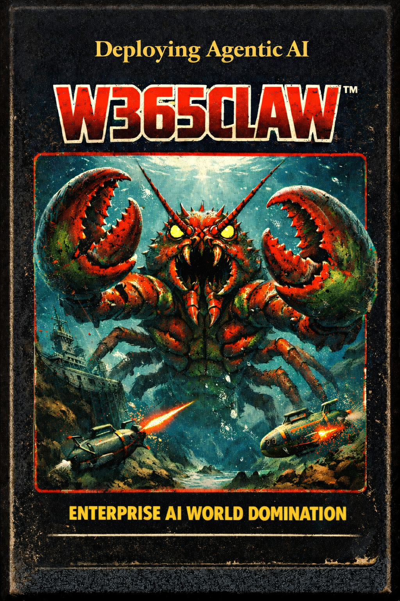

# Deploying OpenClaw with Windows 365: A Practitioner's Guide to Custom Image Engineering and Deployment

**Author:** Kevin Kaminski, Microsoft MVP for Windows 365

---

## About This Book

This book is a comprehensive technical guide for IT administrators and platform engineers who need to deploy AI coding agents (specifically OpenClaw and Claude Code) onto Windows 365 Cloud PCs using custom images built with Azure Compute Gallery and Azure VM Image Builder. While OpenClaw is the anchor product and primary focus, the book also covers Claude Code, OpenAI Codex CLI, and OpenSpec as complementary tools in the AI coding agent ecosystem, each with its own installation, configuration, and security considerations. It covers everything from infrastructure provisioning through Terraform, to the build pipeline, to post-provisioning operations, to the security architecture required to contain autonomous AI agents in an enterprise environment.

The audience is technical. If you're looking for a high-level overview, this isn't it. This is the book you read when you need to understand why the Node.js MSI doesn't update your PowerShell session's PATH, why GitHub Desktop uses a "hydration" mechanism instead of a traditional installer, and why running an AI agent under your primary Entra ID is an architectural failure.

### Publication Notes

This book is designed to work both as a standalone guide and as a companion to the **[W365Claw repository](https://github.com/kkaminsk/W365Claw)**, which contains the complete Terraform modules, PowerShell scripts, and configuration templates referenced throughout. The repository should be public and current with the code shown in this book at the time of publication.

Several chapters include Mermaid diagrams for architecture and workflow visualization. These render natively in GitHub, VS Code, and most modern markdown viewers. If your reading environment does not support Mermaid, the diagrams are described in the surrounding text.

### How to Use This Book

- Read Part I if you are new to Windows 365 or custom image engineering.
- Jump to Part II and Part III if you already run Windows 365 and need the image pipeline details.
- Use Part IV and Part V as operational runbooks during builds and rollouts.
- Use Part VI when you need to justify, implement, or audit security controls.
- Keep Part VII open as a reference while executing builds.

### Conventions and Notation

- Commands appear in fenced code blocks and are intended to be copied as-is.
- Paths are Windows style unless explicitly called out.
- "Build workstation" refers to the temporary VM used for Azure VM Image Builder runs.
- "Agent account" refers to the dedicated Entra ID identity used by the AI agent.
- Code examples are shared with the W365Claw repository and must remain in sync.

### Prerequisites and Assumptions

- An Azure tenant with Windows 365 licensing and Microsoft Intune.
- Entra ID permissions to create app registrations, managed identities, and groups.
- Subscription-level access (Owner or Contributor) and Intune admin rights for image import and policy changes.
- Ability to create Azure Compute Gallery resources and Azure VM Image Builder templates.
- A trusted build workstation with outbound internet access for installer and npm package downloads.

### Versioning and Drift

This guide is accurate as of February 25, 2026. Microsoft services, marketplace images, and third-party tools change frequently. Verify versions, pricing, and feature status in the referenced repositories and release notes before production changes.

---

## Table of Contents

- [Part I: Foundation](./chapters/ch01-introduction.md)
  - [Chapter 1: Introduction](./chapters/ch01-introduction.md)
  - [Chapter 2: Architecture Overview](./chapters/ch02-architecture-overview.md)
  - [Chapter 3: The Architectural Boundary](./chapters/ch03-architectural-boundary.md)
- [Part II: Infrastructure](./chapters/ch04-azure-compute-gallery.md)
  - [Chapter 4: Azure Compute Gallery for Windows 365](./chapters/ch04-azure-compute-gallery.md)
  - [Chapter 5: Identity and RBAC](./chapters/ch05-identity-and-rbac.md)
  - [Chapter 6: Terraform Solution Architecture](./chapters/ch06-terraform-solution-architecture.md)
- [Part III: The Build Pipeline](./chapters/ch07-preparing-build-workstation.md)
  - [Chapter 7: Preparing the Build Workstation](./chapters/ch07-preparing-build-workstation.md)
  - [Chapter 8: Phase 1 -- Core Runtimes](./chapters/ch08-phase1-core-runtimes.md)
  - [Chapter 9: Phase 2 -- Developer Tools](./chapters/ch09-phase2-developer-tools.md)
  - [Chapter 10: Phase 3 -- Configuration and Policy](./chapters/ch10-phase3-configuration-policy.md)
  - [Chapter 12: Windows Update and Sysprep](./chapters/ch12-windows-update-sysprep.md)
  - [Chapter 13: Supply Chain Integrity](./chapters/ch13-supply-chain-integrity.md)
- [Part IV: Operations](./chapters/ch14-building-the-image.md)
  - [Chapter 14: Building the Image](./chapters/ch14-building-the-image.md)
  - [Chapter 15: Verification Checklist](./chapters/ch15-verification-checklist.md)
  - [Chapter 16: Image Versioning and Staged Rollout](./chapters/ch16-image-versioning-staged-rollout.md)
  - [Chapter 17: Importing into Windows 365](./chapters/ch17-importing-into-windows-365.md)
  - [Chapter 18: The Reprovisioning Reality](./chapters/ch18-reprovisioning-reality.md)
  - [Chapter 19: Tearing Down Build Resources](./chapters/ch19-tearing-down-build-resources.md)
  - [Chapter 20: Version Retention and Cost Management](./chapters/ch20-version-retention-cost-management.md)
  - [Chapter 21: CI/CD Pipeline Integration](./chapters/ch21-cicd-pipeline-integration.md)
- [Part V: Post-Provisioning](./chapters/ch22-first-login-experience.md)
  - [Chapter 22: First Login Experience](./chapters/ch22-first-login-experience.md)
  - [Chapter 23: API Key Delivery](./chapters/ch23-api-key-delivery.md)
  - [Chapter 24: VS Code Extensions](./chapters/ch24-vs-code-extensions.md)
  - [Chapter 25: Agent Updates Without Reprovisioning](./chapters/ch25-agent-updates-without-reprovisioning.md)
- [Part VI: Security](./chapters/ch26-agent-threat-model.md)
  - [Chapter 26: The Agent Threat Model](./chapters/ch26-agent-threat-model.md)
  - [Chapter 27: Identity Architecture -- The Secondary User Imperative](./chapters/ch27-identity-architecture-secondary-user.md)
  - [Chapter 28: Hardening Claude Code](./chapters/ch28-hardening-claude-code.md)
  - [Chapter 29: Hardening OpenClaw](./chapters/ch29-hardening-openclaw.md)
  - [Chapter 30: Network Segmentation](./chapters/ch30-network-segmentation.md)
  - [Chapter 31: Endpoint Protection](./chapters/ch31-endpoint-protection.md)
  - [Chapter 32: Intune Configuration Profiles](./chapters/ch32-intune-configuration-profiles.md)
  - [Chapter 33: Monitoring and Forensics](./chapters/ch33-monitoring-and-forensics.md)
  - [Chapter 38: Data Protection with Microsoft Purview](./chapters/ch38-purview-data-protection.md)
- [Part VII: Reference](./chapters/ch34-troubleshooting-faq.md)
  - [Chapter 34: Troubleshooting and FAQ](./chapters/ch34-troubleshooting-faq.md)
  - [Chapter 35: PowerShell Scripts](./chapters/ch35-powershell-scripts.md)
  - [Chapter 36: Windows 365 Image Requirements Checklist](./chapters/ch36-image-requirements-checklist.md)
  - [Chapter 37: Component Summary Matrix](./chapters/ch37-component-summary-matrix.md)

- [Appendix: Operational Quick Reference](./chapters/appendix.md)
- [Appendix: Feedback and Errata](./chapters/appendix.md)

---

