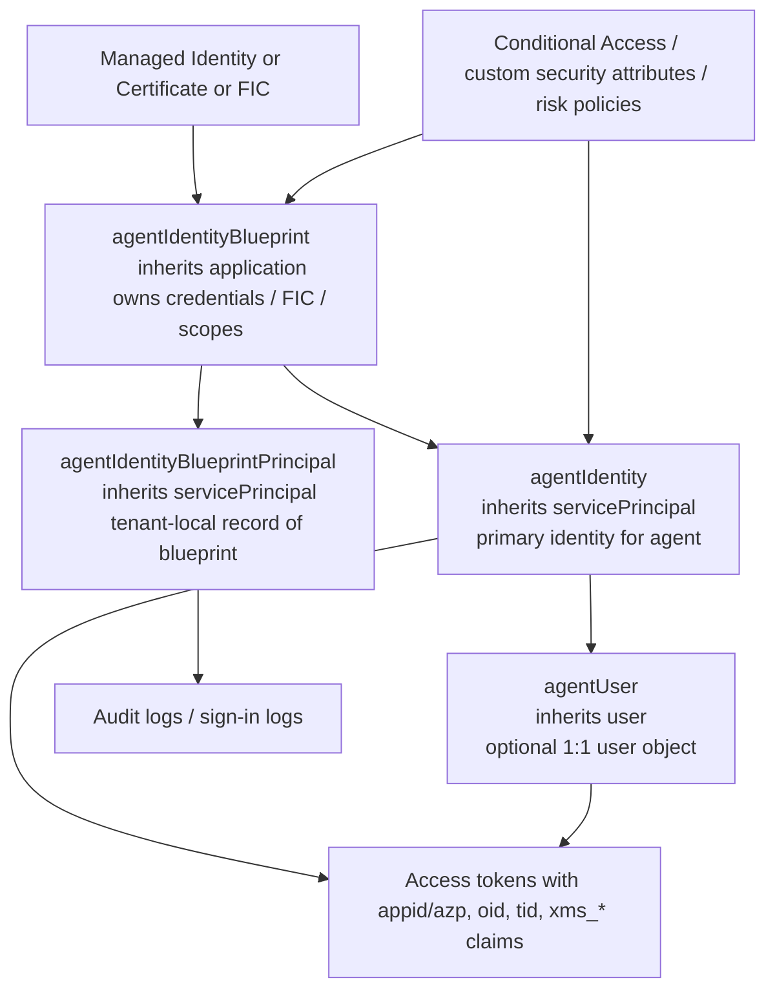
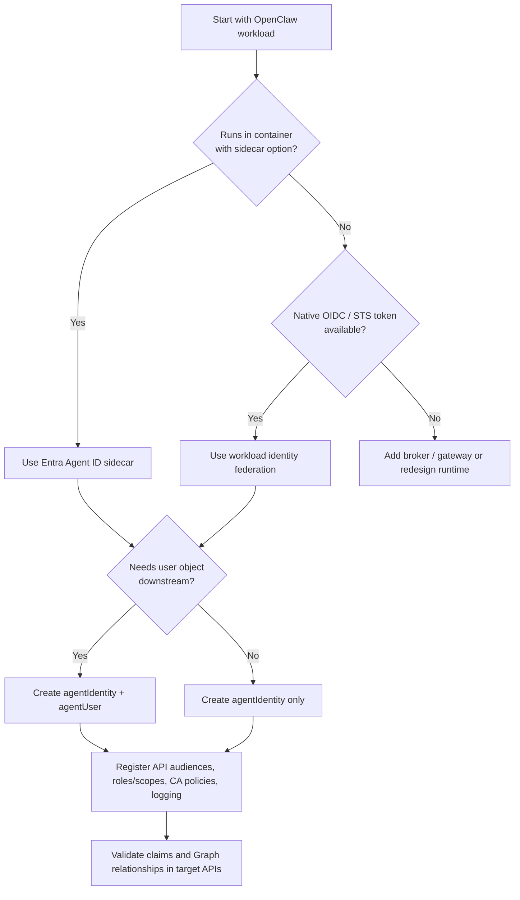

# Microsoft Entra Agent ID and OpenClaw

## Executive summary

In current Microsoft documentation, **Microsoft Entra Agent ID** is not a single identifier field analogous to `tenantId` or `objectId`; it is a **new identity-and-security framework for AI agents**. The concrete identity object within that framework is the **`agentIdentity`** resource in Microsoft Graph, a specialized subtype of `servicePrincipal`. Around it, Microsoft defines a small identity model: **`agentIdentityBlueprint`** as the template and credential anchor, **`agentIdentityBlueprintPrincipal`** as the tenant-local principal for the blueprint, **`agentIdentity`** as the agent’s primary nonhuman identity, and **`agentUser`** as an optional user-like identity for workloads that must present a user object to downstream systems. Microsoft explicitly says this architecture extends Entra to AI agents and is **purpose-built for agentic workloads**, while also noting that traditional service principals and regular user accounts are **not recommended** for most AI-agent scenarios. The product is also still in **preview**, and the API surface is split between **v1.0** and **beta** depending on the object or feature. citeturn6view0turn29view0turn25view0turn29view1turn33view0turn33view2turn38view0turn38view1turn37search1

The most important technical clarification is this: in Microsoft’s published Agent ID model, there is **no special JWT claim named `agent_id`**. Instead, Microsoft uses the existing Entra identifiers and token patterns—especially **`appid` / `azp`**, **`oid`**, and **`tid`**—plus **agent-specific classification claims** such as **`xms_act_fct`**, **`xms_sub_fct`**, and sometimes **`xms_par_app_azp`**. For an **`agentIdentity`**, Microsoft’s conceptual docs state that the **object ID and app ID are the same value**, which is a major departure from the classic application/service-principal model where `id` and `appId` are different identifiers. In other words, when practitioners ask for an “agent id,” the precise answer is usually: **identify the agent by the `agentIdentity` resource, and then use its `id`/object ID and `appId` as exposed by Graph and tokens**—with the special caveat that, for `agentIdentity`, those two values are documented as equal. citeturn7view0turn7view1turn8view0turn12view0turn12view2

From a security perspective, Agent ID’s intended value is not just a new object type. It is the combination of **blueprint-managed credentials**, **delegation patterns**, **agent-aware logging**, **Conditional Access targeting**, **Identity Protection risk telemetry**, and **governance metadata** such as owners and sponsors. Microsoft recommends **managed identities** and **federated identity credentials** over client secrets for production, supports both **app-only autonomous flows** and **on-behalf-of** patterns, and provides agent-specific sign-in and risk surfaces in logs and Graph APIs. This makes Agent ID materially different from “just another service principal.” citeturn11view2turn11view4turn8view5turn8view6turn11view7turn8view9turn7view8turn8view2turn15view2turn15view3

For **OpenClaw**, I did not find a Microsoft Learn page specifically documenting “OpenClaw + Entra Agent ID” in the official docs reviewed for this report. What I did find is a set of **Microsoft GitHub references** that show ecosystem overlap rather than formal productized support: a **Microsoft Amplifier integration for OpenClaw**, a **FastTrack sample** explicitly saying PowerClaw is inspired by OpenClaw, a **community OpenClaw integration** in Microsoft’s agent-governance toolkit repository, and a **Microsoft VS Code issue** mentioning OpenClaw MCP tools. That means the right conclusion is not “unsupported,” but rather: **assess OpenClaw as a third-party agent runtime against Microsoft’s generic third-party integration patterns**—especially the **sidecar** pattern for containerized agents and **workload identity federation** for OIDC-capable external runtimes. citeturn6view11turn8view10turn7view12turn5search3turn5search10turn5search14turn5search18turn5search5

## Meaning and data model

The official Microsoft Graph overview for Agent ID describes four core building blocks: **blueprint**, **blueprint principal**, **agent identity**, and **agent user**. The blueprint is the **template**; the blueprint principal is the **tenant-local record** of that blueprint; the agent identity is the **primary authentication identity**; and the agent user is the **optional user account** for systems that require a user object. Microsoft’s Entra docs describe the same architecture in conceptual terms and add an operational rule: for most AI agents, **agent identity is the right identity type**, while **agent user** should be added only when the target system strictly requires a user object. citeturn29view0turn38view0turn38view1

The Graph resource inheritance model is unusually clear. An **`agentIdentityBlueprint` inherits from `application`**. An **`agentIdentityBlueprintPrincipal` inherits from `servicePrincipal`**. An **`agentIdentity` inherits from `servicePrincipal`**. An **`agentUser` inherits from `user`**. This is the cleanest mental model for understanding where Agent ID fits: it is **not a parallel directory**; it is an **agent-aware specialization of existing Entra object families**. citeturn25view0turn29view1turn33view0turn33view2

One subtle but high-value detail is that the linkage properties use **different identifier kinds**. The **`agentIdentityBlueprintId`** property on an **`agentIdentity`** is defined as the **`appId` of the parent blueprint**, not the blueprint application object’s `id`. By contrast, the **`identityParentId`** property on an **`agentUser`** is the **object ID of the associated agent identity**. This matters in implementation: if you store only application object IDs and then try to correlate child agent identities by `agentIdentityBlueprintId`, you will mismatch unless you translate to the blueprint’s `appId`. citeturn33view0turn33view3

The other standout design decision is Microsoft’s documentation that an **agent identity’s object ID and app ID “always have the same value.”** That is intentionally unlike the ordinary app-registration model, where the application object’s `id` is tenant-scoped and the `appId` is the globally unique client ID. For developers and auditors, this means that the phrase “agent id” often collapses two concepts that are normally distinct. In classic Entra app design, you must keep **object ID** and **application/client ID** separate. In Agent ID, for the **`agentIdentity`** object specifically, Microsoft is trying to make agent attribution easier by making those two values align. citeturn7view0turn7view1turn16view5



The intended administrative model adds **owners**, **sponsors**, and sometimes **managers**. Owners are technical administrators. Sponsors provide business accountability. Managers apply to the **agent user** scenario. Microsoft explicitly positions these constructs as part of agent lifecycle oversight and governance, which is another reason it distinguishes agent identities from ordinary service principals. citeturn29view0turn38view1

### Identifier comparison table

| Identifier type | Canonical property / claim | What it applies to | Scope and uniqueness | Where it appears | What it means in practice |
|---|---|---|---|---|---|
| **Agent identity “ID”** | `agentIdentity.id` and `agentIdentity.appId` | `agentIdentity` | Microsoft documents these as the **same value** for agent identities | Graph resource, OAuth client ID usage, token `appid`/`azp`, token `oid` | This is the closest thing to an “agent id” in practice, but it is **not** a separate `agent_id` schema field. citeturn7view0turn7view1turn33view0turn12view2 |
| **`objectId`** | `id` | Any Entra directory object | Tenant-scoped object identifier | Graph `id`, admin center “Object ID,” token `oid` when that object is the subject | For applications and service principals, this usually differs from `appId`; for **agentIdentity**, Microsoft says it equals `appId`. citeturn25view0turn16view5turn12view2turn7view0 |
| **`appId`** | `appId` | Applications, service principals, blueprints, blueprint principals, agent identities | Global application/client identifier in Entra | Graph `appId`, admin center “Application (Client) ID,” token `appid` / `azp` | For normal apps/SPs, `appId` is the global client identifier. For **agentIdentity**, it is also the practical agent identifier and equals `id`. citeturn25view0turn29view1turn16view5turn12view2turn7view1 |
| **`clientId`** | Usually the same value as `appId` | OAuth clients and SDK configuration | Same semantics as `appId` | Token requests, SDK config, admin/UI wording | Microsoft often uses **app ID** and **client ID** interchangeably; official docs for blueprints explicitly call the blueprint app ID the **client ID**. citeturn6view8turn22search0 |
| **`tenantId`** | `tenantId` / token `tid` | Tenant / directory | Tenant-global GUID | Token claim `tid`, ARM/MI resource metadata | This identifies the Entra tenant, not the agent. It is required for token audience and policy context. citeturn12view0turn12view2turn19view1 |
| **`principalId`** | `properties.principalId` | Managed identity ARM resource | Service-principal object ID associated with the managed identity | ARM/Managed Identity APIs and Azure resource outputs | For managed identities, **`principalId` is the service-principal object ID**, and Microsoft says you typically use it for permissions/RBAC, while using **`clientId`** in application code. citeturn19view1turn15view13turn16view6 |
| **Blueprint parent reference** | `agentIdentityBlueprintId` | `agentIdentity` | Stores the parent blueprint’s **`appId`** | Agent identity Graph resource | Easy to misread: despite the name, this is not the blueprint object’s `id`; it is the blueprint **`appId`**. citeturn33view0 |
| **Agent-user parent reference** | `identityParentId` | `agentUser` | Stores the parent agent identity’s **object ID** | Agent user Graph resource | This directly links the user-like account to its associated agent identity. citeturn33view3 |

## APIs, tokens, and command examples

The official Graph overview says Agent ID is exposed through Microsoft Graph, and the published resource types make the API placement explicit: **blueprints live under the `applications` family**, while **blueprint principals and agent identities live under the `servicePrincipals` family**, and **agent users live under the `users` family**. This is why the API surface feels familiar even though the semantics are new. Some of these Agent ID resources are now in **v1.0**—notably `agentIdentity`, `agentIdentityBlueprint`, and `agentIdentityBlueprintPrincipal`—while **`agentUser`** and several logging/risk surfaces are still in **beta** in the sources reviewed here. citeturn29view0turn25view0turn29view1turn33view0turn33view2turn7view8turn15view0turn15view2

A strong implementation pattern is visible in Microsoft’s token-flow docs. For autonomous operation, you first obtain a token as the **blueprint**, passing the target agent identity in **`fmi_path`**. You then exchange that blueprint token for the **agent identity token**. For agent-user scenarios, Microsoft documents a further **`user_fic`** grant pattern to obtain a delegated token tied to the `agentUser`. For interactive/on-behalf-of operation, Microsoft describes a user authorization-code flow to the blueprint’s **`access_agent`** scope, followed by OBO exchange to a token for the concrete agent identity. citeturn8view5turn8view6turn11view6turn11view7turn11view8

The token model is equally important. Microsoft’s Agent ID token-claims reference shows **no dedicated `agent_id` claim**. Instead, the published claims for agent scenarios rely on standard claims such as **`tid`**, **`appid` / `azp`**, **`oid`**, **`aud`**, **`scp`**, **`roles`**, and **`idtyp`**, with agent-specific semantics carried primarily in **`xms_act_fct`** and **`xms_sub_fct`**. Microsoft assigns value **`11`** to **AgentIdentity** and **`13`** to **AgentIDUser**. When an agent acts autonomously, the subject is app-like (`idtyp=app`) and the token shows `xms_sub_fct=11`; when it acts through an agent user, the subject is user-like (`idtyp=user`) and the token shows `xms_sub_fct=13`. Microsoft also documents **`xms_par_app_azp`** for parent-application attribution and explicitly says it is useful for **logging**, but **not recommended for authorization decisions**. citeturn8view0turn8view1turn12view0turn12view2turn15view6

Below are concrete, official-style examples that show where “agent id” really shows up.

```http
POST https://graph.microsoft.com/v1.0/servicePrincipals/microsoft.graph.agentIdentity
Content-Type: application/json
Authorization: Bearer <token>

{
  "displayName": "My Agent Identity",
  "agentIdentityBlueprintId": "65415bb1-9267-4313-bbf5-ae259732ee12",
  "sponsors@odata.bind": [
    "https://graph.microsoft.com/v1.0/users/acc9f0a1-9075-464f-9fe7-049bf1ae6481",
    "https://graph.microsoft.com/v1.0/groups/47309f33-e0ff-7be6-defe-28b504c8cd2e"
  ]
}
```

Microsoft’s v1.0 `Create agentIdentity` API uses the **servicePrincipals** collection, returns `@odata.type = #microsoft.graph.agentIdentity`, and shows `servicePrincipalType = ServiceIdentity`. The request body’s `agentIdentityBlueprintId` is the parent blueprint’s **`appId`**, not its object ID. citeturn36view0turn33view0

```http
POST https://login.microsoftonline.com/<tenant-id>/oauth2/v2.0/token
Content-Type: application/x-www-form-urlencoded

client_id=<agent-blueprint-client-id>
&scope=api://AzureADTokenExchange/.default
&grant_type=client_credentials
&client_secret=<client-secret>
&fmi_path=<agent-identity-client-id>
```

```http
POST https://login.microsoftonline.com/<tenant-id>/oauth2/v2.0/token
Content-Type: application/x-www-form-urlencoded

client_id=<agent-identity-client-id>
&scope=https://graph.microsoft.com/.default
&grant_type=client_credentials
&client_assertion_type=urn:ietf:params:oauth:client-assertion-type:jwt-bearer
&client_assertion=<agent-blueprint-token>
```

These two requests are the core autonomous-flow pattern in Microsoft’s docs: first obtain a **blueprint token** using `fmi_path`, then exchange it for an **agent identity token**. citeturn8view5turn8view6turn11view5

```json
{
  "tid": "00000001-0000-0ff1-ce00-000000000000",
  "idtyp": "app",
  "xms_idrel": "7",
  "appid": "aaaaaaaa-1111-2222-3333-444444444444",
  "oid": "bbbbbbbb-1111-2222-3333-444444444444",
  "roles": ["<app role>"],
  "xms_act_fct": "11",
  "xms_sub_fct": "11",
  "aud": "f2510d34-8dca-4ab8-a0bc-aaec4d3a3e36"
}
```

This is the shape Microsoft documents for an **autonomous agent identity token**: standard Entra claims plus **AgentIdentity facts**. When the subject switches to an **agent user**, `idtyp` becomes `user`, `oid` becomes the agent user’s object ID, and `xms_sub_fct` shifts to `13`. citeturn8view0turn12view2

```http
GET https://graph.microsoft.com/beta/auditLogs/signIns?$filter=signInEventTypes/any(t: t eq 'servicePrincipal') and agent/agentType eq 'AgentIdentity'
```

```http
GET https://graph.microsoft.com/beta/identityProtection/riskyAgents
```

These show how Agent ID enters **monitoring** and **risk** APIs. Microsoft documents an **`agentSignIn`** event type and an **agent-type filter** in sign-in logs, and separately exposes **`riskyAgents`** and **`agentRiskDetection`** in Identity Protection. citeturn8view2turn7view7turn7view8turn15view0turn15view2turn15view3

```powershell
Connect-MgGraph -Scopes `
  "AgentIdentityBlueprint.Create", `
  "AgentIdentityBlueprint.AddRemoveCreds.All", `
  "AgentIdentityBlueprint.UpdateAuthProperties.All", `
  "AgentIdentityBlueprintPrincipal.Create", `
  "User.Read" `
  -TenantId <your-tenant-id>

$me = Invoke-MgGraphRequest -Method GET -Uri "https://graph.microsoft.com/v1.0/me"

$body = @{
  "@odata.type" = "Microsoft.Graph.AgentIdentityBlueprint"
  "displayName" = "My Agent Identity Blueprint"
  "sponsors@odata.bind" = @("https://graph.microsoft.com/v1.0/users/$($me.id)")
  "owners@odata.bind"   = @("https://graph.microsoft.com/v1.0/users/$($me.id)")
} | ConvertTo-Json -Depth 5

Invoke-MgGraphRequest `
  -Method POST `
  -Uri "https://graph.microsoft.com/v1.0/applications/microsoft.graph.agentIdentityBlueprint" `
  -Body $body `
  -ContentType "application/json"
```

This is the official PowerShell pattern Microsoft shows for creating an **agent identity blueprint** with Graph PowerShell. It also illustrates that **Agent ID lifecycle control is Graph-centric**. citeturn25view1

```powershell
Get-EntraServicePrincipal -Filter "servicePrincipalType eq 'ManagedIdentity'"
```

```powershell
Connect-Entra -Scopes 'Application.ReadWrite.All'
Remove-EntraServicePrincipal -ObjectId <blueprint-principal-object-id>
```

The first command is useful when you need to compare classic managed-identity/service-principal identifiers, and the second is Microsoft’s official Entra PowerShell example for blueprint-principal deletion. In the Entra PowerShell output examples, `Id`, `AppId`, and `ServicePrincipalType` are shown explicitly, including `ManagedIdentity` as a principal type. citeturn16view4turn36view2

```bash
az identity create -g <RESOURCE_GROUP> -n <USER_ASSIGNED_IDENTITY_NAME>

az identity show -g <RESOURCE_GROUP> -n <USER_ASSIGNED_IDENTITY_NAME> \
  --query "{resourceId:id, clientId:clientId, principalId:principalId, tenantId:tenantId}" -o json

az ad sp list --display-name <Azure-resource-name>
```

Azure CLI is most useful here for the **managed-identity side of the design**, not as the primary Agent ID control plane. Microsoft’s managed-identity docs and ARM REST docs say a user-assigned identity returns **`clientId`**, **`principalId`**, **`tenantId`**, and ARM **`id`**, and they explicitly recommend **`principalId`** for permission assignment and **`clientId`** in application code. Microsoft also documents `az ad sp list --display-name` to find the service principal behind a managed identity-enabled Azure resource. citeturn19view2turn15view13turn19view1turn16view7

## Security and identifier analysis

The central security benefit of Agent ID is that **agent identities themselves do not hold credentials**. Microsoft says the **blueprint** is the authentication foundation and holds the credentials that are used to acquire tokens for child agent identities. This shifts credential management upward to the blueprint layer, which is a better fit for governance, rotation, and policy. It also explains why Microsoft emphasizes the blueprint/app context in token requests and why `fmi_path` is needed to specify which child agent is being impersonated. citeturn8view3turn38view1turn8view5

Microsoft is also unusually direct that **managed identities are the preferred credential type**, and that **client secrets should not be used in production** for blueprint credentials. The recommended path is **managed identities** or **federated identity credentials**—including trust to external identity providers where appropriate. This is consistent with Microsoft’s broader workload-identity guidance: federated credentials remove the need to manage secrets, and managed identities provide automatically managed credentials in Entra. citeturn11view2turn11view4turn15view8turn15view9turn15view10

On authorization, Agent ID uses the same broad Entra mechanisms—**app roles**, **delegated scopes**, **OAuth permission grants**, and **Conditional Access**—but applies them to agent-aware principals. Blueprint principals expose app roles and delegated scopes in the familiar service-principal form, while agent identities themselves have app-role-assignment and delegated-grant relationships. For interactive agents, the downstream model is still OBO-style delegated access; for autonomous agents, it is app-only access with `roles` claims. That means resource servers do not need to invent an entirely new authorization system; they need to become **claim-aware** for the agent-specific fact claims and understand the new object types in Graph. citeturn29view1turn33view0turn11view7turn12view2

The control-plane difference from plain service principals is the governance layer. Microsoft’s planning and key-concepts docs explicitly say service principals were designed for **static, deterministic workloads** and **are not recommended** for AI-agent workloads because they lack enforced sponsorship, agent-aware audit entries, and blueprint-managed lifecycle. At the same time, the Entra admin center can still inventory **agents using a service principal** alongside true **agent identity objects**, which is useful for transitional or mixed estates. The strategic guidance, however, is clear: **use `agentIdentity` when you want an AI agent to be visible, governable, and security-distinct as an agent**. citeturn38view0turn38view1turn38view2

Conditional Access is one of the clearest examples of this difference. Microsoft documents that Conditional Access can target **agent identities directly**, **their parent blueprints**, or **custom security attributes** attached to agents and even to target resources. Microsoft also describes high-risk-agent templates and says token issuance to resources occurs only after Conditional Access requirements are satisfied. In practical terms, that gives security teams a path to agent-aware Zero Trust controls, which is very difficult to approximate cleanly with ordinary service principals. citeturn6view5turn8view9turn4search4

Logging and forensics are similarly agent-aware. Microsoft documents an **`agentSignIn`** event type, admin-center filters for **Agent ID user**, **Agent Identity**, **Agent Identity Blueprint**, and **Not Agentic**, and Graph filtering on `agent/agentType`. Microsoft also says agent sign-ins can appear across the four sign-in log types because agents may use either app-only or delegated permission patterns. Combined with **`riskyAgents`** and **`agentRiskDetection`**, this gives a materially richer story than “service principal signed in.” citeturn8view2turn7view8turn7view7turn15view2turn15view3

There are also two important validation cautions. First, Microsoft’s general access-token guidance says applications should not hard-code assumptions about claim order or rely on internal/opaque claims beyond documented semantics. Second, the Agent ID claims reference specifically says **`xms_par_app_azp`** is appropriate for **audit attribution** but **not recommended for authorization**, because using a parent-app identifier for access control could inadvertently grant broad access to many agents under the same manager. The right resource-server pattern is therefore: validate issuer, audience, signature, and expiry; then authorize on stable, documented subject/actor claims and Graph relationships—not on broad parent lineage hints. citeturn15view6turn12view0

## OpenClaw assessment and integration checklist

Because you did not specify what OpenClaw is, I treated it as potentially a project, product, or service. In the materials reviewed, the strongest match is the GitHub project **`openclaw/openclaw`**, described as a **personal AI assistant/runtime** with CLI onboarding. On the Microsoft side, I found no official Microsoft Learn page dedicated to “OpenClaw + Entra Agent ID,” but I did find several Microsoft GitHub references: **`microsoft/amplifier-app-openclaw`** integrates OpenClaw with Microsoft Amplifier; the FastTrack **PowerClawAgent** sample says PowerClaw is inspired by OpenClaw; Microsoft’s **agent-governance-toolkit** lists OpenClaw among community AgentMesh integrations; and a Microsoft **VS Code** issue references OpenClaw MCP tools. Taken together, that looks like **ecosystem adjacency and experimentation**, not yet first-class Entra Agent ID product documentation for OpenClaw. citeturn5search5turn5search3turn5search10turn5search14turn5search18

The practical compatibility test is therefore architectural, not branding-based. Microsoft’s official guidance for **third-party agents** describes two integration patterns: a **sidecar** pattern using the Microsoft Entra SDK for Agent ID, and a **federation** pattern using workload identity federation and direct identity exchange. Microsoft says the sidecar works with **any containerized agent** and is particularly attractive because the agent code remains **credential-free**; Microsoft says the federation pattern is best for agents that already have an external **OIDC / STS** story or **can’t run containers**. If OpenClaw can do one of those two things, it is a plausible Agent ID candidate even without an OpenClaw-specific Microsoft doc page. citeturn6view11turn8view10turn7view12

The next compatibility question is **what the OpenClaw workload must access**. If it only needs app-only access to APIs that accept Entra-protected service-style tokens, **`agentIdentity` alone** is usually enough. If it must access systems that insist on a user object—Microsoft explicitly names examples like Exchange mailboxes or Teams channels—then the design needs an **`agentUser`** paired 1:1 with the agent identity. If it needs policy and governance at scale, attach **custom security attributes**, owners, and sponsors; if it needs strong token hygiene, prefer **managed identity/FIC** over secrets. citeturn38view0turn38view1turn33view2turn11view4turn6view5

### Decision checklist for applying Agent ID to OpenClaw

| Question | If the answer is yes | If the answer is no | Why it matters |
|---|---|---|---|
| Can OpenClaw run in a container or pod next to a sidecar? | Use the **Entra Agent ID sidecar** pattern first. | Consider federation instead. | Microsoft says the sidecar works with **any containerized agent** and keeps agent code credential-free. citeturn8view10turn7view11 |
| Can OpenClaw obtain an external OIDC/STS token from its host platform? | Use **workload identity federation** and direct token exchange. | Use the sidecar or add an identity broker layer. | Microsoft’s federation pattern is for third-party runtimes that already have native workload identity. citeturn7view12turn15view9 |
| Does the target resource require a **user object**? | Add an **`agentUser`** linked 1:1 to the agent identity. | Keep only **`agentIdentity`**. | Microsoft says agent users exist specifically for systems that require user identities, and they use `identityParentId` to link back to the agent identity. citeturn38view0turn33view2turn33view3 |
| Do downstream APIs need **app roles** or **delegated scopes**? | Model the flow accordingly: app-only for autonomous roles, OBO + scopes for delegated access. | Keep the authorization surface simpler. | Agent ID keeps standard Entra authorization primitives, so you must map OpenClaw’s behavior to `roles` vs `scp`. citeturn29view1turn33view0turn12view2 |
| Can the target API validate agent-aware claims? | Validate `aud`, `tid`, `oid`, `appid`/`azp`, and relevant `xms_*` facts. | Add a gateway or middleware that can. | Microsoft’s published claim set is where agent semantics actually live; there is no standalone `agent_id` claim. citeturn12view0turn12view2 |
| Is centralized governance, sponsorship, and CA policy required? | Prefer **Agent ID** over plain service principal. | A classic service principal might be operationally simpler but less governable. | Microsoft’s stated reason for Agent ID is that plain service principals are not rich enough for agent governance. citeturn38view0turn38view1 |
| Can the deployment use managed identity or FIC? | Prefer that for blueprint credentials. | Treat the design as lower-assurance and temporary if it relies on secrets. | Microsoft explicitly recommends managed identities/FIC and warns against client secrets in production. citeturn11view4turn15view8turn15view10 |
| Do you need incident response and auditability for agent actions? | Make sure sign-in-log filters, `agentSignIn`, and Identity Protection signals are part of the rollout. | You will have weaker operational assurance. | Agent-specific logs and risk APIs are a core part of the value proposition. citeturn8view2turn7view8turn15view2turn15view3 |



My bottom-line judgment is that **Agent ID can plausibly apply to OpenClaw**, but only if OpenClaw can be mapped onto one of Microsoft’s official third-party integration patterns and one of the official Entra identity models. The primary mapping questions are: **container vs federation**, **app-only vs user-required**, and **whether the target APIs understand Entra claims and policy**. If OpenClaw is merely an orchestration shell around API keys with no OIDC or sidecar story, Agent ID adoption will require an architectural wrapper rather than a simple toggle. citeturn6view11turn8view10turn7view12turn38view0turn33view2

## Open questions and primary sources

A few limitations matter for interpretation. First, **Microsoft Entra Agent ID is still in preview**, and its control plane is moving quickly; some Graph resources are already in **v1.0**, while others—including **`agentUser`** and several sign-in/risk surfaces—were still documented in **beta** in the sources reviewed. Second, Microsoft’s public docs clearly define the **object model** and **token-claim model**, but they do **not** publish a special `agent_id` token claim; when people say “agent id,” they are often conflating the **product name** with the **agent identity object and its IDs**. Third, I did not encounter an academic/original paper in the primary Microsoft or GitHub sources reviewed; the evidence base here is product documentation plus repository artifacts. citeturn37search1turn25view0turn33view0turn33view2turn15view2

The most useful primary sources for this topic are the following Microsoft docs and GitHub repositories, each linked through the citation:

- **What is Microsoft Entra Agent ID?** and the product landing page for the framework itself. citeturn6view0turn4search9  
- **Microsoft Entra Agent ID APIs in Microsoft Graph overview**, which is the best concise data-model map. citeturn29view0  
- **`agentIdentityBlueprint`**, **`agentIdentityBlueprintPrincipal`**, and **`agentIdentity`** Graph resource types. citeturn25view0turn29view1turn33view0  
- **Agent token claims reference** and **authentication-flow docs** for the actual token semantics and grant patterns. citeturn6view3turn8view5turn8view6turn11view7  
- **Conditional Access for agent identities** and **Agent ID logs**, which explain policy and monitoring. citeturn6view5turn6view4  
- **Managed identities** and **federated identity credentials** docs, which explain the recommended production credential model. citeturn15view10turn15view8turn15view9  
- **`microsoft/entra-agentid-samples`** for runnable Microsoft samples. citeturn5search0turn5search12  
- **`openclaw/openclaw`**, **`microsoft/amplifier-app-openclaw`**, and Microsoft’s related GitHub references for the OpenClaw ecosystem surface I found. citeturn5search5turn5search3turn5search10turn5search14

The shortest accurate answer, after all of that, is this: **in Microsoft Entra, “Agent ID” is primarily the name of a new agent-centric identity framework; the concrete thing you implement against is the `agentIdentity` object, a specialized service principal whose `id` and `appId` are documented as the same value, and whose tokens are identified by standard Entra claims plus agent-specific `xms_*` fact claims.** citeturn6view0turn33view0turn12view0turn12view2