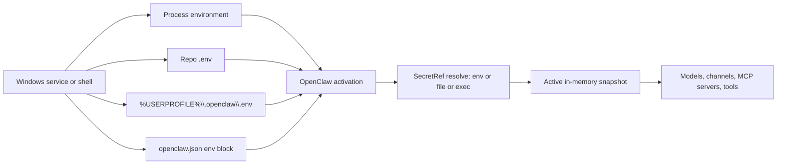
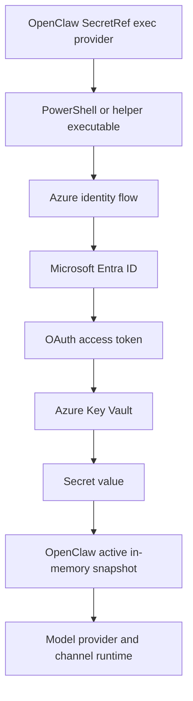

# Secure API Key and Secret Handling for OpenClaw and Agent Frameworks on Windows

## Executive summary

On Windows, the practical secret-handling question is not just **where a key is stored**, but **when it becomes plaintext, which process can read it, how long it persists, and how fast you can rotate it without breaking agents**. OpenClaw’s current documented model is strong on this point: it supports `SecretRef` indirection from `env`, `file`, and `exec` providers, resolves secrets eagerly at activation time, keeps an active in-memory snapshot for runtime use, and can audit plaintext residue. But OpenClaw also explicitly warns that plaintext secrets left in `openclaw.json`, `auth-profiles.json`, `.env`, or generated model files remain agent-readable if the agent can inspect those files. On Windows, that warning matters because local development often defaults to exactly those plaintext surfaces. citeturn6view0turn6view1turn6view3turn6view5

The best Windows pattern depends on the deployment tier. For **single-user local development**, short-lived **process-scoped environment variables** are acceptable and ergonomic; **user-scoped persistent variables** are better than machine-scoped ones, but they still persist in the registry and are inherited into child processes. Plain `.env` files are convenient and widely supported, but they are plaintext and should be treated as a local-dev convenience only, never as a production secret store. On Windows desktops, **PowerShell SecretStore** or **Credential Manager** can reduce plaintext sprawl for user-scoped local usage. citeturn35view0turn24view4turn24view1turn24view7turn38view0turn38view1

For **shared machines, fleet deployments, long-lived services, and CI/CD**, the center of gravity should move to **Azure Key Vault** or an equivalent external secret manager. Microsoft’s own guidance is to use **managed identities** for app-to-Key-Vault access wherever possible, use **RBAC** rather than legacy access policies, cache secrets in memory to avoid throttling, and rotate them regularly—preferably with automation and dual-credential patterns where zero downtime matters. OpenClaw does not document a native Windows Credential Manager or native Azure Key Vault secret provider today; the documented integration surface is `SecretRef` via `env`, `file`, or `exec`, so the clean Key Vault pattern for OpenClaw on Windows is an **`exec` resolver** that retrieves secrets at activation time and returns them into OpenClaw’s in-memory snapshot. citeturn25view5turn25view6turn26view3turn26view4turn26view5turn26view6turn39search0turn39search3turn6view2turn6view3turn31view5

For **Windows containers**, there is a platform-specific caveat that changes the recommendation materially: Docker’s Windows-container secret implementation stores secrets in cleartext on the container root disk because Windows has no built-in RAM-disk driver for that path, and Kubernetes documents that Secret data on Windows nodes is written in cleartext to node-local storage unless you add protections like ACLs and BitLocker. That makes **identity-based retrieval from Key Vault** or platform-native secret references substantially preferable to naïve file mounts or environment injection on Windows containers. citeturn15search1turn15search7turn25view11

My bottom-line recommendation is:

- **Local dev, lowest friction:** process-scoped env vars, optionally backed by a local helper such as SecretStore. citeturn35view0turn24view7
- **Local dev, better hygiene:** OpenClaw `SecretRef` from `env` or `exec`, keep `.env` out of the agent-visible workspace, and run `openclaw secrets audit --check`. citeturn4view1turn6view1turn6view5
- **Production on Azure:** Azure Key Vault + managed identity + OpenClaw `exec` resolver + in-memory caching + regular reload/rotation. citeturn25view5turn25view6turn25view7turn25view8turn6view5
- **CI/CD:** GitHub Actions or Azure Pipelines secret stores, with Azure Key Vault integration where available; avoid committed `.env` files and long-lived plaintext secrets on agents. citeturn25view12turn25view13turn25view14turn25view15turn25view16

## How OpenClaw and common agent frameworks load API keys on Windows

OpenClaw supports both **native Windows** and **WSL2**, but its Windows platform guide is unambiguous that **WSL2 is the more stable and recommended path** for the full experience. Native Windows supports the core CLI and Gateway, with service installation using **Scheduled Tasks** and a **Startup-folder fallback** if task creation is denied. That matters operationally because the identity and startup context of the Gateway process directly determine which environment variables, local files, or secret resolvers are available when secrets are loaded. citeturn3view0turn3view1

OpenClaw’s environment loading model is explicit and standardized. Precedence is: **process environment**, then **`.env` in the current working directory**, then the global **`~/.openclaw/.env`**, then the `env` block in `openclaw.json`, and finally an optional login-shell import for missing keys. OpenClaw “never overrides existing values,” which means a process-level variable injected by a service manager or launcher will win over `.env` and config fallbacks. citeturn4view1turn34view0

OpenClaw’s stronger secret model is `SecretRef`. The documented contract supports `env`, `file`, and `exec` sources, and OpenClaw resolves those references **during activation**, not lazily on each request. If an active reference cannot be resolved, startup fails fast; on successful activation, runtime code reads only from the **active in-memory snapshot**. This is the key architectural property that makes external vault integration attractive: the external lookup happens before the hot path, and runtime operations no longer depend on the remote secret store being available for every request. citeturn6view0turn6view2turn6view3turn6view5



That architecture does **not** mean plaintext is gone. OpenClaw explicitly warns that plaintext secrets remain **agent-readable** if they are stored in files the agent can inspect, including `openclaw.json`, `auth-profiles.json`, `.env`, or generated `agents/*/agent/models.json` files. It also says migration should not be considered complete until `openclaw secrets audit --check` reports no plaintext residue. citeturn6view0turn6view1turn6view5

OpenClaw’s documented agent/runtime model is also relevant because different runtime families imply different secret-loading patterns. The docs distinguish **embedded harnesses** such as `pi` and plugin harnesses like `codex`, **CLI backends** such as `claude-cli`, and **ACP external harnesses** such as Pi, Claude Code, Cursor, Copilot, Droid, OpenCode, Gemini CLI, and other ACPX-supported harnesses. OpenClaw also documents **sub-agents** as separate background runs in their own sessions. In practice, embedded harnesses tend to consume secrets through OpenClaw’s provider/auth configuration, while ACP/CLI paths often need host-level credentials for the external harness itself, which is why OpenClaw notes that vendor auth must exist on the host for that harness. citeturn32view0turn32view1turn31view2

For common agent frameworks outside OpenClaw, the dominant Windows pattern is still **environment variables first**, then sometimes **`.env` fallback**, then explicit client construction if you want to bypass ambient environment state:

- **OpenAI Agents SDK**: the Python and JavaScript SDKs use `OPENAI_API_KEY` by default; the JS SDK resolves it lazily, and both SDKs let you override with an explicit key or explicit client object. The official Python quickstart includes Windows PowerShell and CMD examples for setting `OPENAI_API_KEY` for the current session. citeturn29view15turn29view16turn29view17
- **LangChain**: the standard OpenAI integrations expect `OPENAI_API_KEY`; for base URLs, LangChain documents a resolution order of explicit kwarg, then `OPENAI_API_BASE`, then `OPENAI_BASE_URL` from the underlying OpenAI SDK. citeturn30view0turn29view9turn30view1
- **AutoGen**: its OpenAI and Azure OpenAI clients use the OpenAI package and automatically read environment variables if an API key is not provided directly. citeturn29view8
- **Semantic Kernel** and **Microsoft Agent Framework**: their OpenAI settings classes document **environment variables first**, then **`.env`** as fallback when environment variables are missing. citeturn29view7turn29view5turn30view6
- **CrewAI**: current docs explicitly tell users to place provider keys in `.env` for quick starts, but also warn never to commit API keys and to prefer system secret management where appropriate. citeturn29view11turn30view2

A useful way to think about “common agent types” on Windows is by secret-ingestion pattern rather than brand:

| Agent type | Typical key-loading pattern on Windows | Default risk profile |
|---|---|---|
| Embedded gateway agents | Gateway/provider config or SecretRefs resolved by the host service | Lowest if host uses `exec`/vault and no plaintext residue remains |
| SDK-based app-process agents | `OPENAI_API_KEY` / provider env vars; sometimes `.env`; sometimes explicit client constructor | Moderate; easy locally, easy to leak via plaintext files |
| IDE/ACP-hosted harnesses | Host-level CLI auth or env vars consumed by the external harness | Moderate to high unless host auth is centrally managed |
| Multi-agent orchestrators | Shared env or `.env` plus per-process overrides | Moderate; coordination often increases blast radius |
| CI/CD-run agents | Platform secret store injection or vault fetch at job runtime | Strong if platform secrets are used correctly |

This table is a synthesis of the documented runtime/auth patterns above rather than a verbatim vendor matrix. citeturn32view0turn32view1turn29view15turn29view16turn29view7turn29view8turn30view2

## Environment variables and `.env` files on Windows

On Windows, environment variables exist in **Process**, **User**, and **Machine** scopes. Process-scope values live in the current process/session and are inherited by child processes. User- and Machine-scope values persist in the Windows registry and become visible to **newly started** processes; they are not retroactively injected into already-running processes. PowerShell’s documentation is especially clear that changes made with `$env:` affect only the current session, while persistent changes require `System.Environment`, the System Control Panel, or tools such as `setx`. citeturn35view0turn24view4turn24view1turn24view2turn24view3

The Windows scope trade-offs are straightforward:

| Scope | Persistence | Stored where | Propagates to child processes | Typical use |
|---|---|---|---|---|
| Process | Until the process exits | Current process environment block | Yes | Local testing, one terminal, one CI job |
| User | Persistent | Current-user registry environment | Only for newly started processes | Single-user persistent dev setup |
| Machine | Persistent | Machine-wide registry environment | Only for newly started processes across users | Rarely justified for secrets |

This summary is distilled from Microsoft’s Win32, PowerShell, and .NET environment-variable documentation. citeturn35view0turn24view4turn24view2turn24view3

The main security issue with Windows environment variables is that they are **ambient process state**. They are inherited by child processes, easy to reach from application code, and often end up being used by multiple tools in the same session. That is convenient, but it increases accidental exposure through debugging, script output, or over-broad reuse. The bigger risk comes when developers move from process scope to **User** or **Machine** scope for convenience: now the secret is persistent, living beyond the immediate session, and copied into future processes by the OS. citeturn35view0turn24view4

On Windows, `setx` is the official command-line way to **persistently** create or modify environment variables in the user or system environment; Microsoft contrasts it with `set`, which affects only the current command processor session. In practice, that means `setx` is operationally useful but should be used sparingly for secrets, especially at machine scope. citeturn24view1

`.env` files are not a native Windows secret mechanism; they are a **tooling convention** used by frameworks and CLIs. Their upside is portability and ergonomics. Their downside is that they are plaintext by default and easy to copy, commit, or place in an agent-visible directory. OpenClaw’s own documentation makes that risk concrete by warning that `.env` files containing plaintext credentials are agent-readable if the agent can inspect them, and frameworks such as Semantic Kernel, Microsoft Agent Framework, and CrewAI all document `.env` loading patterns for convenience. citeturn6view0turn6view1turn29view7turn29view5turn29view11turn30view2

For **local development**, `.env` is acceptable only if all of the following are true: the file is **not committed**, it is **not inside an agent-readable workspace**, permissions are restricted to the current user, and developers understand it is a convenience layer rather than a strong secret store. For **production or shared services**, `.env` should generally be replaced with either process-injected secrets or a vault fetch at runtime. GitHub’s own guidance makes the repository risk plain: repositories should enable secret scanning and push protection to prevent API keys and tokens from being committed at all. citeturn25view16turn30view2turn6view0

For **CI/CD**, the best practice is to use the CI platform’s secret store rather than shipping `.env` files through source control or artifacts. GitHub Actions supports secrets at organization, repository, and environment scopes, and reads them at workflow-queue or job-start time depending on scope. Azure Pipelines documents secret-handling best practices, supports secret variables, and supports Azure Key Vault integration directly. citeturn25view14turn25view15turn25view13turn16search4turn25view12

## Alternative secret stores and integration patterns on Windows

The most practical Windows alternatives to plaintext env vars and `.env` files fall into three tiers: **local secure stores**, **local encryption primitives**, and **external secret managers**.

**Windows Credential Manager** is a user-centric local store. The Win32 `CredWrite` and `CredRead` APIs create and retrieve credentials associated with the current token’s logon session, and the `cmdkey` utility exposes common create/list/delete operations from the command line. This is a reasonable fit for desktop-user tooling and personal dev machines, but it is not a strong fit for multi-user services or fleet-wide centralized rotation unless you put a wrapper around it and accept user/session coupling. citeturn38view0turn38view1turn24view5turn36view0

**PowerShell SecretManagement + SecretStore** is a stronger local option for Windows-centric operators. SecretManagement provides a common abstraction over extension vaults, while SecretStore stores secrets locally for the **current user** and encrypts file contents using .NET cryptographic APIs. In default configuration, SecretStore requires a password and Microsoft says that provides the strongest protection. This is a good local-dev or operator-admin choice when teams are already standardized on PowerShell, but it is still fundamentally a local store, not a central vault. citeturn25view0turn24view7turn25view1

**DPAPI** is the core Windows-native encryption primitive for protecting arbitrary bytes with either the current user identity or the local machine identity. Microsoft documents that DPAPI typically allows only the same user on the same computer to decrypt data; with machine scope (`CRYPTPROTECT_LOCAL_MACHINE` or the equivalent .NET `DataProtectionScope.LocalMachine` pattern), any account on that computer can decrypt it. DPAPI is therefore excellent for **encrypted local files bound to one machine or one user**, but poor for cross-machine portability and centralized secret lifecycle management. DPAPI-NG extends the concept to some cross-computer principal-based scenarios, but that is a more advanced enterprise pattern. citeturn24view8turn24view9turn25view4turn8search15

**Windows certificate store + CNG key storage providers + TPM** is the right pattern when your “secret” is actually a **private key or service-principal certificate**, not a raw API string. Windows stores certificates in the certificate store; CNG key storage providers manage persistent keys; and the TPM KSP can generate or protect keys so that the private key does not leave the TPM. This is especially attractive for **certificate-based Azure service principal authentication** on Windows servers and workstations. It is not a natural fit for generic API keys because Key Vault secrets and model-provider tokens are string-like secrets, not asymmetric keypairs. citeturn24view12turn24view10turn24view11turn25view3

**Encrypted local files** are a useful middle ground on Windows if they are backed by a real encryption primitive and tight filesystem ACLs. OpenClaw’s documented `file` SecretRef provider supports both JSON and single-value files, and on Windows it performs path ownership/permission checks and fails closed if ACL verification is unavailable unless `allowInsecurePath: true` is explicitly set. In other words, OpenClaw treats file-backed secrets as viable, but only if the file path itself is trustworthy. The natural Windows-native implementation is a DPAPI-encrypted blob or a SecretStore-protected local file that a small resolver script can read. citeturn6view3turn31view5

**Azure Key Vault** is the most defensible recommendation for production Windows deployments. It stores secrets, keys, and certificates; uses Microsoft Entra ID for authentication; supports RBAC for data-plane access; supports managed identities; supports network restrictions such as private endpoints; and documents security guidance around caching, retry, rotation, and dual-credential zero-downtime rotation patterns. Microsoft’s recommendation is explicit: use **managed identities** for app and service connections to Key Vault to eliminate hard-coded credentials. citeturn26view9turn25view5turn25view6turn25view7turn25view8turn26view3turn26view4turn26view5turn26view6turn39search3

The Azure authentication flows relevant here are:

- **Managed identity**: no secret is stored in the app; the Azure host obtains a token from the managed-identity endpoint and then calls Key Vault. Microsoft distinguishes **system-assigned** identities, which share lifecycle with the resource, from **user-assigned** identities, which are standalone and reusable. citeturn25view6turn25view7
- **Service principal with client secret**: supported, but Microsoft’s CLI guidance recommends certificate-based authentication for applications over passwords/secrets. citeturn25view9turn29view3
- **Service principal with certificate**: stronger than client secrets for applications; pairs especially well with the Windows certificate store and TPM-backed non-exportable private keys. citeturn29view4turn24view11turn24view12
- **Developer interactive login**: acceptable for local development with Azure SDKs or Azure CLI; `DefaultAzureCredential` can use multiple local developer identities in a chain, but Microsoft advises replacing it with a more specific credential in Azure-hosted production apps once requirements are clear. citeturn26view0turn26view1

A practical OpenClaw-on-Windows pattern is therefore:



That pattern is the best fit because OpenClaw documents `exec` as a first-class secret provider, documents eager activation-time resolution, and does **not** document a native Key Vault provider today. citeturn6view2turn6view3turn6view5turn31view5

## Secure implementation examples for Windows

### Environment variables with OpenClaw

For a **session-only** secret on Windows PowerShell, set the variable in the current shell and let it win by process precedence:

```powershell
$env:OPENAI_API_KEY = "sk-..."
openclaw models status
openclaw doctor
```

That aligns with both OpenClaw’s documented precedence model and the OpenAI Agents SDK’s Windows PowerShell quickstart pattern. The secret exists only in the current process tree unless you intentionally persist it elsewhere. citeturn4view1turn29view17turn35view0

For a **persistent user-scoped** variable on Windows, use the .NET `System.Environment` API rather than `$env:`. Then open a **new** terminal before using it:

```powershell
[Environment]::SetEnvironmentVariable("OPENAI_API_KEY", "sk-...", "User")
# Close this terminal, open a new one, then verify:
$env:OPENAI_API_KEY
```

This persists the value for the current user outside the current process. It is convenient, but it also creates a longer-lived local secret, so it should be reserved for personal dev machines, not shared servers. citeturn35view0turn24view4

To keep OpenClaw from storing the key as plaintext inside `openclaw.json`, use an **env SecretRef** instead of a literal string:

```json
{
  "secrets": {
    "providers": {
      "default": { "source": "env" }
    }
  },
  "models": {
    "providers": {
      "openai": {
        "baseUrl": "https://api.openai.com/v1",
        "models": [{ "id": "gpt-5", "name": "gpt-5" }],
        "apiKey": {
          "source": "env",
          "provider": "default",
          "id": "OPENAI_API_KEY"
        }
      }
    }
  }
}
```

After migrating, run:

```powershell
openclaw secrets audit --check
```

That is the documented way to confirm you have removed plaintext residue from supported surfaces. citeturn6view2turn6view3turn6view5turn32view2turn33view0

### `.env` for local development only

If you need a `.env` file for local development, prefer the **global OpenClaw state directory** rather than an agent workspace or repository directory that agents can inspect:

```dotenv
# %USERPROFILE%\.openclaw\.env
OPENAI_API_KEY=sk-...
```

OpenClaw will read the process environment first, then the current-directory `.env`, then `~/.openclaw/.env`, then the config `env` block. Existing process variables are not overridden. citeturn4view1turn34view0

On Windows, harden the file’s ACLs so only the current user can read and write it:

```powershell
$path = "$env:USERPROFILE\.openclaw\.env"
icacls $path /inheritance:r /grant:r "$env:USERNAME:(R,W)"
```

Then keep the file out of source control and out of agent-visible workspace paths. OpenClaw’s docs explicitly warn that plaintext in `.env` remains agent-readable if the agent can inspect the file. citeturn6view0turn6view1turn30view2

### Azure Key Vault with runtime retrieval

A minimal **Azure CLI** setup on Windows looks like this:

```powershell
# Interactive local developer sign-in
az login

# Create resource group and vault
az group create --name rg-openclaw-secrets --location eastus
az keyvault create --resource-group rg-openclaw-secrets --name kv-openclaw-demo

# Store a secret
az keyvault secret set --vault-name kv-openclaw-demo --name OPENAI_API_KEY --value "sk-..."
```

Microsoft documents `az keyvault create`, `az keyvault secret set`, and `az keyvault secret show` for this workflow. citeturn29view0turn27view0turn27view1turn26view12

For a **local dev shell**, you can pull the value into the current process at runtime instead of persisting it:

```powershell
$env:OPENAI_API_KEY = az keyvault secret show `
  --vault-name kv-openclaw-demo `
  --name OPENAI_API_KEY `
  --query value -o tsv

openclaw models status
```

This still leaves plaintext in the current process, but avoids long-lived local persistence. Use it for development or short-lived sessions, not as your final production pattern. The more scalable pattern for production is application-level retrieval or an OpenClaw `exec` resolver. citeturn27view1turn26view3turn26view7

For **Azure-hosted production**, prefer managed identity over storing a client secret. Microsoft’s managed-identity and Key Vault docs describe the flow: the Azure resource gets a token from Entra ID and then calls the Key Vault URI. citeturn25view6turn25view7

Python runtime example:

```python
from azure.identity import DefaultAzureCredential
from azure.keyvault.secrets import SecretClient

vault_url = "https://kv-openclaw-demo.vault.azure.net/"
credential = DefaultAzureCredential()
client = SecretClient(vault_url=vault_url, credential=credential)

openai_key = client.get_secret("OPENAI_API_KEY").value
print(openai_key[:6] + "...")  # never print a real secret in production
```

`DefaultAzureCredential` is designed to try environment-based service principal auth, workload identity, managed identity, and developer credentials in order until one succeeds. In production Azure apps, Microsoft recommends moving from broad `DefaultAzureCredential` convenience toward a more specific credential where appropriate. citeturn26view1turn26view0turn8search14

For **OpenClaw + Azure Key Vault**, use an `exec` SecretRef provider. A PowerShell resolver can read OpenClaw’s request from `stdin`, fetch each requested secret from Key Vault, and return the JSON response OpenClaw expects:

```powershell
# C:\openclaw\scripts\openclaw-akv-resolver.ps1
param(
  [Parameter(Mandatory = $true)]
  [string]$VaultName
)

$raw = [Console]::In.ReadToEnd()
$request = if ($raw) { $raw | ConvertFrom-Json } else { @{ ids = @() } }

$values = @{}
$errors = @{}

foreach ($id in $request.ids) {
  try {
    $value = az keyvault secret show --vault-name $VaultName --name $id --query value -o tsv
    if ([string]::IsNullOrWhiteSpace($value)) {
      $errors[$id] = @{ message = "Empty or missing secret" }
    } else {
      $values[$id] = $value
    }
  } catch {
    $errors[$id] = @{ message = $_.Exception.Message }
  }
}

@{
  protocolVersion = 1
  values = $values
  errors = $errors
} | ConvertTo-Json -Depth 5
```

OpenClaw config:

```json
{
  "secrets": {
    "providers": {
      "akv": {
        "source": "exec",
        "command": "C:\\Program Files\\PowerShell\\7\\pwsh.exe",
        "args": [
          "-File",
          "C:\\openclaw\\scripts\\openclaw-akv-resolver.ps1",
          "-VaultName",
          "kv-openclaw-demo"
        ],
        "passEnv": ["PATH"],
        "jsonOnly": true
      }
    }
  },
  "models": {
    "providers": {
      "openai": {
        "apiKey": {
          "source": "exec",
          "provider": "akv",
          "id": "OPENAI_API_KEY"
        }
      }
    }
  }
}
```

This follows OpenClaw’s documented `exec` provider contract: absolute binary path, no shell, activation-time resolution, and in-memory runtime use after successful activation. After changing a backend secret, use:

```powershell
openclaw secrets reload
openclaw secrets audit --check
```

to refresh the runtime snapshot and confirm you have not reintroduced plaintext residue. citeturn6view2turn6view3turn6view5turn31view5

## Deployment recommendations and method comparison

The recommendations below are an analytical synthesis of the platform properties documented by OpenClaw, Microsoft, Azure, Docker, Kubernetes, GitHub, and Azure DevOps. citeturn6view0turn35view0turn24view7turn25view5turn15search1turn15search7turn25view12turn25view14

### Recommended approach by deployment scenario

| Scenario | Recommended primary method | Why | Avoid |
|---|---|---|---|
| Single Windows dev machine | Process-scoped env vars or SecretStore; optionally OpenClaw env SecretRefs | Low friction; no long-lived shared plaintext if done session-only | Machine-scoped env vars; committing `.env` |
| Single always-on Windows workstation/server | OpenClaw SecretRefs with `exec` or tightly controlled file provider | Reduces plaintext config residue; works with activation-time snapshot | Literal secrets in `openclaw.json` / `.env` |
| Azure VM or App Service fleet | Azure Key Vault + managed identity + OpenClaw `exec` resolver | Centralized access control, rotation, auditing, no baked-in secret | User-scoped local stores on each VM |
| Windows containers | Platform secret refs or Key Vault references plus identity-based retrieval | Avoids Windows file-based secret caveats where secrets land on disk | Docker/Swarm or Kubernetes plaintext secret mounts without disk protection |
| CI/CD | GitHub Actions / Azure Pipelines secret store, ideally with Key Vault integration | Central management, masking, auditability, lower repo risk | Checked-in `.env`; long-lived static secrets on agents |

For **Windows containers**, the warning is especially strong. Docker documents that on Windows, secrets are persisted in cleartext to the container root disk, and Kubernetes documents that Secrets on Windows nodes are written in cleartext to local storage; Kubernetes recommends file ACLs and BitLocker as compensating controls. That makes identity + external vault retrieval the preferred design on Windows. citeturn15search1turn15search7

For **CI/CD**, Azure Pipelines explicitly recommends secret-protection practices and has Key Vault integration, while GitHub Actions supports encrypted secrets at organization, repository, and environment levels and GitHub recommends secret scanning and push protection to stop accidental check-ins. citeturn25view12turn25view13turn25view14turn25view15turn25view16

### Comparison of methods

| Method | Security | Operational complexity | Developer ergonomics | Cost | Scalability | Best fit |
|---|---|---:|---:|---:|---:|---|
| Process env vars | Medium | Low | High | Low | Low | Local dev, one shell, one job |
| User-scoped persistent env vars | Medium-low | Low | High | Low | Low | Personal workstation only |
| Machine-scoped env vars | Low | Low | Medium | Low | Medium | Rare break-glass cases only |
| Plain `.env` | Low | Low | High | Low | Low | Local quickstarts only |
| PowerShell SecretStore / Credential Manager | Medium-high | Medium | Medium | Low | Low | Windows-centric local dev/admin |
| DPAPI-encrypted local file | High on one machine | Medium | Medium | Low | Low-medium | Single host service with no central vault |
| Cert store + TPM-backed service-principal cert | High | Medium-high | Medium | Low-medium | Medium | Windows servers using certificate auth |
| Azure Key Vault + managed identity | Very high | Medium | Medium | Medium | Very high | Production Azure services and fleets |
| Azure Key Vault + service principal secret | High | Medium | Medium | Medium | High | Non-MI automation when unavoidable |
| Azure Key Vault + service principal certificate | Very high | Medium-high | Medium | Medium | High | Strong non-MI production pattern |

The two biggest “gotchas” in that table are: first, `.env` is not weak because dotenv is bad—it is weak because it is **plaintext**; second, machine-scoped environment variables are easy to deploy but usually produce the wrong blast radius on Windows. citeturn6view0turn35view0turn24view4

## Migration, rotation, and audit checklist

A sound migration path for OpenClaw on Windows is:

- **Inventory every secret-bearing surface**: provider API keys, channel tokens, MCP server env vars, gateway auth tokens, and any auth-profile refs. OpenClaw’s SecretRef credential-surface reference is the canonical list of supported targets. citeturn32view2turn33view0
- **Run `openclaw secrets audit --check`** before changing anything. OpenClaw’s audit specifically looks for plaintext values at rest, unresolved refs, precedence shadowing, and legacy residue. citeturn6view5
- **Migrate supported fields to SecretRefs** using `openclaw secrets configure --apply` or a manually edited config. Use `env` for local-dev convenience, `file` for tightly controlled local encrypted files, and `exec` for vault-backed production. citeturn6view3turn31view5
- **Scrub plaintext residue** from `openclaw.json`, `auth-profiles.json`, `.env`, and generated model files. OpenClaw’s docs say migration is not complete until those residues are gone and re-audit is clean. citeturn6view1turn6view5
- **Reload and verify** with `openclaw secrets reload`, `openclaw models status`, and a final audit. OpenClaw documents reload as the way to refresh the active secret snapshot after backend rotation. citeturn6view5
- **Introduce central rotation** for production secrets. Azure Key Vault recommends regular rotation, automation where possible, and dual-credential strategies for zero downtime. citeturn26view3turn26view4turn26view5turn26view6

A practical audit checklist for Windows agent deployments is:

- No provider API keys or channel tokens committed to Git. Enable secret scanning and push protection on repositories. citeturn25view16
- No long-lived secrets stored in machine-scoped environment variables unless there is a documented exception. citeturn24view4turn24view1
- `.env` files are gitignored, outside agent-readable workspace paths, and ACL-restricted. citeturn6view0turn30view2
- `openclaw secrets audit --check` is clean in the target deployment profile. citeturn6view5
- OpenClaw runtime uses SecretRefs, not plaintext config, for supported surfaces. citeturn32view2turn33view0
- Vault access follows least privilege. For Key Vault, prefer RBAC and assign only the minimum secret-reading role needed. citeturn39search0turn39search3turn39search2
- Azure Key Vault network exposure is minimized; prefer private endpoints or stronger network restrictions where feasible. citeturn25view5
- Secret values are cached in memory only as long as operationally necessary and refreshed on rotation. citeturn26view3turn26view7
- CI logs do not print secrets, and pipeline-native secret stores are used instead of checked-in files. citeturn25view13turn25view14
- Windows-container deployments use identity-backed vault retrieval or, at minimum, ACL + BitLocker compensating controls for secret files. citeturn15search1turn15search7

These controls are aligned with general guidance from NIST and OWASP: protect key/secret material through its full lifecycle, apply least privilege, centralize management where possible, and automate rotation rather than relying on manual handling. citeturn23search2turn23search1

## Prioritized sources and open questions

### Prioritized official sources

The most authoritative sources for this topic, in order of practical importance, are:

- **OpenClaw official docs**:  
  Secrets management, environment variables, Windows platform support, agent runtimes, ACP agents, authentication, and SecretRef credential surface. These are the primary sources for how OpenClaw actually loads, resolves, audits, and uses secrets. citeturn4view0turn4view1turn3view0turn32view0turn32view1turn4view2turn32view2turn33view0
- **Microsoft Windows docs**:  
  PowerShell environment variables, Win32 environment blocks, `setx`, DPAPI, Credential Manager, SecretStore, certificate store, CNG KSP, and TPM protection. These are the primary sources for Windows-local secret persistence and protection. citeturn35view0turn24view1turn24view2turn24view3turn24view7turn24view8turn24view9turn38view0turn38view1turn24view10turn24view11turn24view12
- **Microsoft Azure docs**:  
  Azure Key Vault authentication, RBAC, managed identities, secret security guidance, autorotation, throttling, and SDK credential chains. These are the primary sources for production-grade external secret management on Windows and Azure. citeturn25view5turn25view6turn25view7turn25view8turn25view9turn26view0turn26view3turn26view4turn26view5turn26view6turn26view7turn39search0turn39search3
- **Official agent-framework docs**:  
  OpenAI Agents SDK, AutoGen, Semantic Kernel, Microsoft Agent Framework, LangChain, and CrewAI. These show how representative agent frameworks on Windows actually ingest credentials today. citeturn29view15turn29view16turn29view17turn29view8turn29view7turn29view5turn29view6turn30view0turn30view1turn29view11turn30view2
- **CI/CD platform docs**:  
  GitHub Actions secrets, GitHub secret scanning/push protection, Azure Pipelines secret guidance, and Azure Key Vault integration. citeturn25view12turn25view13turn25view14turn25view15turn25view16
- **Relevant standards and security guidance**:  
  RFC 6749 for OAuth 2.0, RFC 6750 for bearer-token handling, RFC 6901 for JSON Pointer, NIST SP 800-57 for key-management lifecycle guidance, and OWASP’s Secrets Management Cheat Sheet for least privilege, automation, and lifecycle practices. citeturn22search1turn22search2turn22search0turn23search2turn23search1

### Open questions and limitations

Two important limitations remain. First, I did **not** find official OpenClaw documentation for a **native Windows Credential Manager provider** or a **native Azure Key Vault provider**; OpenClaw’s documented secret-provider model on Windows is `env`, `file`, and `exec`, so WinCred, SecretStore, and Key Vault integrations are currently wrapper patterns rather than built-in backends. citeturn6view2turn6view3turn31view5

Second, the non-OpenClaw “common agent” landscape changes quickly. The framework list here is therefore **representative rather than exhaustive**, and the report emphasizes the most repeatable Windows secret-loading patterns those official docs currently show: ambient env vars, `.env` fallback, and explicit client construction. citeturn29view15turn29view16turn29view7turn29view8turn30view0turn30view2