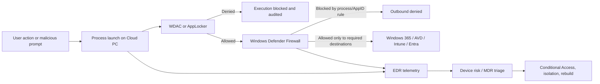

# Restricting Malicious Agents on Windows 365 with Firewall and Application Control

## Executive summary

For Windows 365 Cloud PCs, the most effective defensive pattern against OpenClaw and similar self-hosted agent runtimes is **execution control first, outbound network restriction second, and inbound hardening always**. Microsoft’s own Windows 365 and Microsoft Security guidance points in that direction: Windows 365’s modern connection model does **not** require traditional inbound RDP for normal operation, Microsoft recommends Microsoft-hosted networking where possible because it is “secure by design” with no inbound connectivity or cross-Cloud-PC traffic, and Microsoft’s OpenClaw guidance explicitly says the safest posture is to avoid running it on normal enterprise workstations and, if it must be evaluated, to run it only in isolated environments with dedicated credentials and continuous monitoring. citeturn10view0turn10view4turn24view2turn29view4

That means “block `node.exe` outbound” is useful, but it should be treated as a **backstop**, not the primary control. OpenClaw’s default install path is Node-based and uses `npm install -g openclaw@latest`, so blocking `node.exe` and related wrappers can materially disrupt installation, updates, agent egress, and many default channel/model interactions. But path-based firewall rules alone are easy to route around: attackers can switch runtimes, run through `dotnet.exe`, `mshta.exe`, `wscript.exe`, `powershell.exe`, WSL2, containers, or other allowed tools. Microsoft therefore recommends stronger application control with App Control for Business (WDAC) over AppLocker where possible, and also publishes a recommended block list of Windows binaries frequently abused to bypass allow policies, including `mshta.exe`, `wscript.exe`, `cscript.exe`, `wmic.exe`, `msbuild.exe`, `dotnet.exe`, and WSL-related binaries. citeturn28view0turn17view3turn17view0

For most enterprise Windows 365 fleets, the practical design is: **keep Windows Firewall enabled on all profiles, keep default inbound action set to Block, keep default outbound action at Allow, disable local policy merge, centrally deploy explicit outbound block rules for high-risk binaries and runtimes, and use WDAC/AppLocker to stop unapproved binaries from running at all**. That is also close to Microsoft’s Windows 365 security baseline defaults: firewall enabled on all profiles, inbound blocked, outbound allowed, dropped and successful connections logged, and local policy merge disabled on the public profile. citeturn15view0turn14view1

On the inbound side, the Windows 365 answer is much simpler than traditional VDI: **do not open inbound ports unless you have a very specific, documented requirement**. Microsoft says Windows 365’s cloud-first RDP uses outbound TCP 443 and UDP 3478, not inbound 3389, and further says port 3389 is disabled by default on newly provisioned Cloud PCs and should be kept closed. The only major exception is **RDP Shortpath for private networks**, which requires a UDP listener on port 3390 for Azure Network Connection deployments on managed private networks. citeturn24view2turn12view0turn24view4

Market evidence also supports taking the threat seriously. OpenClaw is a self-hosted agent platform with broad channel and tool integrations, vendors have published OpenClaw-specific security guidance in 2026, and public reporting has already tied OpenClaw or OpenClaw-themed activity to mass exploitation support tooling, malvertising, and multiple newly disclosed vulnerabilities. Cyera reported four chainable OpenClaw vulnerabilities in May 2026 and said they affected 180,000+ enterprise deployments; Check Point reported both fake OpenClaw documentation used to deliver Windows infostealers and a separate campaign where OpenClaw supported large-scale scanning and credential harvesting. Independent prevalence data for **Windows 365 specifically** is not publicly available, but the platform is clearly important enough that Microsoft, CrowdStrike, SentinelOne, Palo Alto Networks, Check Point, and Cyera have all published directly relevant material. citeturn29view2turn29view1turn29view0turn29view3turn6search0turn6search2

## Scope and threat model

OpenClaw is not “just another app.” According to its own documentation and GitHub repository, it is a **self-hosted gateway/runtime** that connects messaging channels and other surfaces to AI agents, runs locally, stores state locally, and in its default security model allows tools to run on the host for the main session. Its recommended installation path uses Node 24 or Node 22.19+ and installs via npm; its docs also note Windows support, with WSL2 strongly recommended for the preferred setup. citeturn28view0turn1search5turn28view1

That design matters because the security boundary becomes the Cloud PC itself. Microsoft’s security blog on OpenClaw states that self-hosted agent runtimes ingest untrusted input, download and execute skills, and act with whatever credentials and local access the machine provides. Microsoft’s conclusion is blunt: treat OpenClaw as **untrusted code execution with persistent credentials**, not as a normal end-user application. citeturn29view4

For Windows 365, the threat model is slightly different from a normal physical endpoint. A Cloud PC is still a Windows endpoint managed with Intune, Microsoft Defender, Group Policy, or Configuration Manager, but its remote desktop connectivity is already brokered in a cloud-native way. Microsoft says modern Windows 365 RDP uses outbound TCP 443 and UDP 3478 and does not require inbound connectivity, which means defenders can be far more aggressive about denying inbound listeners than they often can on legacy workstation fleets. citeturn24view2turn24view1

The architectural implication is straightforward:



In practice, the best control stack for Windows 365 is therefore:

1. **Prevent runtime execution** where possible.
2. **Restrict outbound access** for risky runtimes and living-off-the-land binaries.
3. **Keep the platform’s no-inbound model intact**.
4. **Use EDR/XDR/MDR to catch the gaps**, especially renamed binaries, alternate runtimes, and configuration tampering. citeturn17view3turn21view0turn24view2turn30view0

## Technical controls and configuration examples

### Application control should be the primary preventive layer

Microsoft’s current guidance is to prefer **App Control for Business** over AppLocker when the environment can support it. Microsoft says App Control is the more actively developed technology and recommends enforcing it at the most restrictive level possible, with AppLocker used only to complement it when user- or group-specific rules are needed. citeturn17view3turn18view0

For AppLocker, Microsoft documents three core rule conditions: **publisher, path, and file hash**. Publisher rules are easier to maintain than file-hash rules and more secure than path rules; hash rules are stronger than path rules for unsigned binaries but must be manually updated whenever the file changes. citeturn20view0turn20view1turn20view2

For App Control for Business, Microsoft’s deny-policy guidance is even more direct: prefer **signer- and file-attribute-based deny rules**, and use hash rules only when necessary because hashes are brittle and can impose operational overhead at scale. citeturn19view1

### What to block

Microsoft’s recommended App Control bypass block list already includes many of the Windows binaries that matter for OpenClaw-style agents and agent installers: `mshta.exe`, `wscript.exe`, `cscript.exe`, `wmic.exe`, `msbuild.exe`, `dotnet.exe`, WSL-related binaries, and others. These are important because an attacker who cannot use `node.exe` can often pivot to a different interpreter or trusted utility. citeturn17view0

`node.exe`, `npm.cmd`, `npx.cmd`, `pnpm`, `bun`, `powershell.exe`, `pwsh.exe`, `rundll32.exe`, and `ssh.exe` are not all part of Microsoft’s published bypass list, but on **general-purpose, non-developer Windows 365 Cloud PCs** they are still rational candidates for restricted execution or restricted egress. The point is not that these binaries are inherently malicious; the point is that they are the shortest path from “a user installed an agent runtime” to “the runtime can reach the internet, pull code, and persist.” OpenClaw’s own docs show a Node-based installation flow, a local gateway, and host-level tool execution by default. citeturn28view0turn28view1

### Sample WDAC approach

A practical WDAC design for Windows 365 usually looks like this:

- Start from a Microsoft example base policy.
- Add a managed installer trust path for Intune-delivered software if you rely heavily on Intune Win32 app deployment.
- Add explicit deny rules for high-risk Windows LOLBins not required on standard Cloud PCs.
- Add explicit deny rules for `node.exe` and package-manager binaries on non-dev Cloud PC groups.
- Pilot in **Audit** first, then move to enforce. citeturn19view0turn19view2turn19view1turn14view1

```powershell
# Illustrative WDAC deny-rule pattern for Cloud PCs
$denyRules = @()

# Third-party runtime: Node.js
$denyRules += New-CIPolicyRule -Level FilePublisher `
  -DriverFilePath "C:\Program Files\nodejs\node.exe" `
  -Fallback SignedVersion,Publisher,Hash -Deny

# Common Microsoft LOLBins often abused for agent bootstrap or post-exploit use
$denyRules += New-CIPolicyRule -Level FileName `
  -DriverFilePath "$env:WINDIR\System32\mshta.exe" `
  -Fallback Hash -Deny

$denyRules += New-CIPolicyRule -Level FileName `
  -DriverFilePath "$env:WINDIR\System32\wscript.exe" `
  -Fallback Hash -Deny

$denyRules += New-CIPolicyRule -Level FileName `
  -DriverFilePath "$env:WINDIR\System32\cscript.exe" `
  -Fallback Hash -Deny

$denyRules += New-CIPolicyRule -Level FileName `
  -DriverFilePath "$env:WINDIR\System32\WindowsPowerShell\v1.0\powershell.exe" `
  -Fallback Hash -Deny
```

This pattern is aligned with Microsoft’s documented `New-CIPolicyRule ... -Deny` approach and its recommendation to prefer signer or file-attribute rules over hashes where possible. Audit first; then enforce after validation. citeturn19view1turn14view1

### AppLocker policy shape for organizations not yet on WDAC-first

If WDAC is not yet feasible, AppLocker still provides a meaningful control layer, especially for Cloud PCs that are Microsoft Entra joined or hybrid joined and already managed with Intune/GPO. The recommended rule shape is:

- **Executable rules**: publisher deny for signed runtimes like Node; file-hash deny for unsigned agent wrappers.
- **Script rules**: deny script execution from user-writable folders and downloads.
- **MSI/script collections**: explicitly control installers and bootstrap scripts.
- **Exception handling**: per-role or per-group exceptions for developer or admin Cloud PCs. citeturn20view0turn20view3turn16search11

One AppLocker caveat matters here: Microsoft notes that AppLocker default rules are heavily path-based, and the default script rules allow content in Windows and Program Files. If an organization simply enables default allow rules and installs Node in Program Files, it may unintentionally permit exactly the runtime it meant to restrict. This is one reason Microsoft recommends App Control over AppLocker as the primary enforcement layer. citeturn17view2turn3search14turn17view3

### Firewall rules should target process/path or PolicyAppId, not be your only control

Windows Defender Firewall supports application scoping by **full path** and, more robustly, by **App Control PolicyAppId tags**. Microsoft explicitly warns that wildcard patterns are not supported for application rules; you must use full paths, or use PolicyAppId tags to avoid brittle absolute paths. Disabling local policy merge is also important in high-security environments so local admins cannot quietly add exceptions. citeturn21view0turn21view3

That leads to an important design rule:

- Use **WDAC/AppLocker** for signer/path/hash-based execution control.
- Use **Firewall** for **path** or **PolicyAppId**-based network control.
- Use **Defender indicators** if you need certificate/hash/IP/URL response actions outside native firewall semantics. citeturn21view0turn20view2turn8search1turn8search5turn8search12

### Sample outbound firewall rules

For most non-developer Windows 365 Cloud PCs, a practical outbound ruleset blocks a focused set of binaries while leaving the global outbound default at Allow:

```powershell
$blocked = @(
    @{ Name = "CloudPC Block Node";       Path = "C:\Program Files\nodejs\node.exe" },
    @{ Name = "CloudPC Block PowerShell"; Path = "$env:WINDIR\System32\WindowsPowerShell\v1.0\powershell.exe" },
    @{ Name = "CloudPC Block Pwsh";       Path = "C:\Program Files\PowerShell\7\pwsh.exe" },
    @{ Name = "CloudPC Block WScript";    Path = "$env:WINDIR\System32\wscript.exe" },
    @{ Name = "CloudPC Block CScript";    Path = "$env:WINDIR\System32\cscript.exe" },
    @{ Name = "CloudPC Block MSHTA";      Path = "$env:WINDIR\System32\mshta.exe" },
    @{ Name = "CloudPC Block Rundll32";   Path = "$env:WINDIR\System32\rundll32.exe" },
    @{ Name = "CloudPC Block MSBuild";    Path = "$env:WINDIR\Microsoft.NET\Framework64\v4.0.30319\MSBuild.exe" },
    @{ Name = "CloudPC Block DotNet";     Path = "C:\Program Files\dotnet\dotnet.exe" }
)

foreach ($app in $blocked) {
    New-NetFirewallRule `
      -DisplayName $app.Name `
      -Direction Outbound `
      -Program $app.Path `
      -Action Block `
      -Profile Domain,Private,Public
}
```

This is an adaptation of Microsoft’s documented `New-NetFirewallRule` usage for program-specific outbound blocking. It should be deployed centrally through Intune Firewall Rules policy, GPO, or a controlled PowerShell deployment—not left as local administrator discretion. citeturn22view1turn22view2turn21view0turn23search10

If you already use App Control tagging, a more robust model is to tag disallowed “agent runtime” processes and then block egress by **PolicyAppId** rather than by path:

```powershell
# Illustrative example
New-NetFirewallRule `
  -DisplayName "CloudPC Block Agent Runtime Tagged Processes" `
  -Direction Outbound `
  -PolicyAppId "BHG.CloudPC.AgentRuntime" `
  -Action Block `
  -Profile Domain,Private,Public
```

Microsoft documents PolicyAppId tagging as the preferred way to scope rules without relying on absolute paths. citeturn21view0turn21view3

### Sample Intune profile set

For Windows 365, the most maintainable deployment pattern is to split controls into separate Intune profiles:

| Intune policy | Recommended configuration for standard Cloud PCs | Why |
|---|---|---|
| **Endpoint security → Firewall** | Enable firewall on Domain/Private/Public; default inbound **Block**; default outbound **Allow**; disable inbound notifications; enable dropped and successful connection logging; disable local policy merge where feasible | Aligns with Windows 365 baseline and preserves platform compatibility while preventing quiet local exceptions. citeturn15view0turn4search9turn21view0 |
| **Endpoint security → Firewall rules** | Outbound **Block** rules for `node.exe`, `powershell.exe`, `pwsh.exe`, `wscript.exe`, `cscript.exe`, `mshta.exe`, `rundll32.exe`, `msbuild.exe`, `dotnet.exe`; no inbound rules unless documented exception | This gives targeted containment without the operational blast radius of outbound-default-block. citeturn22view1turn21view0turn12view0 |
| **Endpoint security → App Control for Business** | Base allow policy + managed installer + deny rules for unapproved runtimes and Microsoft-recommended bypass tools | Stops execution, not just networking, and integrates cleanly with Intune-delivered software. citeturn19view2turn17view3turn17view0 |
| **Compliance + Conditional Access** | Require Defender for Endpoint threat level at or under Low; apply Conditional Access to Azure Virtual Desktop / Windows Cloud Login app set | Turns endpoint detections into access control for Cloud PCs and related services. citeturn33view0turn33view1turn33view2 |

## Windows 365 network and inbound hardening

### The Windows 365 default should be no inbound access

Microsoft’s Windows 365 connectivity guidance is explicit on this point. In Microsoft-hosted networking, Microsoft says the model is “secure by design,” with **no inbound connectivity** and no cross-Cloud-PC traffic. In the Azure Network Connection model, Microsoft again says **no inbound connectivity is required; all traffic is outbound**. Microsoft further says Windows 365’s modernized RDP requires no inbound connectivity and uses outbound TCP 443 and UDP 3478 instead of legacy inbound TCP 3389. citeturn10view0turn24view2

For standard enterprise Windows 365 devices, the resulting rule is simple: **close and monitor all inbound ports**. Any newly opened inbound listener is an exception to the intended platform model and should be reviewed. The highest-priority ports to watch are:

- **3389/TCP** — legacy RDP; Microsoft says it is disabled by default on new Cloud PCs and recommends keeping it closed. citeturn12view0
- **3390/UDP** — only needed for RDP Shortpath on **private ANC networks** with direct line-of-sight to the Cloud PC. citeturn24view4
- **5985/5986** — WinRM / PowerShell remoting. Microsoft documents these as the default WinRM and PowerShell remoting listener ports. citeturn34search0turn34search3
- **22/TCP** — OpenSSH server. Microsoft documents port 22 as the default OpenSSH port. citeturn34search1turn34search5
- **445/TCP** — SMB direct hosting. Microsoft recommends blocking inbound SMB from the internet and documents port 445 as SMB’s direct-hosted port. citeturn34search2turn34search8

These ports are not all “Windows 365 ports”; rather, they are **ports whose appearance on a Cloud PC usually indicates drift away from the intended no-inbound design**. On a standard knowledge-worker Cloud PC, that is often stronger evidence than on a traditional on-prem workstation. citeturn24view2turn12view0turn34search0turn34search2

### When to allow inbound at all

There are only a few legitimate Windows 365-driven exceptions:

**Port 3389/TCP** may be needed in some Azure Network Connection scenarios, but Microsoft explicitly recommends keeping it closed and says customers should restrict any inbound 3389 rule to specific IP addresses or networks through Intune or security baselines. This is not applicable to Microsoft-hosted networking. citeturn12view0

**Port 3390/UDP** is required only for **RDP Shortpath for private networks**. Microsoft says this requires a UDP listener on the Cloud PC and direct line-of-sight connectivity, and applies only to ANC deployments on the customer’s private network. If you are not deliberately using that feature, 3390 should remain closed. citeturn24view4

### Recommended allow-list strategy for Windows 365

For Windows 365 on ANC, Microsoft recommends using **Azure Firewall**, **service tags**, and **FQDN tags** rather than hand-maintained IP lists. The relevant traffic is mostly outbound and mostly TCP 443, with a small number of specific exceptions such as UDP 3478 for relayed RDP and 443/5671 for registration/provisioning endpoints. Microsoft also says required endpoints must not be TLS-inspected. citeturn24view0turn24view1turn10view0turn12view0

A concise commercial-cloud allow list for Cloud PCs is:

- **Windows 365 provisioning/health**: `*.infra.windows365.microsoft.com` on 443. citeturn12view0
- **Registration / Entra device flows**: `login.microsoftonline.com`, `login.live.com`, `enterpriseregistration.windows.net`, `global.azure-devices-provisioning.net`, and Windows 365’s documented `hm-iot...azure-devices.net` endpoints on 443 and 5671 where noted. citeturn12view0
- **Azure Virtual Desktop / Windows 365 session-host traffic**: `*.wvd.microsoft.com` on 443 and `WindowsVirtualDesktop` traffic including UDP 3478 for relayed RDP connectivity. citeturn24view1turn24view2
- **Intune**: required Intune service endpoints over 443. Microsoft’s Windows 365 network requirements page explicitly points Cloud PCs to Intune’s endpoint lists. citeturn12view0

For ANC environments, Microsoft also recommends direct routing of `WindowsVirtualDesktop` traffic with UDRs and using Azure Firewall/FQDN tags for the rest. That design reduces latency while keeping inspection and egress control manageable. citeturn24view0turn24view1

## Vendor guidance comparison

| Vendor | Public guidance most relevant to this use case | Controls or detections that matter on Windows 365 | Bottom-line interpretation |
|---|---|---|---|
| **Microsoft** | Microsoft’s security blog advises treating OpenClaw as untrusted code execution, using isolation, dedicated identities, outbound restriction, app control, Defender for Endpoint web content filtering, and Conditional Access. Windows 365 docs recommend Microsoft-hosted networking, no inbound connectivity, keeping 3389 closed, and using Intune/App Control/Firewall centrally. citeturn29view4turn10view0turn12view0turn33view0 | Intune Firewall and App Control for Business, Defender for Endpoint / XDR hunting, custom indicators, web content filtering, device-risk-based Conditional Access, Azure Firewall service/FQDN tags. citeturn3search0turn19view2turn8search0turn30view0turn33view2 | Microsoft provides the most complete **Windows 365-specific** control stack. For Cloud PCs, it should be the reference architecture. |
| **CrowdStrike** | CrowdStrike’s OpenClaw guidance focuses on discovering where OpenClaw is installed and assessing exposure; its npm supply-chain reporting shows behavior-based blocking of malicious package activity and `rundll32.exe` spawned by JavaScript installers. CrowdStrike also publishes LOLBin hunting guidance. citeturn7search0turn7search2turn7search9 | Falcon discovery/hunting for OpenClaw, behavior-based protection against suspicious child processes and package install chains, managed hunting and AI-focused detections. citeturn7search0turn7search2turn7search15 | Strong for **detection, hunting, and MDR**, especially where the organization cannot fully rely on Microsoft-native endpoint controls. |
| **SentinelOne** | SentinelOne’s public OpenClaw guidance centers on discovery/observability (`OneClaw`) and zero-trust protection for agent ecosystems; its product pages emphasize network control for inbound and outbound traffic on Windows endpoints. citeturn27search0turn27search2turn27search1 | Singularity Network/Firewall Control for policy-based inbound/outbound control, visibility into agent sprawl, and optional MDR response services. citeturn27search1turn27search4turn27search13 | Strong where the goal is **network control plus asset discovery** across mixed endpoint fleets, not only Microsoft-managed Cloud PCs. |
| **Palo Alto Networks** | Unit 42 emphasizes excessive privileges and compromised-agent risk in agentic AI; Cortex documentation exposes detections for `mshta.exe` with suspicious arguments, processes connecting to rare external hosts, TCP streams created directly in shells, and user-added Windows firewall rules. citeturn6search2turn25search1turn26search1turn26search2turn26search3 | Cortex XDR/XSIAM analytics for shell/C2 behavior, unusual outbound, script-host abuse, and firewall tampering; Prisma Access/NGFW can complement ANC egress filtering. citeturn26search1turn26search2turn26search3 | Particularly useful for **behavioral detections and firewall-rule tampering**, which are important once an agent gets onto a Cloud PC. |

The common thread across vendors is notable: none of them suggest trusting agent runtimes on ordinary enterprise endpoints. The shared pattern is visibility, execution control, network restriction, and rapid containment—not permissive use with detection alone. citeturn29view4turn7search0turn27search0turn6search2

## Detection, bypass, and mitigation tradeoffs

### What attackers will do when you only block `node.exe`

Blocking outbound for `node.exe` helps because OpenClaw’s canonical install/update path is Node + npm. But OpenClaw’s own docs show that it is flexible in how it runs, and the Windows docs indicate that Windows setups can involve native installers, managed startup, and WSL2. Microsoft also documents that App Control does **not** directly control everything launched through `cmd.exe`/`.bat` and does not directly govern scripts run by unenlightened third-party script hosts. citeturn28view0turn1search10turn17view1

So the obvious bypasses are:

- shift from `node.exe` to another runtime (`dotnet.exe`, `msbuild.exe`, `pwsh.exe`, WSL, containers);
- relocate or rename a binary to evade a purely path-based firewall rule;
- add a local firewall allow rule if policy merge is still permitted;
- use prompt injection or malicious skills to make an already allowed process do the work;
- exfiltrate over ordinary HTTPS to a rare or low-prevalence destination. citeturn17view0turn21view0turn17view1turn29view4turn26search1

### The AppLocker and WDAC nuances that matter

Microsoft’s documentation on script enforcement is critical here. With App Control for Business, `mshta.exe` and MSXML code execution are blocked if any script-enforcing App Control policy is active, even in audit mode. By contrast, PowerShell scripts that are not allowed by policy can still run in **Constrained Language Mode** rather than being stopped absolutely, and AppLocker has the same general caveat for blocked PowerShell scripts. That means many organizations should treat **PowerShell outbound blocking and PowerShell monitoring** as separate needs even after WDAC/AppLocker is deployed. citeturn17view1turn17view2turn18view0

This produces a useful practical split:

- If you can safely deny execution of `mshta.exe`, `wscript.exe`, `cscript.exe`, and similar hosts, do so.
- If you must allow PowerShell for admin or automation reasons, then combine **Constrained Language Mode**, role separation, outbound firewall controls, and EDR analytics instead of assuming application control alone is enough. citeturn17view1turn18view0

### What to detect

For Microsoft Defender XDR, Microsoft has already published OpenClaw hunting patterns using `DeviceProcessEvents` and process command-line discovery. Pair those with `DeviceNetworkEvents` for egress detection. citeturn30view0turn31search0turn31search12

A practical hunting query for Cloud PCs is:

```kusto
let SuspiciousBins = dynamic([
  "node.exe","powershell.exe","pwsh.exe","wscript.exe","cscript.exe",
  "mshta.exe","rundll32.exe","dotnet.exe","msbuild.exe","wmic.exe"
]);
DeviceNetworkEvents
| where Timestamp > ago(7d)
| where InitiatingProcessFileName in~ (SuspiciousBins)
| project Timestamp, DeviceName, InitiatingProcessFileName,
          InitiatingProcessCommandLine, RemoteUrl, RemoteIP, RemotePort
| order by Timestamp desc
```

This is built on Microsoft’s documented hunting schema and is conceptually aligned with Microsoft’s own OpenClaw hunts. citeturn30view0turn31search0turn31search12

Beyond EDR telemetry, the most useful Windows-native logs are:

- **AppLocker**: 8004 and 8007 for blocked EXE/DLL and script/MSI activity; 8003 and 8006 for audit-mode would-block events. citeturn32view0
- **App Control for Business**: 3076 and 3077 for main audit/enforced blocks, 3089 for signature information, 8028/8029 for script-host checks, and 3090–3092 for ISG/Managed Installer diagnostics. citeturn32view1
- **Firewall**: dropped and successful connection logging in `pfirewall.log`, plus EDR detections for firewall-rule creation/tampering. Microsoft documents log configuration through Intune and GPO; Palo Alto documents a specific analytic for “A user added a Windows firewall rule.” citeturn4search9turn26search3

### Real-world evidence behind the detections

There is now enough public reporting to justify explicit detections for agent runtimes. Check Point reported both fake OpenClaw documentation delivering Windows malware and a separate AI-assisted exploitation platform using OpenClaw. Cyera disclosed a chain of vulnerabilities that turned the agent runtime itself into an attacker execution layer. CrowdStrike highlighted that OpenClaw commonly runs with broad access to local files, terminals, and persistent state. citeturn29view1turn29view0turn29view2turn29view3

That is why detections like **rare external host**, **shell-created TCP stream**, **OpenClaw process discovery**, and **firewall rule creation** are high-value for Windows 365. Even if execution prevention is strong, they provide fast confirmation that a Cloud PC is drifting toward unauthorized agent usage. citeturn26search1turn26search2turn30view0turn26search3

## Deployment and operational considerations

### Intune should be the default control plane for Windows 365

Windows 365 Cloud PCs are designed to be managed with Intune, and Microsoft’s Windows 365 security baselines, endpoint security firewall policy, and App Control for Business policy all integrate cleanly there. For large Cloud PC fleets, that is more maintainable than relying on local administration or bespoke scripts. citeturn14view1turn3search0turn19view2

A few deployment details matter operationally:

- Microsoft says Firewall CSP rule deployment in MDM uses **Atomic blocks**: if one unsupported rule fails, the whole block fails. Separate profiles by OS support and keep rule payloads logically grouped. citeturn21view1
- Microsoft recommends **pilot testing** security baselines and new App Control policies before broad rollout. citeturn14view1turn19view1
- Microsoft documents disabling local policy merge in high-security environments and warns that, if you do so, **all** needed inbound exceptions must be centrally deployed. citeturn21view0

### Group Policy and Configuration Manager still matter in some Windows 365 estates

If your Windows 365 environment is hybrid joined or still heavily AD-centric, Group Policy remains a viable way to configure Windows Defender Firewall with Advanced Security. Microsoft’s current documentation still covers GPO-based inbound and outbound rule creation. Configuration Manager tenant attach can also deploy firewall policies from the Intune admin center to ConfigMgr-managed collections. citeturn23search10turn23search6

That said, on Windows 365 specifically, the more “cloud PC-native” your management model is, the easier it is to keep firewall, compliance, Conditional Access, and MDE device-risk evaluations aligned. citeturn33view0turn33view2

### Productivity impact is real, so segment by Cloud PC role

The biggest operational mistake is trying to impose the same runtime restrictions on every Cloud PC. Blocking Node, PowerShell outbound, `dotnet.exe`, or `ssh.exe` is usually tolerable on standard office-productivity Cloud PCs, but can be highly disruptive on developer, admin, automation, or troubleshooting Cloud PCs. Microsoft’s security guidance for self-hosted agents also implicitly supports segmentation by saying agent hosts should be treated as privileged, piloted separately, and placed into stricter device groups. citeturn30view0

The practical answer is to create at least three Windows 365 policy rings:

1. **Standard productivity Cloud PCs** — most restrictive; Node and other runtimes denied or outbound-blocked.
2. **Admin / secure operations Cloud PCs** — PowerShell may be allowed with severe monitoring and no unsanctioned runtimes.
3. **Developer Cloud PCs** — controlled exceptions, ideally with egress restricted to approved registries/repos and stronger monitoring rather than blanket denies. citeturn30view0turn33view3

### Conditional Access and isolation should complement endpoint controls

Microsoft’s Windows 365 guidance recommends using Conditional Access for Windows 365 access, MDE-driven device compliance, and—where appropriate—restricting Microsoft 365 app access to Cloud PCs. For OpenClaw-like risk, that means a high-confidence operating model is:

- onboard Cloud PCs into MDE,
- set compliance policies using Defender device threat level,
- apply CA to the **Azure Virtual Desktop** and **Windows Cloud Login** apps,
- and, where justified, use CA device filters to restrict key SaaS access to Cloud PCs only. citeturn33view0turn33view1turn33view2turn33view3

This does not replace application control or firewalling, but it shortens response time: if a Cloud PC starts behaving like an unsanctioned agent host, access can be constrained quickly while the host is isolated or rebuilt. citeturn29view4turn33view2

## Prioritized action checklist

The highest-value sequence for preventing or materially reducing OpenClaw risk on Windows 365 is:

1. **Prefer Microsoft-hosted networks for new or refactored Windows 365 deployments.** Microsoft recommends them as the default option, and they remove a large amount of customer-side inbound and routing complexity. citeturn10view0turn10view4

2. **Keep the Cloud PC in a no-inbound posture.** Confirm 3389 is closed; do not open 3390 unless you are intentionally enabling RDP Shortpath for private ANC networks; investigate any unexpected listeners on 22, 445, 5985, or 5986. citeturn12view0turn24view4turn34search0turn34search1turn34search2

3. **Deploy the Windows 365 security baseline in Intune to all Cloud PCs, then harden further from that baseline.** The baseline already enables the firewall, blocks inbound by default, and logs both dropped and successful connections. citeturn15view0turn14view1

4. **Disable local firewall policy merge where practical and centralize all exceptions.** This sharply reduces the chance that a local admin or attacker can quietly add a new allow rule. citeturn21view0turn15view0

5. **Use App Control for Business as the primary preventive control.** Import a base policy, enable Managed Installer if Intune-delivered software is central to your workflow, and explicitly deny Microsoft-recommended bypass tools plus Node/package-manager runtimes on non-dev Cloud PCs. Audit first, then enforce. citeturn17view3turn19view2turn17view0turn19view1

6. **Add explicit outbound Windows Firewall block rules for risky binaries.** At minimum, consider `node.exe`, `powershell.exe`, `pwsh.exe`, `wscript.exe`, `cscript.exe`, `mshta.exe`, `rundll32.exe`, `msbuild.exe`, and `dotnet.exe` on standard Cloud PCs. Use PolicyAppId tagging where possible instead of path-only rules. citeturn21view0turn22view1turn17view0

7. **Do not switch to outbound-default-block for the whole fleet unless the Cloud PCs are fixed-function or highly standardized.** Windows 365, Intune, Entra registration, and Azure Virtual Desktop all require outbound service connectivity, mostly on 443 plus some 5671/3478 cases. In most enterprises, targeted process blocking is the safer starting point. citeturn12view0turn24view1turn24view2

8. **Onboard every Cloud PC to EDR/XDR and push the detections into MDR playbooks.** Hunt for `openclaw`, `moltbot`, and related tooling; monitor suspicious outbound from interpreters and LOLBins; alert on local firewall rule creation; and collect AppLocker/WDAC/firewall logs. citeturn30view0turn31search0turn32view0turn32view1turn26search3

9. **Use Conditional Access tied to Defender device risk for Windows 365 access.** Scope policies consistently to Azure Virtual Desktop / Windows Cloud Login, and consider restricting key SaaS access to Cloud PCs where that aligns with your operating model. citeturn33view1turn33view2turn33view3

10. **If OpenClaw must be evaluated, isolate it.** Microsoft’s most conservative guidance is still the right one for Cloud PCs: dedicated VM or device, dedicated identities, non-sensitive data, monitoring, and rapid rebuild capability. citeturn29view4

### Open questions and limitations

The public evidence is strong enough to justify preventive action, but a few things remain incomplete.

First, there is **no public, independently validated prevalence dataset for OpenClaw on Windows 365 specifically**. Public reporting shows rapid enterprise attention and broad platform adoption, but most prevalence figures are vendor-reported or ecosystem-level, not Windows 365-specific. citeturn29view2turn29view3turn1search4

Second, **path-only firewall rules are inherently weaker than execution control**. They remain useful, but renamed binaries, WSL2, containers, alternate runtimes, and other interpreters can bypass them unless WDAC/AppLocker and EDR are also in place. Microsoft’s own application-control and script-enforcement documentation makes that clear. citeturn21view3turn17view1turn17view3

Third, if your Windows 365 fleet includes **developer or admin Cloud PCs**, the recommended controls should be applied by role, not as a single universal policy. The safest enterprise pattern is segmentation, not a one-size-fits-all deny list. citeturn30view0turn33view0