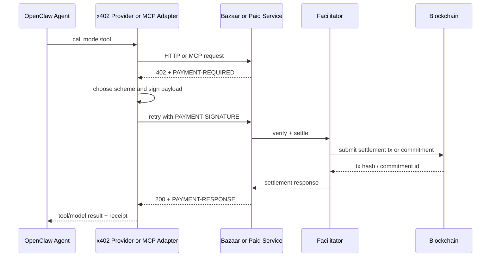
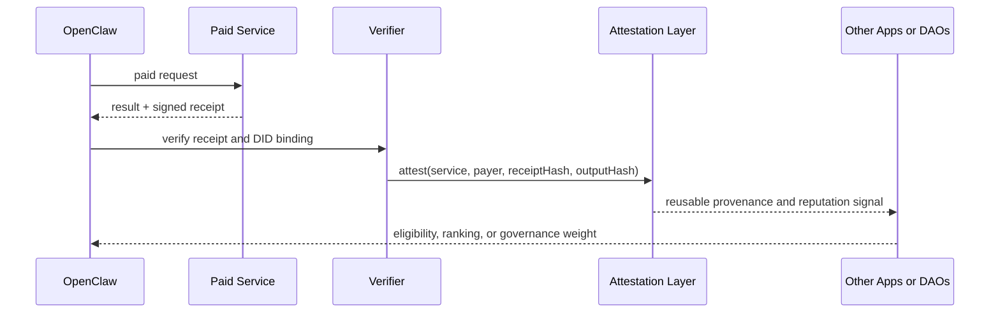
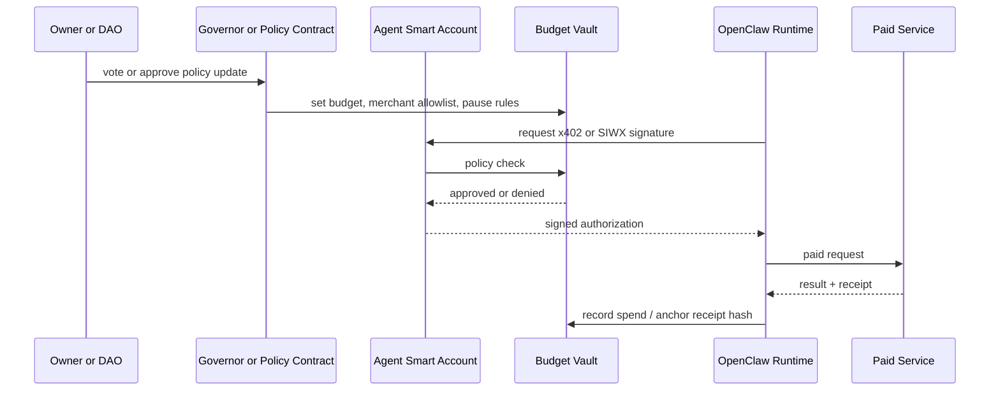

# OpenClaw on-chain integration with identity and x402 payment rails

## Executive summary

OpenClaw is already structurally close to blockchain integration, but not because it is “on-chain” today. Its Gateway is an always-on control plane with a typed WebSocket RPC/event surface, OpenAI-compatible HTTP endpoints, provider plugins, tool plugins, and local session/state handling. That means the cleanest integration path is **not** to rewrite OpenClaw as a smart contract. It is to add a **wallet-and-policy layer** around the existing Gateway and runtime, then connect paid AI/model/tool calls through **x402** adapters at the provider, MCP, or tool boundary. In other words: keep inference, sessions, and most tool execution off-chain; put **identity, budgets, settlement, receipts, reputation, and governance** on-chain or cryptographically anchored. That design aligns with OpenClaw’s local-first runtime model and with x402’s own split between HTTP payment flows, optional facilitators, and chain-specific settlement schemes. citeturn8view0turn7view0turn7view2turn7view3turn9view0turn15view2

Because the user did not specify a blockchain or identity stack, the most defensible approach is a **portable baseline** plus an **EVM reference profile**. The portable baseline is: W3C DID Core plus Verifiable Credentials for identity portability, x402 v2 for payment flows, CAIP-2/10/19/122 identifiers for chain-agnostic naming and wallet authentication, and optional signed offers/receipts for verifiable service interactions. The EVM reference profile is: ERC-4337 smart accounts, ERC-1271 contract signatures, EIP-712 typed signing, ERC-20 assets, EIP-3009 where available, and Permit2 or EIP-2612 where needed. x402’s official SDKs and specs are currently deepest on EVM, while still supporting Solana and additional networks in varying levels across TypeScript, Go, and Python. citeturn5search0turn5search1turn29search2turn29search6turn30search0turn28view0turn15view3turn33view0turn33view1turn14view4turn4search0turn4search1turn4search2turn36view1turn36view2

From an architecture standpoint, the strongest recommendation is a **hybrid model**. OpenClaw should keep using its Gateway, provider plugins, tool plugins, and local storage for prompt assembly, transcripts, device pairing, provider authentication, and tool control. A new blockchain layer should add four things: a canonical **AgentAccount** (wallet or smart account), an **x402 payment adapter** for model/tool/API consumption, an **on-chain or attestable receipt/provenance layer**, and a **governance/budget layer**. This avoids the cost, latency, privacy leakage, and state-size problems of placing agent inference or transcripts directly on-chain, while still unlocking metered consumption, machine-to-machine micropayments, portable reputation, governance, and composability. x402’s `exact`, `upto`, and `batch-settlement` schemes mirror this progression from fixed-price calls to usage-based inference billing to high-frequency micropayment channels. citeturn7view1turn32view0turn20view0turn9view0turn14view0turn14view3turn14view1

The highest-value capability expansion comes from three combinations. First, **service discovery plus auto-payment**: x402 Bazaar exposes discovery APIs and an MCP server for agents, and the `@x402/mcp` client can search and call paid tools with automatic payment handling. Second, **identity plus repeat access**: x402’s SIWX extension binds wallet-authenticated access to previously paid resources and supports EOA and smart-wallet flows. Third, **receipts plus attestations**: signed offers and receipts can be verified off-chain and then anchored as attestations or governance inputs, turning OpenClaw’s service consumption into reusable reputation and provenance. These are exactly the primitives needed for an OpenClaw agent that can autonomously discover AI tools, pay for them per request, preserve audit trails, and participate in on-chain policy/governance without exposing its entire transcript history. citeturn37view2turn37view3turn28view0turn19view0turn19view1turn24search0turn36view0

The most important implementation caveat is security isolation. OpenClaw’s own security docs make clear that its HTTP surfaces and operator credentials are powerful, and bearer access to `/v1/*`, `/tools/invoke`, and related admin/plugin routes should be treated as full operator access. Therefore, a public x402-facing seller deployment should **not** simply expose the same personal Gateway behind a paywall. The safer pattern is a **separate monetized service boundary**: either a distinct OpenClaw deployment with limited scopes and tools, or a sidecar service that invokes the Gateway privately and only exposes the paid subset externally. citeturn32view0turn7view3

## OpenClaw architecture and the blockchain seam

OpenClaw is a self-hosted, personal AI assistant built around a Gateway daemon that acts as its control plane. The Gateway maintains provider connections, exposes a typed WebSocket API, validates JSON frames, emits runtime events, and also serves OpenAI-compatible HTTP endpoints such as `/v1/models`, `/v1/embeddings`, `/v1/chat/completions`, `/v1/responses`, and `/tools/invoke`. In practice, that means OpenClaw already has two natural integration seams for blockchain functionality: the **provider/tool boundary** on the inside, and the **HTTP API boundary** on the outside. citeturn8view0turn7view0turn7view3

Identity in OpenClaw is already layered, but mostly off-chain. At the transport layer, all WebSocket clients and nodes present a device identity on `connect`, new devices require pairing approval, the Gateway issues device tokens, and `connect.challenge` must be signed. In trusted-proxy mode, identity can instead come from reverse-proxy headers, while Tailscale Serve can also provide identity-bearing headers in specific modes. Separately, OpenClaw’s `IDENTITY.md` file is an agent persona/profile file injected into project context; it is meaningful to the runtime, but it is not a cryptographic identity primitive. This distinction matters: blockchain integration should **augment**, not replace, OpenClaw’s existing device/operator trust model. citeturn7view0turn6view4turn6view6turn6view7turn32view0

Data flows are likewise already explicit. OpenClaw injects workspace files such as `AGENTS.md`, `SOUL.md`, `TOOLS.md`, `IDENTITY.md`, and `USER.md` into prompt context, owns prompt assembly and tool wiring inside its agent runtime, and stores session transcripts as JSONL on disk under `~/.openclaw/agents/<agentId>/sessions/<SessionId>.jsonl`. Provider-specific logic lives in provider plugins, which own onboarding, model catalogs, auth mapping, request normalization, usage reporting, OAuth refresh, and related behaviors. This makes the blockchain seam straightforward to define: **wallet signatures and settlement events belong next to provider/tool invocation and usage reporting, while full transcripts and secret material should remain off-chain and only be hashed or selectively attested when needed.** citeturn7view1turn7view2turn32view0

OpenClaw’s extension surface is plugin-first. Official docs describe plugins as the way to add channels, model providers, tools, skills, web fetch/search, speech, and other runtime capabilities. Put differently, a blockchain/x402 integration does not require a forked Gateway core as a first step. It can be shipped as: a **provider plugin** for paid model endpoints, a **tool plugin** for paid APIs, an **MCP wrapper** for paid MCP tools, a **hook/plugin** for receipt anchoring and policy checks, or a **sidecar service** in front of the Gateway’s HTTP surfaces. This is the lowest-friction path because it follows OpenClaw’s official architecture rather than fighting it. citeturn20view0turn7view2

The main architectural warning comes from OpenClaw’s security model. The docs explicitly warn that the Gateway is local/loopback first, that dangerous flags should stay off in production, and that HTTP bearer auth to `/v1/*`, `/tools/invoke`, plugin routes, and session history endpoints is effectively all-powerful operator access unless identity-bearing modes narrow scopes. Therefore, public monetization and public agent access must be isolated from personal/full-trust operator deployments. In practical terms, the “blockchain seam” should sit in a **separate trust zone** from the user’s primary OpenClaw host. citeturn32view0

## Identity and x402 mapping

Because no identity stack was specified, the right mapping is a **three-layer identity model**: local OpenClaw identity, wallet identity, and service identity. Local identity remains OpenClaw’s existing device pairing, trusted-proxy headers, and agent persona files. Wallet identity becomes the cryptographic/economic principal used for payment, authorization, repeat access, and governance. Service identity becomes the portable identifier under which an OpenClaw-powered service can advertise endpoints, sign receipts, and publish metadata. W3C DID Core and Verifiable Credentials are suitable for this because they define decentralized identifiers, verification methods, service endpoints, and security/privacy considerations without forcing one registry model. citeturn5search0turn5search1turn7view0turn6view7

For wallet identity, x402 already treats wallets as both the payment mechanism and a form of unique identity for buyers and sellers. Its SIWX extension implements CAIP-122 to support chain-agnostic wallet authentication, including repeat access to previously purchased resources and auth-only routes. In a concrete OpenClaw design, that means the agent’s canonical economic principal should be a wallet or smart account, and SIWX should be the default way to bind “this agent paid before” or “this wallet is authorized now” at the paid service boundary. x402’s SIWX flow is server–client only and does not require a facilitator, which is important for latency-sensitive repeated reads. citeturn27search17turn28view0turn30search0turn29search1

For service identity, the best default is **`did:web`** for the service/operator domain and **`did:pkh`** for the wallet/account. `did:web` uses DNS and HTTPS, supports verification methods and service endpoints, and is a good fit for a long-lived OpenClaw deployment or seller domain. `did:pkh` wraps an existing blockchain account into a DID, making it ideal for wallet-bound receipts, attestations, and portable account references. The tradeoff is that `did:pkh` is intentionally generative and does not support native updates, rotation, or deactivation; for long-lived service identities, `did:web` is usually better. `did:key` is even lighter weight and useful for ephemeral device or bootstrap identities, but it is intentionally non-registry-based and best suited to short-lived/low-risk interactions rather than persistent public service identities. citeturn35view0turn35view1turn35view2

x402’s payment model maps cleanly to OpenClaw’s existing components:

| OpenClaw surface | Current role | Blockchain / x402 mapping | What is required |
|---|---|---|---|
| Provider plugin | Calls hosted model APIs and reports usage | x402 client for paid model inference endpoints | `exact` for fixed-price, `upto` for metered inference, wallet signer, payment policy |
| Tool plugin / MCP client | Calls external tools/APIs | x402 HTTP or MCP auto-payment wrapper | `@x402/*` client, optional Bazaar discovery, wallet signer |
| Gateway HTTP seller surface | Exposes `/v1/responses`, `/v1/chat/completions`, `/tools/invoke` | x402 resource server or reverse-proxy paywall in front of a limited OpenClaw deployment | x402 seller middleware, isolated trust boundary, receipt signing |
| Device pairing / proxy auth | Local operator and node security | Remains off-chain; optionally linked to wallet/DID for audit | No replacement; only augmentation |
| Session storage | Local transcripts and tool output | Merkle root / content hash anchoring only, not raw transcript storage | Receipt/attestation anchor, privacy-preserving hashing |
| Agent persona files | Human-readable agent profile | Metadata URI or DID service doc, optionally hash anchored on-chain | Optional registry / attestation layer |

The table reflects OpenClaw’s provider/plugin architecture, its HTTP surfaces, x402’s client/server/facilitator model, and the fact that session state is local/private by default. citeturn7view2turn20view0turn7view3turn7view0turn7view1turn9view0turn15view2

A minimum **EVM reference profile** for on-chain data models and interfaces looks like this:

| Interface or data model | Purpose | Standards basis |
|---|---|---|
| `AgentAccount` | Canonical smart wallet for the OpenClaw agent; signs x402/SIWX payloads and executes governed actions | ERC-4337, ERC-1271, EIP-712 |
| `BudgetVault` | Holds spending limits, allowances, merchant/provider allowlists, and epoch budgets | Custom contract; optionally governed via Governor |
| `ServiceRegistry` | Registers service DID/domain, endpoint metadata hash, accepted x402 schemes/assets/networks, policy pointers | Custom registry; identifiers should use DID + CAIP-2/10/19 |
| `ReceiptAnchor` | Stores receipt hash, payment identifier, settlement tx hash or commitment id, output hash, and timestamp | Custom anchoring contract or attestation layer |
| `ReputationAttestation` | Reusable “verified purchase,” QoS, or delivery attestations | EAS preferred; ERC-4973 or ERC-1155 optional for badges/tiering |
| `GovernancePolicy` | Changes budgets, whitelists, key rotation, emergency pause, and module upgrades | OpenZeppelin Governor / Timelock pattern |

These are not all mandatory at day one. The only truly required primitives for a first production integration are **wallet signing**, **budget/policy enforcement**, and **receipt/provenance storage**. The rest become valuable as the system grows into a multi-agent, multi-merchant, or public marketplace environment. citeturn36view1turn36view2turn4search2turn24search0turn24search3turn24search2turn36view0

The payment rail mapping is similarly crisp. x402’s `PaymentRequired` object includes protocol version, resource metadata, accepted payment methods, network in CAIP-2 format, asset, recipient, timeout, and optional extensions. The client responds with a `PaymentPayload` containing the accepted requirement plus scheme-specific authorization data, and successful settlement returns a `SettlementResponse` with the payer, transaction hash, network, and optionally amount/extensions. Those fields are directly usable as the canonical cross-boundary payment record for OpenClaw. For fixed-price tool calls, use `exact`; for token-metered inference or bandwidth-like consumption, use `upto`; for dense, repeated micropayment traffic, use `batch-settlement`. citeturn15view0turn15view5turn14view4turn14view0turn14view3turn11view5

## Integration patterns and tradeoffs

The best integration pattern depends on whether OpenClaw is primarily a **buyer** of AI/tool services, a **seller** of AI/tool services, or both. In almost all cases, the recommended pattern is an off-chain/on-chain hybrid rather than uniformly on-chain execution. x402 itself is designed around HTTP request/response flows with blockchain settlement in the background, and OpenClaw is designed around local runtime control, plugin-owned provider behavior, and private session storage. Those facts jointly favor a design where the Gateway remains off-chain while paid service access, wallet authority, and attestable outcomes become on-chain or chain-anchored. citeturn9view0turn7view2turn7view1

| Pattern | What stays off-chain | What goes on-chain or is anchored | Advantages | Main costs / risks | Best fit |
|---|---|---|---|---|---|
| x402-only buyer integration | Gateway, tools, inference, sessions | Payment settlement only | Fastest path; minimal OpenClaw changes | Weak portability of identity/reputation unless extra layers are added | OpenClaw as consumer of paid APIs/models |
| x402 + SIWX + DID hybrid | Same as above | Payment, wallet auth, service DID docs, optional attestation hashes | Repeat access, portable auth, better merchant identity | More metadata and verifier logic | Buyer + seller deployments |
| Smart-account agent | Gateway, inference, transcripts | Wallet logic, budgets, signature policy, governance | Strong policy control, sponsor gas, recoverability, multisig/MPC support | More infra: bundlers, paymasters, relayers | Higher-value autonomous agents |
| Batch-settlement / state-channel style micropayments | Most request handling | Channel funding, batched claims, periodic sweeps | Best for high-frequency, sub-cent workloads | Additional channel state, redemption complexity | Dense tool marketplaces, streaming-like inference |
| Verifiable compute + provenance | Inference or post-processing execution | Proof verification, attestation anchors | Strong trust/auditability | Proving cost, complexity, partial coverage for LLMs | Compliance-heavy or adversarial settings |

This comparison is grounded in x402’s `exact`, `upto`, and `batch-settlement` schemes; ERC-4337 account abstraction; and the distinction between attestable results and full raw execution. citeturn14view3turn14view1turn36view1turn31search0turn31search7

For oracles and external data, there are three realistic options. A **plain oracle network** such as Chainlink is the easiest way to move specific off-chain facts on-chain for contracts that must react to external state. A **TEE-backed oracle** like the Town Crier model provides stronger provenance/authentication for web data at the cost of trusting hardware and attestation. A **zkVM/zk-proof path** provides the strongest cryptographic verification of deterministic computation, but usually at much higher engineering complexity and proving cost. For OpenClaw, plain oracles are appropriate for market data, exchange rates, or settlement triggers; TEEs fit sensitive private workflows and receipt verification; zk proofs are best reserved for deterministic post-processing, retrieval verification, or policy checking rather than full LLM inference. citeturn22search1turn22search2turn31search0turn31search7turn22search3

For DID methods, the practical profile is:

| DID method | Strengths | Weaknesses | Recommended OpenClaw use |
|---|---|---|---|
| `did:web` | Domain-bound, easy discovery, easy service endpoint publication, key updates supported by changing `did.json` | Depends on DNS/HTTPS trust; mutable | Public service identity for paid OpenClaw deployments |
| `did:pkh` | Directly derived from wallet, zero extra registry, natural for receipts and attestations | No native update/deactivation/rotation model | Wallet/account identity for agents and buyers |
| `did:key` | Cheapest and simplest, no network dependency, good offline/bootstrap behavior | Not ideal for long-lived public identity, no registry-based lifecycle | Device bootstrap, internal node identity, ephemeral sessions |
| Chain-specific DID method | Richer chain-native lifecycle and delegation | Chain lock-in, gas/admin overhead | Use only if the surrounding ecosystem already requires it |

This follows the DID Core model and each method’s own specification. citeturn5search0turn35view0turn35view1turn35view2

Finally, there is a useful delegation pattern between identity and payments: **CAIP-122 + CACAO/CAIP-74**. CAIP-122 gives chain-agnostic wallet authentication, and CAIP-74 defines how to represent that signed authentication as a chain-agnostic capability object. For OpenClaw, that means you can delegate limited authority—such as “this sidecar signer may spend up to X for merchant Y until time T”—without handing out the primary wallet key or permanently widening permissions. This is the right pattern for multi-device nodes, sidecars, or hosted relayers. citeturn30search0turn30search5

## Capabilities unlocked by on-chain existence

If OpenClaw acquires an on-chain principal, the first capability unlocked is **AI service discovery with machine-native payment**. x402 Bazaar already lets buyers and AI agents search payable services by semantic description, pricing, schemas, and network metadata, and it exposes an MCP server with `search_resources` and `proxy_tool_call`. A wrapped x402 MCP client can handle the 402/payment/retry loop transparently, so the agent experiences the whole operation as a single tool call. For OpenClaw, that means a tool-using agent can discover a paid summarizer, speech API, pricing feed, dataset API, or specialized model endpoint at runtime and pay on demand instead of requiring pre-provisioned API keys or fixed vendor lock-in. citeturn37view0turn37view2turn26view1turn33view0

The second capability is **metered consumption**, which is especially important for AI inference. x402’s `upto` scheme was explicitly designed for variable-cost resources such as LLM token generation, bandwidth metering, and dynamic compute: the client authorizes a maximum amount, and the facilitator settles only the actual amount used. That is the cleanest match for OpenClaw provider plugins, because provider plugins already normalize transport, report usage, and own provider-specific behavior. In effect, OpenClaw could treat a paid model provider as just another provider plugin—except authorization becomes stablecoin-native and usage-linked instead of API-key-native and invoice-linked. citeturn14view0turn7view2

The third capability is **micropayment economics that match tool granularity**. x402’s `exact` scheme works for clearly priced operations—“$0.002 for this embedding,” “$0.01 for this transcript cleanup,” “$0.05 for this signature verification.” But when requests are very frequent and low value, `batch-settlement` becomes more appropriate: the buyer pre-funds escrow, sends off-chain cumulative vouchers, and sellers redeem in batches. For an OpenClaw agent that delegates hundreds or thousands of tiny utility calls—parsers, validators, retrieval endpoints, weather lookups, feature extractors—this transforms the economics from a per-request settlement model into a reusable payment-channel model. citeturn14view4turn14view1turn14view3

The fourth capability is **portable reputation and verifiable purchase history**. x402 signed offers and receipts create cryptographic proof that a service offered specific terms and then delivered a response. The docs explicitly note that these artifacts can back reputation systems and on-chain attestations. Combined with an attestation layer such as EAS, OpenClaw can prove that an agent actually bought a dataset, actually consumed a model, or actually received a tool result associated with a given receipt hash. Over time, that produces something much stronger than a local log file: a portable, reusable reputation graph for services, agents, and merchants. citeturn19view0turn19view1turn24search0

The fifth capability is **composability**. Once OpenClaw has a wallet/smart-account identity, budgets and receipts stop being local implementation details and become programmable objects. Budgets can be governed by a DAO or owner multisig. Receipt hashes can gate access to future tools. Providers can offer discounts to previously attested buyers. Governance can approve or revoke provider allowlists. Since ERC-4337 smart accounts can use custom validation logic, paymasters, and batched calls, the agent can combine multiple operations—authenticate, pay, call, attest, and schedule follow-up—under one policy-governed principal. citeturn36view1turn36view3turn36view2turn36view0

The sixth capability is **verifiable compute and provenance**. This should be interpreted carefully. Today, the practical near-term use is not “prove full frontier-model inference on-chain.” The useful pattern is to prove deterministic parts of the workflow: retrieval selection, rule-based post-processing, cost metering, redaction, policy filtering, or the integrity of a deterministic tool pipeline. RISC Zero’s zkVM, for example, produces receipts that can be verified and only reveal public outputs committed to the journal; this is a strong fit for proving that a given post-processing binary transformed a model result correctly. If hardware-backed trust is acceptable, Nitro Enclaves or a Town Crier-like TEE model can provide cheaper attestation boundaries. citeturn31search0turn31search3turn31search7turn23search2turn23search6turn22search2

The seventh capability is **on-chain governance of agent behavior**. OpenZeppelin’s Governor framework supports vote-weight sources, quorum modules, and timelock execution. In the OpenClaw context, that does not mean governance over “what the model should think.” It means governance over policy surfaces: spend caps, merchant allowlists, emergency pause, plugin/module approvals, staking and slashing rules for services, and attestation rules used for reputation. If OpenClaw is operating as a shared or organizational agent rather than a purely personal one, this is where on-chain existence becomes operationally valuable instead of merely novel. citeturn36view0

## Implementation path, infrastructure, and migration

The recommended implementation path is incremental. **Phase one** should make OpenClaw a **buyer** of paid services, because this is operationally simpler and safer than exposing a public seller surface. Implement an x402-capable provider plugin for paid model endpoints and an x402-capable tool/MCP adaptor for paid external APIs. Use a plain wallet first, but encapsulate it behind a signer service so the wallet implementation can later move to MPC or account abstraction without changing OpenClaw’s internal call surface. Official x402 SDK support is broad across TypeScript, Go, and Python, and both provider-style HTTP calls and MCP payment wrappers are first-class patterns in the docs. citeturn33view0turn26view1turn37view2turn20view0turn7view2

**Phase two** should add **wallet identity and repeat-access semantics**. This is where SIWX enters. If the agent consumes services it is likely to revisit—knowledge bases, subscription-like APIs, previously purchased artifacts, or wallet-gated content—SIWX removes duplicate payment pressure and adds a standard auth layer. At the same time, publish a `did:web` for the service domain and use `did:pkh` for the wallet/account. This creates a stable public identity without forcing the entire agent runtime or device topology on-chain. citeturn28view0turn35view0turn35view2

**Phase three** should add **smart-account control, receipts, and budgets**. On EVM, that means an ERC-4337 account, ERC-1271 signature support, and a budget vault/policy contract. If the deployment is consumer-facing or organizational, add signed offers/receipts and an attestation layer so that every economically meaningful call can be proven later. This is also the point where an MPC signer or enclave-backed signer becomes worthwhile. NIST’s threshold cryptography work is directly relevant here because it frames how to distribute trust for signature operations, and Nitro Enclaves are a practical place to isolate signing or receipt-verification logic where HSM-grade workflows are not available. citeturn36view1turn36view2turn19view0turn24search0turn23search0turn23search2turn23search6

The infrastructure stack for that path is modest but real. A production-grade deployment needs: an OpenClaw Gateway, an x402 client or seller adapter, one or more wallet signers, a facilitator or direct settlement path, chain RPC access, receipt/attestation storage, and optionally a bundler/paymaster if using ERC-4337. For seller use cases, add a dedicated x402-facing resource server or reverse proxy rather than exposing a personal Gateway. For discovery, either rely on Bazaar’s off-chain cataloging or add your own registry contract. For verifiable compute, add a zkVM prover or TEE only where there is clear trust or compliance value. citeturn9view1turn33view0turn37view3turn36view3turn31search0turn23search6

A normalized cost and latency model, without assuming any specific chain gas price, looks like this:

| Scheme / pattern | Request-path behavior | On-chain settlement shape | Cost model |
|---|---|---|---|
| `exact` | Payment challenge, signature, verify/settle, then serve | One settlement per request | Simplest model; best for fixed-price calls |
| `upto` | Execute request, measure usage, settle actual amount | One settlement per request | Best for metered inference or variable compute |
| `batch-settlement` | Verify/store commitment in request path, redeem later | One funding step plus periodic batched claims/sweeps | Best for very frequent or tiny-value requests |
| SIWX repeat access | Signature-based access, no repay when previously entitled | No payment tx for auth-only or already-paid reads | Best for recurring content access |
| Receipt anchoring / attestation | Usually asynchronous | Optional per session/call/batch | Adds provenance cost, not core settlement cost |

This table follows directly from the x402 scheme definitions and their settlement lifecycle. It is intentionally normalized because actual wall-clock latency and gas cost depend on chain choice, facilitator policy, and confirmation requirements. citeturn14view4turn14view0turn14view3turn28view0

One concrete current cost signal is facilitator overhead. CDP’s hosted facilitator currently advertises a free tier for the first 1,000 transactions per month and then $0.001 per transaction, while also sponsoring gas and performing KYT checks. That is a useful benchmark for MVP economics, but it should be treated as a provider-specific operational parameter rather than a protocol constant. If self-hosting the facilitator, that fee disappears but is replaced by your own node, relayer, sponsorship, and compliance burden. citeturn9view1

Testing and migration should follow a staged model. Start on a testnet or devnet-compatible combination supported by the target wallet/signing stack. Validate: 402 challenge parsing, `exact` payments, `upto` usage reconciliation, SIWX replay resistance, receipt verification, duplicate request idempotency via the payment-identifier extension, and failure recovery across retries and process restarts. Only after that should you layer in smart wallets, budget contracts, and public discovery. The x402 payment-identifier extension is especially important in OpenClaw because agent loops and retries are normal behavior, and duplicate settlement must be prevented at the logical-request level. citeturn19view2turn10search15turn10search17

## Risks, compliance, and roadmap

The dominant risk is **trust-boundary collapse**: using a personal, all-powerful OpenClaw Gateway as a public paid API surface. OpenClaw’s docs explicitly caution that HTTP bearer access to its OpenAI-compatible and tool surfaces should be treated as full operator access. The mitigation is architectural, not cosmetic: deploy a separate Gateway or a sidecar seller surface with a sharply limited tool and provider policy, isolated secrets, limited scopes, and its own wallet/budget layer. citeturn32view0

The next risk is **key-management failure**. A fully autonomous agent that can spend stablecoins, authenticate with SIWX, and issue attestations is only as safe as its signer. Moving from a raw private key to MPC, multisig, or ERC-4337 smart-account validation substantially improves safety and recovery, and TEEs/enclaves help reduce key exposure in hosted deployments. The mitigation hierarchy should be: development key, then MPC or smart account, then budget vaults and merchant allowlists, then governance/timelocks for high-value deployments. citeturn23search0turn36view1turn36view2turn23search6

A third risk is **privacy leakage**. OpenClaw session transcripts, secrets, auth profiles, and sandbox workspaces can contain highly sensitive material, and W3C VC/DID ecosystems themselves warn about security and privacy considerations. The mitigation is to keep raw transcripts, prompts, and tool outputs off-chain; store only hashes, receipts, or selective attestations; and use `did:web`/`did:pkh`/VCs as identity overlays rather than dumping interaction data onto public ledgers. citeturn32view0turn5search0turn5search1

A fourth risk is **regulatory and compliance drift**. x402 facilitators can be non-custodial, but payments still create sanctions, AML/KYT, and commercial-policy obligations, especially when agents transact across counterparties. CDP’s facilitator explicitly advertises KYT screening and sanctioned/high-risk address declines; self-hosted facilitators would need equivalent controls if operating in regulated environments. Refunds are another practical issue: x402’s current `exact` and `upto` flows are push payments and irreversible once executed, so refunds require business-logic reversals or future escrow-style schemes. citeturn9view1turn10search14

A fifth risk is **supply-chain and plugin risk**. OpenClaw’s docs say to treat plugin installs like running code, and its security docs highlight plugin/skill supply-chain findings. A blockchain integration that adds wallet logic, relayers, or receipt verification through plugins heightens this risk. The mitigation is pinned versions, code review, signed releases where possible, isolated runtime permissions, and separate environments for personal versus public seller deployments. citeturn20view0turn32view0

A practical roadmap, prioritized for fastest value and safest deployment, is:

| Priority | Milestone | What ships | Why it comes at this stage |
|---|---|---|---|
| Highest | Buyer-side x402 adapters | Paid provider plugin and paid tool/MCP wrapper | Lowest-risk way to unlock autonomous payments |
| High | SIWX + DID identity layer | Wallet auth, repeat access, public service identity | Converts payment into usable identity and access control |
| High | Receipt signing + attestation | Signed offers/receipts, provenance anchors | Creates reputation and auditability |
| Medium | Smart-account and budget contracts | ERC-4337/1271 wallet, vaults, merchant allowlists | Adds safety and autonomous policy controls |
| Medium | Seller-side isolated deployment | Monetized, limited-scope OpenClaw service | Turns OpenClaw into a safe public seller |
| Selective | Batch-settlement / channels | High-volume micropayment optimization | Needed only when exact/upto economics become limiting |
| Selective | zk/TEE verification | Proofs or attestations for deterministic operations | Valuable in compliance or adversarial settings |

This roadmap reflects the relative maturity of OpenClaw’s plugin seams, x402’s official buyer/seller/MCP flows, and the fact that governance and verifiable compute are most valuable after the payment and identity plane is working. citeturn20view0turn26view1turn37view2turn28view0turn19view0turn36view1turn14view1

## Open questions and limitations

Several decisions remain impossible to finalize without additional specification. The most important missing inputs are the **target blockchain**, the **desired identity authority model** (wallet-only, DID/VC, enterprise SSO bridge, or mixed), the **custody model** for the agent signer, and whether OpenClaw is mainly intended to be a **buyer**, a **seller**, or a two-sided marketplace node. Those choices affect whether EVM account abstraction is appropriate, whether Bazaar should be sufficient as discovery, whether a custom registry contract is worth building, and whether receipt anchoring should use a generic attestation layer or bespoke contracts. citeturn33view0turn33view1turn35view0turn28view0turn37view0

There is also an important scope limit around “on-chain AI.” The sources support strong patterns for on-chain identity, budget control, payment settlement, discovery metadata, signed receipts, attestations, and verifiable deterministic computation. They do **not** imply that full production-grade OpenClaw inference or transcript management should be moved on-chain. For current systems, that remains economically and operationally inferior to a hybrid architecture unless the use case is extremely narrow and deterministic. That conclusion is partly inferential, but it is strongly supported by OpenClaw’s local-first runtime design and x402’s own evolution toward `upto` and `batch-settlement` rather than naïve per-step on-chain execution. citeturn8view0turn7view1turn14view0turn14view3

The net result is clear: **OpenClaw becomes much more powerful when it can be represented on-chain, but it should not become fully on-chain.** Its strongest future form is a hybrid agent with local runtime intelligence, wallet-native identity, x402-native metered payments, attestable receipts, and programmable governance. citeturn20view0turn28view0turn19view0turn36view0