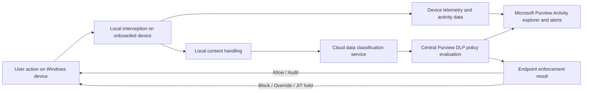
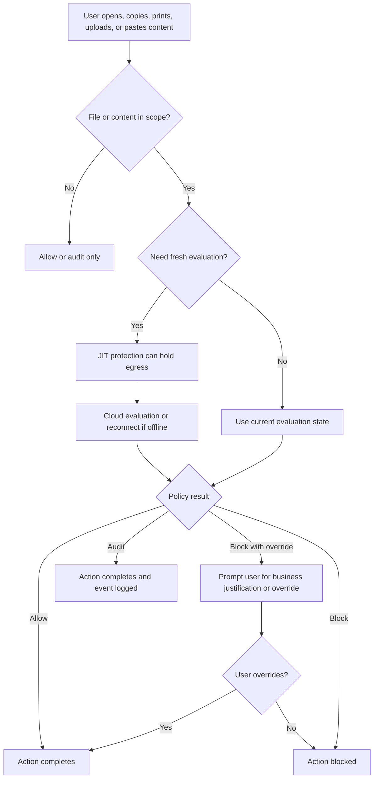

# Microsoft Purview on Windows Devices

## Executive summary

Microsoft Purview on Windows is not one monolithic “agent.” In practice, the Windows-side story is split across several components that do different jobs: Endpoint DLP on Microsoft Defender for Endpoint–onboarded devices; the broader Defender for Endpoint platform that supplies onboarding, identity, telemetry, and much of the endpoint plumbing; the Microsoft Purview Information Protection client for File Explorer, Viewer, and PowerShell-based labeling; the Microsoft Purview Information Protection scanner for on-premises repositories; and the Microsoft Purview Data Map self-hosted integration runtime for catalog scanning across private networks. These components overlap, but they are not interchangeable. Endpoint DLP is primarily an in-use / egress-control engine; the Information Protection client is primarily a labeling and protection extension for Windows; the Information Protection scanner is a scheduled data-at-rest engine for file shares and SharePoint Server; and Data Map SHIR is a catalog-scanning compute node, not an endpoint file-protection agent. citeturn1view0turn3view5turn15view0turn15view2turn21view3turn24view1turn24view4

For Windows endpoints specifically, the most important practical conclusion is this: modern Purview Endpoint DLP depends on device onboarding shared with Microsoft Defender for Endpoint, publishes policy centrally from the cloud, and makes enforcement decisions at the moment users try to copy, print, upload, paste, or otherwise egress sensitive content. It is event-driven rather than a classic scheduled endpoint crawler. Existing policies continue to work offline on already-known files, but newly created or newly accessed files may be gated by just-in-time protection until the device reconnects and cloud evaluation can complete. citeturn8view0turn8view1turn3view1turn3view2turn3view3turn12view3turn13view0

The next major conclusion is that file handling differs sharply by component. Endpoint DLP can monitor common Office, PDF, archive, CSV/TSV, and some image workflows, including MIME-type recognition for certain renamed Office/PDF documents; the Information Protection client can label and encrypt a broader set of Windows files but has exclusions and container-file caveats; the scanner can inspect repositories that Windows can index and can be tuned for additional extensions; and Data Map scanning is about metadata, schema, classifications, and catalog labels rather than endpoint file enforcement. A third important conclusion is that many “gotchas” are documented: unsaved files are invisible to Endpoint DLP, cross-tenant sensitivity labels are not detected by Endpoint DLP, password-protected files and certain scanner scenarios are limited, and SharePoint/OneDrive interactions can affect tracking/revocation and inherited protection behavior. citeturn2view0turn2view2turn3view1turn29view1turn18view3turn27view0turn27view3turn24view4

## Agent types and deployment models

The table below compares the Windows-side components that administrators most often mean when they ask how “Purview agents” work on a Windows device.

| Agent or component | Installed where | Primary role | Installation and onboarding model | What it actually does on Windows | Key constraints | Evidence |
|---|---|---|---|---|---|---|
| **Endpoint DLP on Windows** | Windows 10/11 clients; some Windows Server SKUs | Monitors and restricts sensitive-file activities on devices | Shared onboarding with Microsoft Defender for Endpoint; Purview can onboard by local script, Group Policy, Configuration Manager, Intune/MDM, or VDI scripts; MDE-onboarded devices appear automatically in Purview | Audits or restricts copy to clipboard, USB, network share, print, browser upload, browser paste, Bluetooth, RDP, and restricted-app access; sends telemetry to Activity explorer; supports JIT protection and evidence collection | No inspection if data is never saved locally; cannot detect sensitivity labels from another tenant; Windows Server support is narrower and disabled by default | citeturn3view5turn8view0turn8view1turn29view0turn3view1turn2view0turn10view3 |
| **Microsoft Defender for Endpoint platform** | Windows clients and servers, depending on SKU/OS | Supplies device onboarding, sensor/EDR plumbing, and much of the endpoint telemetry channel Purview relies on | Defender onboarding packages, Group Policy, Intune, Configuration Manager, local scripts, Defender for Cloud, and a preview Defender deployment tool that is itself self-updating | Underpins Endpoint DLP device identity and telemetry; supported Windows coverage is broader than Endpoint DLP coverage | Not itself a Purview labeling engine; server licensing and older-server onboarding differ by OS generation | citeturn5search1turn5search5turn7view1turn6view2 |
| **Microsoft Purview Information Protection client** | Windows desktop or server | Extends sensitivity labels beyond built-in Microsoft 365 app support | Install by `.exe` or `.msi`; supports silent installs; central deployment via tools such as Intune; replaces the older AIP unified labeling client | File Explorer labeling, viewer for protected files, PowerShell labeling/protection, and the local client needed for scanner scenarios | Windows only; ARM64 supports viewer and file labeler but not scanner or PowerShell; active internet required to apply encryption | citeturn15view0turn16view0turn18view0turn18view1turn18view4 |
| **Information Protection scanner** | Windows Server used for file shares / SharePoint Server scanning | Scheduled data-at-rest discovery, classification, labeling, encryption, and optionally DLP remediation for repositories | Installed as part of the full Information Protection client; configured in Purview as scanner clusters and content scan jobs; can authenticate with an Entra token and certificate-based auth is in preview | Discovers, classifies, labels, encrypts, and can enforce on-prem DLP actions such as ACL reduction or quarantine; runs in discovery/manual mode first, then continuous enforce mode if enabled | Repository-focused, not endpoint in-use control; default configuration is reporting-only/manual; some scanner limitations apply | citeturn15view1turn15view3turn14search7turn26view1turn26view6turn25view0turn27view5 |
| **Data Map self-hosted integration runtime** | Windows VM or server in a private network | Data Map catalog-scanning compute for private/on-prem/multicloud sources | Download Microsoft Integration Runtime, register with authentication key, optionally scale out to up to four nodes | Connects to sources, extracts metadata/schema, applies classifications, and can apply sensitivity labels to Data Map assets if connected to the Purview portal | This is **not** endpoint DLP and does **not** provide local file blocking; SharePoint/OneDrive scanning into Unified Catalog is not supported | citeturn21view3turn22view3turn22view0turn24view1turn24view4 |

For Windows endpoint deployments, current Purview onboarding guidance requires supported Windows client builds, Microsoft Entra join/registration, Defender antimalware client version 4.18.2110 or newer, real-time protection and behavior monitoring enabled, Microsoft 365 Apps 16.0.14701.0 or later for the best experience, and firewall allowance for `MpDlpService.exe`. Current Purview guidance lists Windows 10 22H2, Windows 11 21H2 through 24H2 on x64, Windows 11 21H2 through 24H2 on ARM64, and Windows Server 2019/2022 for server support scenarios. citeturn8view2turn8view3

For servers, there is an important nuance: Endpoint DLP support is off by default after server onboarding and must be explicitly enabled. Microsoft’s current Purview docs support Windows Server 2019 and 2022 with specific November 2023 KB baselines, but note that those server KBs disable the **classification** feature on the server. In that configuration, Endpoint DLP can still protect files that were classified previously, provided Microsoft Defender is at version 4.18.23100 or later. Endpoint DLP is also not supported on Windows Servers configured as domain controllers or with the Core Server installation option. citeturn8view0turn6view0turn3view4turn10view3

For the Information Protection client, Microsoft’s current support list is narrower than Defender’s: Windows 11, Windows 10 x64, Windows Server 2019, and Windows Server 2016, with ARM64 support only for the viewer and file labeler. Remote Desktop Services support exists for Windows Server 2019, 2016, 2012 R2, and 2012, with a Microsoft recommendation to preserve `%Appdata%\Microsoft\Protect` if user profiles are deleted. citeturn16view0turn16view2

For Data Map SHIR, Microsoft supports Windows 8.1, 10, 11, and Windows Server 2012 through 2022, but does not support SHIR installation on domain controllers, and does not currently support FIPS mode on SHIR machines. It requires a 64-bit OS and .NET Framework 4.7.2 or later, with a recommended minimum of 8 cores, 28 GB RAM, and 80 GB free disk. citeturn21view3turn21view4

## Architecture and communication

The simplest way to understand the architecture is to separate **local interception** from **cloud policy and classification**. On Endpoint DLP devices, device management is the capability that collects endpoint telemetry into Purview. Device onboarding is shared with Defender for Endpoint, so MDE-onboarded devices show up automatically in Purview. DLP policy evaluation is described by Microsoft as occurring centrally in Purview, with policy updates generally synchronizing across the service in about an hour; targeted items are then reevaluated the next time they are accessed or modified. For advanced classification, the local device can send content to cloud services for classification, but if an admin-configured bandwidth limit is hit, cloud-only classifiers such as Exact Data Match, named entities, trainable classifiers, and credential classifiers stop being available until usage drops below the threshold. citeturn3view5turn3view1turn10view0

The diagram above reflects Microsoft’s documented split: endpoint activity is captured on onboarded devices, policy evaluation is centralized, advanced classification can involve cloud content submission, and the outputs surface in Activity explorer and alerting. Existing policies keep enforcing offline on already-known files, but newly created or stale files can be held by just-in-time protection until the device reconnects and classification completes. citeturn3view1turn3view2turn3view3turn12view3

For authentication and identity, Microsoft requires devices for Endpoint DLP to be Microsoft Entra joined, hybrid joined, or registered. The Information Protection client separately requires Microsoft Entra ID for authentication and authorization, supports SSO, and supports MFA when the environment is configured correctly. The scanner uses a Microsoft Entra token for unattended authentication to the scanner service, and Microsoft also documents certificate-based authentication as a public preview option. citeturn8view2turn16view4turn15view1

The Information Protection client architecture is more local and Windows-centric than Endpoint DLP. Microsoft describes four client components: the scanner, the File Explorer file labeler, the protected-file viewer, and the PowerShell module. Label application can occur through File Explorer, PowerShell, or the scanner after configuration. For Office files, however, Microsoft explicitly says there is no Office add-in in the new Information Protection client because Office sensitivity labels are built into Microsoft 365 apps; for modern Office on Windows, built-in labeling is the default path, while the Information Protection client mainly extends Windows to File Explorer and non-Office file types. citeturn15view0turn16view7turn32view0

The Data Map SHIR communication model is different again. SHIR is registered with an authentication key, can scale to up to four nodes using the same key, and requires outbound access to Microsoft Purview service endpoints, Azure Relay endpoints, and Microsoft Entra sign-in endpoints over 443. Microsoft documents that proxy settings can be configured and that custom proxy credentials are encrypted locally with Windows DPAPI. Auto-update is enabled by default, with Microsoft typically releasing two new SHIR versions per month and pushing one auto-update version monthly; admins can also update manually from Download Center. citeturn22view3turn22view0turn22view1turn22view2turn20view0

## File recognition and labeling behavior

### Endpoint DLP file recognition

Endpoint DLP’s file behavior is broader than many admins expect, but it is still finite and explicit. Microsoft currently documents policy-based monitoring on Windows for Word variants, Excel/CSV/TSV variants, PowerPoint variants, several archive formats, and PDFs. Separate “always audit” behavior covers many Office, PDF, CSV/TSV, and archive types even without a policy match, and—if OCR is enabled—common image formats such as JPG, PNG, TIFF, BMP, and JPEG can also be monitored or audited. Microsoft also lists specific unsupported file types including `.exe`, `.dll`, `.sys`, `.lib`, `.obj`, `.mui`, `.spl`, `.drv`, `.pf`, `.crdownload`, and `.ini`. citeturn3view1turn2view2turn2view9

Endpoint DLP does not rely solely on file extension. Microsoft explicitly states that it monitors activity based on MIME type for certain formats, so activity can still be captured even if the extension is changed for `.doc`, `.docx`, `.xls`, `.xlsx`, `.ppt`, `.pptx`, and `.pdf`. That is an important reason why simple file-renaming is not a reliable bypass for monitored Office/PDF content. citeturn29view1

Advanced classification on endpoints is narrower than activity monitoring. Microsoft says advanced classification supports Office and PDF files, and that it can send content to the cloud for scanning and classification, with size limits of 64 MB for text files and 50 MB for image files when OCR is enabled. Microsoft also notes that DLP policy evaluation still occurs in the cloud even if user content is not being sent because a bandwidth cap has been reached. citeturn10view0

A practical limitation is that Endpoint DLP cannot classify what it never sees. Microsoft states that if data is never saved to a local file—for example, a user opens a document in Word and saves directly to USB without first storing it locally—Endpoint DLP cannot scan, classify, inspect, or block that action. citeturn3view1turn29view0

### Sensitivity labels and encryption on endpoints

For Office on Windows, sensitivity labels are applied primarily through built-in Microsoft 365 app experiences, not through a separate endpoint agent. Microsoft documents manual labeling from the title bar or Sensitivity button, automatic and recommended labeling, and default labeling that applies when a new file is created or when an older unlabeled file is next saved. Labels persist in the file as it moves between devices, apps, and cloud services, and can also apply encryption, headers, footers, watermarks, and dynamic watermarks. citeturn32view0

The Microsoft Purview Information Protection client extends that model to Windows File Explorer, PowerShell, and the scanner. Microsoft says the client supports File Explorer labeling/protection and uses Windows IFilter for content inspection when using PowerShell autolabeling; current documented inspectable types for that path include Word, Excel, PowerPoint, PDF, and text formats such as `.txt`, `.xml`, and `.csv`. The client also excludes critical folders and a defined set of file types from classification/labeling, including `.bat`, `.dll`, `.exe`, `.msi`, `.pst`, `.sys`, and others. citeturn16view7turn16view8turn18view3

For non-Office/PDF file types, Microsoft now documents an especially important endpoint pattern: **Advanced label-based protection for all files on devices**. With the setting enabled, users can label and encrypt many non-Office/PDF file types on Windows while retaining the original extension on the local device; Endpoint DLP then monitors and enforces permissions locally and changes the file into an encrypted-extension form only when it is moved or copied off the device. Without that setting, the Information Protection client typically changes the extension at labeling time and the file becomes effectively viewer-centric. Microsoft documents support requirements of antimalware client version 4.18.25050 or newer and Information Protection client version 3.1.309 or newer. citeturn30view0

That advanced label-based protection model is powerful, but it has important limits. Microsoft says it is supported only for labels that apply encryption, is not supported for labeling files on network locations or USB drives, detects only a subset of rights-management usage rights before egress—specifically view, extract, and print—and does not make the applied sensitivity labels available as DLP conditions before egress. Microsoft also states that the PowerShell module does not recognize this DLP setting, so admins should use the File Labeler rather than PowerShell when this feature is in play. citeturn30view0

The Information Protection client also has an online dependency for encryption. Microsoft states that an active internet connection is required to apply encryption; disconnected-computer scenarios are supported only for labels that do **not** apply encryption, using exported policy files and logs. That distinction matters operationally: offline labeling is possible, but offline encryption is not generally the supported design target for this client. citeturn18view4

### Archives, cloud sync, and OneDrive or SharePoint sync

Container files are one of the most common sources of mistaken assumptions. Microsoft’s troubleshooting guidance says the Information Protection client can classify and protect container files such as `.zip`, `.rar`, `.7z`, `.msg`, and PDF documents with attachments, but the classification/protection is **not** applied recursively to each file inside the container. To modify classification or protection of inner files, you generally have to extract them first. Microsoft also notes that the viewer cannot show attachments inside a protected PDF. citeturn27view0

ZIP handling is more nuanced for the scanner than for the endpoint client. Microsoft documents that the scanner or `Set-FileLabel` can inspect `.zip` files, but when the scanner runs on a Windows Server computer, Microsoft Office iFilter must also be installed to scan ZIP files for sensitive information types. If you want ZIP files to be labeled and encrypted by the scanner, Microsoft says you must also add the `.zip` extension through the `PFileSupportedExtensions` advanced setting. citeturn18view3turn15view1

For OneDrive and cloud sync apps, Endpoint DLP offers a concrete remediation mechanism: auto-quarantine. Microsoft documents that you can add a cloud-sync app such as `onedrive.exe` to the restricted apps list with auto-quarantine enabled, causing DLP to move a protected item to an admin-configured folder and optionally leave a `.txt` placeholder in place of the original. This is specifically intended to stop repeated sync attempts and repeated DLP notifications when a blocked sync app keeps touching protected files. citeturn9view0turn9view1

There are also SharePoint and OneDrive caveats on the Information Protection side. Microsoft documents that protected documents uploaded to SharePoint or OneDrive lose their original ContentID, so access can no longer be tracked or revoked using that original ID; if a user downloads and reopens the file locally, a new ContentID is applied. Microsoft also documents that if an admin later changes the label policy to add protection to documents already stored in OneDrive, that newly added protection is not automatically stamped onto already-labeled OneDrive documents; the workaround is to relabel the document manually. citeturn27view3

Finally, admins should not confuse Data Map with repository or endpoint file protection. Microsoft’s current Data Governance FAQ explicitly says Data Map does **not** support scanning SharePoint and OneDrive into the Unified Catalog; for on-premises SharePoint, Microsoft points customers to the Information Protection scanner instead. citeturn24view4

## Endpoint capabilities and policy enforcement

On Windows endpoints, Endpoint DLP can audit or restrict a broad set of user activities. Microsoft currently documents support for uploading to restricted cloud service domains or accessing files from unallowed browsers; pasting to supported browsers; copying to clipboard; copying to USB removable media; copying to network shares; printing; copying or moving via unallowed Bluetooth apps; copying or moving over RDP; access by restricted apps; item creation/rename auditing; and, in preview, Windows Recall snapshot controls. Policy modes include **Block**, **Block with override**, **Audit**, **Allow**, and **Off**, with corresponding differences in whether the user is blocked, whether alerts are generated, and whether audit records are retained. citeturn29view0turn28view4

This is not merely theoretical. Microsoft’s policy reference says device rules can be configured for block/override behavior, and that when a user overrides a block the action is permitted for a short period—generally one minute—so the user can retry it. Microsoft’s endpoint settings also support global control over business-justification prompts, including default choices or free-text justifications. citeturn28view1turn28view4turn10view2

Policy scope is increasingly precise. Microsoft documents device scoping so that a Devices-location DLP policy is enforced only when **both** the user and the device are in scope. At the same time, Microsoft explains that onboarded devices may still receive all endpoint policies because a single device can host multiple users, and different users on the same device may be in different policy scopes. citeturn28view2turn3view2

The local-versus-cloud behavior is one of the most important operational design points. Microsoft states that DLP policy evaluation is centralized and syncs across the service in roughly an hour, after which items are reevaluated on next access or modification. For offline devices, existing policies continue to be enforced on already-classified files; notifications still appear locally; and events upload to Activity explorer only after the device reconnects. For newly created files on offline Windows devices, JIT protection in block mode can prevent sharing until the device reconnects to the data classification service and evaluation completes. If a new policy is created or an old one is changed while the device is offline, the device keeps enforcing the outdated local policy until it reconnects. citeturn3view1turn3view2turn3view3turn12view3turn13view0

For remediation, Microsoft documents several strong endpoint-side options: restricted apps and app groups, browser/domain restrictions, printer groups, removable USB device groups, network share groups, auto-quarantine, evidence collection, and network share coverage/exclusions. Evidence collection can copy the original matching file from onboarded Windows devices to Azure storage, with local cache options of 7, 30, or 60 days while the device is offline; preview and download are controlled by dedicated Purview roles. Network share coverage can extend device-scoped DLP to new and edited files on mapped drives and network shares. citeturn9view0turn9view4turn9view6turn10view4turn12view0turn12view1

For on-premises repositories, the Information Protection scanner can enforce repository-side DLP actions that are more file-system–oriented than endpoint pop-ups. Microsoft documents four core actions: block everyone except owner/admin, block network-broad identities such as Everyone or Domain Users while keeping explicit ACLs, force inheritance from the parent folder, or remove the file from the improper location by replacing it with a `.txt` stub and moving the original to a quarantine folder. Microsoft also states that policy tips are **not** available in the on-prem scanner path. citeturn25view0

## Performance privacy and security

For Endpoint DLP, Microsoft’s own documentation makes it clear that performance is a real design variable, not an afterthought. The “apply restrictions to only unsupported file extensions” path can increase CPU and memory usage because the file-extension condition triggers content scanning. Advanced classification can also consume bandwidth because it sends content to the cloud, which is why Microsoft exposes per-device rolling 24-hour bandwidth limits. Microsoft also warns that turning on JIT clipboard control can affect user productivity. citeturn2view2turn10view0turn13view0

Repository-scanning components are even more resource-sensitive. For the Information Protection scanner, Microsoft says discovery mode typically runs faster than enforce mode because discovery requires only a read, while enforce mode requires read and write; the first scan cycle takes longer because every file must be inspected, while later cycles inspect only new and changed files by default. For Data Map SHIR, Microsoft recommends 8 cores, 28 GB RAM, and 80 GB disk, notes that concurrent scan jobs can significantly increase peak CPU and RAM use, and recommends multi-node designs when higher concurrency or better availability is needed. citeturn26view4turn26view6turn21view3turn22view0

On privacy and security, Microsoft documents several useful controls. For the Information Protection client, usage-statistics telemetry is enabled by default but can be disabled during installation or via registry. For Always-on diagnostics in Endpoint DLP, Microsoft says logs are protected through restricted access controls and proprietary log format, can be retained with configurable cache and size controls, and can be uploaded securely to Microsoft Support when enabled. For SHIR, custom proxy credentials are encrypted locally with Windows DPAPI. citeturn18view1turn34view0turn22view1

Region and storage design matter too. Defender for Endpoint requires you to choose a data storage region at first-time setup and Microsoft states that this location cannot later be changed without support intervention. Evidence collection for endpoint DLP can store copied files in Azure Blob storage, but Microsoft’s current guidance says support for private access, virtual-network/IP restrictions, and per-container permissions is limited or unavailable in that feature path, which has obvious governance implications for highly regulated deployments. citeturn7view1turn12view1

## Limitations best practices and troubleshooting

Several limitations are material enough that they should shape deployment design from the start. Endpoint DLP cannot inspect unsaved data; it cannot detect sensitivity labels from another tenant; and some browser controls only work in Microsoft Edge or in Chrome/Firefox when Microsoft’s Purview browser extension is present. On the Information Protection side, container protection is not recursive, PowerShell 7 is unsupported, documents encrypted or signed with other solutions such as S/MIME are outside normal support, and advanced label-based protection does not expose applied labels as DLP conditions before egress. For the scanner, Microsoft documents that it cannot scan `.msg` files containing signed PDFs, password-protected files, and certain classifier scenarios. citeturn3view1turn2view0turn10view1turn27view0turn27view1turn27view4turn27view5turn30view0

The most defensible deployment pattern on Windows is therefore layered. Use built-in Office sensitivity labels for Office content creation and collaboration; add the Information Protection client only where Windows File Explorer labeling, viewer support, or non-Office file protection is actually needed; use Endpoint DLP for in-use and egress control on onboarded Windows devices; use the Information Protection scanner for file shares and SharePoint Server repositories; and use Data Map SHIR for metadata governance of private data sources, not as a substitute for endpoint or on-prem DLP. Pilot Endpoint DLP in Audit or Block with override before hard Block, keep JIT fallback permissive during early rollout, and tune app/path/network-share exceptions early to avoid avoidable productivity complaints. citeturn15view0turn32view0turn28view4turn13view0turn25view0turn24view1turn24view4

A short troubleshooting checklist that matches Microsoft’s current guidance is below:

- **Verify device prerequisites first.** Check Windows build, Entra join/registration state, Defender antimalware client version, real-time protection, behavior monitoring, and the `MpDlpService.exe` firewall allowance. citeturn8view2turn8view3
- **Check endpoint configuration and policy sync status in Purview.** Microsoft’s troubleshooting flow uses those values to confirm heartbeat, validation state, and whether policy is actually synchronized. citeturn12view2
- **If DLP behavior is wrong, collect MDE client traces with DLP tracing enabled.** Microsoft’s supported path is `MDEClientAnalyzer.cmd -t` on Windows 10/11, then reproduce the issue and inspect the generated results. citeturn34view1turn34view2
- **If performance is the complaint, inspect whether advanced classification, broad file-extension rules, or JIT clipboard control are in scope.** Those are the documented places where CPU, memory, bandwidth, or user experience can change materially. citeturn2view2turn10view0turn13view0
- **If scanner results are unexpected, confirm whether the job is still in manual/reporting-only mode or whether it has been moved to Always/Enforce.** Also confirm whether you are on the first full scan or a later delta cycle. citeturn26view1turn26view6
- **If SHIR cannot register or connect, verify DNS, outbound 443 allowlists, Azure Relay URLs, and proxy configuration.** Microsoft explicitly recommends `nslookup` validation and notes that SHIR connectivity and interactive authoring depend on those endpoints. citeturn22view0turn22view1turn22view2turn20view7
- **If OneDrive sync keeps generating repeated blocks, use the restricted-app plus auto-quarantine pattern rather than letting the sync app repeatedly touch the same protected file.** citeturn9view0turn9view1

### Open questions and limitations

Some Microsoft Learn pages in this area are partially authorization-gated, so a few very specific UI-step details are only visible through search snippets or linked articles rather than full public page text. Also, Microsoft documents these features by solution area more often than by the single word “agent,” so this report maps those published behaviors into practical Windows-side component categories. The sharpest boundary to remember is that **Endpoint DLP and the Information Protection client/scanner are file-protection technologies, while Data Map SHIR is a scanning compute component for metadata governance**. That mapping is an inference from the official role descriptions and feature boundaries, but it is strongly supported by Microsoft’s own documentation. citeturn24view1turn24view4turn21view3turn15view0turn25view0