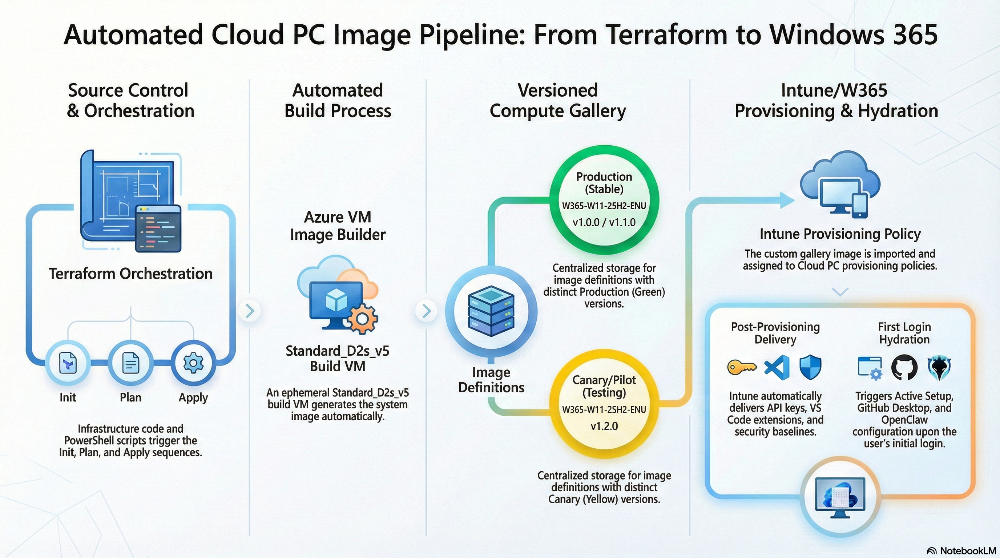
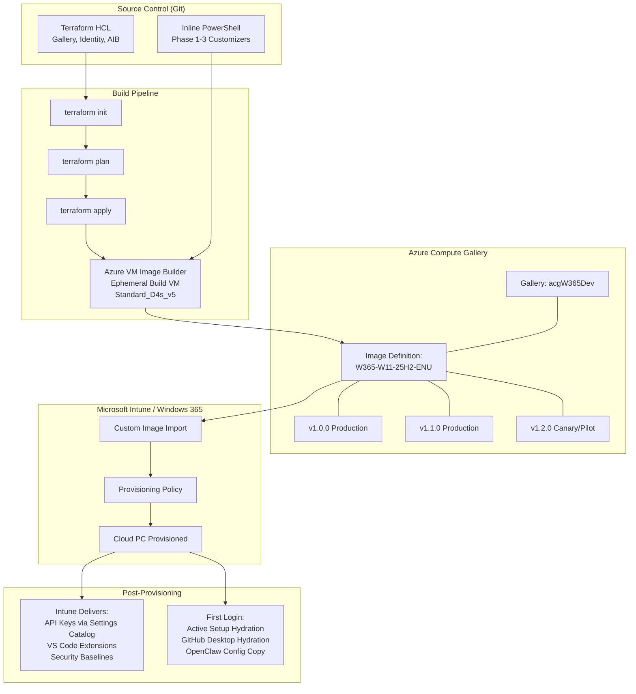

## Chapter 2: Architecture Overview

### End-to-End Architecture

The solution spans four layers: infrastructure definition, image build, Windows 365 ingestion, and post-provisioning configuration.

### The Four Layers

**Layer 1: Source Control.** All infrastructure and build logic lives in Git. The Terraform configuration defines the Azure Compute Gallery, managed identity, RBAC assignments, and AIB template. The build scripts are inline PowerShell within the Terraform HCL, with no external storage account or blob dependencies. Changes are tracked, reviewed, and versioned.

> **💡 Note: Why inline scripts?** Storing PowerShell in external files (Azure Blob Storage, Git raw URLs) would reduce HCL file size but introduce external dependencies: the build would fail if the storage account is misconfigured, the SAS token expires, or the Git URL changes. Inline scripts keep the entire build definition self-contained in a single `terraform apply`. The companion repository includes a setup script (`Initialize-TerraformVars.ps1`) that populates all variables and prepares the tenant, so the inline approach remains manageable even as the scripts grow. For teams that prefer external scripts, the same PowerShell can be extracted to blob storage with minimal changes to the AIB template.

**Layer 2: Build Pipeline.** A manual `terraform apply` deploys the infrastructure and triggers the AIB build. The build VM (Standard_D4s_v5 by default) downloads installers, runs three phases of PowerShell customization, applies Windows Updates, and runs Sysprep. The result is a generalized VHD published to the Azure Compute Gallery. Build time: 75--120 minutes.

> **💡 Tip:** The default build VM is `Standard_D4s_v5` (4 vCPU, 16 GB) to improve build reliability and speed. If cost is a priority and longer builds are acceptable, downgrade to `Standard_D2s_v5` (2 vCPU, 8 GB RAM) in `terraform.tfvars`.

**Layer 3: Windows 365 Ingestion.** An administrator imports the image version from ACG into Intune (Devices > Windows 365 > Custom images > Add > Azure Compute Gallery). The imported image is assigned to a provisioning policy targeting a developer security group. New Cloud PCs are provisioned from this image.

**Layer 4: Post-Provisioning.** Intune delivers API keys, VS Code extensions, and security baselines to running Cloud PCs. On first login, Active Setup copies the OpenClaw configuration template to the user's profile, and GitHub Desktop hydrates from the machine-wide provisioner.

### The "Image Build vs Post-Provisioning" Split Philosophy

This split is not arbitrary. It's an architectural decision driven by the constraints of Azure Image Builder's execution context and the operational reality of Windows 365.

**What goes in the image:**
- Binary installations (runtimes and tools)
- Machine-level policy (managed-settings.json)
- Configuration templates (in ProgramData)
- Windows Updates

**What goes in post-provisioning:**

- Agents
- Secrets and API keys (never bake these)
- User-context configuration (VS Code extensions)
- Identity-specific settings
- Frequently updated components (agent version bumps via npm)
- Agent-specific skill updates (new skills or skill version bumps)
- MCP server credential configuration (API keys, tokens)

The reasoning is simple: anything in the image is frozen at build time. Updating it requires a new image build and reprovisioning (which destroys the Cloud PC). Anything delivered via Intune can be updated on running Cloud PCs without disruption.

### Microsoft Entra ID and the Sign-In Question

If you're not already familiar: **Microsoft Entra ID** (formerly Azure Active Directory) is the cloud identity platform that underpins Microsoft 365, Azure, and Windows 365. Every Cloud PC is Entra-joined, so when a developer signs into their Cloud PC via the Windows 365 web portal, Windows app, or Remote Desktop client, they authenticate against Entra ID. Their identity determines what they can access: email, Teams, SharePoint, Azure subscriptions, Git repositories, and everything else governed by Conditional Access policies.

This creates an important architectural question for AI agent deployments: **which identity does the agent run under, and on which machine?**

There are three viable models, each with different cost, security, and operational trade-offs. Licensing requirements are summarized in Chapter 1's cost table.

#### Option 1: Developer's Own Entra ID (Simple Model)

The developer signs into their Cloud PC with their normal corporate account, the same `kevin@bighatgroup.com` they use for email and Teams. The AI agents (OpenClaw, Claude Code) run under this identity. Everything the developer can access, the agent can access.

**Licensing:** The base stack is Entra P1 + W365 + Intune P1. If the Cloud PC is the developer's **primary device** (replacing a physical workstation), the developer needs a full **Microsoft 365 E3** licence to cover Exchange Online, Teams, SharePoint, and Office apps (M365 E3 includes Entra P1 and Intune P1).

This is the simplest model. It works well when:

- The agents are used interactively (the developer reviews every action before it executes)
- The developer's access is already scoped appropriately
- Audit requirements don't demand separation between human and agent actions

**Security risk:** A compromised agent inherits the developer's full privilege set, including SSO tokens for email, Teams, SharePoint, and any other service the developer has accessed. Agent actions are indistinguishable from human actions in audit logs.

#### Option 2: Dedicated Agent Account on a Separate Cloud PC (Fully Isolated, Minimal Licence)

The organization provisions a **secondary Entra ID account** specifically for agent-assisted work (e.g., `agent-kevin@bighatgroup.com`). The developer signs into a **second, dedicated Cloud PC** with this account when doing heavy agent-assisted coding sessions.

This account has:

- **No email, no Teams, no SharePoint**, stripped of everything the agent doesn't need
- **Access only to Git repositories and Azure DevOps projects** relevant to the development work
- **Its own sign-in logs**, so every action is attributable to the agent account, not the human
- **A minimal licence stack**: Entra ID P1 + Windows 365 Enterprise + Intune P1 (no M365 E3 needed because the agent doesn't use Exchange, Teams, or Office apps)

The developer's primary Cloud PC (signed in as `kevin@bighatgroup.com`) remains available for non-agent work. The agent Cloud PC is a purpose-built, network-isolated environment where the blast radius of a compromised agent is fully contained.

This model is recommended when:

- Agents operate autonomously (OpenClaw running background tasks, accessing APIs without human supervision)
- Compliance requires non-repudiation between human and agent actions
- The organization needs full session isolation (separate machine, separate identity, separate network segment)
- Budget requires keeping the agent account licence cost to a minimum

**Trade-off:** This adds a second Windows 365 licence per developer, but the agent account avoids the cost of a full M365 E3 licence.

#### Option 3: Dedicated Agent Account on a Separate Cloud PC (Fully Isolated, Full M365 Licence)

Architecture is identical to Option 2, but service access scope and licensing cost differ. The agent account is assigned a **full Microsoft 365 E3 licence** instead of the minimal stack. This gives the agent account access to Exchange Online, Teams, SharePoint, and Office apps under its own identity.

This model applies when:

- The agent needs to interact with Microsoft 365 services (e.g., reading Teams channels for context, accessing SharePoint document libraries, sending email notifications)
- Compliance or workflow requirements demand that the agent has its own M365 tenant presence rather than relying on the developer's credentials for service access
- The organization is using Microsoft 365 APIs (Graph API) extensively in agent workflows and needs the agent to authenticate independently

**Trade-off:** This is the most expensive model. Each agent account carries a full M365 E3 licence plus a Windows 365 licence. Reserve this for scenarios where the agent genuinely needs M365 service access under its own identity.

#### Choosing a Model

| | Option 1: Developer's Identity | Option 2: Dedicated PC (Minimal) | Option 3: Dedicated PC (Full M365) |
|---|---|---|---|
| **Agent identity** | Developer's own account | Separate agent account | Separate agent account |
| **Machine** | Developer's Cloud PC | Separate Cloud PC | Separate Cloud PC |
| **Audit separation** | None | Full | Full |
| **Session isolation** | None | Full | Full |
| **M365 services for agent** | Via developer's licence | None | Full (own E3) |
| **Developer licence** | M365 E3 + W365 | M365 E3 + W365 | M365 E3 + W365 |
| **Agent account licence** | N/A | Entra P1 + W365 + Intune P1 | M365 E3 + W365 |
| **Best for** | Interactive, supervised use | Autonomous workflows | Agent needs M365 service access |

> **💡 Tip:** You don't have to choose one model for the entire organization. Many teams start with Option 1 for interactive coding assistance and move to Option 2 or 3 when they adopt autonomous agent workflows. The image is the same in all cases; the identity model is an operational decision, not an image build decision.

Chapter 27 covers the security rationale and implementation details in depth, including the emerging **Microsoft Entra Agent ID** (preview) capability that formalizes agent account management. Chapter 27 also addresses the **local administrator question**: why granting admin rights to a network-isolated, dedicated-account Cloud PC is actually the pragmatic choice for AI agent workflows, and why the risk calculus is fundamentally different from giving admin to a corporate-network-connected laptop.

---

