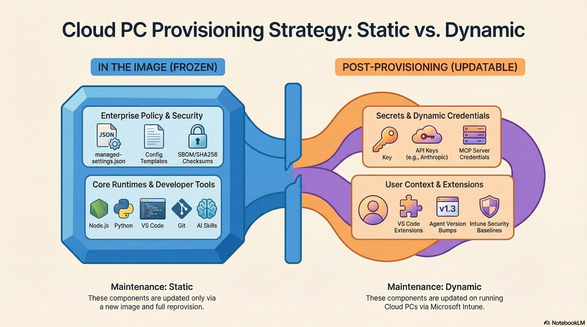

## Chapter 3: The Architectural Boundary

### Local System vs User Context

A critical concept underpins this entire design: **the image build handles binary installation and machine-level policy; everything identity-specific happens after provisioning.**

Azure Image Builder runs scripts as **NT AUTHORITY\SYSTEM** (Local System). This account has full machine access but:

- No user profile (`%USERPROFILE%` resolves to `C:\Windows\System32\config\systemprofile`)
- No HKCU registry hive (in the expected sense)
- No browser session
- No interactive desktop (Session 0)

Any tool that expects a user context (WinGet's App Installer dependency, VS Code extension installation into `%USERPROFILE%`, OpenClaw's onboarding wizard, Claude Code's OAuth login flow) will either fail silently, install into the wrong profile, or hang the build indefinitely.

### The Responsibility Matrix

| Responsibility | Timing | Execution Context | Mechanism |
|---|---|---|---|
| Runtimes (Node.js, Python, PowerShell 7) | Image build | Local System | MSI/EXE silent installers |
| Developer tools (VS Code, Git, Azure CLI) | Image build | Local System | System installers with automation flags |
| AI agent binaries (OpenClaw, Claude Code, Codex) | Post-provisioning | User context | Intune Win32 app (required, per-user) |
| OpenSpec | Post-provisioning | User context | Intune Win32 app (required, per-user) |
| Enterprise policy (managed-settings.json) | Image build | Local System | File write to ProgramData |
| Configuration templates | Image build | Local System | File write to ProgramData |
| Agent skills (curated) | Image build | Local System | File copy to ProgramData |
| MCP server binaries | Post-provisioning | User context | Intune Win32 app (available, per-user) |
| MCP server configuration | Image build | Local System | Template in ProgramData |
| API keys and credentials | Post-provisioning | Machine (Intune) | Environment variables via Settings Catalog |
| VS Code extensions | Post-provisioning | User context | Intune script |
| OpenClaw config hydration | First login | User context | Active Setup registry entry |
| Skill + MCP config hydration | First login | User context | Active Setup (copies to user profile) |
| GitHub Desktop application | First login | User context | Machine-wide MSI provisioner |

### The "Dormant and Ready" Philosophy

The objective is to produce a Windows 11 image where the AI agents are not merely present, but **dormant and ready**:

- **Binaries are machine-wide.** Executables are in `C:\Program Files` or a globally accessible PATH location, not buried in a specific user's AppData.
- **Dependencies are pre-resolved.** Complex dependency chains are fully installed and verified, eliminating the need for the developer to have admin rights.
- **Configuration is injected.** Base configuration files are pre-seeded in a system location, enforcing enterprise security policies before the user ever launches the agent.

Install the binaries. Inject configuration templates. Defer initialization to first login.

> **⚠️ Warning:** Never run `openclaw onboard` or `claude login` during the image build. These commands launch interactive wizards that will hang the build until the AIB timeout kills it. More importantly, if they somehow complete, they generate unique session tokens and device identifiers that would be baked into every Cloud PC provisioned from this image, causing identity collisions and security failures.

---

