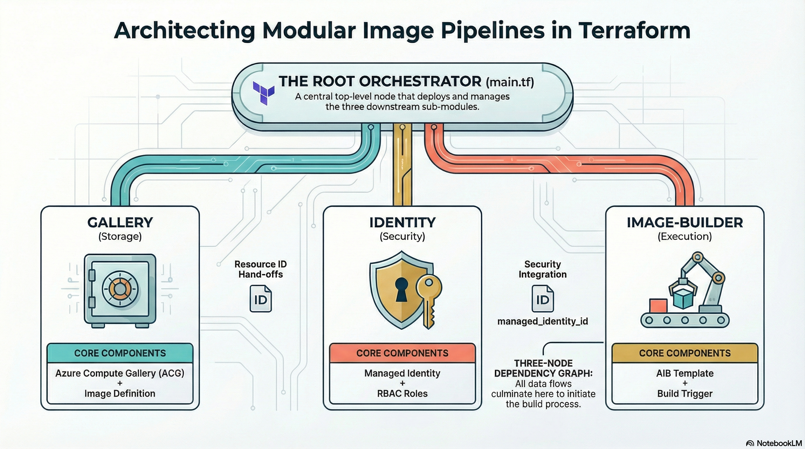
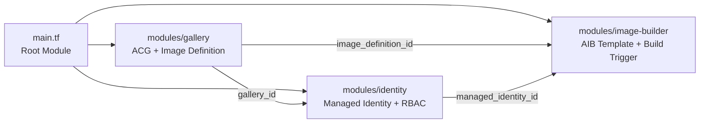

## Chapter 6: Terraform Solution Architecture

### What Is Terraform

Terraform is an open-source infrastructure-as-code (IaC) tool created by HashiCorp. You write declarative configuration files (`.tf` files) that describe the desired state of your infrastructure, and Terraform figures out how to create, modify, or destroy Azure resources to match that state. It communicates with Azure (and hundreds of other cloud providers) through **providers**, plugins that translate Terraform's resource definitions into API calls.

The core workflow is three commands:

1. **`terraform init`**: Downloads the required providers and initializes the working directory.
2. **`terraform plan`**: Compares the desired state (your `.tf` files) against the actual state (what exists in Azure) and shows what will change.
3. **`terraform apply`**: Executes the plan, creating or modifying resources.

Terraform tracks what it has created in a **state file** (`terraform.tfstate`). This is how it knows the difference between "create a new resource group" and "the resource group already exists." In production deployments, state is stored in a remote Azure Storage backend (see the State Management section below); the code examples in this book use a local backend as an explicit shortcut for learning environments only.

### Why Terraform for This Solution

You could build everything in this book by clicking through the Azure portal. You could also script it with the Azure CLI or write Bicep templates. Terraform was chosen for three reasons specific to the developer image workflow:

**1. Unified lifecycle management.** The image build pipeline spans multiple Azure resource types (resource groups, compute galleries, image definitions, managed identities, RBAC assignments, VM Image Builder templates, and build triggers). In the portal, these are spread across half a dozen blades. In Terraform, they're a single `terraform apply` that creates everything in the correct dependency order, and a single `terraform destroy` that tears it down cleanly.

**2. The plan-before-apply safety net.** When you're building images that will be deployed to production Cloud PCs, you want to review exactly what will change before it changes. `terraform plan` gives you a diff ("this RBAC assignment will be added, this image version will be created, this build will be triggered") before any API calls are made. This is particularly valuable when bumping software versions: you can see that only the image version and build template changed, and nothing else was affected.

**3. Modular, parameterised configuration.** Every version number, every Azure region, every gallery name is a variable. The `terraform.tfvars` file (populated by `Initialize-TerraformVars.ps1`) is the single source of truth for the entire build. When you need to bump Node.js from v24.13.1 to v24.14.0, you change one line in `terraform.tfvars` and run `terraform apply`. Terraform recalculates the downstream effects (new download URLs, new SHA256 checksums to verify, new SBOM (Software Bill of Materials) entries) automatically.

**What Terraform is NOT doing here:** Terraform does not manage Windows 365 provisioning policies, Intune configuration profiles, or Entra ID groups. Those are managed through their respective admin portals or via Microsoft Graph. Terraform's scope in this solution ends at "a validated image version exists in the Azure Compute Gallery." Everything after that (importing into Windows 365, assigning to users, post-provisioning configuration) happens outside Terraform.

> **💡 Tip:** If you're new to Terraform, the [official tutorials](https://developer.hashicorp.com/terraform/tutorials) are excellent. For this book, you need to understand `resource`, `variable`, `module`, `output`, `plan`, and `apply`. The solution avoids advanced features like remote state, workspaces, and dynamic blocks to keep the learning curve manageable.

The complete Terraform solution, including all modules, scripts, and variable definitions, is available at **[github.com/kkaminsk/W365Claw](https://github.com/kkaminsk/W365Claw)**. The code excerpts throughout this book are drawn from that repository. Clone it and use it as your starting point.

### Directory Structure

```text
terraform/
|---- main.tf                          # Root module -- orchestrates gallery, identity, image-builder
|---- variables.tf                     # All configurable inputs with defaults
|---- outputs.tf                       # Gallery IDs, build log info, next steps runbook
|---- versions.tf                      # Provider requirements (azurerm, azapi, time)
|---- terraform.tfvars                 # Environment-specific values (git-ignored)
|---- ../scripts/
|--   |---- Initialize-BuildWorkstation.ps1  # Prerequisites installer
|--   |---- Initialize-TerraformVars.ps1     # Interactive tfvars populator
|--   \---- Teardown-BuildResources.ps1      # Targeted resource cleanup
\---- modules/
    |---- gallery/
    |--   |---- main.tf                  # ACG + image definition
    |--   |---- variables.tf
    |--   \---- outputs.tf
    |---- identity/
    |--   |---- main.tf                  # Managed identity + RBAC
    |--   |---- variables.tf
    |--   \---- outputs.tf
    \---- image-builder/
        |---- main.tf                  # AIB template + trigger (inline scripts)
        |---- variables.tf
        |---- outputs.tf
        \---- versions.tf             # azapi + time provider requirements
```

### Module Design

The solution uses three modules, each with a single responsibility:





**Gallery Module** creates the Azure Compute Gallery and image definition with Windows 365 feature flags (Trusted Launch, hibernation, NVMe disk controller, accelerated networking). Both resources have `lifecycle { prevent_destroy = true }` to prevent accidental deletion.

**Identity Module** creates the user-assigned managed identity and four RBAC assignments. It takes the resource group ID (for VM/Network/Identity roles) and gallery ID (for image contributor role) as inputs.

**Image Builder Module** defines the AIB template via the `azapi` provider and triggers the build. All PowerShell scripts are inline, with no storage account required.

### Provider Choices

```hcl
terraform {
  required_version = ">= 1.5.0"

  required_providers {
    azurerm = {
      source  = "hashicorp/azurerm"
      version = "~> 4.0"
    }
    azapi = {
      source  = "azure/azapi"
      version = "~> 2.0"
    }
    time = {
      source  = "hashicorp/time"
      version = "~> 0.11"
    }
  }

  backend "local" {}
}
```

### Why azapi for AIB?

The `azurerm` provider does not have full coverage for `Microsoft.VirtualMachineImages/imageTemplates` resources. The `azapi` provider gives direct ARM API access for the AIB template, which is the most reliable approach for defining customizers, distributor targets, and build VM configuration. This avoids the common pitfall of waiting for provider updates to support new AIB features.

### State Management: Remote Backend Recommended

For production deployments, use an **Azure Storage remote backend** with state locking. This provides encryption at rest, an audit trail of state changes, and prevents concurrent builds from corrupting state:

```hcl
terraform {
  backend "azurerm" {
    resource_group_name  = "rg-terraform-state"
    storage_account_name = "stw365clawstate"
    container_name       = "tfstate"
    key                  = "w365claw.tfstate"
  }
}
```

Create the storage account and container before your first `terraform init`. Enable blob versioning for state history and configure a storage account firewall to restrict access.

The code examples in this book show `backend "local" {}` as an explicit shortcut for initial learning and experimentation only. For any team usage, CI/CD pipelines, or production image builds, the remote Azure Storage backend above is the recommended configuration; switching is a one-line change in `versions.tf` followed by `terraform init -migrate-state`.

> **⚠️ Warning:** The local backend offers no locking, no encryption at rest, and no audit trail. It is acceptable only for single-operator learning environments.

### Variables

The solution exposes over 30 variables, all with sensible defaults. The critical ones:

| Variable | Default | Purpose |
|----------|---------|---------|
| `subscription_id` | *(required)* | Target Azure subscription |
| `image_version` | `1.0.0` | Semantic version for the image |
| `build_vm_size` | `Standard_D4s_v5` | AIB build VM size (speed/cost tradeoff) |
| `os_disk_size_gb` | `128` | OS disk size for the build VM |
| `build_timeout_minutes` | `120` | Build timeout before AIB run fails |
| `exclude_from_latest` | `true` | Canary flag for staged rollout |
| `node_version` | `v24.13.1` | Pinned Node.js version |
| `python_version` | `3.14.3` | Pinned Python version |
| `source_image_version` | `26200.7840.260206` | Pinned Windows 11 25H2 marketplace image |

Every software version is pinned to a specific release. **Note on `python_version`:** Python 3.14 reached final stable release in October 2025; 3.14.3 is the current stable patch as of publication. Verify the current stable release at [python.org/downloads](https://python.org/downloads) before bumping this variable. The `source_image_version` variable includes a validation rule that rejects `"latest"`:

```hcl
variable "source_image_version" {
  description = "Marketplace image version -- MUST be pinned"
  type        = string
  default     = "26200.7840.260206"

  validation {
    condition     = var.source_image_version != "latest"
    error_message = "Source image version must be pinned (not 'latest') for build reproducibility."
  }
}
```

> **Note:** The source marketplace image is Windows 11 25H2 (`win11-25h2-ent` / `26200.7840.260206`), matching the image definition naming convention.

---

