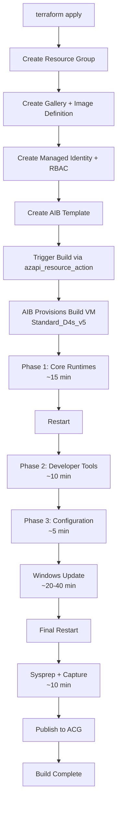

# Part IV: Operations

---

## Chapter 14: Building the Image

### First Deployment

```powershell
Set-Location terraform

# Populate terraform.tfvars (auto-detects versions, checksums, subscription)
..\scripts\Initialize-TerraformVars.ps1

# Initialize (local backend -- no remote state configuration needed)
terraform init

# Plan -- review what will be created
terraform plan -var-file="terraform.tfvars" -out tfplan

# Apply -- deploys infrastructure and triggers the image build
terraform apply tfplan
```

The `terraform apply` creates all resources and triggers the AIB build in a single operation. The build proceeds through these stages:

> **Disk sizing guidance:** Increase `os_disk_size_gb` (for example, to 192 or 256) when adding large toolchains, large package caches, or when Windows Update consistently consumes most of the default 128 GB disk during builds.




### Expected Timelines

| Phase | Duration |
|-------|----------|
| Infrastructure deployment | 2--5 minutes |
| Phase 1: Core Runtimes | ~15 minutes |
| Phase 2: Developer Tools | ~10 minutes |
| Phase 3: Configuration & Policy | ~5 minutes |
| Windows Update | 20--40 minutes (varies) |
| Sysprep + Capture | ~10 minutes |
| **Total** | **60--90 minutes** |

The build timeout is set to 120 minutes (`build_timeout_minutes = 120`), with the Terraform timeout set to 150 minutes (`build_timeout_minutes + 30`) to allow for the API action to complete after the build finishes.

### Monitoring the Build

During the build, you can monitor progress in the Azure Portal:

1. Navigate to **Resource Groups** -> `rg-w365-images`
2. Find the AIB template resource (named `aib-w365-dev-ai-1-0-0`)
3. Check **Runs** -> view the latest run
4. The build log shows real-time output from each customizer

Alternatively, use Azure CLI:

```powershell
az image builder show-runs `
    --name "aib-w365-dev-ai-1-0-0" `
    --resource-group "rg-w365-images" `
    --output table
```

---

