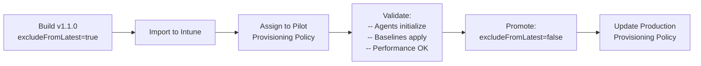

## Chapter 16: Image Versioning and Staged Rollout

### Versioning Convention

ACG image versions follow `Major.Minor.Patch` semantics:

| Version Component | Meaning | Example |
|---|---|---|
| **Major** | Base OS change or breaking toolchain change | Windows 11 24H2 -> 25H2 |
| **Minor** | Monthly rebuild with updated agents and patches | New OpenClaw version |
| **Patch** | Hotfix for a specific issue | Critical security patch |

### The excludeFromLatest Flag

When you publish a new image version, set `excludeFromLatest=true` initially. This is a governance signal, not a technical lock.

> **💡 Tip:** Windows 365 does not auto-consume the "latest" version from your gallery. When you import a custom image in Intune, you manually select a specific version. The `excludeFromLatest` flag doesn't prevent Windows 365 from seeing the version; it's a gallery-level governance signal for your team.

### The Staged Rollout Workflow




```powershell
# Step 1: Build the canary version
terraform apply `
  -var='image_version=1.1.0' `
  -var='exclude_from_latest=true'

# Step 2: Import into Intune and test with pilot group

# Step 3: After validation, promote
terraform apply `
  -var='image_version=1.1.0' `
  -var='exclude_from_latest=false'
```

---

