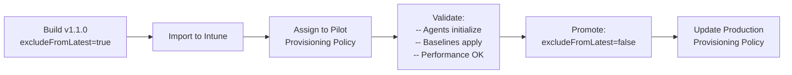

## Chapter 16: Image Versioning and Staged Rollout

### Versioning Convention

ACG (Azure Compute Gallery) image versions follow `Major.Minor.Patch` semantics:

| Version Component | Meaning | Example | Triggers reprovision? |
|---|---|---|---|
| **Major** | Base OS change or breaking toolchain change | Windows 11 24H2 -> 25H2 | No |
| **Minor** | Monthly rebuild with updated agents and patches | New OpenClaw version | No |
| **Patch** | Hotfix for a specific issue | Critical security patch | No |

> **Note:** Version promotion has no effect on existing Cloud PCs. Newly provisioned machines use the latest assigned version; existing machines retain the version they were provisioned with. See Chapter 18 for the operational decisions around moving existing machines.

### The excludeFromLatest Flag

When you publish a new image version, set `excludeFromLatest=true` initially. This is a governance signal, not a technical lock.

> **💡 Tip:** Windows 365 does not auto-consume the "latest" version from your gallery. When you import a custom image in Intune, you manually select a specific version. The `excludeFromLatest` flag doesn't prevent Windows 365 from seeing the version; it's a gallery-level governance signal for your team.

> **Note:** Promoting a new version in ACG does not affect existing Cloud PCs. New Cloud PCs provisioned after the promotion use the new version. To move an existing Cloud PC to a new version, it must be reprovisioned — a destructive operation that replaces the Cloud PC's disk. See Chapter 18 for the reprovisioning decision framework.

### The Staged Rollout Workflow




```powershell
# Step 1: Build the canary version
terraform apply `
  -var='image_version=1.1.0' `
  -var='exclude_from_latest=true'
```

Step 2 — import the image into Intune and test with your pilot provisioning group — is covered in Chapter 17.

```powershell
# Step 3: After validation, promote
terraform apply `
  -var='image_version=1.1.0' `
  -var='exclude_from_latest=false'
```

---

