## Chapter 21: CI/CD Pipeline Integration

### When Manual Builds Aren't Enough

The manual `terraform apply` workflow described in this book works well for small teams and initial deployments. But as your image matures (monthly rebuilds aligned with Patch Tuesday, version bumps across nine pinned packages, multi-region replication), the manual workflow becomes a bottleneck and an error source.

This section outlines how to move the image build into a CI/CD pipeline. The core Terraform and PowerShell scripts don't change; what changes is *who runs them* and *what triggers them*.

### Pipeline Architecture

```mermaid
graph LR
    PR[PR: Bump versions<br/>in terraform.tfvars] --> REVIEW[Code Review]
    REVIEW --> MERGE[Merge to main]
    MERGE --> PLAN[CI: terraform plan<br/>+ artifact upload]
    PLAN --> APPROVE[Manual Approval Gate]
    APPROVE --> APPLY[CD: terraform apply<br/>-> AIB Build ~90 min]
    APPLY --> VERIFY[Post-Build Verification<br/>-> Check ACG version]
    VERIFY --> TEARDOWN[Teardown Build Resources]
    TEARDOWN --> NOTIFY[Notify: Image ready<br/>for Intune import]
```




### Key Design Decisions

**Trigger on merge to `main`, not on push.** Image builds are expensive (60--90 minutes of compute) and produce artefacts that may be consumed by production Cloud PCs. They should only run after code review, not on every feature branch push.

**Manual approval gate before `terraform apply`.** The `terraform plan` output should be reviewed by a human before the build starts. This is the last chance to catch a misconfigured version pin or an unintended source image change. In GitHub Actions, use an `environment` with required reviewers. In Azure DevOps, use an approval gate on the release stage.

**Long-running job support.** The AIB build takes 60--90 minutes. Most CI/CD runners have default timeouts of 30--60 minutes. Configure the build step with a timeout of at least 150 minutes (matching the Terraform timeout).

**Service principal authentication.** The pipeline authenticates to Azure using a service principal or workload identity federation (OIDC), not a personal account. The service principal needs the same RBAC permissions as the manual operator: `Contributor` on the resource group (or the four granular roles described in Chapter 5) plus the ability to trigger AIB builds.

**State management.** Move from the local backend to an Azure Storage backend with state locking:

```hcl
terraform {
  backend "azurerm" {
    resource_group_name  = "rg-terraform-state"
    storage_account_name = "stw365clawstate"
    container_name       = "tfstate"
    key                  = "w365claw.tfstate"
  }
}
```

This prevents concurrent builds from corrupting state and provides an audit trail of state changes.

### GitHub Actions Example

```yaml
name: Build W365 Developer Image

on:
  push:
    branches: [main]
    paths:
      - 'terraform/**'
      - 'scripts/**'

permissions:
  id-token: write   # OIDC federation
  contents: read

jobs:
  plan:
    runs-on: ubuntu-latest
    steps:
      - uses: actions/checkout@v4

      - uses: hashicorp/setup-terraform@v3
        with:
          terraform_version: "1.9.x"

      - name: Azure Login (OIDC)
        uses: azure/login@v2
        with:
          client-id: ${{ secrets.AZURE_CLIENT_ID }}
          tenant-id: ${{ secrets.AZURE_TENANT_ID }}
          subscription-id: ${{ secrets.AZURE_SUBSCRIPTION_ID }}

      - name: Terraform Init
        working-directory: terraform
        run: terraform init

      - name: Terraform Plan
        working-directory: terraform
        run: terraform plan -var-file="terraform.tfvars" -out=tfplan

      - name: Upload Plan
        uses: actions/upload-artifact@v4
        with:
          name: tfplan
          path: terraform/tfplan

  build:
    needs: plan
    runs-on: ubuntu-latest
    environment: production  # Requires manual approval
    timeout-minutes: 150
    steps:
      - uses: actions/checkout@v4

      - uses: hashicorp/setup-terraform@v3
        with:
          terraform_version: "1.9.x"

      - name: Azure Login (OIDC)
        uses: azure/login@v2
        with:
          client-id: ${{ secrets.AZURE_CLIENT_ID }}
          tenant-id: ${{ secrets.AZURE_TENANT_ID }}
          subscription-id: ${{ secrets.AZURE_SUBSCRIPTION_ID }}

      - name: Download Plan
        uses: actions/download-artifact@v4
        with:
          name: tfplan
          path: terraform

      - name: Terraform Init
        working-directory: terraform
        run: terraform init

      - name: Terraform Apply
        working-directory: terraform
        run: terraform apply -auto-approve tfplan

      - name: Verify Image Version
        working-directory: terraform
        run: |
          IMAGE_VERSION=$(terraform output -raw image_version 2>/dev/null || echo "unknown")
          echo "✅ Image version $IMAGE_VERSION published to ACG"

      - name: Teardown Build Resources
        working-directory: terraform
        run: |
          terraform destroy \
            -target="module.image_builder" \
            -var-file="terraform.tfvars" \
            -auto-approve
```

### Azure DevOps Pipeline

The same workflow translates to Azure DevOps with a multi-stage YAML pipeline:

- **Stage 1: Plan**: runs on every commit to `main`, produces the plan artefact
- **Stage 2: Build**: gated by manual approval, runs `terraform apply`, waits for AIB completion
- **Stage 3: Teardown**: runs automatically after build, cleans up AIB resources
- **Stage 4: Notify**: sends a Teams notification or email that the new image version is ready for Intune import

The critical difference from GitHub Actions is authentication: Azure DevOps uses a **service connection** configured with a service principal or managed identity, rather than OIDC federation.

### What the Pipeline Cannot Do

The pipeline ends at "image version published to ACG." The following steps remain manual:

1. **Import into Windows 365**: No public API exists for importing ACG images into Intune's custom image gallery
2. **Update provisioning policy**: Selecting the new image version in the provisioning policy is a portal operation
3. **Reprovision Cloud PCs**: Triggering reprovisioning for existing Cloud PCs requires admin action

When Microsoft provides Graph API support for custom image import, the pipeline can be extended to automate the full lifecycle. Until then, the pipeline's job is to ensure a validated, verified image version is available in ACG and ready for an administrator to pick up.

> **💡 Tip:** Use the pipeline's notification step to send a message (Teams, email, Slack) with the exact image version, a summary of what changed (version bumps, security patches), and a link to the Intune custom image import page. This reduces the manual step to a single click.

---

