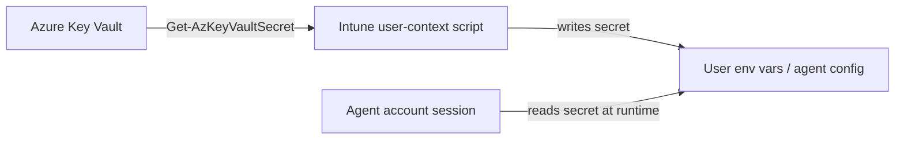

## Chapter 23: API Key Delivery

### Why Never Bake Secrets

Hardcoding API keys into the image is a severe security vulnerability:

- Every Cloud PC provisioned from the image would share the same key
- The key would be visible in the image's file system to anyone who can mount the VHD
- Rotating the key would require a new image build and reprovisioning
- If the key is compromised, every Cloud PC is affected

### Manual API Key Configuration

For the initial deployment, API keys are configured **manually by the developer** after first login. This is intentional; it avoids the complexity and security risk of automated key distribution, and it ensures each developer is using their own credentials.

**For Claude Code:** The developer runs `claude login` from a terminal and follows the browser-based authentication flow to obtain their API token. This stores the token in the user's local profile.

**For OpenClaw:** The developer sets their `ANTHROPIC_API_KEY` as a user environment variable:

```powershell
[Environment]::SetEnvironmentVariable("ANTHROPIC_API_KEY", "<your-key>", "User")
```

**For MCP servers** (Perplexity, Jira, etc.): The developer sets the appropriate environment variables referenced in the `mcporter.json` template:

```powershell
[Environment]::SetEnvironmentVariable("PERPLEXITY_API_KEY", "<your-key>", "User")
```

The MCP configuration template uses placeholder values (e.g., `__PERPLEXITY_API_KEY__`). These placeholders are referenced via environment variable expansion at runtime; the MCP server reads `$env:PERPLEXITY_API_KEY`, not the literal placeholder string. No string replacement is needed in the configuration file itself.

> **💡 Tip:** For teams that need centralized key management in the future, consider Intune remediation scripts that read from Azure Key Vault, or a self-service portal where developers can retrieve approved API keys. The manual approach described here is the simplest starting point and avoids storing secrets in Intune configuration profiles.

> **⚠️ Warning:** On Windows 11, user-level environment variables are stored in the registry and are readable by any process running under that user's security context. For high-value secrets, consider using Windows Credential Manager or Azure Key Vault integration.

### Post-Provisioning Agent Delivery (Intune)

In the **user-installed model**, all npm-based tooling — AI agents, OpenSpec, and MCP servers — is delivered **after** the Cloud PC is provisioned via **Intune Win32 app packages** targeted per-user. This provides install state detection, retries, controlled versioning, and a clear dependency ordering.

**Delivery tiers:**

| Package | Intune Assignment | Rationale |
|---|---|---|
| OpenClaw | **Required** (per-user) | Core agent; must be present on every developer Cloud PC |
| Claude Code | **Required** (per-user) | Core agent; must be present on every developer Cloud PC |
| Codex CLI | **Required** (per-user) | Core agent; must be present on every developer Cloud PC |
| OpenSpec | **Required** (per-user) | Development workflow tooling; needed alongside agents |
| MCP servers (Perplexity, Jira, etc.) | **Available** (per-user) | Optional; developers install from Company Portal on demand |

**Why this ordering matters:** MCP servers depend on the AI agents being present — they are invoked by agents at runtime and their configuration references agent workspace paths. By making agents and OpenSpec **required** and MCP servers **available**, Intune ensures the foundation is in place before optional integrations are added. Developers choose which MCP servers they need from the Company Portal, avoiding unnecessary installs and reducing the attack surface.

**Operational guidance:**

- Target the Cloud PC device group or a dedicated agent user group.
- Run installs in **user context** so npm global packages land in the correct user profile.
- Keep the **image build clean**: only runtimes (Node.js, Python) and baseline tooling in the image.
- Pin versions in the Intune payload to keep developer environments consistent.

**Detection method guidance (Win32):**

- Prefer **version-based detection** using the CLI output:
  - `openclaw --version`
  - `claude --version`
  - `codex --version`
  - `openspec --version`
- Return **non-zero** when the version does not match the pinned version to trigger remediation.
- Avoid file-path detection alone; npm global paths can vary by user profile.
- If you must use file-based detection, use the **npm global bin path** from the user context and validate the executable exists and runs.
- Keep detection scripts **idempotent** and **fast** to avoid repeated install loops.

**Example detection script (PowerShell, user context):**

```powershell
$expected = @{
    openclaw = "2026.2.14"
    claude   = "2.1.42"
    codex    = "0.101.0"
    openspec = "0.9.1"
}

function Get-CmdVersion([string]$cmd) {
    $v = & $cmd --version 2>$null
    if (-not $v) { return $null }
    return ($v -replace '[^0-9\.]','').Trim()
}

foreach ($k in $expected.Keys) {
    $ver = Get-CmdVersion $k
    if (-not $ver -or $ver -ne $expected[$k]) { exit 1 }
}

exit 0
```

### Azure Key Vault Delivery Flow (Enterprise)

When you need centralized control over API keys, the recommended approach is to store secrets in **Azure Key Vault** and deliver them **post-provisioning** via an Intune user-context script. This preserves the "never bake secrets" rule while providing auditability and rotation.

**High-level flow:**

1. **Store secrets in Key Vault** (one key per provider, environment, or team).
2. **Grant the agent identity access** to read the specific secrets (least privilege).
3. **Deploy an Intune user-context script** that:
   - Authenticates to Azure (Az module).
   - Retrieves the secret from Key Vault.
   - Writes it to the required location (environment variable or agent config).
4. **Rotate keys** in Key Vault and re-run the script to update live Cloud PCs.

**Design notes:**

- Use **separate Key Vaults or secret namespaces** for dev, test, and prod to reduce blast radius.
- Prefer **user-context** delivery so secrets are scoped to the agent account session, not the machine.
- Keep **all secret retrieval** out of the image build; treat it as a post-provisioning concern.



**Key Vault delivery checklist:**

- [ ] Key Vault created in the same region or paired region as the Cloud PC.
- [ ] Secret names match the variables or agent auth profile entries.
- [ ] Agent identity granted `get` and `list` permissions only.
- [ ] Intune script runs in **user context** and logs success/failure.
- [ ] Secret rotation runbook documented and tested.

### Configuring OpenClaw Memory Search

OpenClaw's memory system (`MEMORY.md` and `memory/*.md` files) supports semantic search, allowing the agent to search its own notes by meaning rather than exact keyword matches. This requires an **embedding model API key** from a supported provider: OpenAI, Google, or Voyage AI.

Without this key, OpenClaw still functions normally, but `memory_search` calls will fail. The agent falls back to reading memory files directly, which works but lacks the ability to find relevant context across large memory stores.

**To configure memory search**, the developer adds an embedding provider key to the agent's auth profile. The recommended provider is OpenAI (`text-embedding-3-small`), which costs approximately $0.02 per million tokens, effectively negligible for memory search usage.

```powershell
openclaw agents auth add main --provider openai --token sk-your-openai-api-key
```

This writes the key to the agent's `auth-profiles.json` file (typically `~/.openclaw/agents/main/agent/auth-profiles.json`). The key is used exclusively for embedding generation and does not affect which model OpenClaw uses for conversation, which is controlled by the Anthropic API key.

> **💡 Tip:** If the CLI command fails silently (which can happen on some Windows configurations), the key can be added manually by editing `auth-profiles.json` directly:
>
> ```json
> {
>   "version": 1,
>   "profiles": {
>     "anthropic:default": {
>       "type": "token",
>       "provider": "anthropic",
>       "token": "sk-ant-..."
>     },
>     "openai:default": {
>       "type": "token",
>       "provider": "openai",
>       "token": "sk-proj-..."
>     }
>   }
> }
> ```

> **💡 Tip:** The OpenAI API key is obtained from [platform.openai.com/api-keys](https://platform.openai.com/api-keys), not from ChatGPT. The API is pay-as-you-go with separate billing from any ChatGPT subscription. A payment method must be added at [platform.openai.com/settings/organization/billing/overview](https://platform.openai.com/settings/organization/billing/overview).

**Why this is a post-provisioning task:** The embedding API key is a per-developer (or per-team) credential. Different teams may use different embedding providers, and some organizations may choose not to enable memory search at all. Baking a shared key into the image would violate the "never bake secrets" principle and remove the flexibility to configure per-developer.

**For enterprise deployment**, consider including the `openclaw agents auth add` command in your post-provisioning checklist or Intune remediation script, reading the OpenAI API key from Azure Key Vault:

```powershell
# Example: Retrieve from Key Vault and configure (requires Az module + appropriate permissions)
$openaiKey = Get-AzKeyVaultSecret -VaultName "kv-w365-dev" -Name "openai-embedding-key" -AsPlainText
openclaw agents auth add main --provider openai --token $openaiKey
```

---

