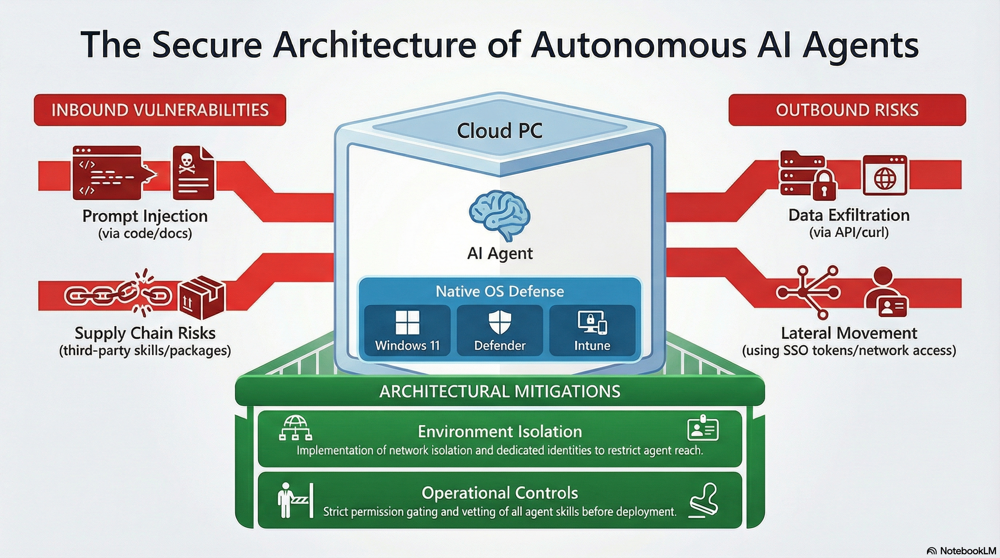

# Part VI: Security

---

## Chapter 26: The Agent Threat Model

### The Autonomous Insider

The integration of agentic AI into enterprise development environments represents a fundamental architectural shift. Tools like Claude Code and OpenClaw possess **agency**, the capability to formulate multi-step plans, execute shell commands, manipulate file systems, interact with network endpoints, and manage persistent memory without continuous human intervention.

When deployed on Windows 365 Cloud PCs, these agents operate behind the corporate firewall, often inheriting the full trust, identity, and privileges of the user under whose context they execute. This creates an "inside-out" risk profile where the perimeter is bypassed not by external penetration, but by the authorized execution of an agent that may be compromised via prompt injection, supply chain poisoning, or misconfiguration.

### Claude Code vs OpenClaw: Risk Profiles

| Characteristic | Claude Code | OpenClaw |
|---|---|---|
| **Architecture** | Governed, reactive | Autonomous, persistent |
| **Execution Model** | CLI invoked per task | Background service/gateway |
| **Permission Model** | Permission-gated (ask/allow/deny) | Full user context by default |
| **Extension Ecosystem** | MCP servers (curated) | Skills/ClawHub (uncurated) |
| **Supply Chain Risk** | Low (Anthropic-published npm package) | **High** (ClawHavoc, 12% malicious skills) |
| **Memory Persistence** | Session-scoped | Long-term (SOUL.md, MEMORY.md) |
| **Network Exposure** | Outbound API calls only | WebSocket server, REST API |
| **Primary Threat** | Prompt injection -> shell execution | Supply chain -> malware delivery |

**Claude Code** represents the "governed" approach. It operates in a reactive mode, analyzing codebases and suggesting changes that require user confirmation. Its reliance on the host OS shell introduces specific Windows vulnerabilities (WebDAV bypass, environment variable exposure), but its permission system provides meaningful defense-in-depth.

**OpenClaw** represents the "autonomous" approach. It runs as a persistent background service with long-term memory, community-driven skills, and multi-channel integration. Its reliance on the uncurated ClawHub marketplace makes it a high-risk asset requiring Zero Trust deployment.

---

