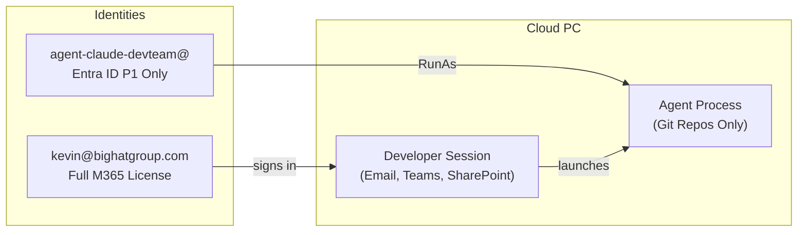
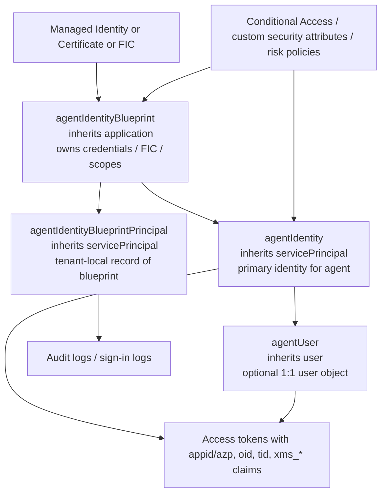

## Chapter 27: Identity Architecture -- The Secondary User Imperative

### Why Primary User Identity Fails

Running autonomous agents under the primary user's interactive identity (e.g., `CORP\JSmith`) introduces three fatal security flaws:

**1. Identity Conflation and Non-Repudiation.** In all Windows Event Logs, Entra ID sign-in logs, and audit trails, actions performed by the agent are attributed to the human user. If OpenClaw executes a destructive command, the logs show JSmith as the perpetrator. Security teams cannot distinguish between a malicious insider, a compromised account, or a rogue AI agent.

**2. Excessive Privilege Inheritance.** A human user accumulates privileges over time: access to legacy file shares, HR portals, financial systems. An agent running as that user inherits this entire accumulated privilege set. An AI coding assistant needs access to a specific Git repository; it does not need access to the user's email, payroll data, or the CEO's calendar.

**3. SSO Exploitation.** If an agent running in the primary user's session is compromised via prompt injection, the attacker gains access to the user's active SSO tokens (Primary Refresh Token). The attacker can access other corporate resources (SharePoint, Teams, Salesforce) without triggering MFA, as the session is already trusted.

### The Recommended Architecture




### Identity Options

| Feature | Secondary Entra ID User | Entra Agent ID (Preview) | Local Standard User |
|---|---|---|---|
| **Description** | Standard cloud-only Entra ID account | Specialized identity for AI agents | Local Windows account |
| **Use Case** | Interactive & Cloud access | Autonomous background agents | Strictly local operations |
| **Authentication** | Password + MFA (FIDO2) | Certificate-based | Local password |
| **Auditability** | High -- Entra ID sign-in logs | Very High -- explicit Agent ID logs | Low -- local only |
| **Intune Management** | Full | Full | Limited |
| **Cost** | Requires licence (M365 F3 or Entra P1) | Usage-based (preview) | Free |

### Microsoft Entra Agent ID

**Entra Agent ID reached General Availability in April 2026.** It is now the recommended identity model for production AI agent deployments and is the recommended migration target from the secondary user pattern described below. This section covers the technical architecture, GA Conditional Access templates, lifecycle governance, and migration sequencing.

Entra Agent ID is an identity and authorization framework designed specifically for AI agents operating in enterprise environments, extending Zero Trust principles — authentication, authorization, governance, lifecycle management, and security controls — to non-human identities using standard protocols (OAuth 2.0, MCP, A2A). It is available to all Microsoft Entra customers; features requiring Entra ID Protection risk signals require P2 licensing.

**Licensing:** Agent ID is included in **Microsoft Agent 365** ($15/user/month) and in **Microsoft 365 E7** ($99/user/month, GA May 2026). The secondary Entra ID user approach documented earlier in this chapter remains valid and is still the appropriate choice when Agent 365 licensing is not yet available to your tenant, or when you require Entra ID features (Exchange, SharePoint) beyond what Agent ID exposes.

> **Note on admin center:** The Agent registry and Agent collections blades in the Entra admin center were retired on 1 May 2026. Agent management is now consolidated in **Microsoft Agent 365**, which serves as the unified registry and control plane. Microsoft Entra continues to provide the identity foundation through Agent ID objects and APIs.

Until Entra Agent ID was GA, the recommended interim approach was to provision **Secondary Entra ID Users** for agents. That approach remains valid for organizations not yet licensed for Agent 365. It provides immediate segregation and auditability using GA-supported primitives, and the identity is not tied to the Cloud PC — a developer can use the same secondary agent account from their local development machine to authenticate to Azure CLI, Azure DevOps, or any Entra-integrated service.

#### The Four-Object Data Model

Agent ID is not a parallel directory — it is an agent-aware specialization of existing Entra object families. Microsoft Graph exposes four core resource types:

| Object | Inherits from | Role |
|--------|--------------|------|
| `agentIdentityBlueprint` | `application` | Template and credential anchor; holds managed identity/Federated Identity Credentials (FIC)/client credentials |
| `agentIdentityBlueprintPrincipal` | `servicePrincipal` | Tenant-local record of the blueprint; exposes app roles and delegated scopes |
| `agentIdentity` | `servicePrincipal` | Primary identity for the running agent; holds no credentials itself |
| `agentUser` | `user` | Optional 1:1 user object for systems that require a user, not a service, identity |



The administrative model adds **owners** (technical administrators), **sponsors** (business accountability), and optionally **managers** (for agent user scenarios). Microsoft explicitly positions these as part of agent lifecycle governance, which is why Agent ID is materially different from a plain service principal.

#### Identifier Architecture

A critical detail: for an `agentIdentity`, Microsoft documents that **`id` and `appId` are the same value**. This is a deliberate departure from the classic application/service-principal model, where the application object's `id` (tenant-scoped) differs from its `appId` (globally unique client ID). For agent identities specifically, Microsoft collapses them to simplify agent attribution.

| Identifier | Property / claim | Scope | Notes |
|-----------|-----------------|-------|-------|
| Agent identity "ID" | `agentIdentity.id` = `agentIdentity.appId` | Tenant | The closest thing to an "agent ID" — but both properties hold the same value for `agentIdentity` objects specifically |
| Object ID | `id` | Tenant | For classic apps/SPs, differs from `appId`; for `agentIdentity`, equals `appId` |
| Application / client ID | `appId` | Global | The globally unique client identifier; used in token `appid`/`azp` claims |
| Tenant ID | `tenantId` / token `tid` | Tenant | Identifies the Entra tenant, not the agent |
| Principal ID | `properties.principalId` | ARM | Service-principal object ID for managed identities; use for RBAC; use `clientId` in app code |
| Blueprint parent ref | `agentIdentityBlueprintId` on `agentIdentity` | — | See warning below |
| Agent-user parent ref | `identityParentId` on `agentUser` | — | Stores the parent agent identity's **object ID** |

> **Warning:** The `agentIdentityBlueprintId` property on an `agentIdentity` stores the parent blueprint's **`appId`**, not the blueprint object's `id`. If you store only object IDs and later try to correlate child agent identities by `agentIdentityBlueprintId`, you will get mismatches. Always translate to `appId` when navigating the blueprint-to-identity relationship.

#### Token Claims

Agent tokens use standard Entra claims plus agent-specific extension claims. There is no dedicated `agent_id` JWT claim — agent semantics are carried in `xms_*` fact claims:

| Claim | Value | Meaning |
|-------|-------|---------|
| `xms_sub_fct` | `11` | Subject is an `agentIdentity` (autonomous flow) |
| `xms_sub_fct` | `13` | Subject is an `agentUser` (delegated/user-required flow) |
| `xms_act_fct` | `11` | Actor is an `agentIdentity` |
| `xms_par_app_azp` | blueprint `appId` | Parent application attribution — useful for **audit logging only**, not for authorization decisions |
| `idtyp` | `app` | Autonomous agent identity token (app-only) |
| `idtyp` | `user` | Agent user token (user-like subject) |

A token for an autonomous agent identity looks like:

```json
{
  "tid": "00000001-0000-0ff1-ce00-000000000000",
  "idtyp": "app",
  "appid": "aaaaaaaa-1111-2222-3333-444444444444",
  "oid":   "aaaaaaaa-1111-2222-3333-444444444444",
  "xms_act_fct": "11",
  "xms_sub_fct": "11",
  "aud": "f2510d34-8dca-4ab8-a0bc-aaec4d3a3e36"
}
```

Note that `appid` and `oid` are the same value — consistent with the data model above. When the subject switches to an agent user, `idtyp` becomes `user`, `oid` becomes the agent user's object ID, and `xms_sub_fct` shifts to `13`.

**Authorization guidance:** Validate `aud`, `tid`, `iss`, signature, and expiry as normal. Authorize on `oid`, `appid`/`azp`, and Graph relationships. Do not use `xms_par_app_azp` for authorization — Microsoft explicitly says this could inadvertently grant broad access to all agents under the same parent blueprint.

#### Credential Architecture

Agent identities themselves hold **no credentials**. The blueprint is the credential anchor. This shifts credential management upward to the blueprint layer, which is better for rotation, policy, and governance. The blueprint then issues tokens to child agent identities via the `fmi_path` parameter in the token request.

Microsoft's recommended credential types for the blueprint, in order of preference:

1. **Managed identity** (system- or user-assigned) — no secret rotation required
2. **Federated Identity Credentials (FIC)** — OIDC trust to an external identity provider
3. **Client certificate** — acceptable; requires rotation management
4. **Client secret** — explicitly not recommended for production

#### Migration Path from Secondary Users

Agent ID is now GA. The migration from secondary Entra ID users is architecturally straightforward because the underlying controls are the same primitives:

| Secondary user model | Agent ID equivalent |
|---------------------|-------------------|
| Cloud-only Entra ID user account | `agentIdentity` (inherits `servicePrincipal`) |
| Conditional Access policy targeting agent user account | Conditional Access policy targeting `agentIdentity` or its parent blueprint |
| RBAC / app-role assignments on the agent account | App-role assignments on the `agentIdentity` |
| `az login --username agent-claude@...` | Blueprint token → `fmi_path` exchange → agent identity token |
| Sign-in log filter by `SubjectUserName has "agent"` | Sign-in log filter by `agent/agentType eq 'AgentIdentity'` (see Chapter 33) |
| Sponsor/manager tracked out-of-band | `sponsors@odata.bind` and `owners@odata.bind` on the blueprint |

The practical migration sequence: create the blueprint and agent identity in parallel with the existing secondary user account, validate token flows and Conditional Access behavior in a test tenant, then cut over by replacing `az login` credential configuration with the blueprint-to-agent-identity exchange pattern. The secondary user account can remain as a fallback during transition.

### Operational Workflow

The following operational workflow applies to the standard secondary account pattern (Option 2) recommended for production deployments.

#### Setting Up the Agent Account

1. **Create a cloud-only user** in Entra ID (e.g., `agent-claude-teamA@bighatgroup.com`). Use a naming convention that makes agent accounts immediately identifiable in audit logs.
2. **Assign a minimal licence.** Entra ID P1 or M365 F3, enough for Entra join and Conditional Access, but no Exchange Online, Teams, or SharePoint.
3. **Scope access.** Grant access only to specific Azure DevOps projects, GitHub repositories, or Azure resource groups. Use Entra ID security groups to manage this at scale (e.g., `SG-AgentAccess-TeamA-Repos`).
4. **Configure Conditional Access.** Create a policy targeting the agent account that restricts sign-in to compliant devices and blocks access to non-development resources.
5. **Add to the Windows 365 provisioning policy (Options 2 and 3).** Include the agent account (or its security group) in the same provisioning policy that uses your custom image. The agent account gets its own Cloud PC, provisioned from the same image.

#### The Developer Experience

**Options 2/3: Dedicated agent Cloud PC (recommended for autonomous workflows):**

The developer has two Cloud PCs in their Windows 365 portal:

| Cloud PC | Signed In As | Purpose |
|----------|-------------|---------|
| Primary | `kevin@bighatgroup.com` | Email, Teams, SharePoint, interactive development |
| Agent | `agent-kevin@bighatgroup.com` | Agent-assisted coding, autonomous tasks |

The developer connects to the agent Cloud PC when they want to run extended agent sessions. Because the agent account has no access to email, HR systems, or financial tools, a compromised agent is limited to the developer's code repositories.

### Local Administrator: The Case for Giving Developers the Keys

This will be controversial in some organizations, but for AI agent developer Cloud PCs, **granting local administrator privileges to the user account is the recommended configuration.**

Here's why: AI coding agents are, by design, tools that install packages, compile software, run build systems, and modify system-level configuration. A developer using Claude Code to scaffold a new project will need `npm install`, `pip install`, `dotnet tool install`, and occasionally `winget install`. An agent debugging a Docker issue needs to restart the Docker service. An agent setting up a development database needs to modify Windows Firewall rules.

Locking the developer (and by extension, the agent) out of administrative operations creates constant friction: the agent hits a permissions wall, the developer files a helpdesk ticket, the helpdesk escalates to IT, IT pushes an Intune script that arrives 45 minutes later. This workflow is antithetical to the entire purpose of autonomous coding agents.

**The risk calculus changes when the Cloud PC is network-isolated.** A local administrator on a Cloud PC that:

- Has **no access to the corporate LAN** (RFC 1918 ranges blocked outbound; see Chapter 30)
- Is on an **isolated Microsoft network** with no line-of-sight to on-premises resources
- Has **default deny outbound** with only allowlisted endpoints (Anthropic API, GitHub, npm registry)
- Is **enrolled in Defender for Endpoint** with Attack Surface Reduction rules active (Chapter 31)
- Uses a **dedicated agent account** (not the user's primary corporate account)

...is a fundamentally different risk from a local administrator on a domain-joined laptop sitting on the corporate network. The blast radius is contained. A compromised agent with local admin on this Cloud PC cannot pivot to the domain controller, cannot access file shares, cannot reach the HR system. It can damage the Cloud PC itself, which can be reprovisioned from the image in minutes.

#### Configuring Local Admin via Windows 365

Windows 365 provisioning policies control whether the user is a local administrator:

1. In the **Intune admin centre**, navigate to **Devices > Windows 365 > Provisioning policies**
2. Edit the provisioning policy for your developer image
3. Under **Additional settings**, set **Local admin** to **Enabled**

This grants the provisioned user local administrator rights on their Cloud PC.

#### The Dedicated Account Makes This Safe

The critical enabler is the **dedicated agent account** from the isolated model. Consider the risk matrix:

| Scenario | Local Admin | Network Isolated | Dedicated Account | Risk Level |
|----------|------------|-----------------|-------------------|------------|
| Primary user on corporate network | ✅ | ❌ | ❌ | 🔴 **Critical** -- compromised agent has admin + corporate access + user's full identity |
| Primary user, network isolated | ✅ | ✅ | ❌ | 🟡 **Medium** -- blast radius contained, but agent actions attributed to the human |
| Dedicated account, network isolated | ✅ | ✅ | ✅ | 🟢 **Low** -- contained blast radius, scoped permissions, clean audit trail |
| Standard user, network isolated | ❌ | ✅ | ✅ | 🟢 **Low** -- maximum restriction, but constant friction for agent workflows |

The sweet spot is **dedicated account + network isolated + local admin**. The agent can do its job without friction, the network prevents lateral movement, the dedicated identity prevents privilege inheritance from the human, and reprovisioning resets the machine to a known-good state.

#### The Licensing Reality

Every user and every agent account requires a **minimum base licence stack of Entra ID P1 + Windows 365 Enterprise + Intune device management**. The developer typically holds a full **Microsoft 365 E3** (~$36/user/month, which includes Entra ID P1 and Intune device management — sufficient for all agent identity and device policy requirements in this book) plus **Windows 365 Enterprise**. The agent account options layer on top of this.

**Option 2 (base stack, no M365 E3):** Each agent account needs:

- A standalone **Entra ID P1** licence (~$6/user/month)
- A standalone **Intune P1** licence (~$8/user/month)
- A **Windows 365 Enterprise** licence (varies by SKU, from ~$31/month for 2 vCPU/4 GB to ~$123/month for 8 vCPU/32 GB; recommended: 4 vCPU/16 GB at $66/month)

The agent account does not need M365 E3 because it has no email, Teams, SharePoint, or Office apps.

**Option 3 (full M365):** Each agent account needs:

- A **Microsoft 365 E3** licence (~$36/user/month, includes Entra ID P1 and Intune device management; the bundled Intune capability is sufficient for this deployment and is not marketed as a separate "Intune P1" licence)
- A **Windows 365 Enterprise** licence for the agent's own Cloud PC

Option 3 is for scenarios where the agent needs to authenticate independently to Microsoft 365 services (Graph API, Teams channels, SharePoint document libraries). The incremental cost over Option 2 is the difference between standalone Entra P1 + Intune P1 and a full M365 E3 licence.

For a team of 10 developers, the incremental cost of Options 2 or 3 is approximately $8,000--$12,000/year depending on the SKU. This is a rounding error compared to the cost of a security incident where a compromised agent with the developer's primary identity exfiltrates source code or accesses sensitive systems.

> **💡 Tip:** The recommended Cloud PC SKU for AI agent workloads is 4 vCPU / 16 GB ($66/user/month). While agents are primarily I/O bound (API calls, file reads), the additional headroom is needed for concurrent agent processes, npm operations, and local language server indexing. A 2 vCPU / 8 GB SKU ($41/user/month) can work for lightweight, single-agent use cases but may constrain heavier workflows.

#### When Standard User Is Appropriate

Not every scenario needs local admin. If the AI agents are used purely for:

- Code review and analysis (read-only)
- Documentation generation
- Chat-based Q&A about the codebase

...then a standard user account is appropriate. The agents don't need to install packages or modify system configuration for these workflows. Reserve local administrator for **active development** scenarios where the agent is building, testing, and deploying code.

---

### Threat Defense: Token Theft and PRT Hijacking

Chapter 26 identified SSO token exploitation as one of the three fatal flaws of running agents under primary user identity. This section operationalizes the defense.

#### The PRT Threat

The **Primary Refresh Token (PRT)** is a long-lived credential stored in the Windows Trusted Platform Module (TPM) or the browser session, used to silently acquire access tokens for all Entra ID-integrated applications without re-prompting for MFA. When an agent executes in the primary user's session, the PRT is accessible to any process running in that context.

Token theft accounted for **31% of Microsoft 365 breaches in 2025**, surpassing traditional credential compromise as the primary attack vector. Advanced infostealers (Lumma, RedLine) are explicitly designed to extract PRTs from the Local Security Authority (LSASS) or browser memory. Nation-state actor **Storm-2372** was documented in 2025 using PRT escalation techniques to maintain persistent access after password resets — because the PRT stores the MFA claim, an attacker with a stolen PRT bypasses both password and MFA controls for the lifetime of the token.

**Device Code Phishing** — a technique that surged 89% in early 2026 — abuses the OAuth device code flow to trick users or agents into authorizing attacker-controlled applications, yielding a refresh token that persists even after the user changes their password.

#### Why the Secondary Account Model Mitigates This

The agent's secondary Entra ID account (or Agent ID) operates in a separate Windows session, under a separate token context. Even if a prompt injection attack causes the agent to execute credential-dumping code:

- **The PRT it finds belongs to the agent account**, not the human user's corporate identity
- **The agent account has no MFA PRT** if you configure it with certificate-based authentication (recommended) — there is no PRT to steal
- **The agent account's access scope is limited** — even a successfully replayed token grants access only to the resources explicitly assigned to that account (specific Azure DevOps projects, GitHub repositories)

#### Entra ID Token Protection

Enable **Conditional Access token protection** on agent accounts to cryptographically bind access tokens to the specific device on which they were issued. A token stolen from the Cloud PC cannot be replayed from an attacker's machine:

1. In Entra admin center, navigate to **Protection > Conditional Access**
2. Create a new policy targeting the agent account or agent identity
3. Under **Session**, enable **Token protection (preview)**
4. Set **Sign-in frequency** to a short value (e.g., 4 hours) for agent accounts that do not require long-lived sessions

Token protection requires Entra ID P2 and is only effective on Windows clients with the TPM-backed credential stack. For agent accounts on Windows 365 Cloud PCs — which are always managed, always TPM-backed — this is the appropriate configuration.

---

### Conditional Access Policy Design for Agent Identities

Agents cannot satisfy interactive Conditional Access controls — they cannot respond to MFA prompts, CAPTCHA challenges, or browser-redirect flows. The Conditional Access architecture for agent identities must therefore rely on non-interactive signals: risk scores, named locations, IP ranges, device compliance, and attribute filters.

With Entra Agent ID GA, Microsoft provides **four purpose-built Conditional Access policy templates** for agent identities. Deploy them in this order:

#### Template 1: Block High-Risk Agent Identities (P2 Required)

This template blocks agent identities detected as high-risk by **Entra ID Protection**. It is the most important policy to deploy first — it is your automated kill switch for compromised agents.

**Configuration:**
1. In the Entra admin center, navigate to **Protection > Conditional Access > New policy from template**
2. Select **Block high-risk agent identities from accessing resources**
3. Under **Assignments > Users, agents, or workload identities**, select **Agents > All agent identities**
4. Under **Conditions > Agent risk**, set **Configure: Yes** and select **High** risk level
5. Under **Access controls > Grant**, select **Block access**
6. Enable the policy in **Report-only** mode first to baseline detections, then enforce

Entra ID Protection generates agent risk signals from: anomalous sign-in patterns, IP reputation, impossible travel, token replay indicators, and behavioral deviations.

#### Template 2: Restrict Autonomous Agent Access by Named Location

Restrict autonomous agent identities (those operating without a human in the loop) to sign in only from expected IP ranges — the Cloud PC subnet or the Windows 365 service IP ranges. An agent authenticating from an unexpected location is an indicator of token replay.

**Configuration:**
1. Create a **Named Location** containing the Windows 365 service IP ranges (retrieve from `https://www.microsoft.com/en-us/download/details.aspx?id=56519`, filter for `AzureCloud.{region}` and `WindowsVirtualDesktop`)
2. Create a CA policy targeting all agent identities
3. Under **Conditions > Locations**, set **Include: Any location**, **Exclude: Your named location**
4. Under **Access controls > Grant**, select **Block access**

#### Template 3: Conditional Access for On-Behalf-Of Agents

Agents that operate on behalf of a human user — sometimes called "digital workers" or "AI teammates" — carry delegated user context in their tokens. Apply specific controls to this flow to prevent privilege escalation via delegated scope.

Configure this policy to require that the delegating user account is compliant (device compliance + MFA satisfied) before the agent can acquire delegated tokens. This ensures the human approval step has been authenticated before the agent receives elevated permissions.

#### Template 4: Conditional Access for Agent User Accounts

For deployments using `agentUser` objects (the `user`-inheriting Agent ID object type for systems requiring a user identity rather than a service identity), apply standard user-facing Conditional Access with two modifications:
- **Disable interactive MFA** — replace with certificate-based or managed identity authentication
- **Enable sign-in frequency enforcement** — short-lived sessions (4 hours) to limit token replay windows

#### Attribute-Based Policy Targeting at Scale

As the number of deployed agents grows, maintaining per-agent CA policies becomes operationally unsustainable. Use **custom security attributes** and **blueprint-level targeting** to govern agent populations at scale:

**Custom security attribute approach:**
- Define a `DataSensitivity` attribute with values `Public`, `Internal`, `Confidential`, `Restricted`
- Assign each agent identity the appropriate value based on the data it accesses
- Create CA policies that evaluate `DataSensitivity eq 'Confidential'` as a filter condition — the policy automatically applies to all current and future agents with that attribute value

**Blueprint-level targeting:**
- Every `agentIdentity` is derived from an `agentIdentityBlueprint`
- Apply CA policy to the blueprint to automatically cover all derived agent identities, including ones provisioned after policy creation
- This is the recommended pattern for team-scoped agent deployments: create one blueprint per team/environment, apply controls at the blueprint level

---

### Agent Identity Lifecycle Governance

An AI agent's identity is not static. It must be provisioned with least-privilege access, monitored throughout its operational life, and deprovisioned when the agent is retired. Without lifecycle governance, agent identities accumulate "privilege debt" — the same problem that makes human service accounts a persistent audit finding.

#### Provisioning: The Sponsor Model

Every agent identity in Entra ID Governance requires a **human sponsor** — an accountable owner who is responsible for the agent's purpose, access scope, and lifecycle decisions. The sponsor relationship is enforced in the directory:

```
agentIdentityBlueprint
  → owners (technical administrators)
  → sponsors (business accountability)
```

If the sponsor's account is deleted or disabled (e.g., they leave the organization), sponsorship automatically transfers to their manager. This prevents orphaned agent identities — a common source of dormant privileged accounts in traditional IAM.

**Provisioning checklist for each agent identity:**
1. Create the `agentIdentityBlueprint` with named owners and sponsors
2. Assign custom security attributes (`DataSensitivity`, `AgentTeam`, `ReviewCycle`)
3. Apply Conditional Access policy at blueprint level
4. Grant access via **Entra ID Governance access packages** — time-bound, auditable, with approval workflows
5. Configure Entra ID Protection monitoring (requires P2)
6. Document in Agent 365 registry with purpose, owner, and review date

#### Access Packages: Time-Bound Access for Agents

Use **Entra ID Governance access packages** to grant agent identities access to resources:

- Access packages are time-bound (configurable expiry: 30/90/180 days)
- Require approval from the resource owner and the agent's sponsor
- Generate an automatic access review at expiry — the sponsor must re-approve or access is revoked
- Provide a complete audit trail of who granted what access, when, and why

This is materially different from direct role assignment: direct assignments are permanent until manually removed (and are frequently never removed). Access packages expire and require active renewal.

#### Access Reviews and the AI-Driven Review Agent

Entra ID Governance **access reviews** now include an AI-driven **Access Review Agent** that analyses agent identity access patterns and generates recommendations:

- Flags agent identities that have not used granted permissions in the review period (candidates for removal)
- Identifies privilege creep — agents accumulating permissions beyond their original purpose
- Surfaces risk signals from Entra ID Protection alongside the access data

Configure quarterly access reviews for all agent identities. For agents with access to `Confidential` or `Restricted` resources, monthly reviews are appropriate.

#### Deprovisioning: The Instant Kill Switch

Every agent identity must have a documented deprovisioning procedure that can be executed in under five minutes. When a compromised agent is detected:

1. **Immediate:** Revoke all tokens — **Entra admin center > Users/Agents > Revoke sessions** (or `Revoke-AzureADUserAllRefreshToken` for the service principal)
2. **Immediate:** Disable the agent identity in Entra ID (sets `accountEnabled: false`)
3. **Immediate:** Remove from all access packages — this revokes all downstream resource access
4. **Within 1 hour:** Rotate all client certificates or managed identity credentials associated with the blueprint
5. **Within 24 hours:** Review audit logs for all actions taken by the agent identity in the 30 days prior to compromise
6. **Within 48 hours:** Reprovision from a clean blueprint with scoped-down permissions if the agent workload needs to continue

The blueprint model provides a critical advantage: disabling or deleting the blueprint disables all derived agent identities simultaneously — a single administrative action neutralizes an entire class of agents.

---

### Workload Identity Federation: Eliminating Long-Lived Secrets

Both the secondary user model and Entra Agent ID introduce a credential management problem: agent accounts need to authenticate to Entra ID, which traditionally means a password or client secret that must be stored, rotated, and protected. Workload Identity Federation (WIF) eliminates this problem for CI/CD and automated pipeline scenarios.

#### How It Works

WIF establishes a trust relationship between Entra ID and an external identity provider (GitHub Actions, Azure Pipelines, Kubernetes, etc.). Instead of storing a long-lived secret, the agent workload:

1. Receives a short-lived **OIDC token** from its native platform (e.g., GitHub issues a JWT for the running workflow)
2. Presents the OIDC token to Entra ID's token endpoint
3. Entra ID validates the token against the external IdP's well-known OIDC configuration
4. Entra ID issues a short-lived Entra access token to the workload

**No client secrets are stored anywhere.** If an attacker intercepts the OIDC token, it expires within minutes. If they intercept the Entra access token, it has a short lifetime and is scoped to the specific resources granted to the agent identity.

#### GitHub Actions → Entra ID Pattern

This is the recommended authentication pattern for Claude Code or OpenClaw running in CI/CD pipelines:

```yaml
# .github/workflows/agent-pipeline.yml
permissions:
  id-token: write   # Required to request OIDC token from GitHub
  contents: read

jobs:
  agent-task:
    runs-on: ubuntu-latest
    steps:
      - uses: azure/login@v2
        with:
          client-id: ${{ secrets.AZURE_CLIENT_ID }}       # Agent identity's appId
          tenant-id: ${{ secrets.AZURE_TENANT_ID }}
          subscription-id: ${{ secrets.AZURE_SUBSCRIPTION_ID }}
          # No secret — authenticates via GitHub OIDC token exchange
```

**Federated credential configuration on the Entra agent identity / app registration:**
- **Issuer:** `https://token.actions.githubusercontent.com`
- **Subject:** `repo:bighatgroup/agent-pipelines:environment:production`
- **Attribute condition (CEL):** `assertion.repository == 'bighatgroup/agent-pipelines' && assertion.environment == 'production'`

> **Critical:** The attribute condition is the single most important security control. Without it, any GitHub Actions workflow in any repository could authenticate as your agent identity by specifying your client ID. Always restrict to specific repositories and environments.

#### When to Use WIF vs. Managed Identity

| Scenario | Recommended Auth | Reason |
|---|---|---|
| Agent runs on Windows 365 Cloud PC (Azure-hosted VM) | **Managed Identity** | Zero secrets, automatic rotation, tightly bound to the VM |
| Agent runs in GitHub Actions CI/CD | **Workload Identity Federation** | No Azure hosting; OIDC bridge is the only secretless option |
| Agent runs in Azure Container Apps | **Managed Identity** | Native Azure hosting |
| Agent runs on-premises or non-Azure VM | **Client Certificate** | Managed identity unavailable; certificate rotation manageable |
| Legacy/interim: no WIF or managed identity available | **Client Secret** | Last resort; rotate every 90 days; store in Azure Key Vault |

---

### Identity Attack Scenarios and Defenses

This section maps documented attack techniques from Chapter 26's threat model to specific identity controls in this deployment.

| Attack Scenario | Technique | Defense in This Chapter |
|---|---|---|
| Storm-2372 style PRT escalation | Infostealer extracts PRT from LSASS; attacker replays across all SSO-connected apps | Secondary account model limits PRT scope; token protection cryptographically binds token to Cloud PC TPM |
| Device code phishing against agent account | Attacker tricks developer into authorizing agent-scoped OAuth device code; receives persistent refresh token | Agent account uses certificate-based auth — no device code flow enabled; CA policy blocks non-compliant device authentication |
| Prompt injection → credential dump | Injected shell command exfiltrates `$env:ANTHROPIC_API_KEY` and adjacent vars | Secrets live in Key Vault (Ch. 39); agent account's CA policy blocks exfiltration to non-named locations |
| Compromised ClawHub skill acquires agent token | Malicious skill calls `az account get-access-token` within agent process | Agent identity scope restricted to Azure DevOps repos only; token has no access to broader Azure subscriptions |
| Inter-agent privilege escalation | Low-privilege agent requests high-privilege peer executes action on its behalf; peer complies due to implicit trust | Agent identities have distinct `appId` values; resource policies validate `azp` claim; no implicit trust between different `appId` values |
| Blueprint credential compromise | Attacker obtains blueprint's managed identity or certificate; derives tokens for all child agent identities | Managed identity is non-exportable (hardware-backed on Azure VMs); certificate rotation automated via Key Vault; blueprint operations require PIM elevation |

---

