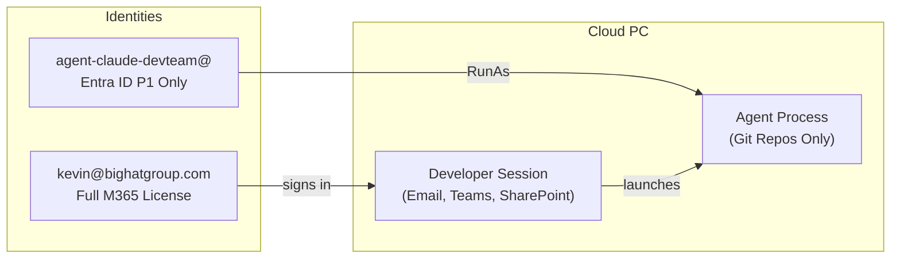

## Chapter 27: Identity Architecture -- The Secondary User Imperative

### Why Primary User Identity Fails

Running autonomous agents under the primary user's interactive identity (e.g., `CORP\JSmith`) introduces three fatal security flaws:

**1. Identity Conflation and Non-Repudiation.** In all Windows Event Logs, Entra ID sign-in logs, and audit trails, actions performed by the agent are attributed to the human user. If OpenClaw executes a destructive command, the logs show JSmith as the perpetrator. Security teams cannot distinguish between a malicious insider, a compromised account, or a rogue AI agent.

**2. Excessive Privilege Inheritance.** A human user accumulates privileges over time: access to legacy file shares, HR portals, financial systems. An agent running as that user inherits this entire accumulated privilege set. An AI coding assistant needs access to a specific Git repository; it does not need access to the user's email, payroll data, or the CEO's calendar.

**3. SSO Exploitation.** If an agent running in the primary user's session is compromised via prompt injection, the attacker gains access to the user's active SSO tokens (Primary Refresh Token). The attacker can access other corporate resources (SharePoint, Teams, Salesforce) without triggering MFA, as the session is already trusted.

### The Recommended Architecture

### Identity Options

| Feature | Secondary Entra ID User | Entra Agent ID (Preview) | Local Standard User |
|---|---|---|---|
| **Description** | Standard cloud-only Entra ID account | Specialized identity for AI agents | Local Windows account |
| **Use Case** | Interactive & Cloud access | Autonomous background agents | Strictly local operations |
| **Authentication** | Password + MFA (FIDO2) | Certificate-based | Local password |
| **Auditability** | High -- Entra ID sign-in logs | Very High -- explicit Agent ID logs | Low -- local only |
| **Intune Management** | Full | Full | Limited |
| **Cost** | Requires licence (M365 F3 or Entra P1) | Usage-based (preview) | Free |

### Microsoft Entra Agent ID

Microsoft is developing **Entra Agent ID** to formalize this architecture. Key features:

- **Cryptographic Identity**: Uses certificate-based auth, eliminating credential theft via phishing
- **Agent Registry**: Centralized inventory of authorized agents linked to human "sponsors"
- **Scoped Permissions**: Policies restrict agents to specific workspaces and resources

**Recommendation:** Entra Agent ID is a compelling long-term solution, but its **preview status** should give production-oriented teams pause. Preview features carry no SLA, may introduce breaking changes, and can be deprecated before reaching GA. Organizations with strict change-management or compliance requirements will find it difficult to justify a preview dependency in their identity architecture. Until Entra Agent ID reaches GA with stable APIs, SLA coverage, and a clear licensing model, provision **Secondary Entra ID Users** for agents. This provides immediate segregation and auditability using GA-supported primitives, and the identity is not tied to the Cloud PC. A developer can use the same secondary agent account from their local development machine to authenticate to Azure CLI, Azure DevOps, or any Entra-integrated service, running agent workloads locally while retaining the audit separation and scoped permissions of the dedicated identity. This makes the secondary user approach useful even without Windows 365: it works anywhere `az login` does. When Entra Agent ID reaches GA, migrating from secondary users to Agent IDs should be straightforward — the scoping and Conditional Access patterns are architecturally aligned.

### Operational Workflow

#### Setting Up the Agent Identity

1. **Create a cloud-only user** in Entra ID (e.g., `agent-claude-teamA@bighatgroup.com`). Use a naming convention that makes agent accounts immediately identifiable in audit logs.
2. **Assign a minimal licence.** Entra ID P1 or M365 F3, enough for Entra join and Conditional Access, but no Exchange Online, Teams, or SharePoint.
3. **Scope access.** Grant access only to specific Azure DevOps projects, GitHub repositories, or Azure resource groups. Use Entra ID security groups to manage this at scale (e.g., `SG-AgentAccess-TeamA-Repos`).
4. **Configure Conditional Access.** Create a policy targeting the agent account that restricts sign-in to compliant devices and blocks access to non-development resources.
5. **Add to the Windows 365 provisioning policy (Options 2 and 3).** Include the agent account (or its security group) in the same provisioning policy that uses your custom image. The agent account gets its own Cloud PC, provisioned from the same image.

#### The Developer Experience

**Options 2/3: Dedicated agent Cloud PC (recommended for autonomous workflows):**

The developer has two Cloud PCs in their Windows 365 portal:

| Cloud PC | Signed In As | Purpose |
|----------|-------------|---------|
| Primary | `kevin@bighatgroup.com` | Email, Teams, SharePoint, interactive development |
| Agent | `agent-kevin@bighatgroup.com` | Agent-assisted coding, autonomous tasks |

The developer connects to the agent Cloud PC when they want to run extended agent sessions. Because the agent account has no access to email, HR systems, or financial tools, a compromised agent is limited to the developer's code repositories.

### Local Administrator: The Case for Giving Developers the Keys

This will be controversial in some organizations, but for AI agent developer Cloud PCs, **granting local administrator privileges to the user account is the recommended configuration.**

Here's why: AI coding agents are, by design, tools that install packages, compile software, run build systems, and modify system-level configuration. A developer using Claude Code to scaffold a new project will need `npm install`, `pip install`, `dotnet tool install`, and occasionally `winget install`. An agent debugging a Docker issue needs to restart the Docker service. An agent setting up a development database needs to modify Windows Firewall rules.

Locking the developer (and by extension, the agent) out of administrative operations creates constant friction: the agent hits a permissions wall, the developer files a helpdesk ticket, the helpdesk escalates to IT, IT pushes an Intune script that arrives 45 minutes later. This workflow is antithetical to the entire purpose of autonomous coding agents.

**The risk calculus changes when the Cloud PC is network-isolated.** A local administrator on a Cloud PC that:

- Has **no access to the corporate LAN** (RFC 1918 ranges blocked outbound; see Chapter 30)
- Is on an **isolated Microsoft network** with no line-of-sight to on-premises resources
- Has **default deny outbound** with only allowlisted endpoints (Anthropic API, GitHub, npm registry)
- Is **enrolled in Defender for Endpoint** with Attack Surface Reduction rules active (Chapter 31)
- Uses a **dedicated agent identity** (not the user's primary corporate account)

...is a fundamentally different risk from a local administrator on a domain-joined laptop sitting on the corporate network. The blast radius is contained. A compromised agent with local admin on this Cloud PC cannot pivot to the domain controller, cannot access file shares, cannot reach the HR system. It can damage the Cloud PC itself, which can be reprovisioned from the image in minutes.

#### Configuring Local Admin via Windows 365

Windows 365 provisioning policies control whether the user is a local administrator:

1. In the **Intune admin centre**, navigate to **Devices > Windows 365 > Provisioning policies**
2. Edit the provisioning policy for your developer image
3. Under **Additional settings**, set **Local admin** to **Enabled**

This grants the provisioned user local administrator rights on their Cloud PC.

#### The Dedicated Account Makes This Safe

The critical enabler is the **dedicated agent account** from the isolated model. Consider the risk matrix:

| Scenario | Local Admin | Network Isolated | Dedicated Account | Risk Level |
|----------|------------|-----------------|-------------------|------------|
| Primary user on corporate network | ✅ | ❌ | ❌ | 🔴 **Critical** -- compromised agent has admin + corporate access + user's full identity |
| Primary user, network isolated | ✅ | ✅ | ❌ | 🟡 **Medium** -- blast radius contained, but agent actions attributed to the human |
| Dedicated account, network isolated | ✅ | ✅ | ✅ | 🟢 **Low** -- contained blast radius, scoped permissions, clean audit trail |
| Standard user, network isolated | ❌ | ✅ | ✅ | 🟢 **Low** -- maximum restriction, but constant friction for agent workflows |

The sweet spot is **dedicated account + network isolated + local admin**. The agent can do its job without friction, the network prevents lateral movement, the dedicated identity prevents privilege inheritance from the human, and reprovisioning resets the machine to a known-good state.

#### The Licensing Reality

Every user and every agent account requires a **minimum base licence stack of Entra ID P1 + Windows 365 Enterprise + Intune P1**. The developer typically holds a full **Microsoft 365 E3** (which includes Entra P1 and Intune P1) plus **Windows 365 Enterprise**. The agent account options layer on top of this.

**Option 2 (base stack, no M365 E3):** Each agent account needs:

- A standalone **Entra ID P1** licence (~$6/user/month)
- A standalone **Intune P1** licence (~$8/user/month)
- A **Windows 365 Enterprise** licence (varies by SKU, from ~$31/month for 2 vCPU/4 GB to ~$123/month for 8 vCPU/32 GB; recommended: 4 vCPU/16 GB at $66/month)

The agent account does not need M365 E3 because it has no email, Teams, SharePoint, or Office apps.

**Option 3 (full M365):** Each agent account needs:

- A **Microsoft 365 E3** licence (~$36/user/month, includes Entra P1 and Intune P1)
- A **Windows 365 Enterprise** licence for the agent's own Cloud PC

Option 3 is for scenarios where the agent needs to authenticate independently to Microsoft 365 services (Graph API, Teams channels, SharePoint document libraries). The incremental cost over Option 2 is the difference between standalone Entra P1 + Intune P1 and a full M365 E3 licence.

For a team of 10 developers, the incremental cost of Options 2 or 3 is approximately $8,000--$12,000/year depending on the SKU. This is a rounding error compared to the cost of a security incident where a compromised agent with the developer's primary identity exfiltrates source code or accesses sensitive systems.

> **💡 Tip:** The recommended Cloud PC SKU for AI agent workloads is 4 vCPU / 16 GB ($66/user/month). While agents are primarily I/O bound (API calls, file reads), the additional headroom is needed for concurrent agent processes, npm operations, and local language server indexing. A 2 vCPU / 8 GB SKU ($41/user/month) can work for lightweight, single-agent use cases but may constrain heavier workflows.

#### When Standard User Is Appropriate

Not every scenario needs local admin. If the AI agents are used purely for:

- Code review and analysis (read-only)
- Documentation generation
- Chat-based Q&A about the codebase

...then a standard user account is appropriate. The agents don't need to install packages or modify system configuration for these workflows. Reserve local administrator for **active development** scenarios where the agent is building, testing, and deploying code.

---

