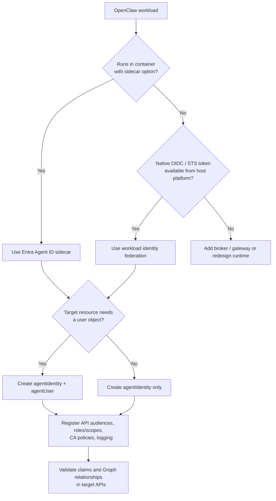

## Chapter 29: Hardening OpenClaw

OpenClaw requires a "Presume Breach" mentality due to its susceptibility to supply chain attacks.

### The ClawHavoc Campaign

The "ClawHavoc" campaign, based on community-reported incidents and security researcher analysis, illustrated the fragility of the OpenClaw skills ecosystem:

- Approximately **12%** of skills in the ClawHub registry were reported as malicious (exact figures vary by source)
- Attackers published skills with innocuous names ("Solana Wallet Tracker", "PDF Tools")
- Post-install scripts downloaded the **Atomic Stealer** malware
- The malware gained immediate access to browser data, crypto wallets, and SSH keys

While the precise scope of ClawHavoc is difficult to verify independently, the pattern it represents (supply chain poisoning through community marketplaces) is well-established across the broader software ecosystem (npm, PyPI, VS Code extensions).

### Mitigation: Skill Vetting

1. **Prohibit** installation of skills from the public ClawHub marketplace
2. **Establish** an internal, curated Git repository for approved skills
3. **Integrate** the [Cisco Skill Scanner](https://github.com/cisco-ai-defense/skill-scanner) for static analysis:

```bash
skill-scanner scan --path ./new-skill --output-format json
```

The scanner detects:
- Data exfiltration patterns (`curl`, `requests.post` to unknown domains)
- Prompt injection in markdown descriptions
- Obfuscation (Base64 encoded payloads)
- Suspicious complexity

### Persistent Memory Poisoning

OpenClaw maintains persistent memory in files like `SOUL.md` and local databases. An attacker can send an email or commit a repository file containing hidden instructions. When OpenClaw processes this content, the malicious instruction enters its memory and may execute hours or days later, a "sleeper agent" capability that makes forensic attribution extremely difficult.

**Mitigation:**
- Restrict OpenClaw's memory files to read-only access from external sources
- Monitor memory file modifications via Sysmon Event ID 11 (File Create)
- Implement input sanitization for all external content ingested by OpenClaw

### WebSocket Security (Architectural Concern)

Prior to OpenClaw version 2026.1.29, the local web dashboard lacked CSRF protection and WebSocket origin validation (CVE-2026-25253). This allowed a malicious website to open a WebSocket connection to OpenClaw's control port on localhost, potentially achieving remote code execution without penetrating the corporate firewall.

**OpenClaw 2026.1.29 and later** include origin validation on WebSocket endpoints and fix the unauthenticated `gatewayUrl` parameter issue. However, defence-in-depth remains essential, as not all deployments will be on the latest version, and similar architectural concerns may arise in future features.

**Mitigation (regardless of version):**
- **Keep OpenClaw updated**: ensure your pinned version is >= 2026.1.29
- Configure OpenClaw to bind strictly to `127.0.0.1`, never `0.0.0.0`
- Use NSGs to block inbound connections to OpenClaw's port from any external source
- Monitor for new security advisories in the OpenClaw changelog

### Entra Agent ID Integration (Forward-Looking)

When Microsoft Entra Agent ID reaches GA, it provides a purpose-built identity model that supersedes the secondary Entra ID user approach described in Chapter 27. This section identifies the architectural questions that determine whether and how OpenClaw can adopt Agent ID in your environment.

> **Note:** Entra Agent ID remains in preview as of this writing. Do not adopt this section's guidance in production until GA is confirmed and the feature carries a Microsoft SLA. Use the secondary Entra ID user model from Chapter 27 until then.

Microsoft documents two integration patterns for third-party agent runtimes:

- **Sidecar pattern**: Deploy an Entra SDK sidecar container alongside the agent. The agent code remains credential-free; the sidecar handles token acquisition. Works with any containerized agent.
- **Federation pattern**: If OpenClaw runs on a platform that already issues OIDC tokens (e.g., AKS workload identity, GitHub Actions), configure workload identity federation on the blueprint so OpenClaw can exchange its platform token for an Entra agent identity token directly.

#### Decision Checklist

Use this checklist when evaluating Agent ID adoption for OpenClaw:

| Question | If yes | If no | Why it matters |
|----------|--------|-------|----------------|
| Can OpenClaw run in a container with a sidecar? | Use the **Entra Agent ID sidecar** pattern — keeps agent code credential-free | Consider federation instead | Sidecar works with any containerized agent; it is the lowest-friction path |
| Can OpenClaw obtain an OIDC/STS token from its host platform? | Use **workload identity federation** and direct token exchange | Use sidecar or add an identity broker layer | Federation is for runtimes with native workload identity already in place |
| Does the target resource require a **user object** (e.g., Exchange mailbox, Teams channel)? | Create an `agentIdentity` **and** an `agentUser` linked 1:1 | Keep only `agentIdentity` | Microsoft provides `agentUser` specifically for systems that reject service-style tokens |
| Do downstream APIs need **app roles** or **delegated scopes**? | Model accordingly: app-only roles for autonomous flows, OBO + scopes for delegated access | Keep authorization surface simple | Agent ID reuses standard Entra authorization primitives; you must map OpenClaw's behavior to `roles` vs. `scp` |
| Can target APIs validate agent-aware claims? | Validate `aud`, `tid`, `oid`, `appid`/`azp`, and `xms_*` facts (see Chapter 27) | Add a gateway or middleware that can | There is no standalone `agent_id` claim; all agent semantics live in standard Entra claims |
| Is centralized governance, sponsorship, and CA policy required? | Prefer **Agent ID** over plain service principal | A classic service principal is operationally simpler but less governable | Microsoft's stated reason for Agent ID is that plain service principals are not rich enough for agent governance at scale |
| Can the deployment use managed identity or FIC for blueprint credentials? | Prefer these for blueprint credentials | Treat as lower-assurance and temporary if relying on secrets | Microsoft explicitly recommends managed identities/FIC and warns against client secrets in production |
| Do you need incident response and auditability for agent actions? | Ensure `agentSignIn` log filters and Identity Protection risk APIs are part of rollout (see Chapter 33) | You will have weaker operational assurance | Agent-specific logs and risk APIs are a core part of the Agent ID value proposition |

#### Integration Decision Flowchart



If OpenClaw is currently an orchestration shell around API keys with no OIDC or sidecar story, Agent ID adoption will require an architectural wrapper rather than a simple configuration toggle. The primary mapping questions are: **container vs. federation**, **app-only vs. user-required**, and **whether target APIs understand Entra claims and agent-specific CA policy**.

---

