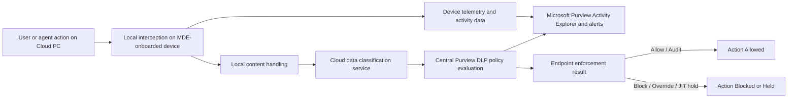
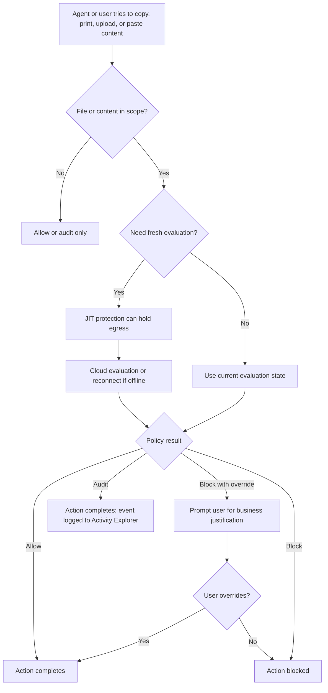

## Chapter 38: Data Protection with Microsoft Purview

The controls in previous chapters address the execution layer: restricting what processes can run, what network paths they can use, and which users can access which resources. They are necessary, but not sufficient. An agent that has been compromised — whether by prompt injection, supply chain attack, or misconfiguration — can still move sensitive data through channels that execution controls explicitly permit: uploading to a cloud service the user already has access to, copying files to a USB drive, or pasting extracted secrets into a browser tab.

Microsoft Purview closes this gap at the data layer. It does not prevent execution; it monitors and restricts what happens to files and content after execution. For Windows 365 Cloud PCs running AI agents, the most relevant surface is **Endpoint DLP** — the policy engine built into Microsoft Defender for Endpoint that intercepts copy, print, upload, and clipboard operations on sensitive content before they leave the device.

### The Five Windows-Side Purview Components

Microsoft Purview is not a single agent. The Windows-side story spans several components that do distinct jobs:

| Component | Installed where | Primary role | Relevance to W365 AI agent workstations |
|---|---|---|---|
| **Endpoint DLP** | Windows 10/11 clients (via Microsoft Defender for Endpoint (MDE) onboarding) | Monitors and restricts file egress at the moment it occurs — copy, print, upload, paste, USB, RDP | **Primary control** for agent workstations; enforces data-layer policy without additional installs |
| **Microsoft Purview Information Protection client** | Windows desktop (optional install) | Extends sensitivity labels to File Explorer, PowerShell, and non-Office file types | Useful when agents create or handle non-Office files (scripts, config files, data exports) that need classification |
| **Information Protection scanner** | Windows Server for on-premises repositories | Scheduled discovery, classification, and labeling of file shares and SharePoint Server | Not applicable to Cloud PC endpoint scenarios; relevant only for on-premises file infrastructure |
| **Defender for Endpoint platform** | Windows clients and servers | Supplies device onboarding, sensor, and telemetry channel that Endpoint DLP depends on | **Prerequisite plumbing** — Endpoint DLP rides on MDE; MDE-onboarded devices appear automatically in Purview |
| **Data Map self-hosted integration runtime (SHIR)** | Windows VM or server in private network | Catalog-scanning compute for metadata governance of private data sources | Not endpoint DLP; does not provide local file blocking; not applicable to Cloud PC workstations |

For Windows 365 Cloud PC deployments, **Endpoint DLP is the control that matters most**. It requires no separate agent install because it is delivered through the existing MDE onboarding that the Cloud PC fleet already has. The Information Protection client is a secondary option for labeling non-Office artifacts. Scanner and SHIR are out of scope for this deployment pattern.

### Architecture: Local Interception, Cloud Policy

The split between where enforcement happens and where policy is evaluated is one of the most important operational facts about Endpoint DLP:



Policy is published centrally from Purview and synchronizes to devices in approximately one hour. Items are reevaluated the next time they are accessed or modified. This has two practical implications for agent workstations:

- **Policy lag is real.** A new DLP policy or a change to an existing one will not take effect for up to an hour on Cloud PCs. Plan policy changes around this window.
- **Offline JIT protection.** For newly created or newly accessed files on a device that is offline, just-in-time (JIT) protection in block mode can hold file egress until the device reconnects and cloud evaluation completes. For developer workflows that involve offline or air-gapped scenarios, this can cause unexpected delays.

For advanced classification (Exact Data Match, named entities, trainable classifiers), the local device sends content to a cloud classification service. Microsoft exposes a per-device rolling 24-hour bandwidth limit; if that cap is reached, cloud-only classifiers become unavailable until usage drops below the threshold. DLP policy evaluation continues in the cloud regardless of bandwidth limits — only the content submission for advanced classification is throttled.

Devices must be **Microsoft Entra joined, hybrid joined, or registered** for Endpoint DLP to apply. For Windows 365 Cloud PCs, Entra join is the standard provisioning path, so this prerequisite is typically met automatically.

### What Endpoint DLP Monitors

Endpoint DLP can audit or restrict a defined set of user and agent activities. Microsoft currently documents:

- Copy to clipboard
- Copy to USB removable media
- Copy to network shares
- Upload to cloud service domains
- Paste to supported browsers
- Print
- Copy or move over RDP
- Copy or move via Bluetooth
- Access by restricted apps
- File creation and rename auditing
- Windows Recall snapshot controls (preview)

Policy modes are **Block**, **Block with override**, **Audit**, **Allow**, and **Off**. For initial rollout on agent workstations, **Block with override** is the recommended starting point — it generates a user-facing prompt that requires a business justification, which produces audit data showing whether blocks are genuinely obstructive before committing to hard Block.



#### File types Endpoint DLP monitors

Endpoint DLP monitors a finite, explicit set of file types. On Windows, Microsoft documents policy-based monitoring for Word, Excel, PowerPoint, archive formats (.zip, .rar, .7z), and PDF. Separate "always audit" behavior covers many Office, PDF, CSV/TSV, and archive types even without a policy match. With OCR enabled, common image formats (JPG, PNG, TIFF, BMP, JPEG) are also included.

A critical detail for agent workstations: **Endpoint DLP monitors based on MIME type for several formats, not file extension**. Renaming `report.docx` to `report.txt` does not bypass DLP monitoring for `.doc`, `.docx`, `.xls`, `.xlsx`, `.ppt`, `.pptx`, or `.pdf`. Extension manipulation is not a reliable bypass for monitored content.

**What Endpoint DLP cannot see:**

- Data that is never saved to a local file (e.g., an agent processes content in memory and writes directly to a USB or network share without staging it locally first)
- Sensitivity labels applied by another tenant
- Content inside unsaved files (a document open in Word but not yet written to disk)

These blind spots are by design, not bugs — but they should inform threat model assumptions for agent workflows that handle data transiently.

### Sensitivity Labels and Advanced Label-Based Protection

For Office files on Windows 365 Cloud PCs, sensitivity labels are applied through built-in Microsoft 365 app experiences, not through a separate agent. Labels applied in Word, Excel, PowerPoint, or Outlook persist with the file as it moves between devices, apps, and cloud services, and can apply encryption, headers, footers, watermarks, and dynamic watermarks.

The **Microsoft Purview Information Protection client** extends this to Windows File Explorer, PowerShell, and non-Office file types. This matters for agent workstations because agents frequently create non-Office artifacts: shell scripts, Python files, JSON configs, CSV exports, and log files. Without the Information Protection client installed, these file types cannot receive sensitivity labels through Windows directly.

The most significant capability for code-centric workstations is **Advanced label-based protection for all files on devices**. With this setting enabled:

- Users or agents can label and encrypt non-Office/non-PDF files on Windows while **retaining the original extension** on the local device
- Endpoint DLP monitors and enforces permissions locally on those files
- The file is converted to an encrypted-extension form only when moved or copied off the device

This means a Python script or a JSON file containing secrets can be labeled, encrypted at rest locally, and protected at egress — without renaming the file to an unrecognizable format on the developer's workstation.

Requirements: antimalware client version 4.18.25050 or newer; Information Protection client version 3.1.309 or newer.

**Important limits of advanced label-based protection:**

- Supported only for labels that apply encryption (not labels that add headers/footers only)
- Not supported for labeling files on network locations or USB drives directly
- Detects only view, extract, and print rights before egress
- The applied sensitivity label is **not available as a DLP condition before egress** — Endpoint DLP cannot use the label as a matching criterion in this mode
- The PowerShell module does not recognize this setting; use the File Labeler for files protected this way

An active internet connection is required to apply encryption. Offline labeling is possible for labels that do not apply encryption, but offline encryption is not supported. For Cloud PCs that are always cloud-connected, this is rarely a constraint in practice.

### Performance Considerations for Developer Workflows

Endpoint DLP is not free from a performance perspective. Microsoft explicitly documents these costs:

- **Broad file-extension rules** trigger content scanning and increase CPU and memory usage. Scope rules as narrowly as possible for the data types that are actually at risk.
- **Advanced classification** submits content to the cloud for scanning, consuming bandwidth. The 24-hour rolling bandwidth limit throttles this path when exceeded.
- **JIT clipboard control**, if enabled broadly, can affect user productivity. Agents that use the clipboard as an intermediate data transfer mechanism will be affected.

### Key Limitations for Agent Environments

> **⚠️ Warning — PowerShell 7 is not supported by the Information Protection client:** The `AIPService` and `PurviewInformationProtection` PowerShell modules require **PowerShell 5.1**. This deployment uses PowerShell 7 everywhere else, so any Purview classification or labeling automation must be invoked in a separate PS5.1 context. The safe invocation pattern from within a PS7 workflow is:
>
> ```powershell
> # Call PS5.1 from within a PS7 script
> & "$env:SystemRoot\System32\WindowsPowerShell\v1.0\powershell.exe" -Version 5.1 -NonInteractive -Command {
>     Import-Module PurviewInformationProtection
>     # ... Purview automation here
> }
> ```
>
> Do not attempt to `Import-Module AIPService` or `Import-Module PurviewInformationProtection` in a PS7 session — the modules will fail to load. Build any Purview automation scripts as standalone `.ps1` files targeting `#Requires -Version 5.1` and invoke them via the pattern above or as a separate Intune Platform Script targeting PS5.1.

| Limitation | Impact | Mitigation |
|---|---|---|
| **Unsaved data is invisible** | Agents processing content in memory without writing to a local file cannot be inspected | Ensure agent workflows write intermediate results locally; treat fully in-memory pipelines as unmonitored |
| **Cross-tenant labels not detected** | Endpoint DLP does not detect sensitivity labels applied by a different tenant | Rely on Conditional Access and information barriers for cross-tenant data controls |
| **Container files not recursive** | Labeling or protecting a `.zip` does not label or protect the files inside it | Extract before labeling; do not assume zip-level protection extends to contents |
| **PowerShell 7 unsupported** | The Information Protection client does not support PowerShell 7 | Use PowerShell 5.1 for any automation that calls the `AIPService` or `PurviewInformationProtection` modules |
| **Advanced label-based protection: label not a DLP condition** | Cannot use the applied label as a DLP matching criterion before egress | Combine with explicit sensitive information type matching in DLP policy |
| **Browser controls require extensions** | Clipboard and upload controls work fully only in Edge; Chrome and Firefox require the Purview browser extension | Deploy the browser extension via Intune for Chrome/Firefox users |
| **Endpoint DLP on Windows Server** | Off by default after server onboarding; the classification feature is disabled on servers with specific KB baselines | Enable explicitly if needed; accept that classification-dependent rules will not function on those servers |

### Troubleshooting Checklist

**Verify device prerequisites first.** Check Windows build, Entra join/registration state, and Defender antimalware client version. Endpoint DLP requires MDE version 4.18.2110 or later. Advanced label-based protection requires MDE version 4.18.25050 or later. These are separate features with separate version minimums. Also verify: real-time protection enabled, behavior monitoring enabled, and firewall allowance for `MpDlpService.exe`. All of these must be in place before DLP policies can enforce.

**Check policy sync status in Purview.** The Purview portal's device management view shows heartbeat, validation state, and whether policy has synchronized. If a device shows outdated policy, wait for the next sync cycle (~1 hour) or trigger a sync.

**Collect MDE client traces for wrong behavior.** Microsoft's supported collection path is `MDEClientAnalyzer.cmd -t` on Windows 10/11 — run this, reproduce the issue, and inspect the generated results. Do not attempt to debug DLP behavior from event logs alone.

**Performance complaints.** If users report slow performance, check whether advanced classification, broad file-extension rules, or JIT clipboard control are in scope for the affected devices. These are the documented cost centers.

**OneDrive sync generating repeated blocks.** Add `onedrive.exe` to the restricted apps list with **auto-quarantine** enabled. This causes DLP to move the protected item to an admin-configured folder and optionally replace it with a `.txt` placeholder, stopping the sync app from repeatedly touching the same protected file.

---
