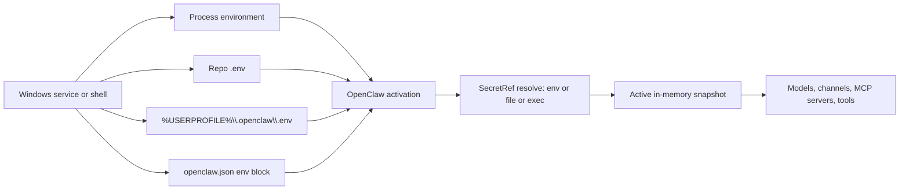
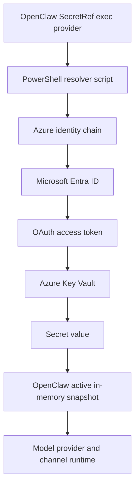

## Chapter 39: Secrets Management for Agent Deployments

The question of where an API key lives is less important than the questions that surround it: when does it become plaintext, which process can read it, how long does it persist, and how quickly can it be rotated without breaking a running agent? Chapter 23 introduced the "never bake secrets" rule and described how to deliver keys post-provisioning. This chapter goes deeper: it maps the full lifecycle of a secret from ingestion through rotation, explains how OpenClaw's SecretRef model works architecturally, walks through every Windows-native storage primitive, and gives you a production-ready integration pattern for Azure Key Vault.

### How OpenClaw Loads Secrets

OpenClaw's secret-loading model has a defined precedence order. When the Gateway starts, it resolves secrets from the following sources in this sequence, stopping as soon as a value is found:

1. **Process environment** — variables already present in the current process block
2. **`.env` in the current working directory** — read at startup, not watched for changes
3. **`~/.openclaw/.env`** — the global per-user state directory
4. **`env` block in `openclaw.json`** — static values embedded in the config file
5. **Windows environment injection** — On Windows, secrets injected by Intune Platform Scripts into system-level environment variables become available to processes at their next startup. For user-scoped secrets, the delivery mechanism is a user-context Intune script that sets environment variables or writes to the user's credential store. This is an optional fallback for keys that are absent from all of the above.

Critically, OpenClaw **never overrides an existing value**. A process-level variable injected by a service manager always wins over `.env` and config fallbacks. This means you can reliably "pin" a secret at the service-manager level without touching the config file.

The stronger model is `SecretRef`. Instead of a literal string, you place an indirection object in the config:

```json
{
  "apiKey": {
    "source": "env",
    "provider": "default",
    "id": "OPENAI_API_KEY"
  }
}
```

OpenClaw resolves every `SecretRef` **at activation time** (startup), not lazily on each request. If a reference cannot be resolved, startup fails immediately. Once activation succeeds, all runtime code reads only from an **active in-memory snapshot** — the external source (environment, file, or subprocess) is not consulted again during the session. This is the architectural property that makes vault integration attractive: the vault call happens once, during startup, and does not add latency to the hot path.



The three supported `SecretRef` source types are:

| Source | How it works | Best fit |
|--------|-------------|----------|
| `env` | Reads a named environment variable | Local dev; simple deployments where an orchestrator injects env |
| `file` | Reads a JSON or single-value file from a path | Local encrypted files; secrets injected by a secrets volume mount |
| `exec` | Spawns an external process, reads secrets from its stdout | Vault integration; any secret store without a native provider |

OpenClaw will verify path ownership and filesystem ACLs on `file`-backed secrets and fail closed if ACL verification is unavailable, unless `allowInsecurePath: true` is explicitly set. This means a file-backed secret is only as strong as the ACL on the file.

After migration from literal to `SecretRef`, always run the audit command to confirm plaintext residue is gone:

```powershell
openclaw secrets audit --check
```

This command scans `openclaw.json`, `auth-profiles.json`, `.env` files, and generated model files for plaintext credential values. Migration is not complete until the audit reports clean.

### Agent-Readable Surfaces

OpenClaw explicitly warns that any plaintext secret stored in a file the agent can inspect is effectively readable by the agent. The at-risk surfaces are:

- `openclaw.json`
- `auth-profiles.json`
- Any `.env` file in or below the agent workspace
- Generated `agents/*/agent/models.json` files

If you use `SecretRef` but store the resolved value back into any of these files, or if you store `.env` in a directory the agent processes, you have defeated the indirection. Keep `.env` files in `~/.openclaw/` (the global state directory) rather than in a repository or agent workspace directory.

### Windows Environment Variables: Scope and Risk

On Windows, environment variables exist in three scopes. The scope determines how long the value persists, where it is stored, and which processes can read it.

| Scope | Persistence | Stored in | Propagates to child processes | Appropriate for secrets |
|-------|------------|-----------|------------------------------|------------------------|
| Process | Until the process exits | Current process memory block | Yes, all children | Local dev, one terminal session, one CI job |
| User | Persistent | Current-user registry key | Newly started processes only | Personal workstation only — not shared machines |
| Machine | Persistent | Machine-wide registry key | Newly started processes, all users | Rarely justified; broad blast radius |

**Process scope** is set in PowerShell with `$env:`:

```powershell
$env:OPENAI_API_KEY = "sk-..."
openclaw models status
```

The secret exists only until the terminal closes. This is the correct scope for local development and CI jobs.

**User scope** persists in the registry and survives reboots:

```powershell
[Environment]::SetEnvironmentVariable("OPENAI_API_KEY", "sk-...", "User")
# Close this terminal and open a new one before using the value
```

User scope is convenient for a personal dev machine but creates a long-lived local secret. Never use it on shared machines or machines where multiple user sessions run.

**Machine scope** is almost never the right choice for API keys. It makes the value accessible to every process on the machine, regardless of which user account the process runs under. If you find yourself reaching for machine scope, the correct answer is usually a centralized vault with per-identity access control.

The critical risk with Windows environment variables is that they are **ambient process state** — inherited automatically by every child process. If OpenClaw spawns a sub-agent or executes a tool, that child process inherits the parent's environment. Use the `passEnv` option in OpenClaw's `exec` provider config to restrict which variables reach external resolver processes.

### Windows-Native Secret Stores

For deployments that cannot use Azure Key Vault immediately, Windows provides several native primitives. They vary significantly in security, portability, and operational complexity.

**Windows Credential Manager** stores credentials associated with the current user's logon session. The `cmdkey` utility provides command-line access:

```powershell
cmdkey /generic:OPENAI_API_KEY /user:api /pass:sk-...
```

Credentials Manager is a reasonable fit for desktop-user tooling and personal dev machines. It is not appropriate for multi-user services or fleet-wide centralized rotation.

**PowerShell SecretManagement + SecretStore** provides a PowerShell-centric abstraction layer over extension vaults. SecretStore encrypts its local file using .NET cryptographic APIs and, in its default configuration, requires a password to unlock:

```powershell
Install-Module Microsoft.PowerShell.SecretManagement
Install-Module Microsoft.PowerShell.SecretStore
Register-SecretVault -Name LocalStore -ModuleName Microsoft.PowerShell.SecretStore
Set-Secret -Name OPENAI_API_KEY -SecretValue (ConvertTo-SecureString "sk-..." -AsPlainText -Force)
Get-Secret -Name OPENAI_API_KEY -AsPlainText
```

This is a strong local-dev choice for teams already standardized on PowerShell, but it is still fundamentally per-user and per-machine. It does not provide centralized rotation or cross-machine access.

**DPAPI** (Data Protection API) is the core Windows encryption primitive for binding arbitrary bytes to either the current user identity or the local machine identity. With user scope, only the same user on the same machine can decrypt the data. With machine scope, any account on that machine can decrypt it. DPAPI is excellent for **encrypted local files bound to one user on one machine**, but it does not support cross-machine portability or centralized lifecycle management:

```powershell
# Encrypt
$plaintext = [System.Text.Encoding]::UTF8.GetBytes("sk-...")
$encrypted  = [System.Security.Cryptography.ProtectedData]::Protect(
    $plaintext,
    $null,
    [System.Security.Cryptography.DataProtectionScope]::CurrentUser
)
[System.IO.File]::WriteAllBytes("$env:USERPROFILE\.openclaw\openai.dpapi", $encrypted)

# Decrypt
$bytes = [System.IO.File]::ReadAllBytes("$env:USERPROFILE\.openclaw\openai.dpapi")
$plaintext = [System.Security.Cryptography.ProtectedData]::Unprotect(
    $bytes,
    $null,
    [System.Security.Cryptography.DataProtectionScope]::CurrentUser
)
[System.Text.Encoding]::UTF8.GetString($plaintext)
```

**Windows certificate store + TPM** is the right pattern when the "secret" is a private key or service-principal certificate rather than a raw API token. Windows stores certificates in the certificate store, CNG key storage providers manage persistent keys, and the TPM KSP can generate keys that never leave the TPM. This is attractive for **certificate-based Azure service principal authentication** on Windows servers and workstations, but it does not directly apply to model-provider API tokens.

### Azure Key Vault Integration

For production environments, Azure Key Vault is the correct answer. It provides centralized access control, secret versioning, rotation automation, audit logging, and support for managed identities — eliminating the need to store any credential in the agent deployment itself.

The recommended authentication flows, in order of preference:

- **System-assigned managed identity**: the Azure resource has its own identity; no credential is stored anywhere. The managed identity token is obtained from the Azure IMDS endpoint.
- **User-assigned managed identity**: a standalone identity that can be assigned to multiple resources; useful when the same identity must reach Key Vault from multiple Cloud PCs or VMs.
- **Service principal with certificate**: stronger than client secrets for non-MI scenarios; pairs well with the Windows certificate store and TPM-backed non-exportable private keys.
- **Service principal with client secret**: supported but discouraged in production; prefer certificate auth for applications.
- **Developer interactive login (`az login`)**: acceptable locally; `DefaultAzureCredential` will fall through to this after exhausting managed identity and environment-based credential chains.

**OpenClaw does not have a native Azure Key Vault secret provider.** The documented integration surface for Key Vault is the `exec` source in a `SecretRef` block. You provide an executable or script that receives a list of secret IDs from OpenClaw on stdin, fetches them from Key Vault, and returns a JSON response on stdout. OpenClaw calls this process at activation time.



#### PowerShell Exec Provider Script

The following script implements the `exec` provider contract. Save it outside the agent workspace (for example, `C:\openclaw\scripts\openclaw-akv-resolver.ps1`):

```powershell
param(
    [Parameter(Mandatory = $true)]
    [string]$VaultName
)

$raw     = [Console]::In.ReadToEnd()
$request = if ($raw) { $raw | ConvertFrom-Json } else { @{ ids = @() } }

$values = @{}
$errors = @{}

foreach ($id in $request.ids) {
    try {
        $value = az keyvault secret show `
            --vault-name $VaultName `
            --name $id `
            --query value -o tsv 2>$null
        if ([string]::IsNullOrWhiteSpace($value)) {
            $errors[$id] = @{ message = "Empty or missing secret" }
        } else {
            $values[$id] = $value
        }
    }
    catch {
        $errors[$id] = @{ message = $_.Exception.Message }
    }
}

@{
    protocolVersion = 1
    values          = $values
    errors          = $errors
} | ConvertTo-Json -Depth 5
```

Reference the script from `openclaw.json`:

```json
{
  "secrets": {
    "providers": {
      "akv": {
        "source": "exec",
        "command": "C:\\Program Files\\PowerShell\\7\\pwsh.exe",
        "args": [
          "-File",
          "C:\\openclaw\\scripts\\openclaw-akv-resolver.ps1",
          "-VaultName",
          "kv-openclaw-prod"
        ],
        "passEnv": ["PATH"],
        "jsonOnly": true
      }
    }
  },
  "models": {
    "providers": {
      "openai": {
        "apiKey": {
          "source": "exec",
          "provider": "akv",
          "id": "OPENAI-API-KEY"
        }
      },
      "anthropic": {
        "apiKey": {
          "source": "exec",
          "provider": "akv",
          "id": "ANTHROPIC-API-KEY"
        }
      }
    }
  }
}
```

Key implementation notes:

- Use absolute paths for both `command` and `-File`. OpenClaw does not invoke a shell, so PATH-relative commands do not work in `exec` providers.
- `passEnv` restricts which environment variables the subprocess inherits. `PATH` is typically sufficient for `az` to find its runtime; add others only if needed.
- `jsonOnly: true` discards any non-JSON output the subprocess writes to stdout, preventing debug messages from breaking the response parse.
- The script uses `az keyvault secret show` with `az login` or managed identity ambient auth. In production, the Cloud PC or VM should have a managed identity assigned and granted `Key Vault Secrets User` on the vault; the `az` CLI will pick up managed identity credentials automatically.

After updating Key Vault, reload the runtime snapshot without restarting the Gateway:

```powershell
openclaw secrets reload
openclaw secrets audit --check
```

#### Setting Up Key Vault for OpenClaw

The one-time setup from a workstation with appropriate Azure permissions:

```powershell
# Create vault (adjust location and names as needed)
az group create --name rg-openclaw-secrets --location eastus
az keyvault create `
    --resource-group rg-openclaw-secrets `
    --name kv-openclaw-prod `
    --enable-rbac-authorization true

# Store secrets (dash-delimited names, not underscores, for Key Vault)
az keyvault secret set --vault-name kv-openclaw-prod --name ANTHROPIC-API-KEY --value "sk-ant-..."
az keyvault secret set --vault-name kv-openclaw-prod --name OPENAI-API-KEY     --value "sk-..."

# Grant the agent's managed identity read access (least privilege)
$miObjectId = (az identity show --name mi-openclaw-agent --resource-group rg-openclaw-secrets --query principalId -o tsv)
az role assignment create `
    --role "Key Vault Secrets User" `
    --assignee $miObjectId `
    --scope (az keyvault show --name kv-openclaw-prod --query id -o tsv)
```

`Key Vault Secrets User` grants `get` and `list` on secrets only — the minimum needed for the resolver. Do not use `Key Vault Secrets Officer` or `Key Vault Administrator` for the agent runtime identity.

### Windows Container Caveats

Windows container deployments introduce a platform-specific caveat that changes the recommendation materially: Docker's Windows-container secret implementation persists secrets in **cleartext on the container root disk** because Windows has no built-in RAM-disk driver for that mount path. Unlike Linux containers, which can mount secrets into a tmpfs RAM-disk (an in-memory filesystem that never touches persistent disk), Windows containers have no built-in equivalent — secrets written to the container root disk persist in cleartext until the container is destroyed. Kubernetes documents that Secret data on Windows nodes is written in cleartext to node-local storage unless you add compensating controls — specifically, file ACLs and BitLocker.

This makes identity-based retrieval from Key Vault the strongly preferred design for Windows containers. Concretely:

- Assign a managed identity (or workload identity in AKS) to the pod or container host
- Use the OpenClaw `exec` provider to fetch secrets from Key Vault at activation time
- Do not mount Docker/Swarm secrets or Kubernetes Secrets as files for API keys on Windows nodes without BitLocker protecting the underlying node storage

Kubernetes recommends enabling BitLocker on Windows nodes and using ACLs to restrict secret file paths. Those controls reduce the risk but do not eliminate it if the node disk can be removed and mounted elsewhere. Identity-backed vault retrieval does not depend on the disk at all.

### Agent Framework Comparison

The secret-loading patterns described above apply beyond OpenClaw. The frameworks most commonly running on Windows 365 Cloud PCs follow consistent patterns:

| Agent / Framework | Default key-loading pattern | Notes |
|---|---|---|
| OpenClaw | Process env → `.env` → config → `SecretRef` resolution | Use `SecretRef` `exec` for vault; audit with `openclaw secrets audit --check` |
| Claude Code | `ANTHROPIC_API_KEY` env var or `claude login` token stored in user profile | See Chapter 28; token is in `~/.claude/` |
| OpenAI Agents SDK (Python) | `OPENAI_API_KEY` env var | Windows PowerShell quickstart uses `$env:OPENAI_API_KEY` for session scope |
| OpenAI Agents SDK (JS) | `OPENAI_API_KEY` env var resolved lazily; or explicit client construction | |
| LangChain | `OPENAI_API_KEY`; base URL follows explicit kwarg → `OPENAI_API_BASE` → `OPENAI_BASE_URL` | |
| AutoGen | Uses the OpenAI package internally; reads env vars if no key provided directly | |
| Semantic Kernel | OpenAI settings class: env vars first, `.env` fallback | |
| Microsoft Agent Framework | Same pattern as Semantic Kernel | |
| CrewAI | Quickstart documents `.env`; warns against committing keys | |

A useful way to think about the risk profile is by ingestion pattern rather than product name:

| Agent type | Typical Windows pattern | Default risk profile |
|---|---|---|
| Embedded gateway agents (OpenClaw) | Provider config or SecretRefs resolved by host service | Lowest when `exec`/vault is used and no plaintext residue remains |
| SDK-based app-process agents | Provider env vars; sometimes `.env`; sometimes explicit client constructor | Moderate; easy locally, easy to leak via plaintext files |
| IDE/ACP-hosted harnesses | Host-level CLI auth or env vars consumed by external harness | Moderate to high unless host auth is centrally managed |
| Multi-agent orchestrators | Shared env or `.env` plus per-process overrides | Moderate; coordination increases blast radius |
| CI/CD-run agents | Platform secret store injection or vault fetch at job runtime | Strong when platform secrets are used correctly |

### Deployment Recommendations by Scenario

| Scenario | Recommended approach | Avoid |
|---|---|---|
| Single developer workstation | Process-scoped env vars or SecretStore; OpenClaw `SecretRef` from `env` | Machine-scoped env vars; committing `.env` |
| Always-on workstation or server | OpenClaw `SecretRef` with `exec` or tightly ACL'd `file` provider | Literal secrets in `openclaw.json` or `.env` |
| Azure VM or App Service fleet | Key Vault + managed identity + OpenClaw `exec` provider | User-scoped local stores on each VM |
| Windows containers | Platform secret refs or Key Vault with identity-based retrieval | Docker or Kubernetes plaintext secret mounts without BitLocker |
| CI/CD pipelines | GitHub Actions / Azure Pipelines secret store; Key Vault integration where available | Checked-in `.env`; long-lived static secrets on agents |

For CI/CD on **GitHub Actions**, configure secrets at repository or environment scope and reference them as `${{ secrets.ANTHROPIC_API_KEY }}`. Enable secret scanning and push protection on all repositories that contain agent configuration. For **Azure Pipelines**, use secret variables and consider direct Key Vault integration via the Azure Key Vault task.

### Migration, Rotation, and Audit Checklist

Follow this sequence when moving an existing OpenClaw deployment from plaintext secrets to SecretRefs:

1. **Inventory every secret-bearing surface**: provider API keys, channel tokens, MCP server env vars, gateway auth tokens, and any auth-profile refs. OpenClaw's SecretRef credential-surface reference is the canonical list of supported targets.

2. **Run `openclaw secrets audit --check` before changing anything.** OpenClaw's audit looks for plaintext values at rest, unresolved refs, precedence shadowing, and legacy residue.

3. **Migrate supported fields to SecretRefs** using `openclaw secrets configure --apply` or by editing the config manually. Use `env` for local-dev convenience, `file` for tightly controlled local encrypted files, and `exec` for vault-backed production.

4. **Scrub plaintext residue** from `openclaw.json`, `auth-profiles.json`, `.env`, and generated model files. Migration is not complete until those residues are gone and re-audit is clean.

5. **Reload and verify** with `openclaw secrets reload`, `openclaw models status`, and a final `openclaw secrets audit --check`.

6. **Introduce central rotation** for production secrets. Azure Key Vault supports rotation automation and dual-credential patterns for zero-downtime rotation. After rotation, call `openclaw secrets reload` to refresh the in-memory snapshot.

**Ongoing audit controls for Windows agent deployments:**

- [ ] No provider API keys or channel tokens committed to Git. Secret scanning and push protection are enabled on all repositories.
- [ ] No API secrets stored in machine-scoped environment variables unless a documented exception exists.
- [ ] `.env` files are gitignored, located outside agent-readable workspace paths, and ACL-restricted to the owning user account.
- [ ] `openclaw secrets audit --check` is clean in the target deployment profile.
- [ ] OpenClaw runtime uses SecretRefs, not literal strings, for all supported surfaces.
- [ ] Key Vault access follows least privilege: `Key Vault Secrets User` role only; no `Officer` or `Administrator` for agent runtime identities.
- [ ] Key Vault network exposure is minimized; private endpoints or service endpoint policies are in place for production vaults.
- [ ] Secret values are cached in memory only as long as operationally necessary and refreshed after rotation via `openclaw secrets reload`.
- [ ] CI pipeline logs do not print secrets; platform secret stores are used instead of checked-in files.
- [ ] Windows-container deployments use identity-backed vault retrieval or, at minimum, ACL + BitLocker compensating controls on all nodes that handle secret files.

### Summary

The secret surface for an OpenClaw deployment on Windows is larger than it looks: env vars, `.env` files, config literals, auth profiles, generated model files, and any file in the agent workspace path can all become readable if plaintext lands there. OpenClaw's `SecretRef` system with an `exec` provider gives you a first-class path to vault-backed secrets without waiting for a native Key Vault provider. For production deployments on Azure, the combination of managed identity + Key Vault + `exec` resolver is the strongest practical option today: no baked-in credential, centralized rotation, auditable access, and no hot-path vault calls.

---
