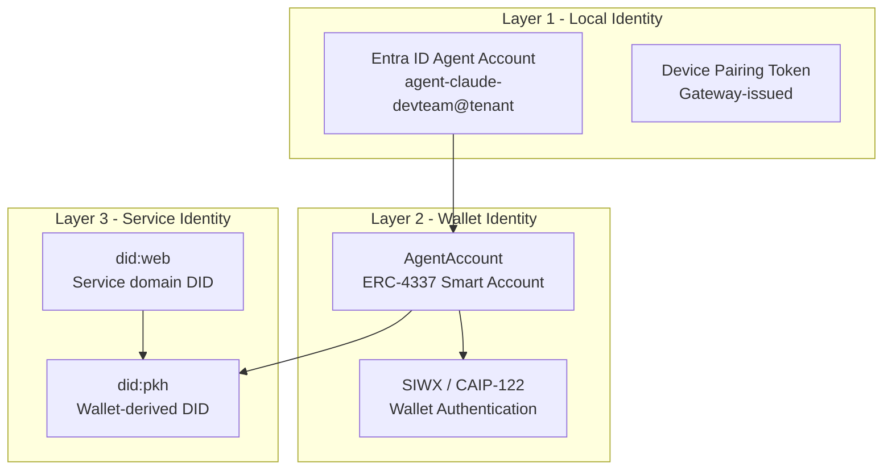
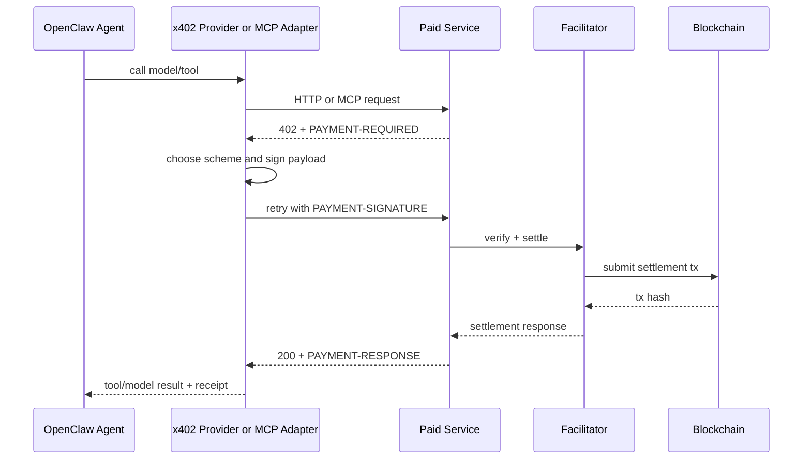
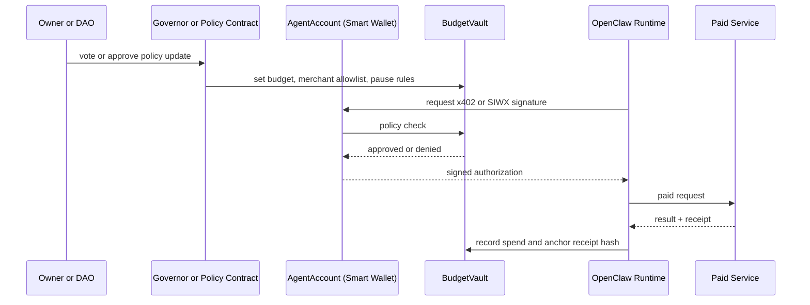
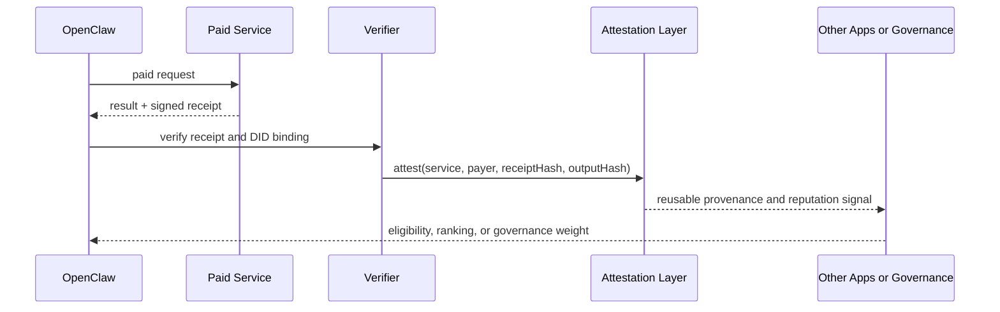

## Chapter 40: Decentralized Identity and Autonomous Payment Architecture

### The Missing Identity Layer

Chapters 26 through 39 built a security model for OpenClaw operating inside your enterprise boundary. Those controls are necessary but incomplete for one increasingly common scenario: an OpenClaw agent that must autonomously discover, pay for, and audit AI tools and services from external providers — without pre-provisioned API keys, without manual procurement, and without human approval on every transaction.

That scenario requires an identity layer that Entra ID does not provide. Entra ID governs the relationship between the agent and your tenant. It has nothing to say about the relationship between the agent and an AI service on the open internet that requires payment before it responds.

This chapter adds a wallet-native identity layer without dismantling the security model already in place. The governing principle is a hybrid architecture: keep inference, sessions, and most tool execution off-chain; put identity, payments, receipts, budgets, and governance on-chain or cryptographically anchored. OpenClaw stays local-first. It gains a wallet and a policy contract.

---

### OpenClaw's Two Blockchain Seams

OpenClaw has two natural integration points for blockchain functionality. Understanding them determines where controls apply and where risk concentrates.

**The provider/tool boundary** is the inside seam. Provider plugins own model API calls, usage reporting, auth mapping, and request normalization. Tool plugins own external API calls. These are the right insertion points for x402 payment clients because payment is a property of service consumption, and OpenClaw already isolates service consumption here. A buyer-side x402 adapter lives entirely within a plugin and does not touch the Gateway core.

**The HTTP API boundary** is the outside seam. When OpenClaw serves `/v1/chat/completions`, `/v1/responses`, or `/tools/invoke`, those surfaces can be placed behind an x402 paywall. But Chapters 26 and 29 apply here with full force. The Gateway's HTTP bearer surface is effectively full operator access. A public x402 seller deployment must never reuse your personal Gateway. It requires a separate Gateway instance with a limited scope, isolated credentials, and its own wallet and budget layer.

Build the buyer side first. The seller surface is the highest-risk configuration in this chapter, and it should only be built after the buyer-side controls are stable and reviewed.

---

### Three-Layer Identity Model

Chapter 27 established the secondary user imperative: the agent account is a distinct Entra identity, not the developer's primary identity. Blockchain integration adds two more layers without replacing that structure.

**Layer 1 — Local identity (existing).** OpenClaw's device pairing, trusted-proxy headers, and agent persona files. These govern the relationship between the Gateway, the Cloud PC, and the Entra tenant. Nothing changes here.

**Layer 2 — Wallet identity (new).** A cryptographic principal — a wallet or smart account — used for payment, authorization, repeat access, and governance with external services. This is the agent's economic identity on the open internet.

**Layer 3 — Service identity (new).** A portable identifier under which an OpenClaw-powered deployment advertises endpoints, signs receipts, and publishes metadata to external discovery systems.

Layer 1 is already in place from Part VI. Layers 2 and 3 are added through plugins and sidecar services — not as replacements for the Gateway's existing auth model.

---

### DID Methods for OpenClaw Deployments

W3C Decentralized Identifiers (DIDs) provide the portable identifier format for wallet and service identity. Three methods cover the practical range for OpenClaw deployments:

| DID method | Strengths | Weaknesses | Use in OpenClaw |
|---|---|---|---|
| `did:web` | Domain-bound, HTTPS-anchored, supports service endpoint publication and key rotation via `did.json` | Depends on DNS and HTTPS trust; mutable | Public service identity for paid or shared OpenClaw deployments |
| `did:pkh` | Directly derived from a wallet address, zero extra registry, natural for receipts and attestations | No native update, rotation, or deactivation model | Wallet/account identity for the agent principal and receipt signing |
| `did:key` | Zero network dependency, suited for offline and bootstrap scenarios | Not suitable for long-lived public identity | Device bootstrap, internal node identity, ephemeral sessions |

The standard deployment choice is `did:web` for the service (operator domain) and `did:pkh` for the wallet (agent account). `did:key` handles device-level bootstrap. Avoid chain-specific DID methods unless the surrounding ecosystem already requires them — chain lock-in and gas overhead outweigh the benefits for most enterprise deployments.

---

### x402 Payment Architecture

x402 is an open protocol for machine-to-machine payments over HTTP. It is designed specifically for the scenario where an agent needs to pay for a service within a single request-response cycle, with no human in the loop. It maps directly onto OpenClaw's provider plugin and tool plugin surfaces.

The protocol flow:

1. OpenClaw calls a paid endpoint.
2. The endpoint returns HTTP 402 with a `PaymentRequired` object: resource metadata, accepted payment methods, network (CAIP-2 format), asset, recipient, and timeout.
3. The x402 client selects a scheme, signs a payment payload, and retries the request with a `Payment-Signature` header.
4. The endpoint verifies and settles, optionally through a facilitator.
5. The endpoint returns 200 with a `Payment-Response` header containing settlement confirmation.

Three payment schemes cover the range of OpenClaw use cases:

| Scheme | Request-path behavior | Settlement shape | Best fit |
|---|---|---|---|
| `exact` | Fixed payment per request; challenge, sign, verify, serve | One settlement per request | Fixed-price tool calls, embeddings, deterministic API calls |
| `upto` | Client authorizes a maximum; facilitator settles actual amount used | One settlement per request | Token-metered inference, variable-cost providers |
| `batch-settlement` | Pre-fund escrow; off-chain vouchers; periodic batched claims | One funding step plus periodic sweeps | Dense tool marketplaces, high-frequency utility calls |

Start with `exact` for fixed-price calls. Add `upto` when metered inference provider plugins enter the picture. Reserve `batch-settlement` for high-volume tool workloads where per-request settlement economics become limiting.

#### Surface Mapping

Each OpenClaw surface has a defined x402 role:

| OpenClaw surface | Current role | x402 mapping | What is required |
|---|---|---|---|
| Provider plugin | Calls hosted model APIs and reports usage | x402 client for paid inference endpoints | `exact` or `upto` client, wallet signer, payment policy |
| Tool plugin / MCP client | Calls external tools and APIs | x402 HTTP or MCP auto-payment wrapper | `@x402/*` client, optional Bazaar discovery, wallet signer |
| Gateway HTTP seller surface | Exposes `/v1/*` and `/tools/invoke` | x402 resource server or reverse-proxy paywall | **Isolated trust boundary required**, x402 seller middleware, receipt signing |
| Device pairing / proxy auth | Local operator and node security | Remains off-chain; optionally linked to wallet for audit | No replacement; augmentation only |
| Session storage | Local transcripts and tool output | Content hash anchoring only — not raw transcript storage | Receipt/attestation anchor, privacy-preserving hash |

The session storage row is non-negotiable. OpenClaw transcripts and tool outputs must stay off-chain. Only hashes and receipt references belong on a public ledger. This is the same posture Chapter 38 enforces for Purview — move metadata, not content.

---

### Wallet Authentication with SIWX

Sign-In with X (SIWX) is x402's wallet authentication extension, implementing CAIP-122 for chain-agnostic wallet auth. It binds a wallet address to a session or resource access right without requiring a new payment transaction on each access.

For OpenClaw, SIWX provides two capabilities that raw payment does not:

- **Repeat access.** Previously paid or authorized resources do not require a new payment transaction. The wallet proves prior entitlement.
- **Auth-only routes.** Gated content that requires wallet proof without a new payment — subscription-like APIs, previously purchased artifacts, knowledge bases with per-session pricing.

SIWX is server-client only and does not require a facilitator, which matters for latency-sensitive repeated reads.

The delegation pattern for multi-device or sidecar deployments is CAIP-122 combined with CAIP-74 (CACAO). This lets you delegate limited authority — "this sidecar signer may spend up to X for merchant Y until time T" — without distributing the primary wallet key. This is the correct pattern for Cloud PC deployments where the agent may run on multiple nodes or through a hosted relayer.

---

### Smart Accounts and Budget Governance

A raw private key is not sufficient for deployments with autonomous spending authority. ERC-4337 smart accounts replace raw key signing with programmable validation logic, enabling the policy controls that enterprise deployments require.

The minimum EVM reference profile for a production OpenClaw agent:

| Component | Purpose | Standard basis |
|---|---|---|
| `AgentAccount` | Canonical smart wallet; signs x402 and SIWX payloads, executes governed actions | ERC-4337, ERC-1271, EIP-712 |
| `BudgetVault` | Holds spend caps, merchant/provider allowlists, epoch budgets, and pause controls | Custom contract; governed via Governor |
| `ServiceRegistry` | Registers service DID, endpoint metadata hash, accepted x402 schemes, policy pointers | Custom registry; CAIP-2/10/19 identifiers |
| `ReceiptAnchor` | Stores receipt hash, payment ID, settlement tx hash, output hash, timestamp | Custom anchoring contract or attestation layer |
| `ReputationAttestation` | Verified purchase, QoS, or delivery attestations for consumed services | EAS preferred |
| `GovernancePolicy` | Changes budgets, allowlists, key rotation, emergency pause, module upgrades | OpenZeppelin Governor / Timelock |

Not all of these are required on day one. The only truly required primitives for a first production integration are wallet signing, budget/policy enforcement, and receipt storage. The registry, reputation, and governance layers become valuable as the deployment grows into multi-agent or shared-service scenarios.

The governance flow enforces for economic identity the same least-privilege principle that Chapter 27 enforced for Entra identity. Budgets and merchant allowlists are the spending equivalent of scoped Entra RBAC assignments.

---

### Receipts, Attestations, and Provenance

Signed receipts are x402's audit artifact. Every successful settlement produces a `SettlementResponse` containing payer, transaction hash, network, and optionally amount and extensions. Combined with the service's signed offer, this creates cryptographic proof that a specific service offered specific terms and delivered a response — proof that a local log file cannot provide.

For enterprise deployments, receipt anchoring extends the audit trail from Chapter 33 into the external service interaction layer. The difference from a local log is tamper resistance: a signed receipt anchored to an attestation layer is cryptographically unforgeable.

The privacy constraint from Chapter 38 applies with equal force. The attestation layer receives receipt hashes and output hashes — not raw transcript content, not prompt text, not tool arguments. The preimage stays in local storage or an encrypted store. Anchoring plaintext model outputs to a public ledger is a data classification failure.

---

### Security Risks and Mitigations

Blockchain integration adds five risks not present in a standard OpenClaw deployment.

**Trust-boundary collapse.** Using a personal, all-powerful OpenClaw Gateway as a public paid API surface is the dominant risk. The HTTP bearer surfaces grant full operator access — Chapter 29 established this in detail. Mitigation: deploy a separate Gateway instance with a sharply limited tool and provider policy, isolated credentials, and its own wallet and budget layer for any public seller surface. This is a harder isolation requirement than the secondary user boundary in Chapter 27. The entire Gateway process must be separate.

**Key management failure.** A fully autonomous agent with stablecoin spending authority is only as safe as its signer. Key exposure is a total compromise. Mitigation hierarchy: development key for local testing → MPC or smart-account validation for production → `BudgetVault` with merchant allowlists as a spending backstop → governance timelocks for high-value deployments. The wallet signer should be treated as a `SecretRef`-managed secret at the process boundary (Chapter 39) but isolated to a dedicated signer service rather than loaded into the main Gateway process.

**Privacy leakage.** Public ledger anchoring of raw content creates permanent, irrevocable exposure. Mitigation: store only hashes, receipts, or selective attestations on-chain. Raw transcripts, prompts, and tool outputs belong in local storage consistent with Chapter 38, not in attestation payloads.

**Plugin and supply-chain risk.** Chapter 13 covered supply-chain integrity at the image level, and Chapter 29 covered ClawHavoc-style skill poisoning. A blockchain integration that routes wallet logic, relayers, or receipt verification through plugins heightens both risks because a compromised plugin now has access to economic value, not just compute. Mitigation: pin plugin versions, require code review for any plugin that touches signing operations, isolate signing to a dedicated service, and treat wallet-adjacent plugins with the same vetting rigor described in Chapter 29.

**Regulatory and compliance drift.** x402 payments create AML/KYT obligations, particularly when the agent transacts across counterparties at scale. Facilitators such as CDP's hosted service advertise KYT screening and sanctioned-address declines. Self-hosted facilitators require equivalent controls in regulated environments. Refunds in `exact` and `upto` schemes are push payments — irreversible once executed. Build spending controls and approval thresholds before deploying autonomous payment authority in production.

---

### Implementation Roadmap

| Priority | Phase | What ships | Why it comes first |
|---|---|---|---|
| 1 | Buyer-side x402 adapters | Paid provider plugin and paid tool/MCP wrapper | Lowest risk; no public surface exposure; unlocks autonomous payments |
| 2 | SIWX + DID identity layer | Wallet auth, repeat access, `did:web` service identity, `did:pkh` wallet identity | Converts payment capability into portable identity and access control |
| 3 | Receipt signing and attestation | Signed offers/receipts, provenance anchors | Creates auditability; extends Chapter 33 monitoring to external service interactions |
| 4 | Smart-account and budget contracts | ERC-4337/1271 wallet, `BudgetVault`, merchant allowlists | Adds policy safety for autonomous spending |
| 5 | Isolated seller deployment | Monetized, limited-scope OpenClaw service with separate trust zone | Only after buyer-side is stable and reviewed |
| 6 (selective) | Batch-settlement / channels | High-volume micropayment optimization | Only when `exact`/`upto` economics become limiting |
| 7 (selective) | zkVM / TEE verification | Proofs for deterministic post-processing or policy checking | Compliance-heavy or adversarial settings only |

Do not start Phase 5 before Phases 1 through 3 are stable and have passed security review. The seller surface is the highest-risk configuration in this chapter.

---

### Relationship to Earlier Chapters

This chapter adds a layer on top of, not instead of, the security controls in Part VI.

- **Chapter 26 (Threat Model):** Trust-boundary collapse and blockchain plugin supply-chain risks are new threat categories. Add wallet compromise and unauthorized stablecoin spend to the agent threat model.
- **Chapter 27 (Identity Architecture):** The three-layer identity model extends Chapter 27's Entra ID model. Layer 1 is unchanged. Layers 2 and 3 add wallet and service identity without replacing the secondary user account structure.
- **Chapter 29 (Hardening OpenClaw):** The isolated seller surface requires the same Gateway hardening from Chapter 29, applied to a separate Gateway instance with a narrower scope. ClawHavoc-style supply chain risk is elevated for wallet-touching plugins.
- **Chapter 33 (Monitoring and Forensics):** Receipt anchoring and attestation extend the audit trail into the external service interaction layer. Unsigned or unverified receipts should trigger the same alert path as other anomalous agent behaviors.
- **Chapter 38 (Data Protection):** The "metadata on-chain, content in controlled storage" principle mirrors the Purview information barriers model. The same data classification logic applies to attestation payloads.
- **Chapter 39 (Secrets Management):** The wallet signer is a `SecretRef`-managed secret at the process boundary, but it should be isolated to a dedicated signer service rather than loaded into the main Gateway process. The key management hierarchy here extends Chapter 39's rotation and lifecycle model into the economic identity layer.
